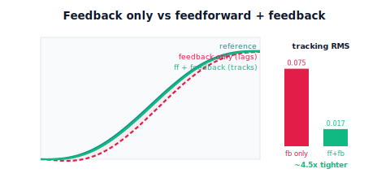

!!! abstract "You are here"
    **Module 8 — Feedback Control and Real-Time Execution (ROS 2)**  ·  **Unit 4 — Tracking the Whole Arm: Feedforward and Feedback**  ·  **Lesson 4.3 — Feedforward + Feedback Together**

# Lesson 4.3 — Feedforward + Feedback Together

> Feedforward anticipates the plan but trusts the model; feedback corrects reality but always trails. Neither alone is the answer — but **together** they are. This is the payoff of Unit 4: the feedforward command computed from Module 7's $\dot q_d, \ddot q_d$ does the heavy lifting in advance, while a light feedback loop cleans up the model mismatch and disturbances feedforward can't foresee. We put them side by side on the *identical* trajectory and measure the difference: feedback-only lags; feedforward+feedback tracks several times tighter. That combined controller is exactly what Module 8 hands to Module 9.

---

## 1. Why This Matters
We have two complementary tools with opposite strengths. Feedforward (4.2) is fast and lag-free but only as good as its model — it anticipates the *known* motion and is blind to surprises. Feedback (4.1) is robust to surprises — it corrects whatever actually goes wrong — but it's always a step behind a moving target. The central engineering move of motion control is to **add them**: let feedforward handle the large, predictable part of the command from the plan, and let feedback handle only the small, unpredictable residual.

This matters because it resolves the tension the whole unit has built. Feedback-only tracking left a speed-dependent following error (4.1). Feedforward-only removed the lag but was fragile to model error and disturbance (4.2). The sum keeps each one's strength and cancels each one's weakness: near-zero following error *and* robustness. It's also why the combination — not either piece — is the controller worth shipping, and the form the Module 9 handoff takes. The required experiment of this lesson is the direct comparison that makes the benefit undeniable.

## 2. Physical Intuition
Back to steering into a known curve. Feedforward is turning the wheel as you enter the curve because you can see it coming — most of the steering, done in advance. But the road has a crosswind and a slick patch you *couldn't* plan for. Feedback is the small, continuous corrections your hands make for those surprises. You'd never drive on anticipation alone (one gust and you're in the ditch), and you'd never drive purely reactively (you'd swing wide on every curve). You do both, automatically: anticipate the known, correct the unknown. The anticipation carries the bulk; the corrections are small because anticipation already got you most of the way.

A robot joint tracking a Module-7 trajectory works the same way. The feedforward term pushes with the planned force at every instant, so the joint nearly follows the plan on its own. Whatever's left — the joint is a bit heavier than the model thought, a gust of load hits, friction is higher today — shows up as a small error, and the feedback term nudges it away. Because feedforward already did most of the work, the feedback corrections are small, so the loop stays calm and well inside its stability margin. Anticipate the plan, correct the surprises.

## 3. Mathematical Foundations
The combined command is simply the **sum** of the two:
$$u(t) = \underbrace{m\,\ddot q_d + b\,\dot q_d + \ell}_{u_{\text{ff}}\ \text{(anticipate the plan)}} \;+\; \underbrace{\text{PID}\big(q_d - q\big)}_{u_{\text{fb}}\ \text{(correct the residual)}}.$$

How the labour divides:

- **Feedforward carries the known motion.** Using Module 7's $\ddot q_d$ and $\dot q_d$, it supplies the inertia and damping forces the planned move needs, in advance. If the model were perfect, $u_{\text{ff}}$ alone would track and the error would be zero.
- **Feedback carries the unknown residual.** The model is never perfect ($m, b, \ell$ are estimates) and disturbances happen. Those produce a *small* tracking error — and because it's small, a *modest* feedback gain erases it without riding the stability edge.
- **The error feedback must handle is much smaller.** Feedback-only must generate the entire corrective command reactively (large error, large lag). With feedforward present, feedback only sees the residual mismatch — so the same gains track far tighter, or gentler gains suffice.

The measurable claim — the required comparison — is: on the *identical* trajectory, the combined controller's tracking RMS is several times smaller than feedback-only's. In our verified setup (fast 1.5 s move, realistic model mismatch), feedback-only gives RMS ≈ 0.075 rad while feedforward+feedback gives RMS ≈ 0.017 rad — about a **4.5× improvement** — with the feedback effort *smaller*, not larger, because feedforward already did the bulk. The engine expresses this directly: `track_reference(..., ff="full")` adds $u_{\text{ff}}=$ `feedforward_full(qd_d, qdd_d, m, b, load_comp)` to the PID feedback; comparing `ff="none"` vs `ff="full"` on one reference reproduces the improvement. No new theory — just the sum of the two ideas you already have.

## 4. Visual Explanation

<figure markdown>
  { width="680" }
</figure>

## 5. Engineering Example
Two-degree-of-freedom control — feedforward plus feedback — is the default architecture of high-performance motion systems. A CNC machine feeds forward the planned axis velocity and acceleration so the tool rides the programmed contour, while feedback trims the cutting-force disturbances and the bits the model missed; turn the feedforward off and the same machine rounds its corners. Pick-and-place arms, printer carriages, telescope drives, and surgical robots all combine a model-based feedforward from the planner with a feedback loop for robustness. Practitioners describe it exactly as we have: "feedforward for performance, feedback for robustness." The combination is why a modern arm can move fast *and* accurately — feedback alone caps your speed, feedforward alone caps your reliability, and only together do you get both. This is the controller our Module 7→8→9 pipeline is built to produce.

## 6. Worked Example
The required comparison, on one trajectory.

- **Setup:** the same fast 1.5 s move; one tuned PID ($K_p=30,\ K_i=12,\ K_d=8$); a *realistic* model mismatch (the controller's $m, b, \ell$ are ~15–25% off the true plant).
- **Feedback only** (`ff="none"`): tracking RMS ≈ **0.075 rad**, with the largest gap at peak speed — the Lesson 4.1 following error.
- **Feedforward + feedback** (`ff="full"`, same PID): tracking RMS ≈ **0.017 rad** — about **4.5× tighter** — the actual rides on the reference, and the feedback command is *smaller* than in the feedback-only case because feedforward supplied the bulk.
- **Why not feedforward alone here?** With the same imperfect model, feedforward-only leaves a steady residual (its model is wrong and nothing corrects it). Adding feedback erases that residual — the combination beats *both* pieces.
- **Reading it:** identical trajectory, identical gains, one change (turn feedforward on) → several times tighter tracking. The notebook computes both RMS values and asserts the combined controller is at least ~3× better.

## 7. Interactive Demonstration

<iframe src="../../demos/module08/lesson15_feedforward_feedback.html" title="Feedforward + Feedback Together interactive demo" style="width:100%;height:520px;border:1px solid #e2e8f0;border-radius:12px"></iframe>

[Open this demo in a new tab ↗](../demos/module08/lesson15_feedforward_feedback.html)

*(Conceptual — runnable in the companion notebook.)*

**The head-to-head.** In the notebook you:

1. Track one reference with feedback only and record the following-error gap and RMS.
2. Turn feedforward on (same gains, same trajectory) and watch the actual snap onto the reference; record the new RMS.
3. Plot the two command signals and see $u_{\text{ff}}$ (large, from the plan) plus a *small* $u_{\text{fb}}$ — feedback doing less work, not more.

## 8. Coding Exercise

!!! tip "Run the hands-on notebook"
    `modules/module08/notebooks/lesson15_feedforward_plus_feedback.ipynb` — open in JupyterLab and run **Kernel → Restart & Run All**.

*(Snippet / notebook task — uses `track_reference(ff="none"/"full")`, `tracking_rms`.)*

In the companion notebook:

1. Track an identical reference with `ff="none"` and `ff="full"` (same PID, realistic model mismatch); assert the combined RMS is at least ~3× smaller than feedback-only.
2. Assert the feedback command magnitude is **smaller** in the combined case than in feedback-only — feedforward did the bulk.
3. Show feedforward-only (same mismatch, no feedback) leaves a residual error, and assert feedforward+feedback beats feedforward-only too — the combination wins over both parts.

## 9. Knowledge Check

Formative — unlimited attempts, immediate feedback; does not affect your grade.

<iframe src="../../quizzes/module08/lesson15_quiz.html" title="Feedforward + Feedback Together knowledge check" style="width:100%;height:720px;border:1px solid #e2e8f0;border-radius:12px"></iframe>

[Open this quiz in a new tab ↗](../quizzes/module08/lesson15_quiz.html)

1. Write the combined feedforward+feedback command and state each part's job.
2. On an identical trajectory, why does feedforward+feedback track tighter than feedback only?
3. Why is the feedback effort *smaller* when feedforward is present?
4. Why does the combination beat feedforward alone under model mismatch?

## 10. Challenge Problem
On one identical trajectory, predict and then explain the ordering of tracking error for four controllers: feedback-only, feedforward-only (imperfect model), feedforward+feedback, and (hypothetically) feedforward-only with a *perfect* model. Justify each placement in terms of what each controller knows and corrects. Then explain why "feedforward for performance, feedback for robustness" is more than a slogan — specifically, why the feedback gains can be gentler (more stable) in the combined system than in a feedback-only system asked to hit the same tracking spec. *(You are arguing that the combination is both more accurate and more stable.)*

## 11. Common Mistakes
- **Thinking the combination just means higher gains.** It means a *different signal* (feedforward from the plan) added to a modest feedback loop.
- **Expecting feedforward to need big feedback.** If feedforward is doing its job, feedback effort shrinks — large feedback alongside feedforward signals a bad model.
- **Comparing on different trajectories.** The benefit must be shown on the *identical* reference to be meaningful.
- **Dropping feedback because feedforward is "good enough."** Without feedback there's nothing to reject disturbance or mismatch — the next lesson's point.

## 12. Key Takeaways
- The shipped controller is the **sum**: $u = u_{\text{ff}} + u_{\text{fb}}$ — feedforward anticipates the plan, feedback corrects the residual.
- On the **identical trajectory**, feedforward+feedback tracks **several times tighter** than feedback-only (≈0.075 → ≈0.017 rad, ~4.5×) — the required, measurable improvement.
- The combination is **more accurate and more stable**: feedforward does the bulk, so feedback effort (and gain) stays small.
- It beats *both* parts alone — feedback-only lags, feedforward-only drifts under mismatch. Next: exactly why feedback is still essential — disturbances.

---

### AI Learning Companion

Copy any prompt below into your AI tutor.

- **Tutor (re-explain):** "Re-explain combining feedforward and feedback using the 'steering into a known curve with a crosswind' analogy: feedforward turns for the curve you see, feedback corrects the gust you don't. Show u = u_ff + u_fb, and why feedback effort is small when feedforward works. Keep it intuition-first."
- **Practice (generate exercises):** "Give me tracking-RMS numbers for feedback-only and feedforward+feedback on the same trajectory and ask me to compute the improvement factor and explain why feedback effort dropped. Withhold answers until I respond."
- **Explore (connect to the real world):** "Explain the 'feedforward for performance, feedback for robustness' principle in CNC or pick-and-place machines, and what happens to a fast contour when feedforward is switched off."

### Global Learning Support

Per-language explanation prompts — use whichever you think best in.

- **English (authoritative):** "Explain combining feedforward and feedback for a robot joint: u = (m·q̈_d + b·q̇_d + ℓ) + PID(q_d−q), why on an identical trajectory the combination tracks several times tighter than feedback-only with smaller feedback effort, and why it beats feedforward-only under model mismatch — at a robotics-course level."
- **Español:** "Explica la combinación de feedforward y realimentación para una articulación de robot: u = (m·q̈_d + b·q̇_d + ℓ) + PID(q_d−q), por qué en una trayectoria idéntica la combinación sigue varias veces más ajustada que solo realimentación con menor esfuerzo de realimentación, y por qué supera al feedforward solo bajo error de modelo — a nivel de curso de robótica."
- **中文（简体）：** "解释机器人关节的前馈+反馈组合：u = (m·q̈_d + b·q̇_d + ℓ) + PID(q_d−q)，为什么在相同轨迹上该组合比仅反馈跟踪更紧（且反馈用力更小），以及为什么在模型失配时它优于仅前馈——机器人课程水平。"
- **Türkçe:** "Bir robot eklemi için ileri besleme ve geri beslemenin birleşimini açıkla: u = (m·q̈_d + b·q̇_d + ℓ) + PID(q_d−q); aynı yörüngede birleşimin neden yalnızca geri beslemeden birkaç kat daha sıkı izlediğini (ve geri besleme çabasının daha küçük olduğunu) ve model uyumsuzluğunda neden yalnızca ileri beslemeyi geçtiğini anlat — robotik dersi düzeyinde."

---

*Next lesson: 4.4 — Disturbances, Load, and the Complete Tracker.*
