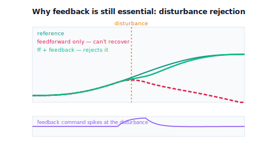

!!! abstract "You are here"
    **Module 8 — Feedback Control and Real-Time Execution (ROS 2)**  ·  **Unit 4 — Tracking the Whole Arm: Feedforward and Feedback**  ·  **Lesson 4.4 — Disturbances, Load, and the Complete Tracker**

# Lesson 4.4 — Disturbances, Load, and the Complete Tracker

> Feedforward is powerful because it knows the plan — and limited for exactly the same reason: the plan never mentions the unexpected. A gust of load, a payload heavier than the model assumed, friction that crept up with wear — none of these are in $q_d, \dot q_d, \ddot q_d$, so feedforward cannot anticipate them. **Feedback can**, because it watches what actually happens. This lesson nails down why feedback is non-negotiable — feedforward alone cannot reject a disturbance, while feedforward+feedback shrugs it off — then assembles the **complete joint tracker** that Module 8 was built to deliver, and closes Unit 4.

---

## 1. Why This Matters
Lesson 4.3 might tempt you to think feedforward is the star and feedback a minor cleanup. This lesson corrects that: feedback is what makes the controller *survive contact with reality*. The world is full of things no planner can foresee — a fruit that's heavier than expected, an arm brushing a branch, a motor warming up and changing its friction, a payload picked up mid-trajectory. Feedforward, computed entirely from the plan, is structurally blind to all of them. Feedback, computed from the measured error, catches every one — that's the whole reason the module opened (Unit 1) by showing open-loop drift.

So the complete controller needs both, and for *different* reasons: feedforward for the **known** (performance, no lag) and feedback for the **unknown** (robustness, disturbance rejection). Understanding precisely which job each does — and that neither substitutes for the other — is the mature picture of motion control. This lesson also assembles the deliverable: a single joint tracker that takes the Module 7 reference and the measured state and outputs a command, the seed of the Module 9 capstone.

## 2. Physical Intuition
Imagine carrying a tray of glasses along a route you've memorised. **Feedforward** is executing the memorised route perfectly — every lean and pause planned in advance. Now someone bumps your elbow. The memorised route says nothing about the bump; if all you do is execute the plan, the glasses go flying. What saves you is **feedback**: you *feel* the tray tilt and react, regardless of the fact that the bump wasn't in your plan. You didn't need to predict the bump — you only needed to sense its effect and correct. That's disturbance rejection, and only feedback provides it.

A robot joint is identical. Feedforward drives the planned motion beautifully — until something not in the plan happens. A heavier payload means the planned force is now too small; the joint falls behind, and feedforward, reading only the plan, keeps issuing the same too-small command forever. The error just sits there. Add feedback and the story changes: the error is sensed, the feedback term ramps up its correction, and the joint is dragged back onto the reference. The plan didn't change; reality did; feedback noticed. This is the irreplaceable job of feedback, and why a controller that's "all feedforward" is fragile.

## 3. Mathematical Foundations
**Why feedforward can't reject disturbances.** Feedforward is $u_{\text{ff}} = m\ddot q_d + b\dot q_d + \ell_{\text{nominal}}$ — a function of the *reference and the model only*. A disturbance $d(t)$ (an unmodelled load, a bump, extra friction) enters the *plant*, not the reference: $m\ddot q = u - b\dot q - \ell - d(t)$. Since $d$ never appears in $u_{\text{ff}}$, feedforward issues the same command it would have with no disturbance — it literally cannot respond, because it never measures $q$. The disturbance produces a persistent tracking error that feedforward leaves untouched.

**Why feedback can.** Feedback is $u_{\text{fb}} = \text{PID}(q_d - q)$ — a function of the *measured error*. The disturbance changes $q$, which changes the error, which drives $u_{\text{fb}}$ to oppose it. Feedback doesn't need to know what $d$ is or where it came from; it only needs to see its effect on $q$ — exactly the property from Unit 1. So feedback rejects disturbances feedforward never anticipated.

**The complete joint tracker** combines them:
$$u(t) = \underbrace{m\,\ddot q_d + b\,\dot q_d + \ell_{\text{nominal}}}_{\text{feedforward: known plan}} + \underbrace{\text{PID}(q_d - q)}_{\text{feedback: unknown residual + disturbance}}.$$
Feedforward handles the planned motion and the *nominal* load; feedback handles model mismatch *and* disturbances. Extended to the arm, one such tracker runs per joint — the engine's `JointTracker(gains, ff="full")`, whose `command(refs_t, measured, …)` consumes Module 7's per-joint $(q_d, \dot q_d, \ddot q_d)$ and the measured state to produce per-joint commands. The verified demonstration: under a mid-trajectory disturbance kick, feedforward-*only* leaves a large final error (it can't react), while feedforward+feedback drives the final error to near zero. That contrast is the proof that feedback is essential.

This tracker — `tracking_controller(reference, measured_state) → actuator_command` — is precisely the interface Module 8 was chartered to produce and that Module 9 will integrate. With it, Unit 4 closes the loop the module opened: Module 7 says *where to go*; this controller makes the arm *actually go there*, accurately (feedforward) and robustly (feedback).

## 4. Visual Explanation

<figure markdown>
  { width="680" }
</figure>

## 5. Engineering Example
Every robust motion system leans on feedback for the world's surprises. A robot arm that picks up an unexpectedly heavy part sags momentarily, then feedback restores the trajectory — feedforward (sized for the nominal part) never could. A drone hit by a gust holds position because feedback rejects the wind feedforward didn't plan. A CNC machine biting into a hard inclusion in the material feels the cutting-force spike and feedback holds the path. Conversely, the cautionary tales are all "feedforward-only" or open-loop systems meeting reality: a 3D printer that loses steps on a snag and prints the rest offset forever (no feedback to notice), or any dead-reckoning system that drifts without correction. The engineering consensus is blunt: you may tune feedforward for performance, but you *never* ship without feedback, because the one thing you can guarantee about the real world is that it will do something your plan didn't include.

## 6. Worked Example
Disturbance rejection, head to head.

- **Setup:** the fast 1.5 s move; a disturbance kick applied to the joint partway through (a sudden extra load for a fraction of a second).
- **Feedforward only** (good nominal model, **no** feedback): tracks the plan until the kick, then jumps off the reference and **stays off** — final error ≈ **1.4 rad**. It issues the planned command throughout and never sees the disturbance.
- **Feedforward + feedback** (same feedforward, modest PID): the kick causes a brief dip, then feedback drags the joint back — final error ≈ **0.003 rad**. The feedback command spikes exactly at the kick and subsides once corrected.
- **Reading it:** identical feedforward; the only difference is whether feedback is present — and it's the difference between a permanent error and full recovery. Feedforward is for the plan; feedback is for everything the plan omits.
- The notebook applies the kick to both controllers and asserts feedforward-only leaves a large residual while feedforward+feedback recovers to near zero.

## 7. Interactive Demonstration
*(Conceptual — runnable in the companion notebook.)*

**The disturbance test.** In the notebook you:

1. Track the reference with feedforward only and inject a disturbance kick — watch the actual step off the reference and never recover.
2. Add feedback (same feedforward) and repeat — watch the actual dip then snap back onto the reference.
3. Plot the feedback command and see it spike precisely at the disturbance — feedback catching what feedforward can't.

## 8. Coding Exercise

!!! tip "Run the hands-on notebook"
    `modules/module08/notebooks/lesson16_disturbances_complete_tracker.ipynb` — open in JupyterLab and run **Kernel → Restart & Run All**.

*(Snippet / notebook task — uses `track_reference(ff="full")` with `extra_disturbance`, `JointTracker`, `track_arm`.)*

In the companion notebook:

1. Apply a mid-trajectory disturbance to a feedforward-**only** run (zero feedback gains) and assert a large residual error remains at the end.
2. Repeat with feedforward+feedback (same feedforward) and assert the final error is near zero — feedback rejected the disturbance.
3. Assemble a multi-joint `JointTracker(ff="full")`, track a two-joint reference with a disturbance on one joint, and assert the overall RMS stays small — the complete tracker in action.

## 9. Knowledge Check

Formative — unlimited attempts, immediate feedback; does not affect your grade.

<iframe src="../../quizzes/module08/lesson16_quiz.html" title="Disturbances, Load, and the Complete Tracker knowledge check" style="width:100%;height:720px;border:1px solid #e2e8f0;border-radius:12px"></iframe>

[Open this quiz in a new tab ↗](../quizzes/module08/lesson16_quiz.html)

1. Why is feedforward structurally unable to reject a disturbance?
2. Why can feedback reject a disturbance it was never told about?
3. Write the complete joint tracker command and state which part handles the plan and which handles surprises.
4. What is the tracker's interface, and how does it connect Modules 7 and 9?

## 10. Challenge Problem
A colleague proposes dropping feedback entirely and relying on a very accurate feedforward model "because the model is good now." Explain, using the disturbance argument, why this is unsafe regardless of model quality, and give two concrete real-world disturbances a greenhouse-harvesting arm would face that no model could anticipate. Then describe the complete tracker's division of labour precisely — what feedforward owns, what feedback owns — and explain why this controller, not either piece alone, is the right thing to hand to Module 9's system integration. Finally, connect back to Unit 1: how is this the same lesson as "open-loop drifts," now at full strength? *(You are defending feedback as the robustness guarantee of the whole stack.)*

## 11. Common Mistakes
- **Trusting a good model to remove the need for feedback.** No model anticipates disturbances; feedback is non-negotiable.
- **Thinking feedback "fixes" feedforward's model.** It corrects the *residual* online, but a wildly wrong model still strains the loop — keep feedforward reasonable.
- **Forgetting disturbances enter the plant, not the reference.** That's exactly why feedforward (reference-based) can't see them and feedback (plant-based) can.
- **Shipping feedforward-only.** Fast and accurate on paper, fragile on contact with reality.

## 12. Key Takeaways
- Disturbances (unmodelled load, bumps, changing friction) enter the **plant**, not the reference — so **feedforward is blind to them**.
- **Feedback rejects disturbances** it was never told about, because it acts on the measured error — the Unit 1 lesson at full strength.
- The **complete joint tracker** is feedforward (known plan, performance) **+** feedback (unknown residual and disturbance, robustness): $u = m\ddot q_d + b\dot q_d + \ell + \text{PID}(q_d-q)$, one per joint.
- This `tracking_controller(reference, measured_state) → actuator_command` is Module 8's deliverable and the **handoff to Module 9**. Unit 4 complete; the midpoint assessment follows.

---

### AI Learning Companion

Copy any prompt below into your AI tutor.

- **Tutor (re-explain):** "Re-explain why feedback is essential using the 'carrying a tray when someone bumps your elbow' analogy: feedforward executes the memorised route, feedback catches the bump that wasn't in the plan. Then state the complete joint tracker u = m·q̈_d + b·q̇_d + ℓ + PID(q_d−q) and which part handles known vs unknown."
- **Practice (generate exercises):** "Describe a disturbance scenario and ask me to predict what feedforward-only does versus feedforward+feedback, and why. Withhold the answer until I respond."
- **Explore (connect to the real world):** "Give me real cases where feedback saved a motion system from an unplanned disturbance (heavy part, gust, hard material), and one cautionary case of a feedforward-only or open-loop system drifting after a surprise."

### Global Learning Support

Per-language explanation prompts — use whichever you think best in.

- **English (authoritative):** "Explain why feedforward cannot reject disturbances (they enter the plant, not the reference) while feedback can (it acts on measured error), and assemble the complete joint tracker u = m·q̈_d + b·q̇_d + ℓ + PID(q_d−q) as Module 8's deliverable to Module 9 — at a robotics-course level (no manipulator dynamics)."
- **Español:** "Explica por qué el feedforward no puede rechazar perturbaciones (entran en la planta, no en la referencia) mientras que la realimentación sí (actúa sobre el error medido), y ensambla el rastreador de articulación completo u = m·q̈_d + b·q̇_d + ℓ + PID(q_d−q) como entregable del Módulo 8 al Módulo 9 — a nivel de curso de robótica (sin dinámica del manipulador)."
- **中文（简体）：** "解释为什么前馈无法抑制扰动（扰动进入被控对象，而非参考），而反馈可以（它作用于测量误差），并组装完整的关节跟踪器 u = m·q̈_d + b·q̇_d + ℓ + PID(q_d−q)，作为模块8交付给模块9的成果——机器人课程水平（不涉及机械臂动力学）。"
- **Türkçe:** "İleri beslemenin neden bozucuları reddedemediğini (bozucular referansa değil, sisteme girer) ve geri beslemenin neden reddedebildiğini (ölçülen hata üzerinde çalışır) açıkla; ve tam eklem izleyicisini u = m·q̈_d + b·q̇_d + ℓ + PID(q_d−q) Modül 8'in Modül 9'a teslimatı olarak birleştir — robotik dersi düzeyinde (manipülatör dinamiği yok)."

---

*Next: Module 8 Midpoint Assessment (Units 1–4), then Installment C — Unit 5: Actuator Control.*
