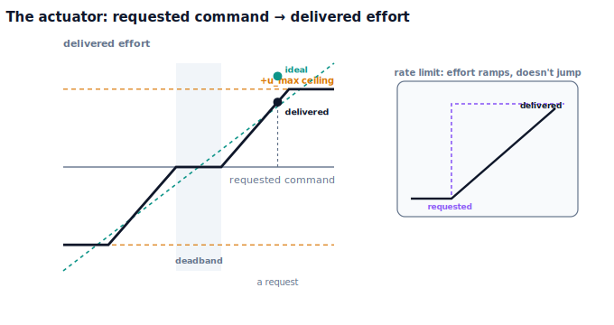

!!! abstract "You are here"
    **Module 8 — Feedback Control and Real-Time Execution (ROS 2)**  ·  **Unit 5 — Actuator Control**  ·  **Lesson 5.1 — The Actuator: From Requested Command to Delivered Effort**

# Lesson 5.1 — The Actuator: From Requested Command to Delivered Effort

> Units 1–4 built a controller that decides *what command to send*. We drew an arrow from the controller to the joint and assumed the joint received exactly that command. Reality puts a device on that arrow — the **actuator** — and that device does not faithfully hand over whatever you ask for. It has a ceiling (it can only push so hard), a floor (tiny commands do nothing), and inertia of its own (it can't switch effort instantly). This lesson opens Unit 5 by replacing the faithful-arrow fiction with the honest picture: **a requested command goes in, a delivered effort comes out, and they differ.**

---

## 1. Why This Matters
A controller is only as good as the effort it can actually get delivered. You can compute a beautiful command, but if the motor is already pushing as hard as it can, the extra is thrown away; if the command is a whisper, friction eats it and nothing moves; if the command jumps, the hardware can only ramp toward it. Treat the actuator as a perfect wire and your careful tuning quietly lies to you — the loop you analysed is not the loop that runs.

This is the bridge from "the controller decides" (Units 1–4) to "the command becomes motion" (Unit 5). Everything downstream in this unit — why integrators wind up (5.2), why a joint sticks short of target (5.3), why some trajectories simply can't be tracked (5.4) — follows from the three plant-level nonlinearities introduced here. We stay strictly at the level of *what is delivered*: no motor electrodynamics, no current loops, no actuator dynamics. The actuator is a converter with a shape, and the shape is what bites.

## 2. Physical Intuition
Think of asking someone to push a heavy cart. **Saturation:** ask them to push with 500 N and they simply can't — they give you their maximum and no more. **Deadband:** ask for a feather-light nudge and static friction means nothing happens until you ask for enough. **Rate limit:** ask them to slam from a hard pull to a hard push instantly and they can't reverse that fast — the effort ramps. None of this is about *how muscles work*; it's about *what force actually reaches the cart* for a given request.

A robot joint's actuator is the same story. Request more torque than it can produce and you get its ceiling. Request a torque smaller than what's needed to overcome the joint's own friction and you get no motion. Request an instantaneous reversal and you get a ramp. The controller speaks in "requested command"; the joint feels "delivered effort." The translation between them is the actuator, and a good engineer keeps the difference in view at all times.

## 3. Mathematical Foundations
Model the actuator as a **static transfer characteristic** plus a **rate limit** — plant-level, not dynamical. Given a requested command $u_{\text{req}}$, the delivered effort $u_{\text{del}}$ is:

$$u_{\text{del}} = \operatorname{clip}\!\Big(\,\operatorname{deadband}_{\,d}(u_{\text{req}}),\; -u_{\max},\; +u_{\max}\Big), \qquad
\operatorname{deadband}_{\,d}(u) = \begin{cases} 0 & |u| \le d \\ u - d\,\operatorname{sign}(u) & |u| > d. \end{cases}$$

Two static nonlinearities: a **deadband** of half-width $d$ (requests inside $[-d, d]$ deliver nothing; larger requests are shifted in past the band) and a **saturation** ceiling $u_{\max}$. On top of these, a **rate limit** caps how fast the delivered effort can slew between steps:

$$|u_{\text{del}}(t+\Delta t) - u_{\text{del}}(t)| \le r_{\max}\,\Delta t.$$

That is the whole actuator: a curve with a flat dead zone in the middle, a sloped middle region, and two flat ceilings, with a slew limit on top. The plant the joint obeys is unchanged from Unit 1 — $m\ddot q = u_{\text{del}} - b\dot q - \ell$ — except that it is driven by $u_{\text{del}}$, not $u_{\text{req}}$. In the engine, `Actuator(u_max, deadband, rate_max).deliver(u_req, dt)` performs exactly this conversion, and `Actuator.characteristic(grid)` returns the static requested-vs-delivered curve. The verified fact: a single requested command of $5$ is delivered as $5$ by an ideal actuator, as $0$ through a deadband of $8$, and as $3$ through a ceiling of $3$ — same request, three different deliveries.

## 4. Visual Explanation

<figure markdown>
  { width="680" }
</figure>

## 5. Engineering Example
Every real drivetrain wears these limits openly. A servo motor has a peak torque it physically cannot exceed — datasheets list it as "stall torque," and a controller commanding beyond it just gets the ceiling. Geared joints have backlash and stiction that create a dead zone around zero, which is why a robot finger can fail to make the final tiny move onto a delicate fruit. Hydraulic and pneumatic actuators have pronounced rate limits — valves and fluid can't reverse flow instantly. Even a quadcopter's rotors saturate (max thrust) and slew-limit (the motor can only spin up so fast). The competent control engineer never tunes against an idealised actuator; they tune knowing the command will be re-shaped by these limits before it reaches the joint.

## 6. Worked Example
One request, three actuators.

- **Setup:** request a command of $u_{\text{req}} = 5$.
- **Ideal actuator** ($u_{\max}=100$, no deadband): delivers $5$ — the faithful wire of Units 1–4.
- **Deadband $d = 8$:** $|5| \le 8$, so it delivers $0$ — the request is too small to register.
- **Saturated $u_{\max}=3$:** delivers $3$ — the ceiling.
- **Transfer curve** ($u_{\max}=6$, $d=2$): flat $0$ for $|u_{\text{req}}| \le 2$, rising for larger requests, flat at $\pm 6$ beyond the ceiling.
- **Rate limit** ($r_{\max} = 200$/s, $\Delta t = 0.002$): asked to jump to $50$ from rest, the delivered effort steps $0.4, 0.8, 1.2, \dots$ — it ramps, it doesn't leap.
- The notebook builds each actuator and confirms these exact deliveries.

## 7. Interactive Demonstration

<iframe src="../../demos/module08/lesson17_actuator_bench.html" title="The Actuator: From Requested Command to Delivered Effort interactive demo" style="width:100%;height:520px;border:1px solid #e2e8f0;border-radius:12px"></iframe>

[Open this demo in a new tab ↗](../demos/module08/lesson17_actuator_bench.html)

The **Actuator Bench** lets you dial a requested command and watch the delivered effort respond as you change the actuator's limits.

1. Set the deadband and try small requests — watch delivery stay at zero until you cross the band.
2. Lower the saturation ceiling and push a large request — watch delivery clip flat.
3. Turn on the rate limit and snap the request — watch delivery ramp toward it instead of jumping.

The transfer curve redraws live so you can see the dead zone, the slope, and the ceilings all at once.

## 8. Coding Exercise

!!! tip "Run the hands-on notebook"
    `modules/module08/notebooks/lesson17_actuator_command_to_motion.ipynb` — open in JupyterLab and run **Kernel → Restart & Run All**.

*(Companion notebook — uses `Actuator(u_max, deadband, rate_max)`, `.deliver(u_req, dt)`, `.characteristic(grid)`.)*

In the notebook you:

1. Deliver the same requested command through an ideal, a deadband, and a saturated actuator, and confirm three different delivered values.
2. Compute the transfer characteristic and assert it is flat zero inside the deadband and flat at the ceiling beyond $u_{\max}$.
3. Drive a rate-limited actuator with a big step and confirm the delivered effort ramps at the slew limit rather than jumping.

## 9. Knowledge Check

Formative — unlimited attempts, immediate feedback; does not affect your grade.

<iframe src="../../quizzes/module08/lesson17_quiz.html" title="The Actuator: From Requested Command to Delivered Effort knowledge check" style="width:100%;height:720px;border:1px solid #e2e8f0;border-radius:12px"></iframe>

[Open this quiz in a new tab ↗](../quizzes/module08/lesson17_quiz.html)

1. What does an actuator convert, and why isn't a requested command the same as the delivered effort?
2. Describe each of the three plant-level nonlinearities (saturation, deadband, rate limit) by its effect on delivery.
3. Sketch the transfer characteristic and label the deadband, the slope, and the ceilings.
4. Why do we deliberately *not* model motor electrodynamics here?

## 10. Challenge Problem
A teammate insists their loop is perfectly tuned because the simulation (ideal actuator) tracks flawlessly, yet the real arm overshoots on fast moves and stalls just short on slow approaches. Using only the three nonlinearities from this lesson, explain *both* symptoms — which limit causes the fast-move problem, which causes the slow-approach problem — and predict what they'd see on the requested-vs-delivered curve in each case. Then argue why measuring the *delivered* effort (not just the requested command) is essential to debugging a real controller, and connect this to why Units 1–4's "command reaches the joint" picture had to be a simplification. *(You are establishing the actuator as the missing translation layer.)*

## 11. Common Mistakes
- **Tuning against an ideal actuator.** The loop you analysed isn't the loop that runs; the actuator re-shapes the command first.
- **Confusing requested with delivered effort.** The controller's output is a request; only the actuator says what's delivered.
- **Treating the deadband as "small, so ignorable."** It is precisely what blocks the final tiny move (5.3).
- **Reading the actuator as a motor model.** It is a plant-level transfer characteristic — what is delivered — not electrodynamics.

## 12. Key Takeaways
- An **actuator** sits between controller and plant and converts a **requested command** into a **delivered effort**; the two differ.
- Three plant-level nonlinearities shape delivery: **saturation** (effort ceiling), **deadband** (tiny requests deliver nothing), and a **rate limit** (effort can't jump).
- The actuator is a **transfer characteristic** ($+$ slew limit), modelled at the plant level — **no motor internals**.
- The plant is still $m\ddot q = u_{\text{del}} - b\dot q - \ell$, but driven by the *delivered* effort. This sets up windup (5.2), deadband/stiction (5.3), and the feasibility envelope (5.4).

---

### AI Learning Companion

Copy any prompt below into your AI tutor.

- **Tutor (re-explain):** "Re-explain the actuator as a request→delivery converter using the 'asking someone to push a cart' analogy: saturation = their max push, deadband = too light to register, rate limit = can't reverse instantly. Then describe the requested-vs-delivered transfer curve and where each limit appears."
- **Practice (generate exercises):** "Give me a requested command and an actuator (u_max, deadband, rate_max) and ask me to predict the delivered effort; then vary one limit at a time. Withhold the answer until I respond."
- **Explore (connect to the real world):** "Give real actuators (servo stall torque, geared-joint backlash, hydraulic rate limits, quadrotor rotor saturation) and ask me to match each to saturation, deadband, or rate limit."

### Global Learning Support

Per-language explanation prompts — use whichever you think best in.

- **English (authoritative):** "Explain the actuator as a request→delivery converter with three plant-level nonlinearities — saturation (effort ceiling), deadband (small requests deliver nothing), and a rate limit (effort can't jump) — and the requested-vs-delivered transfer characteristic, at a robotics-course level (no motor electrodynamics, no actuator dynamics)."
- **Español:** "Explica el actuador como un conversor de petición→entrega con tres no linealidades a nivel de planta — saturación (techo de esfuerzo), zona muerta (las peticiones pequeñas no entregan nada) y un límite de velocidad de cambio (el esfuerzo no puede saltar) — y la característica de transferencia pedido-vs-entregado, a nivel de curso de robótica (sin electrodinámica del motor, sin dinámica del actuador)."
- **中文（简体）：** "把执行器解释为'请求→交付'转换器，具有三种被控对象层面的非线性——饱和（力的上限）、死区（很小的请求不产生输出）以及变化率限制（力不能瞬间跳变）——并说明'请求-对-交付'的传递特性，达到机器人课程水平（不涉及电机电动力学，不涉及执行器动力学）。"
- **Türkçe:** "Eyleyiciyi, üç tesis-seviyesi doğrusalsızlığı olan bir istek→teslim dönüştürücüsü olarak açıkla — doyum (kuvvet tavanı), ölü bant (küçük istekler hiçbir şey teslim etmez) ve bir değişim hızı sınırı (kuvvet aniden sıçrayamaz) — ve istenen-karşı-teslim edilen transfer karakteristiğini, robotik dersi düzeyinde (motor elektrodinamiği yok, eyleyici dinamiği yok)."

---

*Next: Lesson 5.2 — Saturation and Integral Windup.*
