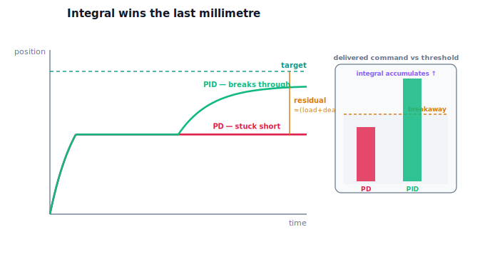

!!! abstract "You are here"
    **Module 8 — Feedback Control and Real-Time Execution (ROS 2)**  ·  **Unit 5 — Actuator Control**  ·  **Lesson 5.3 — Deadband, Stiction, and Why Integral Wins the Last Millimetre**

# Lesson 5.3 — Deadband, Stiction, and Why Integral Wins the Last Millimetre

> Saturation was the ceiling; this is the floor. Near zero command, the actuator's deadband delivers nothing and the joint's static friction refuses to budge until the effort crosses a breakaway threshold. The cruelty is that proportional and derivative action shrink to nothing exactly when the error is small — so they hand the joint to friction and walk away, leaving it parked short of the target. The integral term is the only one that keeps pressing: it banks the small leftover error until the command is finally large enough to break through. The final approach is the integrator's job.

---

## 1. Why This Matters
"Almost there" is where precision tasks live and die. A harvesting gripper that stops a few millimetres short of the fruit, a pen plotter that never quite touches down, a valve that won't close the last sliver — these are deadband and stiction failures, and they are invisible until the very end of a move. A controller can look excellent through the whole trajectory and still fail the one moment that matters: the final settle onto the target. Understanding why P and D give up there, and why I doesn't, is the difference between a robot that *reaches* its goal and one that hovers maddeningly near it.

This lesson is the second half of Unit 5's payoff and the mirror image of 5.2: saturation is too much command being discarded at the top; deadband/stiction is too little command being swallowed at the bottom. Together they bound what the actuator can usefully deliver — the envelope we formalise in 5.4.

## 2. Physical Intuition
Try to slide a heavy book the last centimetre across a table with a feather-light touch. Push gently and nothing happens — static friction holds it. Push a bit harder, still nothing, until suddenly you cross the threshold and it lurches. That refusal-to-move-until-enough is **stiction** (static friction); the band of gentle pushes that accomplish nothing is the **deadband**. Now imagine your strategy is "push in proportion to how far it still has to go." Near the end, it has almost no distance left, so you push almost not at all — and it never makes the final move. You are guaranteed to stall short.

The fix is intuitively obvious once you see it: if gentle steady pressure isn't moving it, *lean harder over time*. Keep adding pressure as long as it hasn't arrived. Eventually you cross the breakaway threshold and it slides home. That "keep adding pressure while it hasn't arrived" is exactly integral action. Proportional says "push by the current gap" and gives up as the gap closes; integral says "push by the accumulated gap" and never gives up. The last millimetre needs the one that never gives up.

## 3. Mathematical Foundations
Two small-effort effects. The actuator's **deadband** (Lesson 5.1) delivers $0$ for $|u_{\text{req}}| \le d$. The joint's **stiction** is plant-level static friction: at rest, motion begins only once the net forcing exceeds a breakaway threshold $\sigma$; below it the joint stays put. The engine models this with `apply_stiction(net, qd, stiction)` inside `step_plant`, and the deadband inside `Actuator.deliver`.

**Why P and D stall.** A proportional command is $K_p e$. As the joint approaches the target, $e \to$ small, so $K_p e \to$ small — and once $K_p e$ falls inside the deadband (or below the stiction breakaway), the delivered effort is $0$ and the joint stops. Worse, under a steady load $\ell$ the joint can't even hold without effort, so it settles where the *delivered* command balances the load: roughly $K_p e^\star - d \approx \ell$, giving a residual error $e^\star \approx (\ell + d)/K_p$ that proportional gain can shrink but not erase. Derivative action is no help — it responds to the *rate* of error, which is also near zero at a stall. So P and D structurally surrender the final approach.

**Why I wins.** The integral term is $K_i \int e\,dt$. While the joint is stuck with a small residual $e^\star > 0$, the integrator keeps accumulating: $e_i$ grows steadily even though $e$ is small. Eventually $K_i e_i$ lifts the total command past the deadband and the stiction breakaway, the joint lurches forward, and the error collapses toward zero. The verified contrast: a setpoint of $1.0$ with a deadband of $2.0$, stiction $0.6$, and a load of $2.0$ leaves a **PD** controller stuck with $|e| \approx 0.44$, while adding integral drives **PID** to $|e| \approx 0.003$ — more than two orders of magnitude better. The integrator is the only term that treats "small but persistent" as "keep pushing."

## 4. Visual Explanation

<figure markdown>
  { width="680" }
</figure>

## 5. Engineering Example
The last-millimetre problem is everywhere precision matters. Machine-tool positioning stages add integral action specifically to defeat stiction in the ways and screws, so the table lands exactly on the commanded coordinate rather than a hair short. Antenna and telescope pointing systems fight stiction in their bearings; without integral they settle with a small persistent pointing error. Valve positioners in process control are built around integral action because a valve's packing friction creates a wide deadband — proportional control alone leaves the valve chronically off-setpoint. In robotics, a gripper making a delicate final approach onto a soft fruit relies on the integrator to convert "almost touching" into "touching," because the proportional command at that range is far too small to overcome the joint's own friction.

## 6. Worked Example
P/PD stalls; integral arrives.

- **Setup:** a setpoint move to $1.0$ on a joint with a load of $2.0$, through an actuator with a deadband of $2.0$, and plant stiction of $0.6$.
- **PD** ($K_p=8,\,K_i=0,\,K_d=2$): rises, then as the error shrinks the proportional command drops into the deadband, the delivered effort goes to zero, and the joint freezes with $|e| \approx \mathbf{0.44}$ — a clearly visible gap.
- **PID** ($K_p=8,\,K_i=6,\,K_d=2$, clamp $20$): the integrator accumulates the small residual until the command crosses the deadband and breakaway, the joint moves the rest of the way, and $|e| \approx \mathbf{0.003}$.
- **Reading it:** the only change is the integral term, and it converts a permanent $0.44$-rad miss into a near-perfect landing. The deadband and stiction haven't changed; the integrator simply refuses to quit.
- The notebook asserts PD leaves a residual above $0.2$, PID lands below $0.05$, and PID is at least four times better.

## 7. Interactive Demonstration
*(Conceptual — runnable in the companion notebook.)*

**The last-millimetre test.** In the notebook you:

1. Drive a joint with deadband and stiction using PD only and watch it stall short of the target with a measurable gap.
2. Add integral action and watch the joint stall briefly, then break through and land on the target.
3. Inspect the integrator value rising while the joint is stuck — the accumulation that finally crosses the threshold.

## 8. Coding Exercise

!!! tip "Run the hands-on notebook"
    `modules/module08/notebooks/lesson19_deadband_and_friction.ipynb` — open in JupyterLab and run **Kernel → Restart & Run All**.

*(Companion notebook — uses `track_reference_actuated(..., stiction=...)`, `Actuator(deadband=...)`, `PIDController` with and without `Ki`.)*

In the notebook you:

1. Track a setpoint on a joint with deadband and stiction using a PD controller and assert a residual error remains.
2. Repeat with integral action and assert the final error collapses to near zero.
3. Confirm the integral run is decisively better (several times smaller final error) — the integrator overcame the deadband and stiction.

## 9. Knowledge Check

Formative — unlimited attempts, immediate feedback; does not affect your grade.

<iframe src="../../quizzes/module08/lesson19_quiz.html" title="Deadband, Stiction, and Why Integral Wins the Last Millimetre knowledge check" style="width:100%;height:720px;border:1px solid #e2e8f0;border-radius:12px"></iframe>

[Open this quiz in a new tab ↗](../quizzes/module08/lesson19_quiz.html)

1. Define deadband and stiction, and explain why both block small commands.
2. Why do proportional and derivative action vanish exactly when the error is small?
3. Why does integral action succeed where P and D fail at the final approach?
4. Estimate the PD residual error for load $\ell$, deadband $d$, and gain $K_p$, and explain why raising $K_p$ shrinks but doesn't erase it.

## 10. Challenge Problem
A pick-and-place arm reaches every target to within a couple of millimetres but never exactly, and raising the proportional gain reduces the miss but introduces jitter and overshoot elsewhere. Explain the persistent miss using deadband and stiction, and explain why cranking $K_p$ is the wrong fix (what does it cost?). Then explain precisely how adding integral action solves the final approach, and what a poorly chosen integral gain or clamp could do (too slow to break through, or windup from 5.2). Finally, tie 5.2 and 5.3 together: how are saturation-windup and deadband-stall two faces of the same fact — that the actuator only usefully delivers effort within a bounded band? *(You are arguing that the integrator owns the last millimetre, within limits set by the actuator.)*

## 11. Common Mistakes
- **Raising $K_p$ to fix a stall.** It shrinks the residual but buys jitter and overshoot; the residual never reaches zero.
- **Expecting derivative action to help at a stall.** D responds to error *rate*, which is ~zero when stuck.
- **Forgetting the load.** Under load the joint can't even hold without effort, so P settles off-target by $(\ell+d)/K_p$.
- **Over-clamping the integrator.** Too tight a clamp (from 5.2's anti-windup) can stop the integral from ever breaking through — balance the two.

## 12. Key Takeaways
- **Deadband** (actuator) and **stiction** (joint) both block small commands: tiny efforts deliver no motion until a breakaway threshold is crossed.
- **Proportional and derivative action stall** at the final approach because their commands shrink to nothing as the error (and its rate) shrink — leaving a residual ≈ $(\ell+d)/K_p$ under load.
- **Integral action wins the last millimetre**: it accumulates the small persistent error until the command crosses the threshold and the joint reaches the target.
- Verified: with deadband, stiction, and load, PD stalls at $|e|\approx 0.44$ while PID lands at $|e|\approx 0.003$. Saturation (5.2) and deadband/stiction (5.3) together bound the usable effort — the feasibility envelope of 5.4.

---

### AI Learning Companion

Copy any prompt below into your AI tutor.

- **Tutor (re-explain):** "Re-explain why integral action wins the last millimetre using the 'sliding a heavy book the final centimetre with a feather-light touch' analogy: stiction holds it, proportional push shrinks to nothing as the gap closes, and only 'leaning harder over time' (integral) breaks through. Then give the PD residual ≈ (load+deadband)/Kp."
- **Practice (generate exercises):** "Give me a joint with a deadband, stiction, and a load, and a choice of P, PD, or PID, and ask me to predict whether it reaches the target or stalls short. Withhold the answer until I respond."
- **Explore (connect to the real world):** "Give real last-millimetre cases (machine-tool stage stiction, valve positioner deadband, telescope pointing, a gripper's final approach) and ask me to identify the deadband/stiction and the role of integral action in each."

### Global Learning Support

Per-language explanation prompts — use whichever you think best in.

- **English (authoritative):** "Explain deadband and stiction (small commands deliver no motion until a breakaway threshold), why proportional/derivative action stalls short, and why integral action overcomes them to reach the target — at a robotics-course level (no friction models like LuGre, plant-level intuition only)."
- **Español:** "Explica la zona muerta y la fricción estática/stiction (los comandos pequeños no producen movimiento hasta un umbral de ruptura), por qué la acción proporcional/derivativa se queda corta y por qué la acción integral las supera para alcanzar el objetivo — a nivel de curso de robótica (sin modelos de fricción como LuGre, solo intuición a nivel de planta)."
- **中文（简体）：** "解释死区与静摩擦/stiction（小指令在跨过起动阈值前不产生运动）、为什么比例/微分作用会停在目标之前，以及为什么积分作用能克服它们到达目标——达到机器人课程水平（不涉及 LuGre 等摩擦模型，仅被控对象层面的直觉）。"
- **Türkçe:** "Ölü bandı ve statik sürtünmeyi/stiction'ı (küçük komutlar, bir kopma eşiği aşılana kadar hareket üretmez), oransal/türevsel etkinin neden kısa kaldığını ve integral etkisinin hedefe ulaşmak için bunları neden yendiğini açıkla — robotik dersi düzeyinde (LuGre gibi sürtünme modelleri yok, yalnızca tesis-seviyesi sezgi)."

---

*Next: Lesson 5.4 — The Command Pipeline and the Feasibility Envelope.*
