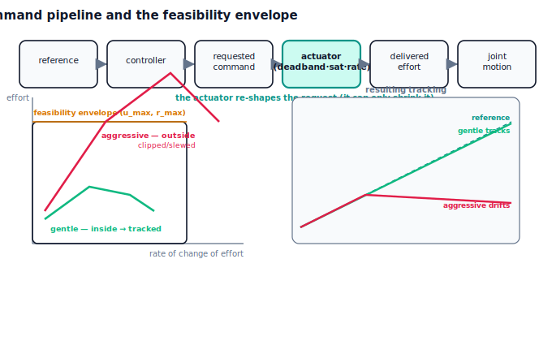

!!! abstract "You are here"
    **Module 8 — Feedback Control and Real-Time Execution (ROS 2)**  ·  **Unit 5 — Actuator Control**  ·  **Lesson 5.4 — The Command Pipeline and the Feasibility Envelope**

# Lesson 5.4 — The Command Pipeline and the Feasibility Envelope

> Unit 5 introduced three actuator limits one at a time. Now we put them together and look at the whole path a command travels: from the reference, through the controller, into a requested command, through the actuator's deadband/saturation/rate limit, out as a delivered effort, and finally into motion. Seen whole, the actuator's limits define a **feasibility envelope** — the effort and rate the joint can actually produce. And here is the punchline that ties Unit 5 back to Module 7: a trajectory that demands more than the envelope allows simply cannot be tracked, however perfect the controller. Feasibility isn't only geometry and velocity — it's what the actuator can deliver.

---

## 1. Why This Matters
It is tempting to believe a good enough controller can track any trajectory. It can't. If the plan asks for more torque than the motor can produce, or a faster effort change than the actuator can slew, the controller's beautiful command is re-shaped by the limits of Lesson 5.1 and the trajectory is missed — not because the controller failed, but because the request was impossible. Recognising this saves enormous wasted effort: you stop re-tuning a loop that was never the problem and instead slow the plan down until it fits the hardware.

This lesson assembles Unit 5 and connects it to the rest of the stack. Module 7 already taught feasibility as a property of trajectories (respecting velocity and acceleration limits). Unit 5 reveals *where those limits ultimately come from*: the actuator's envelope. The command pipeline is the spine of the whole control system, and the envelope is the constraint every planner upstream must respect.

## 2. Physical Intuition
Think of the command pipeline as a relay race where the baton is the command. The reference hands a desired motion to the controller; the controller decides how hard to push and hands a *requested* command to the actuator; the actuator, bound by its limits, hands a *delivered* effort to the joint; the joint moves. The baton can only get smaller or slower as it passes through the actuator — never larger or faster than the actuator allows. If an early runner (the plan) demands a sprint the actuator-runner can't match, the baton arrives late no matter how eager the controller-runner was.

The **feasibility envelope** is just the actuator-runner's honest top speed and top strength. Stay inside it and the baton passes cleanly: the delivered effort matches the request and the joint tracks the plan. Ask for a pace outside it and the actuator clips and slews, the delivered effort falls short of the request, and the joint drifts off the trajectory. So the planner's real job, from the actuator's point of view, is to choose a motion whose demands fit inside the envelope — exactly the feasibility thinking from Module 7, now grounded in hardware.

## 3. Mathematical Foundations
The **command pipeline** is the composition of everything built so far:

$$\underbrace{\text{ref}(t) \to (q_d,\dot q_d,\ddot q_d)}_{\text{Module 7}} \;\to\; \underbrace{u_{\text{req}} = \text{FF} + \text{PID}(q_d - q)}_{\text{controller (Units 1–4)}} \;\to\; \underbrace{u_{\text{del}} = \text{actuator}(u_{\text{req}})}_{\text{Lesson 5.1}} \;\to\; \underbrace{m\ddot q = u_{\text{del}} - b\dot q - \ell}_{\text{plant}}.$$

The **feasibility envelope** is the set of efforts and rates the actuator can deliver:

$$|u_{\text{del}}| \le u_{\max}, \qquad \left|\frac{d\,u_{\text{del}}}{dt}\right| \le r_{\max},$$

plus the deadband floor below which nothing is delivered. The engine reports it with `feasibility_envelope(actuator)`. A trajectory is **trackable** only if the effort it demands — the command the controller must request to follow it — stays within these bounds for the whole motion. When it does, $u_{\text{del}} \approx u_{\text{req}}$ everywhere and tracking is tight. When it doesn't, the actuator clips and/or slews, $u_{\text{del}}$ falls short, and a tracking error opens up that no gain can close, because the missing effort is physically unavailable.

The verified contrast uses the same controller on two versions of the same move (0 → 1.2 rad). A **gentle** version (over 2.5 s) stays inside the envelope: no clipping, RMS error ≈ $0$. An **aggressive** version (over 0.35 s) demands far more effort than $u_{\max}$ can deliver: the actuator clips about **60%** of the time and the RMS error rises to ≈ **0.29**. Same controller, same target — only the trajectory's demand changed, and the envelope decided which one was trackable. This is precisely Module 7's feasibility statement, now read off the actuator: the planner must keep the demanded effort and rate inside the envelope.

## 4. Visual Explanation

<figure markdown>
  { width="680" }
</figure>

## 5. Engineering Example
Feasibility-by-envelope is standard practice in motion systems. CNC and robotic controllers run a "look-ahead" that slows the commanded feed rate wherever the upcoming path would demand more acceleration than the drives can deliver — the planner is explicitly kept inside the actuator envelope. Drone and rocket guidance constrain commanded manoeuvres to the thrust and slew limits of their actuators; a guidance law that ignored the envelope would command impossible accelerations and the vehicle would simply fall behind. Industrial robots publish payload-dependent speed limits precisely because a heavier payload shrinks the effective envelope (more of the available torque goes to holding the load). In every case the lesson is the one here: the controller can only ask; the actuator decides; and a wise planner asks only for what the envelope can give.

## 6. Worked Example
Same move, two demands.

- **Setup:** track 0 → 1.2 rad with feedforward + PID through an actuator with $u_{\max}=14$ and rate limit $r_{\max}=1500$.
- **Gentle (2.5 s):** the demanded effort stays inside the envelope. No clipping (`clip_frac` $= 0$), RMS error ≈ **0.0** — the delivered effort matches the request and the joint tracks the plan.
- **Aggressive (0.35 s):** the demanded effort far exceeds $u_{\max}$. The actuator clips about **60%** of the run (`clip_frac` ≈ 0.60), the delivered effort falls short, and RMS error ≈ **0.29** — the trajectory is missed.
- **Reading it:** the controller and target are identical; only the trajectory's aggressiveness changed. The envelope, not the controller, drew the line between trackable and not. To fix the aggressive case you don't re-tune — you slow the plan until its demand fits the envelope (Module 7's feasibility, enforced by hardware).
- The notebook asserts the gentle run has no clipping and tiny RMS, while the aggressive run clips and tracks several times worse.

## 7. Interactive Demonstration

<iframe src="../../demos/module08/lesson20_command_pipeline_envelope.html" title="The Command Pipeline and the Feasibility Envelope interactive demo" style="width:100%;height:520px;border:1px solid #e2e8f0;border-radius:12px"></iframe>

[Open this demo in a new tab ↗](../demos/module08/lesson20_command_pipeline_envelope.html)

*(Conceptual — runnable in the companion notebook.)*

**The envelope test.** In the notebook you:

1. Read the actuator's feasibility envelope ($u_{\max}$, $r_{\max}$, deadband).
2. Track a gentle trajectory and confirm no clipping and near-perfect tracking.
3. Track an aggressive version of the *same* move and watch the actuator clip and the trajectory drift — then reason about how much you'd need to slow the plan to bring it back inside.

## 8. Coding Exercise

!!! tip "Run the hands-on notebook"
    `modules/module08/notebooks/lesson20_command_pipeline_feasibility.ipynb` — open in JupyterLab and run **Kernel → Restart & Run All**.

*(Companion notebook — uses `track_reference_actuated(...)`, `feasibility_envelope(actuator)`, gentle vs aggressive `quintic_reference`.)*

In the notebook you:

1. Report the actuator's feasibility envelope.
2. Track a gentle trajectory and assert it is delivered without clipping and with small RMS error.
3. Track an aggressive version of the same move and assert the actuator clips and the RMS error is several times larger — the demand exceeded the envelope.

## 9. Knowledge Check

Formative — unlimited attempts, immediate feedback; does not affect your grade.

<iframe src="../../quizzes/module08/lesson20_quiz.html" title="The Command Pipeline and the Feasibility Envelope knowledge check" style="width:100%;height:720px;border:1px solid #e2e8f0;border-radius:12px"></iframe>

[Open this quiz in a new tab ↗](../quizzes/module08/lesson20_quiz.html)

1. List the stages of the command pipeline from reference to motion.
2. Define the feasibility envelope. What two bounds (plus a floor) make it up?
3. Why can't a better controller track a trajectory whose demand exceeds the envelope?
4. How does this connect to Module 7's notion of trajectory feasibility?

## 10. Challenge Problem
A planner hands the controller a trajectory that the simulation (ideal actuator) tracks perfectly, but the real arm falls behind on the fast segments and recovers on the slow ones. Diagnose this with the command pipeline and feasibility envelope: which stage re-shapes the command, and what would the delivered-effort trace show on the fast segments? Propose two principled fixes — slowing the demanded trajectory to fit the envelope (Module 7 re-planning) versus a larger actuator — and discuss the trade-offs of each. Finally, articulate the unit's thesis in one sentence: how do saturation (5.2), deadband/stiction (5.3), and the envelope (5.4) together define the boundary between what a controller can and cannot achieve, and why that boundary belongs to the actuator, not the controller? *(You are closing Unit 5 by making the envelope the hardware constraint behind feasibility.)*

## 11. Common Mistakes
- **Believing a good controller can track anything.** If the demand exceeds the envelope, no gain can close the gap.
- **Re-tuning instead of re-planning.** When the actuator clips, the cure is a feasible trajectory, not more gain.
- **Ignoring the rate limit.** A move can be within the effort ceiling yet demand an impossible slew.
- **Treating the envelope as fixed.** Payload and load shrink the usable envelope; the planner must account for it.

## 12. Key Takeaways
- The **command pipeline** is reference → controller → requested command → actuator → delivered effort → motion; the actuator can only re-shape the command downward (clip, slew, dead-band).
- The **feasibility envelope** is the actuator's deliverable effort and rate ($|u|\le u_{\max}$, $|\dot u|\le r_{\max}$, plus the deadband floor).
- A trajectory is **trackable only if its demand stays inside the envelope**; beyond it the actuator clips/slews and the trajectory is missed regardless of the controller.
- This is **Module 7 feasibility grounded in hardware**: verified gentle (no clip, RMS ≈ 0) vs aggressive (≈ 60% clipped, RMS ≈ 0.29) on the same move. The fix for the aggressive case is to re-plan within the envelope.

---

### AI Learning Companion

Copy any prompt below into your AI tutor.

- **Tutor (re-explain):** "Re-explain the command pipeline and the feasibility envelope using the 'relay race where the baton is the command' analogy: the actuator-runner can only pass the baton at its own top speed and strength, so a plan demanding more is missed. Then state the envelope ($u_{\max}$, $r_{\max}$, deadband) and how it ties back to Module 7 feasibility."
- **Practice (generate exercises):** "Give me an actuator envelope and a trajectory (gentle or aggressive) and ask me to predict whether it clips and whether it tracks. Withhold the answer until I respond."
- **Explore (connect to the real world):** "Give real envelope-enforcement cases (CNC feed-rate look-ahead, drone thrust limits, payload-dependent robot speed limits) and ask me to identify the envelope and the planner's job in each."

### Global Learning Support

Per-language explanation prompts — use whichever you think best in.

- **English (authoritative):** "Explain the command pipeline (reference → controller → requested command → actuator → delivered effort → motion) and the feasibility envelope (effort and rate the actuator can deliver), and why a trajectory beyond the envelope can't be tracked — connecting back to Module 7 feasibility, at a robotics-course level (no formal dynamics)."
- **Español:** "Explica la tubería de comandos (referencia → controlador → comando solicitado → actuador → esfuerzo entregado → movimiento) y la envolvente de factibilidad (esfuerzo y velocidad que el actuador puede entregar), y por qué una trayectoria fuera de la envolvente no se puede seguir — conectando con la factibilidad del Módulo 7, a nivel de curso de robótica (sin dinámica formal)."
- **中文（简体）：** "解释指令流水线（参考 → 控制器 → 请求指令 → 执行器 → 交付力 → 运动）与可行域（执行器能交付的力和变化率），以及为什么超出可行域的轨迹无法被跟踪——并与模块7的轨迹可行性相联系，达到机器人课程水平（不涉及正式动力学）。"
- **Türkçe:** "Komut hattını (referans → denetleyici → istenen komut → eyleyici → teslim edilen kuvvet → hareket) ve fizibilite zarfını (eyleyicinin teslim edebileceği kuvvet ve değişim hızı) açıkla; ve zarfın ötesindeki bir yörüngenin neden izlenemeyeceğini — Modül 7 fizibilitesine bağlayarak, robotik dersi düzeyinde (resmi dinamik yok)."

---

*Next: Lesson 6.1 — The Robot as a Nervous System: The Loop as Messages.*
