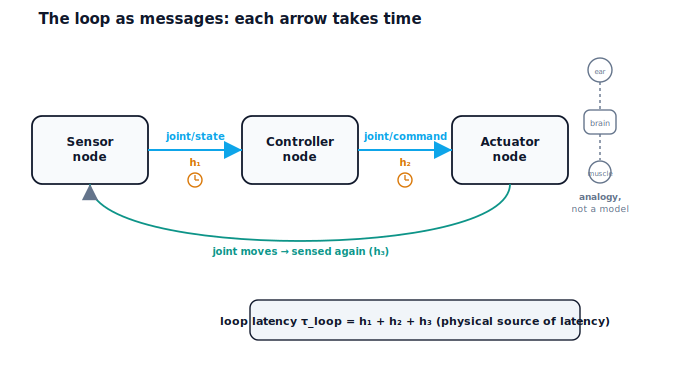

!!! abstract "You are here"
    **Module 8 — Feedback Control and Real-Time Execution (ROS 2)**  ·  **Unit 6 — Communication**  ·  **Lesson 6.1 — The Robot as a Nervous System: The Loop as Messages**

# Lesson 6.1 — The Robot as a Nervous System: The Loop as Messages

> Until now the control loop was a tidy circle drawn on one page, as if the joint's position teleported into the controller and the command teleported back. A real robot is not one place. A sensor measures the joint and *sends* that reading somewhere; a controller *receives* it, computes, and *sends* a command; an actuator *receives* the command and acts. Each arrow is a message crossing a gap between subsystems, and every message takes time. This is Unit 6's opening move: stop drawing the loop as instantaneous and start seeing it as a conversation between parts — a nervous system — where the speaking and listening themselves cost time.

---

## 1. Why This Matters
The single most important idea in this unit is that **the arrows are real**. In Units 1–4 the loop's connections were free and instant; that fiction was fine for learning what feedback does, but it hides the failure mode that brings real loops down. When you accept that sensing, deciding, and acting are separate subsystems passing messages, two things follow immediately: the system has a *structure* you can design (who talks to whom, over what), and it has a *delay* you can't wish away (messages take time). The first sets up the publish–subscribe pattern (6.2); the second sets up the instability that finite communication speed causes (6.3) and the timing-layered architecture that manages it (6.4).

This is also where Unit 3's abstract "latency" finally gets a physical explanation. Back then, delay was a knob we turned to show it could destabilise a loop. Here we learn *why there is a knob at all*: because real subsystems communicate, and communication is not instantaneous.

## 2. Physical Intuition
Your own body runs a feedback loop every time you balance on one foot. Sensors in your inner ear and feet measure your sway; nerves carry those signals to your brain; your brain decides; nerves carry commands to your muscles; muscles correct. It works beautifully — but it isn't instant. There is a measurable delay between a sensed sway and the muscular correction, and if you've ever tried to react to something happening very fast, you've felt that delay matter. The robot is the same: its "nerves" are wires and buses, its "brain" is the controller, its "muscles" are the actuators, and the signals between them take time to travel and to be processed.

The analogy is useful and worth taking seriously — separate organs, signals between them, a loop closed through the world — but it has limits, and naming them keeps us honest. A robot's messages are discrete packets on named channels, not continuous chemical-electrical impulses; its "brain" runs a fixed program at a chosen rate rather than a plastic biological network; and its timing is engineered and (largely) knowable rather than evolved. We use the nervous system to *feel* why the loop is distributed and delayed, not as a model of how the robot actually computes.

## 3. Mathematical Foundations
Reframe the loop as message-passing. Each pass of sense → compare → correct → actuate is a sequence of messages, and each **hop** — sensor to controller, controller to actuator, and any relays between — adds a transit and processing time $h_k$. The **loop latency** is their sum:

$$\tau_{\text{loop}} = \sum_k h_k.$$

The engine makes this concrete with `loop_latency(hops)` (the sum of per-hop seconds) and `latency_to_steps(latency, dt)` (turning that delay into simulation steps). It runs the loop as actual messages with `run_pubsub_loop(...)`: a *sensor node* publishes the measured state to a topic, a *controller node* subscribes, computes, and publishes a command, and an *actuator node* subscribes and drives the plant. The verified facts: the loop closes entirely through messages (the topics `joint/state` and `joint/command` carry it, and it tracks to RMS ≈ 0.025 with small hops), and the end-to-end latency is exactly the sum of the per-hop times — e.g. three 1 ms hops give a 3 ms loop latency.

Crucially, this $\tau_{\text{loop}}$ is the *same* delay Unit 3 inserted by hand to destabilise a loop. There, latency was an abstract parameter; here it is the physical consequence of the arrows being real. Nothing about the control math changes — the loop still computes $e = q_d - q$ and corrects — but now the measurement the controller acts on is a few milliseconds old because it had to travel, and the command reaches the actuator a few milliseconds late for the same reason. Lesson 6.3 will show how much that matters.

## 4. Visual Explanation

<figure markdown>
  { width="680" }
</figure>

## 5. Engineering Example
Real robots are emphatically distributed. A modern arm has a sensor (encoder) at each joint, a controller on a separate board or computer, and motor drivers at the actuators, all connected by a communication bus (EtherCAT, CAN, or a software middleware). The joint reading is sampled, packed into a message, and transmitted; the controller's command makes the reverse trip. Autonomous vehicles take it further: cameras, lidar, and radar each publish to the compute stack, which publishes steering and throttle commands to the actuators — a literal network of nodes and messages. Even a hobby drone separates its IMU, flight controller, and ESCs, with messages flowing between them every few milliseconds. In all of these, engineers budget the latency of each hop because, exactly as in this lesson, the loop is closed through communication and the communication takes time.

## 6. Worked Example
Closing the loop with messages.

- **Setup:** a sensor node, a controller node, and an actuator node on a shared bus; the controller subscribes to `joint/state` and publishes `joint/command`; the actuator subscribes to `joint/command`.
- **Run:** track a setpoint of $1.0$ with small per-hop times (two 1 ms sensor hops, one 1 ms command hop). The loop closes entirely through topics; the joint tracks the setpoint to RMS ≈ **0.025**.
- **Latency:** the end-to-end loop latency is the sum of the hops; three 1 ms hops give exactly $\tau_{\text{loop}} = 3$ ms. Nothing about the controller changed — only the recognition that the measurement it acts on is $\tau_{\text{loop}}$ old.
- The notebook confirms the loop ran through the topics `joint/state` and `joint/command`, that it tracked, and that `loop_latency([0.001, 0.001, 0.001]) = 0.003`.

## 7. Interactive Demonstration

<iframe src="../../demos/module08/lesson21_message_bus.html" title="The Robot as a Nervous System: The Loop as Messages interactive demo" style="width:100%;height:520px;border:1px solid #e2e8f0;border-radius:12px"></iframe>

[Open this demo in a new tab ↗](../demos/module08/lesson21_message_bus.html)

The **Message Bus** lets you watch the loop run as messages and see where time goes.

1. Watch a message leave the sensor, arrive at the controller, become a command, and reach the actuator — one trip around the loop.
2. Increase a hop's transit time and watch the running loop-latency total climb.
3. See that the measurement the controller acts on is always a little old — by exactly the accumulated hop time.

## 8. Coding Exercise

!!! tip "Run the hands-on notebook"
    `modules/module08/notebooks/lesson21_loop_as_messages.ipynb` — open in JupyterLab and run **Kernel → Restart & Run All**.

*(Companion notebook — uses `Bus`, `run_pubsub_loop(...)`, `loop_latency(hops)`.)*

In the notebook you:

1. Run the control loop as messages over a `Bus` and confirm it closes through the topics `joint/state` and `joint/command` and tracks the setpoint.
2. Read the end-to-end loop latency and confirm it equals the sum of the per-hop times.
3. Observe that the controller acts on a measurement delayed by the loop latency — the setup for Lesson 6.3.

## 9. Knowledge Check

Formative — unlimited attempts, immediate feedback; does not affect your grade.

<iframe src="../../quizzes/module08/lesson21_quiz.html" title="The Robot as a Nervous System: The Loop as Messages knowledge check" style="width:100%;height:720px;border:1px solid #e2e8f0;border-radius:12px"></iframe>

[Open this quiz in a new tab ↗](../quizzes/module08/lesson21_quiz.html)

1. Name the three subsystems the loop is distributed across and the messages between them.
2. Why is each arrow of the loop not instantaneous?
3. How is the loop latency computed from the per-hop times?
4. State the nervous-system analogy and two ways it breaks down.

## 10. Challenge Problem
You are handed a robot whose control loop "works in simulation but jitters on hardware." Before touching the gains, explain how reframing the loop as message-passing changes your mental model and points you toward the cause. Identify the hops in a typical distributed arm (encoder → controller → driver) and explain how each contributes to $\tau_{\text{loop}}$. Then explain why the same controller that was stable with instantaneous arrows could misbehave once the arrows are real — connecting forward to Lesson 6.3 — and state precisely what the nervous-system analogy does and does not justify in this reasoning. *(You are establishing communication as the physical origin of loop latency.)*

## 11. Common Mistakes
- **Drawing the loop as instantaneous.** The arrows are real subsystems passing messages; they take time.
- **Forgetting the measurement is old.** By the time the controller acts, the state it read has aged by the loop latency.
- **Over-trusting the nervous-system analogy.** It conveys "distributed and delayed," not how the controller computes.
- **Lumping all delay into one place.** Latency is the sum of distinct hops, each of which you can measure and budget.

## 12. Key Takeaways
- A real robot's loop is **distributed**: separate sensor, controller, and actuator subsystems exchanging **messages**.
- Each loop arrow is a message that **takes time**; the **loop latency** is the sum of the per-hop transit/processing times, $\tau_{\text{loop}} = \sum_k h_k$.
- This is the **physical source** of the latency Unit 3 treated abstractly — nothing in the control math changed, but the measurement is now $\tau_{\text{loop}}$ old.
- The **nervous-system analogy** (separate organs, signals take time) builds intuition but is not a model: messages are discrete, the controller is a fixed-rate program.

---

### AI Learning Companion

Copy any prompt below into your AI tutor.

- **Tutor (re-explain):** "Re-explain the control loop as a nervous system: sensors→nerves→brain→nerves→muscles, where every signal takes time, so the loop is distributed and delayed. Then state the loop latency as the sum of per-hop times and name two limits of the analogy."
- **Practice (generate exercises):** "Give me a distributed loop with named hops and per-hop times and ask me to compute the loop latency and identify which message the controller acts on. Withhold the answer until I respond."
- **Explore (connect to the real world):** "Give real distributed robots (an arm on EtherCAT/CAN, an autonomous vehicle's sensor stack, a drone's IMU→flight-controller→ESC) and ask me to identify the nodes, messages, and hops in each."

### Global Learning Support

Per-language explanation prompts — use whichever you think best in.

- **English (authoritative):** "Explain the robot control loop as distributed subsystems (sensor, controller, actuator) exchanging messages, why each hop takes time (the physical source of loop latency, summed over hops), and the nervous-system analogy with its limits — at a robotics-course level (communication conceptual, ROS 2 only named as the Unit 8 implementation)."
- **Español:** "Explica el lazo de control del robot como subsistemas distribuidos (sensor, controlador, actuador) que intercambian mensajes, por qué cada salto toma tiempo (la fuente física de la latencia del lazo, sumada sobre los saltos), y la analogía del sistema nervioso con sus límites — a nivel de curso de robótica (comunicación conceptual, ROS 2 solo nombrado como la implementación de la Unidad 8)."
- **中文（简体）：** "把机器人控制回路解释为相互交换消息的分布式子系统（传感器、控制器、执行器），说明为什么每一跳都需要时间（回路延迟的物理来源，对各跳求和），以及神经系统类比及其局限——达到机器人课程水平（通信为概念性内容，ROS 2 仅作为第8单元的实现被提及）。"
- **Türkçe:** "Robot denetim döngüsünü mesaj alışverişi yapan dağıtık alt sistemler (sensör, denetleyici, eyleyici) olarak açıkla; her sıçramanın neden zaman aldığını (döngü gecikmesinin fiziksel kaynağı, sıçramalar üzerinden toplanır) ve sinir sistemi benzetmesini sınırlarıyla birlikte — robotik dersi düzeyinde (iletişim kavramsal, ROS 2 yalnızca Ünite 8 uygulaması olarak anılır)."

---

*Next: Lesson 6.2 — Publish and Subscribe: Nodes, Topics, and Messages.*
