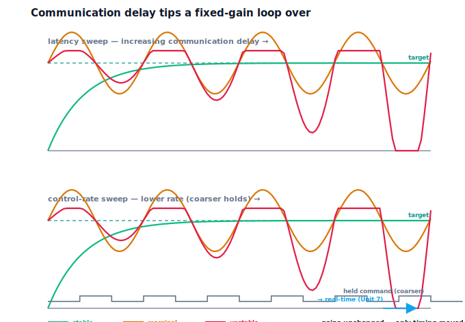

!!! abstract "You are here"
    **Module 8 — Feedback Control and Real-Time Execution (ROS 2)**  ·  **Unit 6 — Communication**  ·  **Lesson 6.3 — Latency and Control Rate: How Communication Destabilises the Loop**

# Lesson 6.3 — Latency and Control Rate: How Communication Destabilises the Loop

> This is the apex of Unit 6 and the moment the latency spine pays off. Lesson 6.1 gave latency a physical source: messages take time. Now we show what that time does. Two communication facts add delay to the loop — the transit/processing **latency** of messages, and the **finite rate** at which the controller runs (it can only act so many times per second, so it always works on slightly old information). Their sum is loop delay, and Unit 3 already taught the verdict: enough delay destabilises a loop as surely as too much gain. Here we watch a perfectly good, fixed-gain loop slide from stable to unstable as communication delay grows — and that is exactly why robots need real-time execution.

---

## 1. Why This Matters
This lesson connects the two halves of Module 8: the control theory of Unit 3 and the communication reality of Unit 6. A controller that is provably well-tuned with instantaneous, infinitely fast communication can oscillate and then diverge on real hardware purely because its messages are late and its update rate is finite. Engineers who don't see this blame the gains and detune — sacrificing performance — when the real culprit is the loop delay. Seeing latency and control rate as the destabilisers they are tells you to fix the *timing* (faster bus, higher control rate, real-time scheduling) rather than crippling the controller.

It also delivers the unit's core warning and hands the baton to Unit 7. Once you accept that communication delay can topple a loop, "make the timing fast and predictable" stops being a nicety and becomes a requirement — which is precisely what real-time execution provides.

## 2. Physical Intuition
Steer a car while looking at a video feed that's a half-second behind. You see you've drifted left, so you correct right — but by the time your correction takes effect, you'd already started coming back, and now you've over-corrected to the right; you see *that* late, swing left, and the oscillations grow until you're weaving across the road. Nothing was wrong with your reflexes or your steering strength; the *delay* between seeing and acting made a stable task unstable. Now imagine you can only glance at the feed twice a second instead of continuously — a low "control rate." You act on even staler information, spaced further apart, and the weaving gets worse still.

A control loop is identical. Latency is the lag between the joint's true state and the controller seeing it; a finite control rate means the controller glances and acts only every so often, holding its last command in between. Both mean the correction is based on old information and arrives late. A little is harmless; enough turns the corrective action into the thing that drives the oscillation. This is the same phenomenon Unit 3 demonstrated by inserting delay — only now the delay is the unavoidable cost of real communication.

## 3. Mathematical Foundations
Loop delay has two communication sources. **Message latency** $\tau_{\text{loop}} = \sum_k h_k$ (Lesson 6.1) means the controller acts on a measurement that is $\tau_{\text{loop}}$ old. **Finite control rate** means the controller updates every $T_c$ seconds (it "acts $1/T_c$ times per second") and holds its command between updates; on average this adds roughly half an update period of staleness and spaces corrections by $T_c$. Their combined effect is an effective loop delay; the larger it is, the more the correction lags the true state.

We keep this strictly **qualitative**, exactly as Unit 3 did — stability is read off the response envelope (settles / sustained oscillation / diverges) with `classify_stability`, not from poles or transfer functions. (A later control course quantifies the delay-versus-stability trade with phase margin; that formalism is out of scope here.) The engine exposes the two levers on the actuated pipeline: `sensor_delay_steps` (message latency) and `control_period_steps` (the finite control rate, holding the request between updates).

The verified demonstrations hold the gains fixed and vary only the timing. **Latency sweep:** with zero delay the loop is *stable*; increasing the sensor delay in steps marches it stable → marginal → *unstable*. **Control-rate sweep:** with the controller updating every step the loop is *stable*; lowering the rate (larger update period) marches it stable → *unstable*. The same conclusion appears in the message-passing loop of 6.1: small per-hop times track fine, but large hops (a much greater $\tau_{\text{loop}}$) drive the loop unstable. In every case the gains never changed — communication delay alone tipped the loop over, reproducing Unit 3's "delay is as dangerous as excess gain," now with communication as the source.

## 4. Visual Explanation

<figure markdown>
  { width="680" }
</figure>

## 5. Engineering Example
Communication-induced instability is a well-known hazard. Networked and tele-operated control systems are studied precisely because transmission delay can destabilise an otherwise sound loop — surgical tele-robots and remote manipulators add explicit delay-compensation for this reason. Drone flight controllers run their inner attitude loop at high rates (hundreds to thousands of hertz) specifically because a low control rate would add enough delay to destabilise the aircraft; pilots feel "mushy" or oscillatory behaviour when a loop rate is set too low. Industrial fieldbuses (EtherCAT and friends) advertise deterministic low latency because drive control loops become unstable if the bus is slow or jittery. In all of these, the fix is to reduce or bound the loop delay — faster communication, higher control rate, predictable timing — not to weaken the controller.

## 6. Worked Example
Same gains, only timing changes.

- **Setup:** a setpoint of $1.0$ on a fixed plant with fixed PID gains $(40, 0, 4)$ through a generous actuator (no saturation in play), so only the timing matters.
- **Latency sweep** (sensor-delay steps $0, 40, 90, 130$): the response goes **stable → … → unstable** as the delay grows. With zero delay it settles cleanly; with enough delay it diverges.
- **Control-rate sweep** (update period $1, 40, 110, 160$ steps): **stable → … → unstable** as the rate drops. Updating every step is stable; updating too rarely diverges.
- **Message-passing cross-check** (Lesson 6.1's loop): small hops (~1 ms each) track fine; large hops (tens of ms each) push $\tau_{\text{loop}}$ high enough to make the loop unstable.
- **Reading it:** the gains were never touched. Communication delay — latency or finite rate — alone moved the loop across the stability boundary. This is Unit 3's lesson, sourced from communication.
- The notebook asserts the zero-delay case is stable and that both the latency sweep and the control-rate sweep reach an unstable case.

## 7. Interactive Demonstration
*(Conceptual — runnable in the companion notebook.)*

**The destabilising-delay test.** In the notebook you:

1. Fix the gains and sweep the communication latency, classifying each run — watch stable give way to oscillation and then divergence.
2. Fix the gains and lower the control rate, classifying each run — watch the same progression as the held command gets coarser.
3. Confirm that the message-passing loop with large per-hop times goes unstable — communication delay, not gain, tipped it over.

## 8. Coding Exercise

!!! tip "Run the hands-on notebook"
    `modules/module08/notebooks/lesson23_latency_and_control_rate.ipynb` — open in JupyterLab and run **Kernel → Restart & Run All**.

*(Companion notebook — uses `track_reference_actuated(..., sensor_delay_steps=..., control_period_steps=...)`, `classify_stability`.)*

In the notebook you:

1. With fixed gains, sweep `sensor_delay_steps` and classify stability — assert zero delay is stable and that enough latency reaches an unstable run.
2. With the same gains, sweep `control_period_steps` and assert that a low enough control rate reaches an unstable run.
3. Conclude that communication delay alone moved the loop across the stability boundary — the Unit-3 lesson from a communication source.

## 9. Knowledge Check

Formative — unlimited attempts, immediate feedback; does not affect your grade.

<iframe src="../../quizzes/module08/lesson23_quiz.html" title="Latency and Control Rate: How Communication Destabilises the Loop knowledge check" style="width:100%;height:720px;border:1px solid #e2e8f0;border-radius:12px"></iframe>

[Open this quiz in a new tab ↗](../quizzes/module08/lesson23_quiz.html)

1. What are the two communication sources of loop delay?
2. Why does acting on a delayed measurement make corrective action destabilising?
3. How does a finite control rate add delay even with a fast bus?
4. Why does this motivate real-time execution (Unit 7)?

## 10. Challenge Problem
A robot loop is stable on the bench but oscillates after the team moves the controller onto a shared computer that also runs logging and vision, lowering the effective control rate and adding jitter to the messages. Without changing the gains, explain why the loop became unstable, separating the contributions of added latency and reduced control rate. Then propose timing-side fixes (a faster/dedicated bus, a higher and more predictable control rate, isolating the control task) and explain why these are the right fixes rather than detuning. Finally, connect the dots across the module: how is this the same phenomenon as Unit 3's delay-driven instability, and why does accepting it make real-time execution (Unit 7) a requirement rather than an optimisation? *(You are diagnosing communication-induced instability and motivating real-time guarantees.)*

## 11. Common Mistakes
- **Blaming the gains for hardware-only oscillation.** The culprit is often loop delay, not tuning.
- **Ignoring the control rate.** Even a fast bus can't save a loop whose controller updates too slowly.
- **Treating latency as negligible "because it's just milliseconds."** Whether it matters depends on the loop; enough of it always destabilises.
- **Reaching for formal stability math here.** Stability stays qualitative (settle/oscillate/diverge); phase-margin analysis is a later course.

## 12. Key Takeaways
- Loop delay has two communication sources: **message latency** ($\tau_{\text{loop}} = \sum h_k$) and a **finite control rate** (the controller acts $1/T_c$ times per second on stale information, holding its command between updates).
- Together they make the correction lag the true state; **enough delay destabilises the loop** — Unit 3's "delay is as dangerous as gain," now sourced from communication.
- Verified at **fixed gains**: a latency sweep and a control-rate sweep each march the loop stable → unstable; large per-hop times destabilise the message-passing loop too.
- The fix is to bound the loop delay — faster communication, higher and more predictable control rate — which is exactly what **real-time execution (Unit 7)** provides. Stability stays qualitative; phase-margin formalism is out of scope.

---

### AI Learning Companion

Copy any prompt below into your AI tutor.

- **Tutor (re-explain):** "Re-explain how communication delay destabilises a control loop using the 'steering a car from a half-second-delayed video feed' analogy, then add the 'can only glance twice a second' part for finite control rate. Connect it to Unit 3's 'delay is as dangerous as gain' and keep it qualitative (settle/oscillate/diverge)."
- **Practice (generate exercises):** "Give me a fixed-gain loop and a latency or control-rate value and ask me to predict whether it stays stable, oscillates, or diverges. Withhold the answer until I respond."
- **Explore (connect to the real world):** "Give real communication-induced instability cases (tele-operated surgery delay, low drone loop rate, slow industrial fieldbus) and ask me to identify the loop delay source and the timing-side fix in each."

### Global Learning Support

Per-language explanation prompts — use whichever you think best in.

- **English (authoritative):** "Explain how communication latency and a finite control rate combine into loop delay that, at fixed gains, drives a loop from stable through oscillation to unstable (Unit 3's 'delay is as dangerous as gain'), and why this motivates real-time execution — at a robotics-course level, qualitatively (no Laplace/Nyquist/phase-margin formalism, no discrete-time/sampling theory)."
- **Español:** "Explica cómo la latencia de comunicación y una tasa de control finita se combinan en un retardo de lazo que, con ganancias fijas, lleva un lazo de estable a oscilación y a inestable (el 'el retardo es tan peligroso como la ganancia' de la Unidad 3), y por qué esto motiva la ejecución en tiempo real — a nivel de curso de robótica, cualitativamente (sin formalismo de Laplace/Nyquist/margen de fase, sin teoría de muestreo/tiempo discreto)."
- **中文（简体）：** "解释通信延迟与有限控制频率如何叠加成回路延迟：在固定增益下，使回路从稳定经振荡走向不稳定（第3单元的'延迟与过大增益一样危险'），以及为什么这促成了实时执行——达到机器人课程水平，定性地说明（不涉及拉普拉斯/奈奎斯特/相位裕度的形式化，也不涉及离散时间/采样理论）。"
- **Türkçe:** "İletişim gecikmesi ile sınırlı denetim hızının nasıl birleşip döngü gecikmesi oluşturduğunu, bunun sabit kazançlarda bir döngüyü kararlıdan salınıma ve kararsızlığa nasıl sürüklediğini (Ünite 3'ün 'gecikme, aşırı kazanç kadar tehlikelidir' ilkesi) ve bunun gerçek zamanlı yürütmeyi neden gerektirdiğini açıkla — robotik dersi düzeyinde, niteliksel olarak (Laplace/Nyquist/faz payı biçimciliği yok, ayrık zaman/örnekleme teorisi yok)."

---

*Next: Lesson 6.4 — A Data-Flow Architecture Layered by Timing.*
