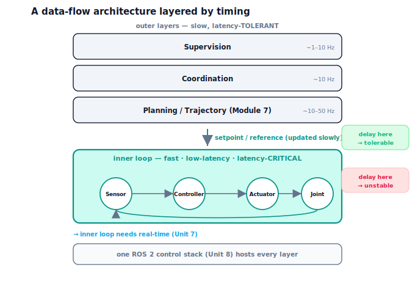

!!! abstract "You are here"
    **Module 8 — Feedback Control and Real-Time Execution (ROS 2)**  ·  **Unit 6 — Communication**  ·  **Lesson 6.4 — A Data-Flow Architecture Layered by Timing**

# Lesson 6.4 — A Data-Flow Architecture Layered by Timing

> Lesson 6.3 left us with a sharp fact: the control loop cannot tolerate much delay before it goes unstable. But a whole robot is far more than a control loop — it plans, perceives, coordinates, supervises — and not all of those parts are equally sensitive to delay. This final lesson of Unit 6 organises the robot's data flow into **layers by timing**: a fast, latency-critical **inner loop** and slower, latency-tolerant **outer layers**. That split is the architectural backbone of every real robot. It tells you exactly which part must be made fast and predictable — the inner loop — which is the reason Unit 7 exists, and it frames the complete ROS 2 control stack of Unit 8.

---

## 1. Why This Matters
Knowing *that* delay destabilises a loop (6.3) raises the practical question: do we then have to make the *entire* robot blindingly fast and perfectly timed? That would be impossible — planning and perception are heavy and can't run at thousands of hertz. The resolution is architectural: separate the parts that *must* be fast from the parts that can be slow. The inner control loop, which closes around the joint and is the thing 6.3 showed is delay-sensitive, gets the fast, predictable timing; the outer layers, which set goals and replan, run slower and tolerate latency because their "freshness" requirements are gentle. Getting this split right is what makes a real robot both responsive and capable.

This lesson is the synthesis of Unit 6 and the bridge out of Installment C. It turns the pub/sub topic graph (6.2) and the delay story (6.3) into a design principle, and it names the two destinations: real-time execution for the inner loop (Unit 7) and the ROS 2 control stack that hosts all the layers (Unit 8).

## 2. Physical Intuition
Return to the nervous system, now with its layers. Your spinal reflexes are fast and local: touch something hot and your hand withdraws before your brain has even "decided" — a tight, low-latency inner loop. Your conscious planning is slow and global: deciding to reach for a cup, choosing a route across a room — these tolerate a delay of a fraction of a second without any harm. Evolution put the delay-critical work (balance, reflexes) in fast local loops and the delay-tolerant work (planning, deliberation) in slower central processes. A robot is organised the same way and for the same reason: match each job's timing to its sensitivity.

So the design rule is intuitive: the closer a layer is to the physical loop closing around the joint, the faster and more predictable it must be; the further out toward goals and plans, the more delay it can absorb. A slow plan updated a few times a second is fine — the inner loop will faithfully track whatever setpoint it's given between updates. A slow inner loop is a disaster — as 6.3 showed, it goes unstable. The architecture is just this intuition made into structure.

## 3. Mathematical Foundations
Picture the robot's data flow as a graph of nodes (6.2) grouped into **layers by their timing requirements**: each layer has a characteristic **rate** (how often it runs) and a **latency tolerance** (how stale its inputs may be before behaviour degrades).

- **Inner loop (fast, latency-critical):** sensing → control → actuation, closing around the joint. This is the loop of 6.3; it must run fast and with bounded, low latency, because delay here destabilises it. Required: high rate, tight latency.
- **Outer layers (slow, latency-tolerant):** planning and trajectory generation (Module 7), coordination, perception, supervision. These set the inner loop's reference and goals; they run at lower rates and tolerate more latency because the inner loop tracks whatever setpoint it's handed between their updates.

The engine illustrates the split directly. Putting heavy latency *inside* the loop — `sensor_delay_steps` large — makes the inner loop **unstable** (it is the feedback timing). But updating the *reference* slowly from an outer layer — a planner republishing the setpoint every quarter-second via `zoh_reference(...)`, while the inner loop stays fast with negligible latency — remains **stable** and tracks well (RMS ≈ 0.086). Same numerical "slowness," opposite consequences, depending on which layer it lives in. That asymmetry *is* the architecture: latency is intolerable in the inner loop and tolerable in the outer layers, so you spend your timing budget where it counts.

This pinpoints the two destinations. The inner loop's need for fast, *predictable* timing — not just fast on average, but bounded worst-case — is exactly what **real-time execution (Unit 7)** guarantees. And the whole layered graph of nodes and topics, inner and outer, is what the **ROS 2 control stack (Unit 8)** is built to host. Installment C ends here, at the threshold of both. (We name them; we do not build them yet — real-time scheduling is Unit 7, the ROS 2 implementation is Unit 8.)

## 4. Visual Explanation

<figure markdown>
  { width="680" }
</figure>

## 5. Engineering Example
Every capable robot is layered by timing. An industrial arm runs a joint-level servo loop at a high, hard-real-time rate (often 1 kHz or more) on a dedicated controller, while motion planning and task logic run at tens of hertz on a general-purpose computer that hands trajectories down to the servo layer. Autonomous vehicles separate a fast, safety-critical low-level control loop (steering/brake actuation) from slower perception and planning stacks that produce trajectories several times a second. Drones split a high-rate inner attitude loop from a lower-rate position/navigation loop and an even slower mission planner. The pattern is universal: the delay-sensitive inner loop is given fast, predictable timing (and, in Unit 7's terms, real-time guarantees), while the heavy, delay-tolerant outer layers run slower — and a single software stack (ROS 2 in Unit 8) hosts all of them as nodes on topics.

## 6. Worked Example
The asymmetry that defines the architecture.

- **Inner-loop latency (critical):** put a heavy delay inside the feedback path (a large sensor delay) at fixed gains. The inner loop goes **unstable** — exactly the 6.3 result. Latency here is intolerable.
- **Outer-layer slowness (tolerable):** keep the inner loop fast (negligible latency) but let the planner update the setpoint only every 0.25 s (a zero-order-hold reference). The loop stays **stable** and tracks the slowly-updated goal well (RMS ≈ **0.086**). Latency here is fine — the inner loop tracks whatever setpoint it holds between updates.
- **Reading it:** the same "slowness," placed in different layers, gives opposite outcomes. That is the whole design principle: lavish fast, predictable timing on the inner loop; let the outer layers be slow. It is why Unit 7 (real-time) targets the inner loop, and why Unit 8's ROS 2 stack can host the slow layers alongside it.
- The notebook asserts the inner-loop-latency run is unstable while the slow-outer-layer run is stable with small RMS.

## 7. Interactive Demonstration
*(Conceptual — runnable in the companion notebook.)*

**The layering test.** In the notebook you:

1. Inject heavy latency into the inner loop and confirm it goes unstable — the latency-critical layer.
2. Move the "slowness" to the outer layer (update the setpoint only occasionally) with a fast inner loop, and confirm the system stays stable and tracks well.
3. Conclude the design rule: fast and predictable for the inner loop, slow-tolerant for the outer layers.

## 8. Coding Exercise

!!! tip "Run the hands-on notebook"
    `modules/module08/notebooks/lesson24_data_flow_architecture.ipynb` — open in JupyterLab and run **Kernel → Restart & Run All**.

*(Companion notebook — uses `track_reference_actuated(..., sensor_delay_steps=...)`, `zoh_reference(ref, hold_T)`, `classify_stability`.)*

In the notebook you:

1. Run the inner loop with a large sensor delay and assert it is unstable (latency-critical inner loop).
2. Run with a fast inner loop but a slowly-updated outer reference and assert it stays stable with small RMS (latency-tolerant outer layer).
3. State the architectural conclusion and where real-time (Unit 7) and ROS 2 (Unit 8) fit.

## 9. Knowledge Check

Formative — unlimited attempts, immediate feedback; does not affect your grade.

<iframe src="../../quizzes/module08/lesson24_quiz.html" title="A Data-Flow Architecture Layered by Timing knowledge check" style="width:100%;height:720px;border:1px solid #e2e8f0;border-radius:12px"></iframe>

[Open this quiz in a new tab ↗](../quizzes/module08/lesson24_quiz.html)

1. What distinguishes the inner loop from the outer layers, in timing terms?
2. Why is latency intolerable in the inner loop but tolerable in the outer layers?
3. Where do sensing, control, planning, and supervision sit in the layered picture?
4. How does the timing split motivate real-time execution (Unit 7) and frame the ROS 2 stack (Unit 8)?

## 10. Challenge Problem
You're architecting the software for a greenhouse-harvesting arm: a vision system that finds fruit, a planner that produces reach trajectories (Module 7), a joint controller (Units 1–5), and a safety supervisor. Assign each subsystem to the inner loop or an outer layer, justify the assignment by its delay sensitivity, and state a reasonable rate and latency tolerance for each. Explain, using the 6.3 result, why the joint controller must be the fast, real-time layer and why the vision/planner can be slow. Then describe how a single publish–subscribe stack (6.2) hosts all of it, and what specifically Unit 7 (real-time guarantees for the inner loop) and Unit 8 (the ROS 2 implementation) will add. Finally, summarise Installment C: how do Units 5 (actuators) and 6 (communication) together complete the journey from "the controller decides" to "a real, distributed, delay-bound system makes the arm move"? *(You are turning the timing split into a concrete architecture and bridging to Units 7–8.)*

## 11. Common Mistakes
- **Trying to make the whole robot fast.** Only the inner loop must be fast and predictable; outer layers should be slow and capable.
- **Putting delay-sensitive work in a slow layer.** Joint control in a slow, jittery layer goes unstable (6.3).
- **Putting heavy work in the fast layer.** Vision/planning can't run at inner-loop rates; keep them outer.
- **Confusing "layered" with "built."** This lesson names real-time (Unit 7) and ROS 2 (Unit 8) as destinations; it doesn't implement them.

## 12. Key Takeaways
- The robot's data flow is a **layered architecture organised by timing**: a fast, latency-critical **inner loop** and slower, latency-tolerant **outer layers**.
- **Inner loop** (sensing → control → actuation) must be fast and low-latency — delay here destabilises it (6.3). **Outer layers** (planning/Module 7, coordination, perception, supervision) run slower and tolerate latency.
- Verified asymmetry: heavy latency *in the loop* → unstable; the same slowness *in the outer reference update* → stable, RMS ≈ 0.086. Spend the timing budget on the inner loop.
- The split motivates **real-time execution (Unit 7)** for the inner loop and frames the **ROS 2 control stack (Unit 8)** that hosts every layer. This closes Installment C; it names — but does not build — Units 7 and 8.

---

### AI Learning Companion

Copy any prompt below into your AI tutor.

- **Tutor (re-explain):** "Re-explain the layered-by-timing architecture using the nervous-system layers analogy: fast local reflexes (the latency-critical inner loop) vs slow conscious planning (latency-tolerant outer layers). Then state why latency in the inner loop destabilises it but latency in the outer reference update is fine."
- **Practice (generate exercises):** "Give me a robot's subsystems and ask me to assign each to the inner loop or an outer layer with a rate and latency tolerance, and to justify it by delay sensitivity. Withhold the answer until I respond."
- **Explore (connect to the real world):** "Give real layered robots (industrial arm 1 kHz servo + slow planner, AV low-level control vs perception/planning, drone attitude vs navigation vs mission) and ask me to identify the inner loop, the outer layers, and where real-time and the software stack fit."

### Global Learning Support

Per-language explanation prompts — use whichever you think best in.

- **English (authoritative):** "Explain the robot as a data-flow architecture layered by timing — a fast, latency-critical inner control loop vs slower, latency-tolerant outer layers (planning, coordination, supervision) — why latency is intolerable in the inner loop and tolerable outside, and how this motivates real-time (Unit 7) and frames the ROS 2 stack (Unit 8) — at a robotics-course level (conceptual; no real-time scheduling mechanisms, no ROS 2 implementation)."
- **Español:** "Explica el robot como una arquitectura de flujo de datos por capas según la temporización — un lazo interno de control rápido y crítico en latencia frente a capas externas más lentas y tolerantes a la latencia (planificación, coordinación, supervisión) — por qué la latencia es intolerable en el lazo interno y tolerable fuera, y cómo esto motiva el tiempo real (Unidad 7) y enmarca la pila ROS 2 (Unidad 8) — a nivel de curso de robótica (conceptual; sin mecanismos de planificación en tiempo real, sin implementación de ROS 2)."
- **中文（简体）：** "把机器人解释为按时序分层的数据流架构——快速、对延迟敏感的内部控制回路，相对于较慢、容忍延迟的外层（规划、协调、监督）——说明为什么延迟在内回路不可容忍而在外层可以容忍，以及这如何促成实时（第7单元）并框定 ROS 2 栈（第8单元）——达到机器人课程水平（概念性；不涉及实时调度机制，不涉及 ROS 2 实现）。"
- **Türkçe:** "Robotu zamanlamaya göre katmanlı bir veri-akışı mimarisi olarak açıkla — hızlı, gecikmeye duyarlı bir iç denetim döngüsü ile daha yavaş, gecikmeye toleranslı dış katmanlar (planlama, koordinasyon, denetim) — gecikmenin iç döngüde neden tolere edilemezken dışarıda tolere edilebildiğini ve bunun gerçek zamanlıyı (Ünite 7) nasıl gerektirdiğini ve ROS 2 yığınını (Ünite 8) nasıl çerçevelediğini — robotik dersi düzeyinde (kavramsal; gerçek zamanlı çizelgeleme mekanizmaları yok, ROS 2 uygulaması yok)."

---

*Next: Module 8 Installment D — Unit 7: Embedded and Real-Time Execution.*
