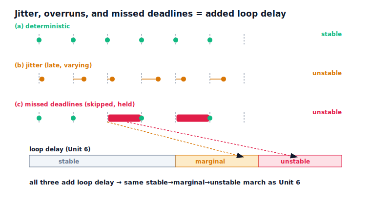

!!! abstract "You are here"
    **Module 8 — Feedback Control and Real-Time Execution (ROS 2)**  ·  **Unit 7 — Embedded Execution and Real-Time Control**  ·  **Lesson 7.3 — Jitter, Overruns, and Missed Deadlines**

# Lesson 7.3 — Jitter, Overruns, and Missed Deadlines

> Lesson 7.2 gave the ideal: a periodic loop that ticks at a fixed rate, doing sense → compute → actuate every period. Real systems deviate from that ideal in three ways. **Jitter** is when the period varies — the next tick lands a little (or a lot) late. An **overrun** is when the work doesn't finish before the next period is due. A **missed deadline** is the consequence: the update is skipped and the previous command is held one more period. Each of these is, in the loop's eyes, the same thing — extra delay between sensing and acting — and Unit 6 already showed where that leads. A loop that is perfectly stable when its timing is deterministic can be tipped into oscillation by enough jitter or enough missed deadlines.

---

## 1. Why This Matters
You can choose a good control rate (7.2) and still have an unstable robot if the rate isn't *honoured*. Jitter and overruns are the gap between the rate you designed for and the timing you actually get, and they are exactly what happens when the control loop shares a processor with other work, runs under a general-purpose operating system, or competes for a busy communication bus. Recognising these three hazards — and that they all reduce to added loop delay — tells you what to fix (make the timing predictable) and what not to bother fixing (raw average speed). It is the direct argument for 7.4's real-time target.

## 2. Physical Intuition
Return to the drummer of 7.2. **Jitter** is a drummer whose beats wander — sometimes early, sometimes late. Even at the right average tempo, the music wobbles, and if the wandering is bad enough the band loses the groove entirely. An **overrun** is a drummer who starts a fill that runs long and misses the next downbeat. A **missed deadline** is the silence where that downbeat should have been — the rhythm holds the last note one beat too long. Each one degrades the timing the rest of the band depends on; enough of it and the performance falls apart, not because anyone played a wrong note, but because the notes arrived at the wrong times.

For the control loop, the "band" is the feedback dynamics. A correction that arrives late — because the tick jittered, or the compute overran, or the update was skipped and a stale command was held — is a correction applied at the wrong moment. From Unit 6 you know what late corrections do: they lag the true state and can push when they should pull, growing the oscillation. So jitter and missed deadlines aren't cosmetic timing blemishes; they are injected loop delay, and the loop's stability has no special tolerance for them.

## 3. Mathematical Foundations
Take the periodic loop of 7.2 with nominal period $T_c$ and define the three hazards:

- **Jitter:** the actual interval between updates is $T_c + \delta_i$, with $\delta_i \ge 0$ varying cycle to cycle. The command is held over the longer interval, so the effective sense-to-act delay grows and varies.
- **Overrun:** the cycle's work exceeds $T_c$ (the budget of 7.2 is violated), so the update can't complete on time.
- **Missed deadline:** the overrun's consequence — the scheduled update is skipped, and the *previous* command is held for another period. The state ages further before a fresh correction lands.

All three increase the **effective loop delay** $\tau$ — the same quantity Unit 6 swept. There, at fixed gains, increasing $\tau$ marched the loop **stable → marginal → unstable**. Jitter and missed deadlines are simply mechanisms that raise $\tau$ (and, for jitter, make it unpredictable). So the stability consequence is inherited directly: enough jitter or enough missed deadlines crosses the same boundary. We keep this **qualitative** — settle / oscillate / diverge by the envelope of Unit 3 — with **no formal scheduling theory** (no schedulability tests, no WCET bounds, named only as the out-of-scope tools that would *predict* when the budget is safe).

The verified results, all at the same fixed control gains:

- **Deterministic** periodic loop (no jitter, no overruns): **stable**.
- **Jitter** added (each period can land substantially late): **unstable** — the mean interval is much larger than nominal and the worst-case interval larger still.
- **Overruns** (a high probability that a scheduled update is skipped): **unstable** — many missed deadlines, so the command is repeatedly held stale.

Same controller, same plant, same actuator — only the timing changed, and the timing alone decided stability.

## 4. Visual Explanation

<figure markdown>
  { width="680" }
</figure>

## 5. Engineering Example
Jitter and overruns are what you get when a control loop runs in the wrong place. Put the inner loop in an ordinary thread on a general-purpose OS and the scheduler will occasionally preempt it for other work — the tick jitters and sometimes the update is skipped. Run it on a processor that's also doing perception or logging and a heavy frame can overrun the control budget. Share a non-deterministic network for the feedback and the message latency jitters. Each of these is a real, common way a well-tuned loop becomes a jittery, deadline-missing loop and starts to oscillate. The fix in every case is the same and is the subject of 7.4: move the inner loop somewhere its timing is protected and predictable, so the rate you designed for is the rate you actually get.

## 6. Worked Example
Same loop, three timings.

- **Setup:** identical fixed control gains, plant, and actuator; a periodic loop run three ways.
- **Deterministic:** every update on time. Result: **stable**.
- **Jitter:** each period can land substantially late (large random extra delay). Result: **unstable** — the mean interval ballooned well past nominal and the worst-case interval larger still.
- **Overruns:** a high probability each scheduled update is skipped. Result: **unstable** — dozens of missed deadlines across the run, the command repeatedly held stale.
- **Reading it:** nothing about the controller changed. The timing alone moved the loop from stable to unstable, exactly as the Unit-6 delay sweep predicted — because jitter and missed deadlines *are* added loop delay.
- The notebook asserts deterministic is stable while jitter and overruns are each unstable.

## 7. Interactive Demonstration

<iframe src="../../demos/module08/lesson27_jitter_overruns.html" title="Jitter, Overruns, and Missed Deadlines interactive demo" style="width:100%;height:520px;border:1px solid #e2e8f0;border-radius:12px"></iframe>

[Open this demo in a new tab ↗](../demos/module08/lesson27_jitter_overruns.html)

*(Conceptual — runnable in the companion notebook.)*

**The timing-hazard test.** In the notebook you:

1. Run a deterministic periodic loop and confirm it is stable.
2. Add jitter and confirm the loop goes unstable; read the inflated mean and worst-case intervals.
3. Add overruns and confirm missed deadlines destabilise it too.
4. Connect each result to the Unit-6 delay sweep — same mechanism, same boundary.

## 8. Coding Exercise

!!! tip "Run the hands-on notebook"
    `modules/module08/notebooks/lesson27_jitter_overruns_deadlines.ipynb` — open in JupyterLab and run **Kernel → Restart & Run All**.

*(Companion notebook — uses `track_reference_rt(..., jitter_steps, overrun_prob)`, `classify_stability`.)*

In the notebook you:

1. Run a deterministic periodic loop and assert it is stable.
2. Add jitter and assert the loop destabilises; inspect the interval statistics.
3. Add overruns and assert the missed deadlines destabilise it.
4. Argue that all three reduce to added loop delay (Unit 6).

## 9. Knowledge Check

Formative — unlimited attempts, immediate feedback; does not affect your grade.

<iframe src="../../quizzes/module08/lesson27_quiz.html" title="Jitter, Overruns, and Missed Deadlines knowledge check" style="width:100%;height:720px;border:1px solid #e2e8f0;border-radius:12px"></iframe>

[Open this quiz in a new tab ↗](../quizzes/module08/lesson27_quiz.html)

1. Define jitter, overrun, and missed deadline for a periodic loop.
2. How does each increase the effective loop delay?
3. Why is the stability consequence the same as Unit 6's delay sweep?
4. Why is making the timing predictable the fix, rather than making it faster?

## 10. Challenge Problem
A loop that was stable on the bench oscillates after the team moves the controller into a thread on a general-purpose computer shared with a logging process. Using jitter, overruns, and missed deadlines, explain the chain of cause: what the shared computer does to the loop's timing, how that maps onto added loop delay, and why it reproduces the Unit-6 stable→unstable march at unchanged gains. Then explain why "buy a faster CPU" might *not* fix it (a faster-on-average CPU can still jitter and overrun), and why "make the timing predictable" (the 7.4 real-time target) is the correct fix. Name the formal tool that would *predict* whether a given workload meets its deadlines, and note it's out of scope. *(You are diagnosing a timing-induced instability and prescribing predictability over speed.)*

## 11. Common Mistakes
- **Treating jitter as harmless noise.** Jitter is varying loop delay; enough of it destabilises.
- **Ignoring missed deadlines.** A skipped update holds a stale command — the Unit-6 delay, repeated.
- **Trying to fix timing instability with more gain or a faster average.** The cure is predictable timing, not speed.
- **Reaching for schedulability proofs here.** The concept (these add delay) is the lesson; the proof tools are a later course.

## 12. Key Takeaways
- **Jitter** (varying period), **overruns** (work exceeds the period), and **missed deadlines** (skipped update, command held) all **add loop delay**.
- That added delay is the **same quantity Unit 6 swept**: at fixed gains, enough of it marches the loop **stable → marginal → unstable**.
- Verified: a deterministic periodic loop is stable, while jitter and overruns each destabilise the identical loop — **timing alone** decides.
- The fix is **predictable timing**, not faster timing — which is why the inner loop needs a real-time target (7.4). Formal scheduling analysis is out of scope.

---

### AI Learning Companion

Copy any prompt below into your AI tutor.

- **Tutor (re-explain):** "Re-explain jitter, overruns, and missed deadlines using the 'wandering drummer' analogy, then explain why all three reduce to added loop delay and connect to the Unit-6 result that delay at fixed gains marches a loop from stable to unstable."
- **Practice (generate exercises):** "Describe a periodic loop's timing (deterministic, or with jitter, or with missed deadlines) and ask me to predict whether it stays stable and why. Withhold the answer until I respond."
- **Explore (connect to the real world):** "Give real causes of control-loop jitter and overruns (OS preemption, sharing a CPU with perception, a busy network) and ask me to map each to the timing hazard and to the fix."

### Global Learning Support

Per-language explanation prompts — use whichever you think best in.

- **English (authoritative):** "Explain jitter, overruns, and missed deadlines in a periodic control loop, why each adds loop delay, how that connects to the Unit-6 stable→marginal→unstable result, and why the fix is predictable (not faster) timing — at a robotics-course level, qualitatively (no formal scheduling theory; schedulability/WCET named only as out-of-scope)."
- **Español:** "Explica el jitter, los sobrepasos (overruns) y los plazos incumplidos en un lazo de control periódico, por qué cada uno añade retardo de lazo, cómo se conecta con el resultado de la Unidad 6 (estable→marginal→inestable) y por qué la solución es una temporización predecible (no más rápida) — a nivel de curso de robótica, cualitativamente (sin teoría formal de planificación; schedulability/WCET solo como fuera de alcance)."
- **中文（简体）：** "解释周期控制回路中的抖动（jitter）、超时（overrun）和错过截止期（missed deadline），说明每一种为何都会增加回路延迟、如何与第 6 单元'稳定→临界→不稳定'的结论相联系，以及为什么修复之道是可预测（而非更快）的时序——达到机器人课程水平，定性说明（不涉及形式化调度理论；schedulability/WCET 仅作为超范围内容提及）。"
- **Türkçe:** "Periyodik bir denetim döngüsünde titreşimi (jitter), aşımları (overrun) ve kaçırılan süreleri (missed deadline) açıkla; her birinin neden döngü gecikmesi eklediğini, bunun 6. Ünite'deki kararlı→sınırda→kararsız sonucuyla nasıl bağlandığını ve çözümün neden öngörülebilir (daha hızlı değil) zamanlama olduğunu anlat — robotik dersi düzeyinde, niteliksel olarak (resmi çizelgeleme teorisi yok; schedulability/WCET yalnızca kapsam dışı)."

---

*Next: Lesson 7.4 — Running the Inner Loop on a Real-Time Target.*
