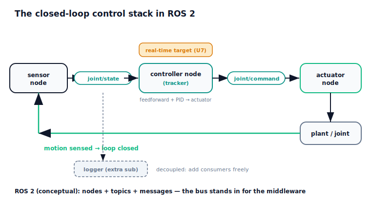

!!! abstract "You are here"
    **Module 8 — Feedback Control and Real-Time Execution (ROS 2)**  ·  **Unit 8 — ROS 2 Integration and the Control Stack**  ·  **Lesson 8.1 — The Closed-Loop Control Stack in ROS 2**

# Lesson 8.1 — The Closed-Loop Control Stack in ROS 2

> Every piece is now in hand: a tracking controller (Units 1–4), an actuator pipeline (Unit 5), the communication pattern (Unit 6), and the real-time inner loop (Unit 7). This lesson wires them into one **closed-loop control stack**, drawn as a **ROS 2 node/topic graph**. A **sensor node** publishes the measured joint state; a **controller node** — the tracker — subscribes to that state and the Module 7 reference, computes the actuator command, and publishes it; an **actuator node** subscribes and drives the joint; the motion is sensed again, closing the loop. This is exactly the publish/subscribe pattern of Lesson 6.2, now carrying real control, with the controller node's inner loop running on the real-time target of Unit 7. ROS 2 is treated **conceptually and lightly** — our pub/sub bus stands in for the middleware, with no `rclpy` internals.

---

## 1. Why This Matters
A controller that works in a single tight simulation loop is not yet a robot's control system. Real robots run their control as a graph of communicating nodes — that's how sensing, control, and actuation, often on different processors, are coordinated, and how new consumers (loggers, monitors, second controllers) are added without rewiring. Seeing the closed loop as a ROS 2 node/topic graph is what connects all of Module 8 to how production robots are actually built. It also unifies the module: the pub/sub pattern you learned abstractly in 6.2 becomes the literal skeleton of the control stack, and the real-time discipline of Unit 7 becomes a property of one node in that graph.

## 2. Physical Intuition
Picture the control system as a small team passing notes on named channels. One teammate (the sensor node) constantly posts the latest joint reading to a channel called `joint/state`. Another (the controller node) watches that channel and the incoming plan, works out the command, and posts it to a channel called `joint/command`. A third (the actuator node) watches `joint/command` and pushes the joint accordingly. The joint moves, the sensor posts the new reading, and the cycle continues. No teammate calls another by name; they only read and write channels. That's the publish/subscribe shape from 6.2 — and now the notes carry real control traffic.

The one teammate with a stopwatch is the controller node: its inner loop must run on time, every period, so it sits on the protected real-time target of Unit 7. The others can be looser. The beauty of the note-passing arrangement is that you can add a fourth teammate who just reads `joint/state` to log it, or a safety teammate who can override `joint/command`, without disturbing anyone — the same decoupling payoff you saw in 6.2, now buying you a control system you can grow.

## 3. Mathematical Foundations
The closed-loop stack is the publish/subscribe graph (6.2) instantiated with the control content of Units 1–7:

- **Sensor node** → publishes `joint/state` (the measured $(q, \dot q)$, here bundled with the current Module 7 reference sample $(q_d, \dot q_d, \ddot q_d)$).
- **Controller node (the tracker)** → subscribes to `joint/state`; computes the command using the complete control law from Unit 4 (feedforward $m\,\ddot q_d + b\,\dot q_d + \ell$ + PID feedback on $q_d - q$) passed through the actuator pipeline of Unit 5; publishes `joint/command` (the delivered actuator command).
- **Actuator node** → subscribes to `joint/command` and drives the plant.
- The motion is sensed again → the loop is closed.

The two topics that *carry the loop* are `joint/state` and `joint/command`. Communication hops add the loop latency of 6.1 ($\tau = \Sigma$ hops); Unit 7's real-time target keeps that latency small and the controller node's period deterministic, so the loop stays stable (6.3). We treat **ROS 2 conceptually and lightly**: nodes, topics, messages — the same pattern as 6.2 — implemented on our in-process bus rather than DDS/`rclpy`, which is the production implementation (out of scope to build).

The verified result: running the full stack — a Module 7 quintic reference, a controller node carrying the feedforward + PID law and the actuator, and an actuator node, wired over the bus with small communication hops — tracks the reference to RMS ≈ **0.0015**, with the loop carried over exactly the two topics `joint/state` and `joint/command`. The pattern of 6.2 now closes a real control loop.

## 4. Visual Explanation

<figure markdown>
  { width="680" }
</figure>

## 5. Engineering Example
This graph is the literal shape of a real robot's control system. In a ROS 2 manipulator, a hardware-interface node publishes joint states, a controller node (e.g., a joint trajectory controller) subscribes and publishes commands, and the hardware interface applies them — with the time-critical control often running in a real-time controller-manager loop while the rest of ROS 2 runs best-effort. Mobile robots publish odometry and sensor topics consumed by controller nodes that publish velocity commands. The decoupling matters in practice: teams add diagnostics, recording (rosbag), and safety-monitor nodes that subscribe to the same topics without touching the controller. The stack in this lesson is a faithful miniature of that arrangement — the same nodes, the same topics, the same real-time/best-effort split.

## 6. Worked Example
Closing the loop over topics.

- **Setup:** a Module 7 quintic reference (0 → 1.2 rad over 2 s); a controller node built from the feedforward + PID control law and the actuator pipeline; an actuator node and a sensor node, wired over the bus with small communication hops.
- **Result:** the loop runs entirely over the two topics `joint/state` and `joint/command`, and the stack tracks the reference to RMS ≈ **0.0015**, with a small bounded loop latency.
- **Reading it:** the publish/subscribe pattern of 6.2 now carries real control, and because the controller node's timing is real-time (Unit 7) and the hops are small, the loop is stable and tight — the whole module operating as one stack.
- The notebook asserts the loop runs through `joint/state` and `joint/command` and that the stack tracks the reference.

## 7. Interactive Demonstration

<iframe src="../../demos/module08/lesson29_closed_loop_tracking_studio.html" title="The Closed-Loop Control Stack in ROS 2 interactive demo" style="width:100%;height:520px;border:1px solid #e2e8f0;border-radius:12px"></iframe>

[Open this demo in a new tab ↗](../demos/module08/lesson29_closed_loop_tracking_studio.html)

**L29 — Closed-Loop Tracking Studio (flagship).** An interactive view of the control stack closing the loop. The reference flows in; the tracker node computes feedforward + feedback and the actuator delivers the command; the joint moves and is sensed back. Watch the measured trajectory converge onto the reference and the **tracking error shrink toward zero** as the loop closes. Controls let you scrub the reference and toggle feedback on/off (feedforward-only drifts under disturbance; feedforward + feedback locks on). The two topics carrying the loop are shown live. Accessible (ARIA labels, keyboard-operable, live-updating metrics); no browser storage.

## 8. Coding Exercise

!!! tip "Run the hands-on notebook"
    `modules/module08/notebooks/lesson29_control_stack_ros2.ipynb` — open in JupyterLab and run **Kernel → Restart & Run All**.

*(Companion notebook — uses `control_layer`, `run_control_stack`, `Bus`.)*

In the notebook you:

1. Build a controller node with `control_layer` (feedforward + PID + actuator).
2. Run the closed-loop stack over the bus against a Module 7 reference.
3. Assert the loop runs through `joint/state` and `joint/command` and that the stack tracks (small RMS).

## 9. Knowledge Check

Formative — unlimited attempts, immediate feedback; does not affect your grade.

<iframe src="../../quizzes/module08/lesson29_quiz.html" title="The Closed-Loop Control Stack in ROS 2 knowledge check" style="width:100%;height:720px;border:1px solid #e2e8f0;border-radius:12px"></iframe>

[Open this quiz in a new tab ↗](../quizzes/module08/lesson29_quiz.html)

1. Name the three nodes of the stack and what each publishes/subscribes.
2. Which two topics carry the closed loop?
3. Where does the inner loop's real-time requirement live in this graph?
4. How does decoupling let you add a logger or safety monitor without rewiring?

## 10. Challenge Problem
Draw the closed-loop control stack for a single joint as a ROS 2 node/topic graph: name the nodes, the topics, and the direction of each message, and mark which node carries the real-time inner loop. Then explain, using Unit 6, how the loop latency arises from the hops and why the real-time target (Unit 7) keeps it small enough for stability. Add a safety-supervisor node that can veto `joint/command`, and explain how the decoupling of 6.2 makes that addition non-invasive. Finally, state precisely what about ROS 2 we have modelled (the pattern) and what we have not (the DDS/`rclpy` implementation), and why the distinction matters. *(You are specifying a real control stack and reasoning about its timing and extensibility.)*

## 11. Common Mistakes
- **Thinking nodes call each other.** They publish/subscribe to topics; the topic mediates (6.2).
- **Forgetting the loop's timing lives in one node.** The controller node carries the real-time inner loop; the graph alone doesn't guarantee timing.
- **Confusing the pattern with the framework.** We model nodes/topics/messages; DDS/`rclpy` is the implementation we don't build.
- **Ignoring the hops.** Communication adds loop latency (6.1); the real-time target keeps it bounded.

## 12. Key Takeaways
- The closed loop is a **ROS 2 node/topic graph**: **sensor node** → `joint/state` → **controller node (tracker)** → `joint/command` → **actuator node** → back to the joint.
- The two topics that **carry the loop** are `joint/state` and `joint/command`; the controller node carries the **real-time inner loop** (Unit 7).
- It is the **publish/subscribe pattern of 6.2** now carrying real control, with **decoupling** letting you add loggers/monitors freely.
- Verified: the stack tracks a Module 7 reference to RMS ≈ 0.0015 over those two topics. ROS 2 is modelled conceptually; the DDS/`rclpy` implementation is out of scope.

---

### AI Learning Companion

Copy any prompt below into your AI tutor.

- **Tutor (re-explain):** "Re-explain the closed-loop control stack as a team passing notes on named channels (joint/state, joint/command): sensor posts state, controller posts command, actuator acts, loop closes. Then explain why only the controller node needs real-time timing."
- **Practice (generate exercises):** "Give me a robot subsystem and ask me to draw its closed loop as a ROS 2 node/topic graph — naming nodes, topics, and which node is real-time. Withhold the answer until I respond."
- **Explore (connect to the real world):** "Describe how a real ROS 2 manipulator arranges hardware-interface, controller, and monitoring nodes on topics, and ask me to map it onto the sensor/controller/actuator stack from this lesson."

### Global Learning Support

Per-language explanation prompts — use whichever you think best in.

- **English (authoritative):** "Explain the closed-loop control stack as a ROS 2 node/topic graph (sensor → joint/state → controller → joint/command → actuator → loop closed), the two loop-carrying topics, where the real-time inner loop lives, and the decoupling payoff — at a robotics-course level, conceptually (ROS 2 as pattern, not building DDS/rclpy)."
- **Español:** "Explica la pila de control en lazo cerrado como un grafo de nodos/tópicos de ROS 2 (sensor → joint/state → controlador → joint/command → actuador → lazo cerrado), los dos tópicos que transportan el lazo, dónde vive el lazo interno de tiempo real y la ventaja del desacoplamiento — a nivel de curso de robótica, conceptualmente (ROS 2 como patrón, sin construir DDS/rclpy)."
- **中文（简体）：** "把闭环控制栈解释为一个 ROS 2 节点/话题图（传感器 → joint/state → 控制器 → joint/command → 执行器 → 闭环），说明承载回路的两个话题、实时内部回路所在的节点，以及解耦带来的好处——达到机器人课程水平，概念性说明（把 ROS 2 当作模式，不去构建 DDS/rclpy）。"
- **Türkçe:** "Kapalı-çevrim denetim yığınını bir ROS 2 düğüm/konu grafiği olarak açıkla (sensör → joint/state → denetleyici → joint/command → eyleyici → çevrim kapanır), çevrimi taşıyan iki konuyu, gerçek-zamanlı iç döngünün hangi düğümde olduğunu ve ayrıştırmanın faydasını anlat — robotik dersi düzeyinde, kavramsal olarak (ROS 2 bir desen olarak; DDS/rclpy inşa edilmez)."

---

*Next: Lesson 8.2 — A Lightweight ROS 2 Tracker Node.*
