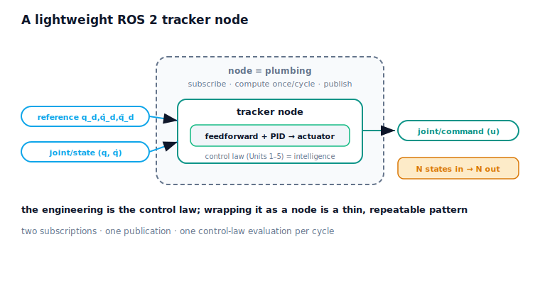

!!! abstract "You are here"
    **Module 8 — Feedback Control and Real-Time Execution (ROS 2)**  ·  **Unit 8 — ROS 2 Integration and the Control Stack**  ·  **Lesson 8.2 — A Lightweight ROS 2 Tracker Node**

# Lesson 8.2 — A Lightweight ROS 2 Tracker Node

> Lesson 8.1 drew the whole stack; this lesson zooms in on its brain — the **tracker node**. Stripped to essentials, the node is small: it **subscribes** to the reference and to the measured state, and on each cycle it runs the control law (feedforward + PID, through the actuator) once and **publishes** a single actuator command. Two inputs, one output, one computation per cycle. The striking thing is how little the node itself contains: all the control intelligence is the law you built in Units 1–5; the node is just plumbing that connects that law to topics and runs it at a fixed rate. That separation — intelligence in the law, plumbing in the node — is the whole point of this lesson, and it's why moving a controller into ROS 2 is mostly mechanical.

---

## 1. Why This Matters
"Write a ROS 2 controller" sounds like it requires deep framework expertise. This lesson shows it mostly doesn't: once you have a control law, wrapping it as a node is a thin, repeatable pattern — subscribe to what you need, compute once per cycle, publish the command. Understanding that the node is plumbing and the law is intelligence keeps your design clean (the control logic stays testable in isolation, exactly as in every notebook so far) and tells you where the engineering actually is (the law, not the framework). It also demystifies the leap from "my controller works in a loop" to "my controller is a ROS 2 node."

## 2. Physical Intuition
Think of the tracker node as a single, focused worker at a desk with two inboxes and one outbox. One inbox receives the plan (the reference); the other receives the latest joint reading (the measured state). Every tick of the clock, the worker takes the newest item from each inbox, does one well-practised calculation — anticipate with feedforward, correct with feedback, respect the actuator's limits — and drops a single command in the outbox. Then waits for the next tick. The worker's *skill* (the calculation) is everything you taught them in Units 1–5; their *job description* (read two inboxes, write one outbox, once per tick) is tiny and never changes.

This is why a controller is easy to "node-ify." You don't re-teach the worker their skill to put them in the team; you just point their inboxes at the right channels and their outbox at the command channel. The same worker (the same control law) could be dropped into any robot's stack by re-pointing the inboxes. The node is the desk and the inbox/outbox wiring; the control law is the worker's expertise.

## 3. Mathematical Foundations
The tracker node is a thin wrapper around the control law. Its anatomy:

- **Subscriptions (inputs):** `reference` (the Module 7 sample $(q_d, \dot q_d, \ddot q_d)$) and `joint/state` (the measured $(q, \dot q)$). In the stack of 8.1 these arrive bundled on `joint/state`; conceptually they are the node's two inputs.
- **Per-cycle callback (compute):** once per control period, evaluate
  $$u_{\text{req}} = \underbrace{m\,\ddot q_d + b\,\dot q_d + \ell}_{\text{feedforward (anticipate)}} + \underbrace{\text{PID}(q_d - q)}_{\text{feedback (correct)}}, \qquad u = \text{actuator}(u_{\text{req}}),$$
  i.e., the complete control law of Unit 4 through the actuator pipeline of Unit 5.
- **Publication (output):** `joint/command` — the single delivered actuator command $u$.

That is the entire node: two subscriptions, one publication, one control-law evaluation per cycle. The **control law is the intelligence** (Units 1–5); the **node is the plumbing** (subscribe / compute-once / publish). Run at a fixed rate (7.2) on the real-time target (7.4), the node produces exactly one command per state it receives. We keep it **lightweight and conceptual** — no `rclpy` boilerplate, no executors, no QoS tuning (the production details); the *shape* is what transfers.

The verified result: wrapping the control law as a node on the bus and running the loop, the node receives a stream of states and publishes **exactly one command per state** (e.g., 1001 states → 1001 commands), and the closed loop tracks the reference (small RMS). One in, one out, per cycle — the node's contract.

## 4. Visual Explanation

<figure markdown>
  { width="680" }
</figure>

## 5. Engineering Example
This thin-wrapper pattern is exactly how ROS 2 controllers are written. A typical node declares its subscriptions in a few lines, registers a callback (or a fixed-rate timer) that runs the control computation, and publishes the command — the control math is a self-contained function the node calls. Teams keep that control function library-clean and unit-tested on its own, precisely because the node is just plumbing; the same control function can be reused across nodes and robots. ros2_control formalises this separation (controllers are plugins; the manager handles the plumbing and timing). The lesson's miniature node mirrors that production reality: the intelligence is an isolated, testable control law; the node connects it to topics and runs it on schedule.

## 6. Worked Example
One in, one out.

- **Setup:** wrap the feedforward + PID + actuator control law as a tracker node on the bus; run the closed loop against a Module 7 reference; count the messages.
- **Result:** the node receives a stream of measured states and publishes **exactly one command per state** (e.g., 1001 → 1001), and the loop tracks the reference with small RMS.
- **Reading it:** the node honours its contract — subscribe, compute once, publish — every cycle. Nothing about the control law changed from earlier units; it's the same intelligence, now wired to topics.
- The notebook asserts one command per state and that the node closes the loop and tracks.

## 7. Interactive Demonstration

<iframe src="../../demos/module08/lesson30_tracker_node.html" title="A Lightweight ROS 2 Tracker Node interactive demo" style="width:100%;height:520px;border:1px solid #e2e8f0;border-radius:12px"></iframe>

[Open this demo in a new tab ↗](../demos/module08/lesson30_tracker_node.html)

*(The flagship demo is L29 Closed-Loop Tracking Studio; this lesson is conceptual + notebook.)*

**The node-contract test.** In the notebook you:

1. Wrap the control law as a tracker node and run the loop.
2. Count states received vs commands published and confirm they match (one per cycle).
3. Confirm the loop tracks — the node's plumbing connects the same control intelligence to the stack.

## 8. Coding Exercise

!!! tip "Run the hands-on notebook"
    `modules/module08/notebooks/lesson30_tracker_node.ipynb` — open in JupyterLab and run **Kernel → Restart & Run All**.

*(Companion notebook — uses `control_layer` as the node, `run_control_stack`, `Bus` subscribers as counters.)*

In the notebook you:

1. Build the tracker node from the control law and attach counters to `joint/state` and `joint/command`.
2. Run the loop and assert one command per state.
3. Assert the node closes the loop and tracks (small RMS).

## 9. Knowledge Check

Formative — unlimited attempts, immediate feedback; does not affect your grade.

<iframe src="../../quizzes/module08/lesson30_quiz.html" title="A Lightweight ROS 2 Tracker Node knowledge check" style="width:100%;height:720px;border:1px solid #e2e8f0;border-radius:12px"></iframe>

[Open this quiz in a new tab ↗](../quizzes/module08/lesson30_quiz.html)

1. What are the tracker node's two subscriptions and one publication?
2. What does the node compute each cycle?
3. Distinguish the control law (intelligence) from the node (plumbing).
4. Why does the node publish exactly one command per state?

## 10. Challenge Problem
Explain why "writing a ROS 2 controller" is mostly plumbing once you have a control law. Specify the tracker node precisely — its subscriptions, its per-cycle computation, its publication — and argue why keeping the control law as a separate, testable function (rather than entangled in the node) is good engineering, citing how every Module 8 notebook tested the law in isolation. Then describe how you would reuse the *same* control law as a node on a different robot, what would change (the plumbing) and what wouldn't (the intelligence), and why the node's "one command per state" contract matters for the periodic, real-time execution of Unit 7. *(You are arguing for the intelligence/plumbing separation and specifying the node.)*

## 11. Common Mistakes
- **Believing the node needs deep framework expertise.** It's a thin wrapper; the engineering is the control law.
- **Entangling the control law with node code.** Keep the law a separate, testable function (as in the notebooks).
- **Publishing more or fewer commands than states.** The contract is one command per cycle.
- **Adding `rclpy` detail here.** We model the shape; executors/QoS are production specifics out of scope.

## 12. Key Takeaways
- The **tracker node** is small: **two subscriptions** (reference, measured state), **one publication** (the command), **one control-law evaluation** per cycle.
- The **control law is the intelligence** (Units 1–5); the **node is the plumbing** (subscribe · compute once · publish) — keep them separate and the law stays testable.
- Run at a fixed rate on the real-time target, the node produces **one command per state**.
- Verified: N states → N commands, and the node closes the loop and tracks. ROS 2 internals (`rclpy`, executors, QoS) are out of scope; the node *shape* is what transfers.

---

### AI Learning Companion

Copy any prompt below into your AI tutor.

- **Tutor (re-explain):** "Re-explain the tracker node as a focused worker with two inboxes (reference, measured state) and one outbox (command) who does one calculation per tick. Then explain why the worker's skill (the control law) is the intelligence and the desk/wiring (the node) is just plumbing."
- **Practice (generate exercises):** "Give me a control law and ask me to specify the tracker node that wraps it — its subscriptions, per-cycle compute, and publication — and to predict the states-in/commands-out relationship. Withhold the answer until I respond."
- **Explore (connect to the real world):** "Describe how ros2_control separates controllers (the intelligence) from the controller manager (the plumbing and timing) and ask me to map it onto this lesson's node."

### Global Learning Support

Per-language explanation prompts — use whichever you think best in.

- **English (authoritative):** "Explain the lightweight ROS 2 tracker node — two subscriptions (reference, measured state), one publication (command), one control-law evaluation per cycle — and the separation of control law (intelligence) from node (plumbing), at a robotics-course level, conceptually (no rclpy/executors/QoS internals)."
- **Español:** "Explica el nodo rastreador ligero de ROS 2 — dos suscripciones (referencia, estado medido), una publicación (comando), una evaluación de la ley de control por ciclo — y la separación entre la ley de control (la inteligencia) y el nodo (la fontanería), a nivel de curso de robótica, conceptualmente (sin internals de rclpy/executors/QoS)."
- **中文（简体）：** "解释轻量级 ROS 2 跟踪器节点——两个订阅（参考、测量状态）、一个发布（指令）、每周期一次控制律计算——以及控制律（智能）与节点（管线连接）的分离，达到机器人课程水平，概念性说明（不涉及 rclpy/executors/QoS 内部细节）。"
- **Türkçe:** "Hafif ROS 2 izleyici düğümünü açıkla — iki abonelik (referans, ölçülen durum), bir yayın (komut), döngü başına bir denetim-yasası değerlendirmesi — ve denetim yasasının (zeka) düğümden (tesisat) ayrılmasını, robotik dersi düzeyinde, kavramsal olarak (rclpy/executor/QoS iç ayrıntıları olmadan)."

---

*Next: Lesson 8.3 — The Control Layer: the Module 9 Handoff.*
