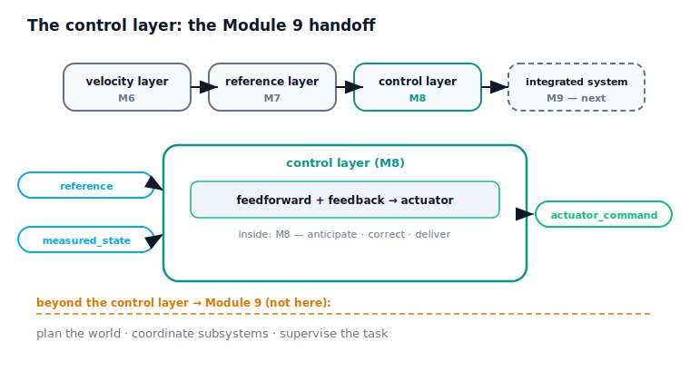

!!! abstract "You are here"
    **Module 8 — Feedback Control and Real-Time Execution (ROS 2)**  ·  **Unit 8 — ROS 2 Integration and the Control Stack**  ·  **Lesson 8.3 — The Control Layer: the Module 9 Handoff**

# Lesson 8.3 — The Control Layer: the Module 9 Handoff

> Module 8 has produced a great deal — a tracking controller, an actuator pipeline, a real-time loop, a ROS 2 stack — and this lesson packages all of it behind a single, clean interface: the **control layer**. Its signature is
> $$\texttt{tracking\_controller(reference, measured\_state)} \;\rightarrow\; \texttt{actuator\_command}.$$
> Hand it one sample of Module 7's reference $(q_d, \dot q_d, \ddot q_d)$ and the measured joint state $(q, \dot q)$, and it returns the **actuator command** that drives the joint toward the reference — feedforward anticipating, feedback correcting, the actuator delivering. This interface is the **Module 9 handoff**: the third link in the chain **velocity layer (M6) → reference layer (M7) → control layer (M8) → integrated system (M9)**. Module 9 will *integrate* this layer into a full autonomous system. Everything beyond this interface is Module 9's job — the boundary this module was careful to keep.

---

## 1. Why This Matters
A module's lasting contribution is the clean interface it hands the next one. Module 6 handed Module 7 a velocity layer; Module 7 handed Module 8 a reference layer; now Module 8 hands Module 9 a **control layer**. Defining that interface precisely — what goes in, what comes out, what's inside, what's deliberately not — is what lets Module 9 build an integrated autonomous system without re-deriving control, and what keeps Module 8's scope honest (we built the layer, not the integration). This lesson is where the whole module crystallises into the one object the rest of the curriculum will use.

## 2. Physical Intuition
Think of the control layer as a sealed, well-labelled component you can hand to another engineer. On its front are two ports — "plan in" (the reference) and "where am I now" (the measured state) — and one port out — "what to send the actuator" (the command). The engineer doesn't need to open it to understand it; the label says: *give me the plan and the current state, and I'll give you the command that follows the plan on this real, imperfect joint*. Inside, sealed away, are the feedforward that anticipates the motion, the feedback that corrects the error, and the actuator handling that respects the hardware's limits — all the work of Module 8.

What's deliberately *not* inside is just as important. The component doesn't decide *what* the plan should be (that's the reference layer, Module 7), doesn't plan around obstacles or coordinate multiple subsystems or supervise the task (that's integration, Module 9). It does exactly one job — turn plan-plus-state into a command — and does it reliably. A clean component with a clear contract is what makes the next engineer's job tractable; that next engineer is Module 9.

## 3. Mathematical Foundations
The control layer is the function

$$\texttt{tracking\_controller}\big(\underbrace{(q_d, \dot q_d, \ddot q_d)}_{\text{reference (M7)}},\ \underbrace{(q, \dot q)}_{\text{measured state}}\big) \;\rightarrow\; \underbrace{u}_{\text{actuator command}},$$

implemented as the complete control law of Module 8:

$$u_{\text{req}} = \underbrace{m\,\ddot q_d + b\,\dot q_d + \ell}_{\text{feedforward (Unit 4, consumes M7's }\dot q_d, \ddot q_d)} + \underbrace{\text{PID}(q_d - q)}_{\text{feedback (Units 2–3)}}, \qquad u = \text{actuator}(u_{\text{req}})\ \text{(Unit 5)}.$$

It is **stateful** (the PID integral and the actuator carry state between calls) and runs **once per control period** (Unit 7) inside the **tracker node** (Unit 8). 

**The chain.** Each module hands the next a layer:

| Module | Layer | Interface |
|---|---|---|
| M6 | velocity layer | $\xi_d \rightarrow \dot q$ |
| M7 | reference layer | $\texttt{reference}(t) \rightarrow (q_d, \dot q_d, \ddot q_d)$ |
| **M8** | **control layer** | $\texttt{tracking\_controller}(\text{reference}, \text{measured\_state}) \rightarrow \texttt{actuator\_command}$ |
| M9 | integrated system | (integrates the control layer into the full robot) |

**Inside the layer:** feedforward + feedback + actuator (all of Module 8). **Outside the layer (Module 9's job):** deciding the reference (M7 supplies it), planning around the world, coordinating subsystems, supervising the task — **no system integration beyond the control layer**. We hold the module boundaries: no formal dynamics, no advanced control theory; the layer is the artifact, the integration is next.

The verified result: calling `tracking_controller((q_d, q̇_d, q̈_d), (q, q̇), dt)` returns a single **actuator command** (a number) together with its breakdown — a nonzero **feedforward** term (anticipation), a **feedback** term (correction), and the **delivered** command (through the actuator). Driven closed-loop against a Module 7 reference, the layer **tracks** to small RMS. The interface behaves exactly as the handoff promises.

## 4. Visual Explanation

<figure markdown>
  { width="680" }
</figure>

## 5. Engineering Example
The clean-interface handoff is how real robot software is layered. A motion controller exposes a stable interface — "give me a setpoint/trajectory and the measured state; I'll output commands" — and the rest of the system is built on top of it without knowing its internals. In ros2_control, a controller presents a standard interface and the broader application (navigation, manipulation, task logic) composes with it through topics/actions, never reaching inside. This is why you can swap one tracking controller for another, or reuse the same control layer across robots: the contract is fixed. Module 9's job — perception-driven planning, coordinating the arm with the rest of the harvesting system, supervising the task — sits entirely *on top of* this control-layer interface, exactly as a real autonomy stack sits on top of its low-level controllers.

## 6. Worked Example
Exercising the interface.

- **Setup:** build the control layer (feedforward + PID + actuator). Call it with one Module 7 reference sample $(1.0, 0.5, 0.2)$ and one measured state $(0.9, 0.4)$.
- **Result:** it returns a single **actuator command**, decomposable into a nonzero **feedforward** term (anticipation from $\dot q_d, \ddot q_d$), a **feedback** term (correction from $q_d - q$), and the **delivered** command through the actuator.
- **Closed loop:** driven against a Module 7 quintic reference, the layer **tracks** to small RMS.
- **Reading it:** the interface is exactly `tracking_controller(reference, measured_state) → actuator_command`, and it works — the Module 9 handoff is real and verified.
- The notebook asserts the interface shape (a command from reference + measured state, with feedforward, feedback, and delivered terms) and that the layer tracks closed-loop.

## 7. Interactive Demonstration

<iframe src="../../demos/module08/lesson31_control_layer_handoff.html" title="The Control Layer: the Module 9 Handoff interactive demo" style="width:100%;height:520px;border:1px solid #e2e8f0;border-radius:12px"></iframe>

[Open this demo in a new tab ↗](../demos/module08/lesson31_control_layer_handoff.html)

*(The flagship demo is L29 Closed-Loop Tracking Studio; this lesson is conceptual + notebook.)*

**The handoff test.** In the notebook you:

1. Build the control layer and call its `tracking_controller` with one reference sample and one measured state.
2. Confirm it returns an actuator command with feedforward, feedback, and delivered parts.
3. Run it closed-loop against a Module 7 reference and confirm it tracks — the layer Module 9 will integrate.

## 8. Coding Exercise

!!! tip "Run the hands-on notebook"
    `modules/module08/notebooks/lesson31_control_layer_handoff.ipynb` — open in JupyterLab and run **Kernel → Restart & Run All**.

*(Companion notebook — uses `control_layer`, `run_control_stack`.)*

In the notebook you:

1. Build the control layer and exercise its interface on one (reference, measured_state) pair.
2. Assert it returns an actuator command combining feedforward and feedback, delivered through the actuator.
3. Assert it tracks a Module 7 reference closed-loop — the verified Module 9 handoff.

## 9. Knowledge Check

Formative — unlimited attempts, immediate feedback; does not affect your grade.

<iframe src="../../quizzes/module08/lesson31_quiz.html" title="The Control Layer: the Module 9 Handoff knowledge check" style="width:100%;height:720px;border:1px solid #e2e8f0;border-radius:12px"></iframe>

[Open this quiz in a new tab ↗](../quizzes/module08/lesson31_quiz.html)

1. State the control-layer interface precisely (inputs and output).
2. Where does the control layer sit in the M6→M7→M8→M9 chain?
3. What is inside the layer, and what is deliberately outside it?
4. Why is a clean, fixed interface valuable for the next module?

## 10. Challenge Problem
Define the Module 8 control layer as the handoff to Module 9: write its interface, list what's inside it (and which unit each piece came from), and list what's deliberately outside it (and why each belongs to Module 9). Then place it in the full chain — velocity layer (M6), reference layer (M7), control layer (M8), integrated system (M9) — explaining what each layer hands the next. Argue why packaging Module 8 behind this single interface (rather than exposing its internals) is what makes Module 9 tractable, and give one concrete thing Module 9 will do *on top of* this layer that Module 8 deliberately did not. *(You are specifying the module's deliverable and defending its boundary.)*

## 11. Common Mistakes
- **Letting the layer decide the reference.** The reference comes from Module 7; the layer consumes it.
- **Doing integration inside the layer.** Planning, coordination, supervision are Module 9 — beyond the control layer.
- **Exposing internals instead of an interface.** The value is the fixed contract `tracking_controller(reference, measured_state) → actuator_command`.
- **Forgetting the layer is stateful and periodic.** It carries PID/actuator state and runs once per control period (Unit 7).

## 12. Key Takeaways
- The **control layer** is the module's deliverable: `tracking_controller(reference, measured_state) → actuator_command`.
- **Inside:** feedforward (anticipate) + feedback (correct) + actuator (deliver) — all of Module 8. **Outside (Module 9):** planning the world, coordination, supervision — no integration beyond the layer.
- It is the **Module 9 handoff**, completing **velocity layer (M6) → reference layer (M7) → control layer (M8) → integrated system (M9)**.
- Verified: the interface returns an actuator command (feedforward + feedback, delivered) and tracks a Module 7 reference closed-loop.

---

### AI Learning Companion

Copy any prompt below into your AI tutor.

- **Tutor (re-explain):** "Re-explain the control layer as a sealed component with two input ports (reference, measured state) and one output port (actuator command), with feedforward/feedback/actuator sealed inside. Then explain why what's left OUTSIDE the component (planning, coordination, supervision) is Module 9's job."
- **Practice (generate exercises):** "Give me a candidate interface for a robot software layer and ask me whether it's clean (fixed contract, internals hidden) and what belongs inside vs in the next layer. Withhold the answer until I respond."
- **Explore (connect to the real world):** "Describe how real robot stacks build navigation/manipulation on top of a fixed low-level controller interface (e.g., ros2_control), and ask me to map it onto the M8 control layer / M9 integration boundary."

### Global Learning Support

Per-language explanation prompts — use whichever you think best in.

- **English (authoritative):** "Explain the Module 8 control layer interface tracking_controller(reference, measured_state) → actuator_command, its place in the M6→M7→M8→M9 chain, what's inside it (feedforward + feedback + actuator) and what's deliberately outside (Module 9 integration) — at a robotics-course level (no formal dynamics, no advanced control theory)."
- **Español:** "Explica la interfaz de la capa de control del Módulo 8 tracking_controller(referencia, estado_medido) → comando_actuador, su lugar en la cadena M6→M7→M8→M9, qué hay dentro (feedforward + feedback + actuador) y qué queda deliberadamente fuera (la integración del Módulo 9) — a nivel de curso de robótica (sin dinámica formal ni teoría de control avanzada)."
- **中文（简体）：** "解释第 8 模块控制层接口 tracking_controller(参考, 测量状态) → 执行器指令，它在 M6→M7→M8→M9 链条中的位置，层内有什么（前馈 + 反馈 + 执行器）以及哪些被有意置于层外（第 9 模块的集成）——达到机器人课程水平（不涉及形式化动力学，不涉及高级控制理论）。"
- **Türkçe:** "Modül 8 denetim katmanı arayüzünü tracking_controller(referans, ölçülen_durum) → eyleyici_komutu, M6→M7→M8→M9 zincirindeki yerini, içinde ne olduğunu (ileribesleme + geribesleme + eyleyici) ve neyin bilerek dışarıda bırakıldığını (Modül 9 entegrasyonu) açıkla — robotik dersi düzeyinde (resmi dinamik yok, ileri denetim teorisi yok)."

---

*Next: Lesson 8.4 — Capstone: The Greenhouse Arm Tracks Its Trajectory.*
