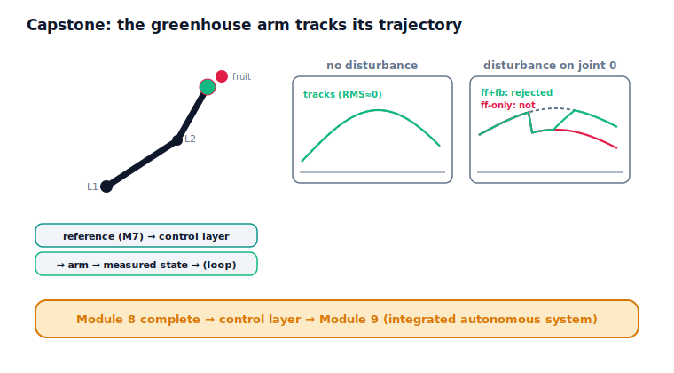

!!! abstract "You are here"
    **Module 8 — Feedback Control and Real-Time Execution (ROS 2)**  ·  **Unit 8 — ROS 2 Integration and the Control Stack**  ·  **Lesson 8.4 — Capstone: The Greenhouse Arm Tracks Its Trajectory**

# Lesson 8.4 — Capstone: The Greenhouse Arm Tracks Its Trajectory

> This is the whole module in a single run. The planar 2-link greenhouse arm — the running example since Module 5 — tracks a **Module 7 reference** through the **closed-loop control layer**: feedforward anticipates the motion, feedback corrects the error, the actuator delivers within its limits, and the inner loop runs as a periodic real-time task inside a ROS 2 stack. Then we kick the arm with a disturbance and watch **feedback reject what feedforward alone cannot** — the proof, from Lesson 4.4, that closing the loop was essential, now demonstrated on the full arm. The artifact this capstone produces is the **control layer** that Module 9 will consume. With it, Module 8 is complete, and the bridge to Module 9 — the integrated autonomous system — is open.

---

## 1. Why This Matters
A capstone earns its name by making the whole module *work at once*, on the real running example, and by showing the central claim end to end. Here the central claim is the module's reason for existing: open-loop execution drifts, and only closed-loop control — feedforward + feedback, through real actuators, on real-time timing — makes a real arm follow its trajectory and recover from disturbances. Watching the greenhouse arm track its Module 7 reference and shrug off a kick is the payoff of eight units, and it hands the next module a verified control layer to build on. This lesson also closes the loop on the curriculum's spine: M6's velocity layer, M7's reference layer, and now M8's control layer, ready for M9's integration.

## 2. Physical Intuition
Picture the greenhouse arm reaching for a piece of fruit. Module 7 handed it a plan — a smooth trajectory for each joint, with the desired positions, velocities, and accelerations. Module 8's job is to make the real arm actually follow that plan despite everything that's imperfect about it: load on the joints, friction, actuators that can't deliver infinite effort or react instantly, sensing and commands that travel as messages and take time. The control layer does this by anticipating the motion (feedforward, using the plan's velocities and accelerations) and continuously correcting whatever still goes wrong (feedback, from the tracking error), all while respecting the actuator's limits and running fast and on time.

Now imagine a gust, a bumped branch, an unexpected load — a disturbance mid-reach. Feedforward, which only knows the plan, can't see it and can't respond; an arm relying on feedforward alone would be pushed off course and *stay* off course. Feedback sees the growing error and pushes back until the arm is back on the trajectory. That contrast — the arm shoved and recovering versus shoved and stranded — is the whole reason Module 8 exists, made physical on the arm you've followed all along.

## 3. Mathematical Foundations
The capstone runs the closed-loop control layer on the **planar 2-link arm** ($L_1 = 0.4$, $L_2 = 0.3$), one control layer per joint, tracking a Module 7 reference for each joint:

$$\text{per joint } j:\quad u_j = \texttt{tracking\_controller}_j\big((q_{d,j}, \dot q_{d,j}, \ddot q_{d,j}),\ (q_j, \dot q_j)\big),$$

with feedforward $m\,\ddot q_d + b\,\dot q_d + \ell$, PID feedback on $q_d - q$, and the actuator pipeline (Unit 5), executed as periodic real-time tasks (Unit 7) in the ROS 2 stack (Unit 8). Joints are treated independently; any coupling is handled as a disturbance, within the **no-formal-dynamics** boundary the module has kept throughout.

Two verified results:

- **Tracking (no disturbance).** The arm tracks its Module 7 reference closed-loop to overall RMS ≈ **0.0000** — essentially perfect: the plan is followed.
- **Disturbance rejection (the Lesson 4.4 claim, on the arm).** A mid-trajectory kick is applied to joint 0. With **feedforward + feedback**, the final joint error returns to ≈ **0.012** — the disturbance is rejected. With **feedforward only** (feedback gains zeroed), the final joint error is ≈ **4.9** — a large, permanent miss, because open-loop anticipation cannot see or correct a disturbance. Feedback is what makes the arm recover; that is why the loop is closed.

This is the entire module operating as one system, on the running example, producing the **control layer** of Lesson 8.3 — the artifact Module 9 consumes.

## 4. Visual Explanation

<figure markdown>
  { width="680" }
</figure>

## 5. Engineering Example
A harvesting arm in a real greenhouse lives exactly this loop. The planner hands down a trajectory to a fruit; the joint controllers track it on real-time hardware while the heavy perception/planning runs best-effort; the actuators deliver bounded effort against gravity and friction; and when a branch springs back or the fruit resists, feedback drives the joints back onto the plan. Take feedback away and the first disturbance leaves the gripper in the wrong place — a missed pick. The capstone's two runs are the bench version of that field reality: perfect tracking when the world cooperates, graceful recovery when it doesn't, all delivered by the control layer the rest of the robot is built on. Module 9 will wrap this layer in perception, task logic, and coordination to harvest autonomously.

## 6. Worked Example
The arm, end to end.

- **Tracking:** two joints, each with a control layer (feedforward + PID + actuator), track a Module 7 two-joint reference closed-loop. Overall RMS ≈ **0.0000** — the plan is followed.
- **Disturbance, feedback on:** a kick on joint 0 mid-trajectory; the joint dips, then feedback drives the error back to ≈ **0.012** by the end — **rejected**.
- **Disturbance, feedforward only:** the same kick with feedback zeroed; the joint is pushed off and stays off, final error ≈ **4.9** — **not rejected**.
- **Reading it:** identical plan, identical disturbance — only feedback differs, and it is the difference between recovery and a permanent miss. The module's thesis, demonstrated on the arm.
- The notebook asserts the arm tracks (small RMS), feedback rejects the disturbance (final error near zero), and feedforward-only cannot (large permanent error).

## 7. Interactive Demonstration

<iframe src="../../demos/module08/lesson32_greenhouse_tracking_capstone.html" title="Capstone: The Greenhouse Arm Tracks Its Trajectory interactive demo" style="width:100%;height:520px;border:1px solid #e2e8f0;border-radius:12px"></iframe>

[Open this demo in a new tab ↗](../demos/module08/lesson32_greenhouse_tracking_capstone.html)

*(The flagship demo is L29 Closed-Loop Tracking Studio — re-open it here and run the full loop on the arm: scrub the reference, toggle feedback, inject a disturbance, and watch the arm track and recover.)*

**The capstone run.** In the notebook you:

1. Track a Module 7 two-joint reference with the closed-loop control layer and confirm near-perfect tracking.
2. Inject a disturbance and confirm feedforward + feedback rejects it.
3. Confirm feedforward-only leaves a large permanent error — feedback was essential.

## 8. Coding Exercise

!!! tip "Run the hands-on notebook"
    `modules/module08/notebooks/lesson32_capstone_closed_loop.ipynb` — open in JupyterLab and run **Kernel → Restart & Run All**.

*(Companion notebook — uses `multi_quintic`, `control_layer`, `run_arm_control_stack`.)*

In the notebook you:

1. Build a control layer per joint and run the closed-loop arm against a Module 7 reference; assert it tracks (small overall RMS).
2. Inject a disturbance on one joint and assert feedback rejects it (final error near zero).
3. Assert feedforward-only cannot (large permanent error) — the module's central claim, on the arm.

## 9. Knowledge Check

Formative — unlimited attempts, immediate feedback; does not affect your grade.

<iframe src="../../quizzes/module08/lesson32_quiz.html" title="Capstone: The Greenhouse Arm Tracks Its Trajectory knowledge check" style="width:100%;height:720px;border:1px solid #e2e8f0;border-radius:12px"></iframe>

[Open this quiz in a new tab ↗](../quizzes/module08/lesson32_quiz.html)

1. What does the capstone run demonstrate about tracking the Module 7 reference?
2. Why does feedback reject the disturbance while feedforward alone cannot?
3. What artifact does the capstone produce, and which module consumes it?
4. Summarise the module's arc from open-loop drift to a real-time control stack.

## 10. Challenge Problem
Tell the full Module 8 story through the greenhouse arm. Start at Unit 1 (open-loop drift, the tracking problem) and trace the arc: PID feedback (Unit 2), stability and tuning (Unit 3), feedforward + feedback tracking the whole arm (Unit 4), the actuator's limits (Unit 5), the loop as messages with latency (Unit 6), real-time periodic execution (Unit 7), and the ROS 2 control stack (Unit 8) — explaining what each unit added to make a *real* arm follow its trajectory. Then state precisely the control layer the capstone produces, why the disturbance-rejection result proves the loop had to be closed, and what Module 9 will build on top of this layer (and what Module 8 deliberately left to it). *(You are narrating the whole module and handing off cleanly to Module 9.)*

## 11. Common Mistakes
- **Crediting feedforward for disturbance recovery.** Feedforward only knows the plan; feedback rejects disturbances.
- **Expecting perfect tracking to imply no need for feedback.** The disturbance run shows why the loop must be closed.
- **Doing Module 9's work here.** The capstone produces the control layer; integration (perception, coordination, supervision) is Module 9.
- **Forgetting the real-system context.** The arm tracks through actuators, over messages, on real-time timing — not in an idealised loop.

## 12. Key Takeaways
- The capstone runs the **whole module at once**: the 2-link arm tracks a Module 7 reference through the closed-loop control layer (feedforward + feedback → actuator, periodic real-time, ROS 2 stack) to RMS ≈ 0.
- **Feedback rejects a disturbance feedforward alone cannot** (final error ≈ 0.012 with feedback vs ≈ 4.9 without) — the proof, on the arm, that the loop had to be closed.
- The artifact is the **control layer** `tracking_controller(reference, measured_state) → actuator_command` — the **Module 9 handoff**.
- **Module 8 is complete.** The arc ran from open-loop drift to a real, distributed, actuator-limited, real-time control stack. **Next: Module 9 — the integrated autonomous system.**

---

### AI Learning Companion

Copy any prompt below into your AI tutor.

- **Tutor (re-explain):** "Walk me through the greenhouse arm tracking its Module 7 trajectory through the closed-loop control layer, then explain why a mid-reach disturbance is rejected by feedback but not by feedforward alone. Tie it back to why Module 8 exists."
- **Practice (generate exercises):** "Quiz me on the Module 8 arc: name what each unit (1–8) added to make a real arm follow its trajectory, and where the control layer hands off to Module 9. Withhold the answers until I respond."
- **Explore (connect to the real world):** "Describe how a real harvesting arm uses the closed loop — planner → real-time joint control → actuators → recovery from disturbances — and ask me to identify each Module 8 piece in it and what Module 9 would add."

### Global Learning Support

Per-language explanation prompts — use whichever you think best in.

- **English (authoritative):** "Explain the Module 8 capstone: the 2-link arm tracking a Module 7 reference through the closed-loop control layer, feedback rejecting a disturbance feedforward alone cannot, the control layer as the Module 9 handoff, and the module's arc from open-loop drift to a real-time control stack — at a robotics-course level (no formal dynamics, no advanced control theory, no integration beyond the control layer)."
- **Español:** "Explica el proyecto final del Módulo 8: el brazo de 2 eslabones siguiendo una referencia del Módulo 7 a través de la capa de control en lazo cerrado, la realimentación rechazando una perturbación que el feedforward por sí solo no puede, la capa de control como el traspaso al Módulo 9, y el arco del módulo desde la deriva en lazo abierto hasta una pila de control en tiempo real — a nivel de curso de robótica (sin dinámica formal, sin teoría de control avanzada, sin integración más allá de la capa de control)."
- **中文（简体）：** "解释第 8 模块的结课项目：二连杆机械臂通过闭环控制层跟踪第 7 模块的参考，反馈能抑制单靠前馈无法抑制的扰动，控制层作为向第 9 模块的交接，以及本模块从开环漂移到实时控制栈的脉络——达到机器人课程水平（不涉及形式化动力学、高级控制理论，或控制层以外的集成）。"
- **Türkçe:** "Modül 8 bitirme projesini açıkla: 2-uzuvlu kol, kapalı-çevrim denetim katmanı üzerinden bir Modül 7 referansını izler, geribesleme yalnızca ileribeslemenin reddedemediği bir bozucuyu reddeder, denetim katmanı Modül 9 devri olur ve modülün açık-çevrim sürüklenmesinden gerçek-zamanlı denetim yığınına uzanan yayı — robotik dersi düzeyinde (resmi dinamik yok, ileri denetim teorisi yok, denetim katmanı ötesinde entegrasyon yok)."

---

*Next: Module 9 — the integrated autonomous system, which consumes the Module 8 control layer.*
