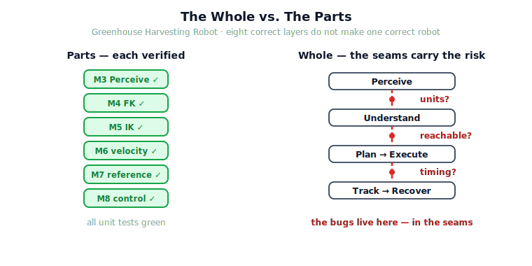

!!! abstract "You are here"
    **Module 9 — System Integration — The Complete Physical AI System**  ·  **Unit 1 — The System View**  ·  **Lesson 1.1 — Why Integration Is Hard: The Whole vs. The Parts**

# Lesson 1.1 — Why Integration Is Hard: The Whole vs. The Parts

> You have built eight layers, each verified on its own. This lesson is about the uncomfortable truth every robotics team meets: eight correct layers do not automatically make one correct robot. The failures of a complete system live in the **seams** — the handoffs, the timing, the shared assumptions — not in the parts. Module 9 is the study of those seams.

---

## 1. Why This Matters
By the end of Module 8 the greenhouse robot had everything it needs, in pieces. Module 3 can see a tomato. Module 4 knows where the gripper is. Module 5 can solve for the joint angles that reach a point. Module 6 turns a desired tool motion into joint velocities. Module 7 plans a smooth, timed trajectory. Module 8 tracks that trajectory under friction and disturbance. Each was verified — each notebook ended in *All checks passed*.

And yet none of that, by itself, picks a tomato. A robot that picks fruit is not "perception plus kinematics plus control." It is those layers **handing the right information to each other, in the right order, at the right time, and noticing when one of them is wrong**. That cooperation is not built into any single module — it is the new thing, and it is what breaks first on real hardware. This module exists because the hardest robotics bugs are not inside a layer; they are in the space *between* layers, where no one module was responsible.

## 2. Physical Intuition
Think of a relay race. You can have four sprinters who each run a flawless 100 metres, time them individually, and be delighted. Then you put them in a race and they lose — because someone dropped the baton. Nobody ran slowly. The failure was entirely in the **exchange zone**, a place none of the four "owns" when training alone.

A robot is a relay race run thousands of times a second. Perception hands a fruit location to target selection; selection hands a goal pose to the planner; the planner hands a timed reference to the controller; the controller hands commands to the motors; the motors' result is sensed and handed back. Every one of those handoffs is an exchange zone. The baton is *information*, and it can be dropped in ways a single-layer test never sees: the units disagree, the timing slips, one layer assumed the world hadn't changed while another changed it. The sprinters are fine. The race is still lost in the seams.

## 3. Mathematical Foundations
There is little new mathematics in Module 9 — by design. What changes is the *object of study*. Earlier modules studied a layer as a function:

$$\text{layer}: \text{input} \mapsto \text{output},$$

and "correct" meant the output satisfied the layer's own specification. Integration studies the **composition** of those functions:

$$\text{system} = \text{Recover} \circ \text{Track} \circ \text{Execute} \circ \text{Plan} \circ \text{Understand} \circ \text{Perceive}.$$

Component correctness is a property of each $\text{layer}_i$. System correctness is a property of the composition — and composition introduces failure modes that none of the factors has alone:

- **Interface mismatch:** $\text{layer}_i$'s output type/units/frame is not what $\text{layer}_{i+1}$ expects.
- **Contract violation:** $\text{layer}_{i+1}$ assumed a precondition (e.g. *the target is reachable*) that $\text{layer}_i$ never guaranteed.
- **Temporal coupling:** the layers are correct in isolation but wrong when run at different rates or with latency between them.
- **Shared-state drift:** two layers read or write a common world model and disagree about its current value.

None of these is a bug *in* a layer. Each is a bug in the composition. That is the formal reason "the whole" is harder than "the parts."

## 4. Visual Explanation

<figure markdown>
  { width="680" }
</figure>

## 5. Engineering Example
A real greenhouse failure: the perception layer reports a ripe tomato at $(0.69, 0.08)$ m. Target selection passes it on. The planner plans a beautiful trajectory to it. The controller tracks the trajectory perfectly — *and the gripper closes on empty air just short*, because the arm's reach is $0.7$ m measured from the base, the fruit sat at radius $0.69$ m at an awkward angle, and inverse kinematics returned a "best effort" solution at the workspace boundary rather than refusing. Every layer did exactly what it was specified to do. The system still failed, because no layer was responsible for the question *"is this target actually reachable before we commit to it?"* That question lives in a seam. Module 9 is where we put someone in charge of it.

## 6. Worked Example
Consider two layers, each provably correct:

- **Selection** guarantees: *returns the nearest detected ripe fruit.*
- **Planner** guarantees: *given a reachable goal, returns a smooth trajectory to it.*

Compose them. Is the system correct? Walk the contract:

1. Selection's postcondition is "nearest ripe fruit." It says **nothing** about reachability.
2. Planner's precondition is "given a *reachable* goal."
3. The composition is only correct if every nearest ripe fruit is reachable — which is **not guaranteed**.

The gap between selection's postcondition and the planner's precondition is the bug, and it is invisible if you test each layer alone. Fixing it is an integration act: either selection must also guarantee reachability, or a seam-check between them must reject unreachable targets. Module 9 will make exactly this kind of contract explicit at every handoff.

## 7. Interactive Demonstration

<iframe src="../../demos/module09/lesson01_integration_dashboard.html" title="Why Integration Is Hard: The Whole vs. The Parts interactive demo" style="width:100%;height:520px;border:1px solid #e2e8f0;border-radius:12px"></iframe>

[Open this demo in a new tab ↗](../demos/module09/lesson01_integration_dashboard.html)

*(Conceptual — the runnable version lives in the notebook track.)*
Picture a dashboard with eight layer lights, all green. Now add a ninth indicator: *system health*. Flip one seam assumption — say, let perception report positions in centimetres while the planner expects metres. Every layer light stays green; the system light goes red and the gripper lands a hundred-fold off. The demonstration's whole point: the system indicator can fail while every component indicator passes. That ninth light is what Module 9 builds.

## 8. Coding Exercise

!!! tip "Run the hands-on notebook"
    `modules/module09/notebooks/lesson01_why_integration_is_hard.ipynb` — open in JupyterLab and run **Kernel → Restart & Run All**.

*(Thought exercise; the notebook makes it concrete.)*
You are given two functions, `perceive(world) -> detections` and `plan(goal) -> trajectory`, each with passing unit tests. Write down — in words, not code — the **three** things you would have to check about their *composition* that neither unit test covers. (Hint: type/units of the value passed, the precondition `plan` assumes about `goal`, and what happens if `perceive` returns an empty list.) The notebook will let you trigger each of these three composition failures and watch the layers stay individually "correct" while the system breaks.

## 9. Knowledge Check

Formative — unlimited attempts, immediate feedback; does not affect your grade.

<iframe src="../../quizzes/module09/lesson01_quiz.html" title="Why Integration Is Hard: The Whole vs. The Parts knowledge check" style="width:100%;height:720px;border:1px solid #e2e8f0;border-radius:12px"></iframe>

[Open this quiz in a new tab ↗](../quizzes/module09/lesson01_quiz.html)

*(Formative — unlimited attempts, immediate feedback.)*
Confirm the core distinction between component and system correctness, the relay-race intuition, the four composition failure modes, and why Module 9 introduces no new perception/control theory.

## 10. Challenge Problem
Pick any two adjacent layers from Modules 3–8 (e.g. Module 6's `velocity_layer` and Module 8's `tracking_controller`). Write the postcondition of the first and the precondition of the second as precisely as you can. Identify one assumption the second makes that the first does not guarantee. Propose where that gap should be closed — inside a layer, or in a seam-check between them — and justify the choice in terms of *who should own that decision*.

## 11. Common Mistakes
- **Believing green unit tests imply a working system.** They imply working *parts*. System correctness is a separate property of the composition.
- **Treating integration as "just plumbing."** The plumbing is where the hard bugs are; the seams carry contracts, units, frames, and timing.
- **Letting a layer silently "best-effort" past a violated precondition** (the boundary-IK trap). A layer that fudges a broken contract hides the bug downstream.
- **Assuming Module 9 will re-teach a layer.** It will not. It teaches how the existing layers cooperate.

## 12. Key Takeaways
- Eight correct layers do not equal one correct robot; system correctness is a property of the **composition**, not the parts.
- The characteristic failures of a system live in the **seams**: interface mismatch, contract violation, temporal coupling, shared-state drift.
- Integration is its own discipline, with its own bugs and its own checks.
- Module 9 adds the seams — the data flow, the contracts, the ownership, and (later) the recovery — without rebuilding any layer.
- The recurring questions from here on: *where does information come from, who owns the decision, how do failures propagate, how does recovery occur?*

---

## AI Learning Companion
Copy any prompt into an AI assistant.

**Tutor prompt** — explain it another way
```
Re-explain Lesson 1.1 (Why Integration Is Hard) a different way, focusing on why correct parts can compose into an incorrect system.
```
**Practice prompt** — generate more exercises
```
Give me 4 exercises on spotting interface mismatch, contract violation, temporal coupling, and shared-state drift between two robot software layers, with answers.
```
**Explore prompt** — connect it to the real world
```
Show me real robotics or aerospace systems that failed in the seams between working subsystems, and what the integration fix was.
```

## Global Learning Support
Need this lesson in another language? Copy a prompt below into an AI assistant. English is the authoritative source.

**Supported languages (initial):** English · Español · 中文 (Simplified Chinese) · Türkçe

```
I just completed Lesson 1.1 — Why Integration Is Hard: The Whole vs. The Parts.
Explain this lesson in Español. Keep robotics/math terminology in English where appropriate.
Then provide: a summary, three practice questions, and one challenge problem.
```
```
I just completed Lesson 1.1 — Why Integration Is Hard: The Whole vs. The Parts.
Explain this lesson in 中文 (Simplified Chinese). Keep robotics/math terminology in English where appropriate.
Then provide: a summary, three practice questions, and one challenge problem.
```
```
I just completed Lesson 1.1 — Why Integration Is Hard: The Whole vs. The Parts.
Explain this lesson in Türkçe. Keep robotics/math terminology in English where appropriate.
Then provide: a summary, three practice questions, and one challenge problem.
```

---

*Next lesson: 1.2 — The Six-Stage Workflow (the spine every later lesson hangs on: Perceive → Understand → Plan → Execute → Track → Recover).*
