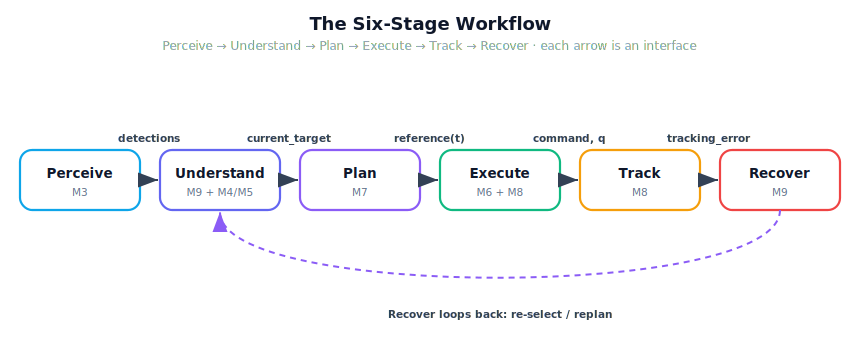

!!! abstract "You are here"
    **Module 9 — System Integration — The Complete Physical AI System**  ·  **Unit 1 — The System View**  ·  **Lesson 1.2 — The Six-Stage Workflow: Data Flow, Interfaces, and Subsystem Ownership**

# Lesson 1.2 — The Six-Stage Workflow: Data Flow, Interfaces, and Subsystem Ownership

> One picture organises this entire module: **Perceive → Understand → Plan → Execute → Track → Recover**. This lesson installs that spine and, crucially, attaches to each stage the three facts you will need at every step: who owns it, what flows in, what flows out.

---

## 1. Why This Matters
In Lesson 1.1 we learned the bugs live in the seams. To reason about seams you first need a clear map of where they are. The six-stage workflow is that map. It is not new technology — every stage is a layer you already built — but laid out as a single directed flow it becomes the object you can point at and ask the four Module 9 questions: *where does this come from? who owns it? how does failure propagate? how do we recover?*

Without the spine, "the robot picks a tomato" is a vague story. With it, the story is a precise sequence of typed handoffs, each with an owner you can hold responsible. Every remaining lesson in Module 9 is, quite literally, a closer look at one arrow or one box on this diagram.

## 2. Physical Intuition
Watch a person pick a tomato and narrate it honestly. First you *see* the fruit and roughly where it is (Perceive). Then you *decide* which one to go for — that ripe one, not the green one behind it, and you judge it's within arm's reach (Understand). You *plan* a reach: a smooth path your hand will take, not a teleport (Plan). You *move*, adjusting as your hand travels (Execute). You *watch* whether your hand is actually getting there (Track). And if you misjudge — the fruit was further than it looked, or a leaf blocks you — you *recover*: re-grip, lean in, or pick a different fruit (Recover).

Nobody teaches a person these six labels, but everyone does the six things. The robot must do them too, explicitly, with a named subsystem responsible for each. The spine just makes the implicit sequence explicit so we can engineer each handoff.

## 3. Mathematical Foundations
Write the system as a pipeline of stage functions over a shared state $s$ (the world-state blackboard, formalised next lesson):

$$s_0 \xrightarrow{\text{Perceive}} s_1 \xrightarrow{\text{Understand}} s_2 \xrightarrow{\text{Plan}} s_3 \xrightarrow{\text{Execute}} s_4 \xrightarrow{\text{Track}} s_5 \xrightarrow{\text{Recover}} s_0'.$$

Each stage is a contract — a (precondition, owner, postcondition) triple:

| Stage | Owner (module) | Input (reads) | Output (writes) | Question it answers |
|---|---|---|---|---|
| Perceive | M3 perception | camera / world | `detections` | *What can the robot see?* |
| Understand | M9 selection (+M4/M5) | `detections` | `targets`, `current_target` | *Which fruit, and is it reachable?* |
| Plan | M7 `reference_layer` | `current_target`, `q` | `reference(t)` | *When should it be where?* |
| Execute | M6 + M8 | `reference`, `q` | `command`, new `q` | *How does the joint actually move?* |
| Track | M8 telemetry | `reference`, `q` | `tracking_error`, `health` | *Is it succeeding?* |
| Recover | M9 orchestrator | `health` | revised target / stage | *What if something is wrong?* |

The arrows are the interfaces; the rows are the contracts. "Integrate the system" means: make every postcondition imply the next precondition. Recover is special — it is the only stage that can send the flow *backwards* (re-select, replan), closing the loop rather than continuing it.

## 4. Visual Explanation

<figure markdown>
  { width="680" }
</figure>

## 5. Engineering Example
Trace a single command through the greenhouse robot at one instant. Perception's camera frame yields `detections = [{id:F3, xy:(0.45,0.30), ripe:True, conf:0.9}, ...]`. Understand de-duplicates, filters to ripe-and-reachable, ranks by distance, and writes `current_target = F3`. Plan asks Module 7 for a reference trajectory from the current joint configuration to F3's pose. Execute feeds that reference, sample by sample, to Module 8's `tracking_controller`, which drives the joints; the new joint angles feed Module 6's forward kinematics so the gripper position is always known. Track compares where the gripper is to where the reference said it should be and reports the error. Recover watches that error and the reach flag — and does nothing this cycle, because all is well. Six owners, five batons, one pick.

## 6. Worked Example
Given this snippet of the spine table, fill the missing cell:

> Plan (owner: **Module 7**) reads `current_target` and `q`, and writes `_____`.

Reasoning: Plan's job is *timing* — "when to be where." Its product is a function of time the downstream controller can sample. So it writes the **reference trajectory** `reference(t)` (joint angles and their derivatives versus time). Note what it does **not** write: it does not move the robot (that's Execute) and it does not choose the fruit (that's Understand). Pinning down exactly what each stage writes — and refusing to let it write anything else — is the core discipline of this lesson.

## 7. Interactive Demonstration

<iframe src="../../demos/module09/lesson02_pipeline_dataflow_explorer.html" title="The Six-Stage Workflow: Data Flow, Interfaces, and Subsystem Ownership interactive demo" style="width:100%;height:520px;border:1px solid #e2e8f0;border-radius:12px"></iframe>

[Open this demo in a new tab ↗](../demos/module09/lesson02_pipeline_dataflow_explorer.html)

*(Conceptual — runnable in the notebook and the Installment-A flagship demo.)*
Imagine clicking each box of the spine and seeing a card pop up: stage name, owner, the exact field it reads, the exact field it writes, and the one-line question it answers. Hover an arrow and the *baton* — the data structure being passed — is shown. The flagship "Pipeline Data-Flow Explorer" for this installment is exactly this, built from the same `LAYER_REGISTRY` the notebook prints.

## 8. Coding Exercise

!!! tip "Run the hands-on notebook"
    `modules/module09/notebooks/lesson02_six_stage_workflow.ipynb` — open in JupyterLab and run **Kernel → Restart & Run All**.

*(The notebook makes this concrete using the real registry.)*
From the integration package, import `LAYER_REGISTRY` and, for each entry, print `stage → owner → reads → writes`. Then answer in a comment: which single stage is the only one whose `writes` can change which fruit gets picked on a *later* cycle? (Answer: Recover — it is the one stage that can revise `current_target` and route the flow backwards.) This teaches the spine as data, not as a slogan.

## 9. Knowledge Check

Formative — unlimited attempts, immediate feedback; does not affect your grade.

<iframe src="../../quizzes/module09/lesson02_quiz.html" title="The Six-Stage Workflow: Data Flow, Interfaces, and Subsystem Ownership knowledge check" style="width:100%;height:720px;border:1px solid #e2e8f0;border-radius:12px"></iframe>

[Open this quiz in a new tab ↗](../quizzes/module09/lesson02_quiz.html)

*(Formative — unlimited attempts, immediate feedback.)*
Check ordering of the six stages, the owner of each, the input/output of each, and the special backward-looping role of Recover.

## 10. Challenge Problem
The spine shown is for picking **one** fruit. Sketch (in words or a diagram) how the spine would wrap in an outer loop to harvest a whole **row**, and identify the one new decision that outer loop introduces that none of the six inner stages owns. Then say which stage you would extend to own it, and why — being careful not to smuggle in trajectory or control responsibilities that belong to Modules 7 and 8.

## 11. Common Mistakes
- **Collapsing Understand into Perceive.** Seeing a fruit and *deciding to pick it* are different stages with different owners.
- **Letting Plan move the robot.** Plan only produces a timed reference; Execute is what actuates.
- **Forgetting Recover loops backward.** The first five stages flow forward; Recover is the only one that can send the flow back to re-select or replan.
- **Adding theory to a stage.** Every stage here is an existing layer invoked through its interface — no new perception, planning, or control is introduced.

## 12. Key Takeaways
- The spine is **Perceive → Understand → Plan → Execute → Track → Recover**, and the whole module is a walk along it.
- Each stage carries a contract: an **owner**, an **input it reads**, and an **output it writes**.
- The arrows are the interfaces; integrating the system means making each postcondition satisfy the next precondition.
- **Recover** is special: the only stage that can route the flow backwards and close the loop.
- Learn the spine as *data* (the `LAYER_REGISTRY`), not as a slogan, and the rest of Module 9 follows.

---

## AI Learning Companion
Copy any prompt into an AI assistant.

**Tutor prompt** — explain it another way
```
Re-explain Lesson 1.2 (the six-stage workflow) a different way, emphasising owner / input / output for each stage.
```
**Practice prompt** — generate more exercises
```
Quiz me on the six-stage robot workflow: for a random stage, ask its owner, input, and output. 6 questions with answers.
```
**Explore prompt** — connect it to the real world
```
Show me how perceive-plan-act style pipelines appear in real autonomous systems and where the "recover" stage lives in each.
```

## Global Learning Support
Need this lesson in another language? Copy a prompt below into an AI assistant. English is the authoritative source.

**Supported languages (initial):** English · Español · 中文 (Simplified Chinese) · Türkçe

```
I just completed Lesson 1.2 — The Six-Stage Workflow.
Explain this lesson in Español. Keep robotics/math terminology in English where appropriate.
Then provide: a summary, three practice questions, and one challenge problem.
```
```
I just completed Lesson 1.2 — The Six-Stage Workflow.
Explain this lesson in 中文 (Simplified Chinese). Keep robotics/math terminology in English where appropriate.
Then provide: a summary, three practice questions, and one challenge problem.
```
```
I just completed Lesson 1.2 — The Six-Stage Workflow.
Explain this lesson in Türkçe. Keep robotics/math terminology in English where appropriate.
Then provide: a summary, three practice questions, and one challenge problem.
```

---

*Next lesson: 1.3 — System Walkthrough: Tracing One Tomato Through All Six Stages (we run the spine end to end on the real layers).*
