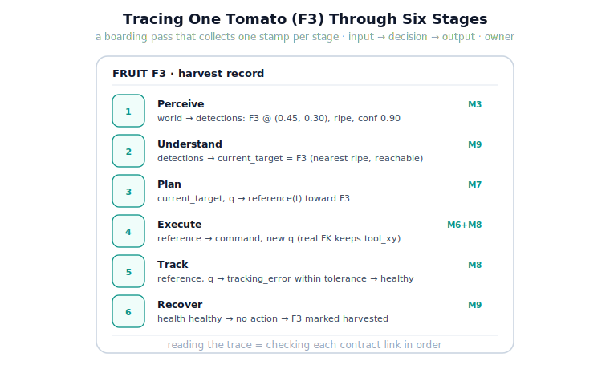

!!! abstract "You are here"
    **Module 9 — System Integration — The Complete Physical AI System**  ·  **Unit 1 — The System View**  ·  **Lesson 1.3 — System Walkthrough: Tracing One Tomato Through All Six Stages**

# Lesson 1.3 — System Walkthrough: Tracing One Tomato Through All Six Stages

> Abstractions earn trust when you watch them run. In this walkthrough we pick one tomato — call it **F3** — and follow it the whole way down the spine, pausing at each stage to read the shared blackboard and ask: what came in, what was decided, what went out, who owned it.

---

## 1. Why This Matters
Lesson 1.2 gave the spine as a table. A table is easy to nod at and hard to truly believe. This lesson converts the table into a trace: an actual run of the greenhouse system on the real layers you built, narrated stage by stage. By the end you will have seen the `detections` list become a `current_target`, become a `reference`, become joint `command`s, become a `tracking_error`, and finally a `harvested` entry — each transition owned by a named subsystem. Seeing the baton change hands, with values attached, is what makes the rest of Module 9 feel like engineering rather than vocabulary.

## 2. Physical Intuition
This is a guided museum tour of one decision. We stand at each stage's "exhibit," look at what is written on the blackboard at that moment, and move on. Because we follow exactly one fruit, the story stays simple: no fleets, no rows, just F3 and the six questions asked about it in order. The tour's value is rhythm — *input, decision, output, owner* — repeated six times until it is automatic.

## 3. Mathematical Foundations
We instrument the pipeline by snapshotting the blackboard state $s$ after each stage:

$$s_1 = \text{Perceive}(s_0),\quad s_2 = \text{Understand}(s_1),\quad \dots,\quad s_6 = \text{Recover}(s_5).$$

A **trace** is the sequence $(s_1, s_2, \dots, s_6)$ together with, at each step, the field that changed and its owner. Formally a correct trace satisfies, at every step $i$, the contract from Lesson 1.2: stage $i$'s precondition held on $s_{i-1}$ and its postcondition holds on $s_i$. Reading a trace is therefore not just watching values scroll by — it is *checking the contract chain*, one link at a time. That is exactly what the lesson's notebook asserts.

## 4. Visual Explanation

<figure markdown>
  { width="680" }
</figure>

## 5. Engineering Example
Here is the trace the notebook produces (values rounded), the spine made literal:

1. **Perceive** (M3) — reads the world, writes `detections`: F3 appears at `xy ≈ (0.45, 0.30)`, ripe, confidence `0.90`, alongside its neighbours.
2. **Understand** (M9) — reads `detections`, de-duplicates, keeps ripe-and-reachable, ranks by distance, writes `current_target = F3` (because it is the nearest ripe reachable fruit) and the full ranked `targets`.
3. **Plan** (M7) — reads `current_target`, `q`; writes a `reference(t)` from the current configuration toward F3's pose. *(Wired with the real reference layer in Unit 3; here we record the handoff.)*
4. **Execute** (M6+M8) — reads `reference`, drives joints, writes new `q` and `command`. Real forward kinematics keeps `tool_xy` current.
5. **Track** (M8) — reads `reference` and `q`, writes `tracking_error` and a `health` entry: error within tolerance ⇒ healthy.
6. **Recover** (M9) — reads `health`; all healthy ⇒ no action, marks F3 `harvested`.

## 6. Worked Example
Suppose at stage 2 the trace showed `current_target = None`. Diagnose it *from the trace alone*, without looking inside any layer. Reasoning: `current_target` is written by Understand, whose rule is "nearest ripe **reachable** detection." `None` means the filtered set was empty. Either (a) `detections` was empty (a Perceive problem upstream), or (b) detections existed but none were both ripe and reachable (a legitimate Understand outcome — nothing to pick). You distinguish them by reading the previous stamp, `s_1.detections`. This is the skill the walkthrough builds: localising a fault to a stage by reading the blackboard, before ever opening a layer.

## 7. Interactive Demonstration
*(Conceptual — runnable in the notebook.)*
Picture a "step" button that advances the trace one stage at a time, printing the blackboard diff: which field changed, from what to what, owned by whom. Stepping F3 through six clicks, you watch the boarding pass collect its six stamps. The notebook implements exactly this stepwise trace and asserts the contract chain holds at every step.

## 8. Coding Exercise

!!! tip "Run the hands-on notebook"
    `modules/module09/notebooks/lesson03_tracing_one_tomato.ipynb` — open in JupyterLab and run **Kernel → Restart & Run All**.

*(The notebook runs the real trace.)*
Using the integration package, build a `GreenhouseWorld`, run `model_perception` to fill `detections`, run `understand` to produce `current_target`, and print a one-line stamp per stage: `stage | reads → writes | owner`. Then assert that `current_target` is one of the detected ids and is reachable. The exercise teaches you to *emit and read a trace*, the diagnostic backbone of every later failure-analysis lesson.

## 9. Knowledge Check

Formative — unlimited attempts, immediate feedback; does not affect your grade.

<iframe src="../../quizzes/module09/lesson03_quiz.html" title="System Walkthrough: Tracing One Tomato Through All Six Stages knowledge check" style="width:100%;height:720px;border:1px solid #e2e8f0;border-radius:12px"></iframe>

[Open this quiz in a new tab ↗](../quizzes/module09/lesson03_quiz.html)

*(Formative — unlimited attempts, immediate feedback.)*
Confirm the order of blackboard writes, which stage produces `current_target`, how to localise a `None` target to a stage, and what "reading a trace" checks.

## 10. Challenge Problem
Extend the trace to a *second* tomato picked immediately after F3. Identify what must be true on the blackboard between the two picks for the second trace to start cleanly (hint: F3 must be marked picked/harvested so Understand does not re-select it, and the arm's `q` carries over as the new start). Describe the one piece of state that, if not reset correctly between picks, would silently corrupt the second trace — and which stage owns resetting it.

## 11. Common Mistakes
- **Reading values without checking contracts.** A trace is for verifying postcondition⇒precondition links, not just sightseeing.
- **Blaming the wrong stage.** `current_target = None` is not necessarily an Understand bug; read the upstream stamp first.
- **Forgetting carried state between picks.** `q` and the harvested set persist; mishandling them corrupts the next trace.
- **Expecting new math.** The walkthrough only *invokes* existing layers; nothing is re-derived.

## 12. Key Takeaways
- A **trace** is the spine made literal: the sequence of blackboard states with the changed field and its owner at each step.
- Following one tomato (F3) through six stamps fixes the *input → decision → output → owner* rhythm.
- Reading a trace = checking the contract chain link by link; it localises faults to a stage *before* opening any layer.
- Carried state between picks (`q`, the harvested set) is part of correctness; some stage must own resetting it.
- This diagnostic habit underpins every failure-analysis and recovery lesson to come.

---

## AI Learning Companion
Copy any prompt into an AI assistant.

**Tutor prompt** — explain it another way
```
Re-explain Lesson 1.3 by walking one data item through a six-stage pipeline, naming the owner and the value written at each stage.
```
**Practice prompt** — generate more exercises
```
Give me 4 "read the trace, localise the fault to a stage" exercises for a perceive→understand→plan→execute→track→recover robot pipeline, with answers.
```
**Explore prompt** — connect it to the real world
```
Show me how engineers use execution traces / logs to localise faults in real robotic or distributed systems.
```

## Global Learning Support
Need this lesson in another language? Copy a prompt below into an AI assistant. English is the authoritative source.

**Supported languages (initial):** English · Español · 中文 (Simplified Chinese) · Türkçe

```
I just completed Lesson 1.3 — System Walkthrough: Tracing One Tomato.
Explain this lesson in Español. Keep robotics/math terminology in English where appropriate.
Then provide: a summary, three practice questions, and one challenge problem.
```
```
I just completed Lesson 1.3 — System Walkthrough: Tracing One Tomato.
Explain this lesson in 中文 (Simplified Chinese). Keep robotics/math terminology in English where appropriate.
Then provide: a summary, three practice questions, and one challenge problem.
```
```
I just completed Lesson 1.3 — System Walkthrough: Tracing One Tomato.
Explain this lesson in Türkçe. Keep robotics/math terminology in English where appropriate.
Then provide: a summary, three practice questions, and one challenge problem.
```

---

*Next lesson: 1.4 — Unit 1 Recap (consolidate the integration mindset, the spine, and the trace before we open the first seam in Unit 2).*
