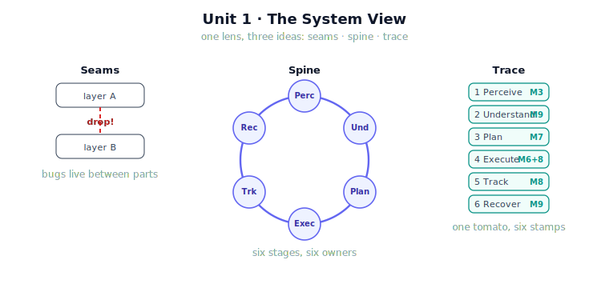

!!! abstract "You are here"
    **Module 9 — System Integration — The Complete Physical AI System**  ·  **Unit 1 — The System View**  ·  **Lesson 1.4 — Unit 1 Recap: The System View**

# Lesson 1.4 — Unit 1 Recap: The System View

> Unit 1 gave you the lens for all of Module 9. Before we open the first seam (Perceive → Understand) in Unit 2, this recap consolidates the three ideas — the seams, the spine, the trace — into one mental model and one runnable check.

---

## 1. Why This Matters
Everything that follows in Module 9 assumes the Unit 1 lens. If "the bugs live in the seams," the six-stage spine, and "read the trace to localise a fault" are second nature, then Units 2–8 are just disciplined walks along the spine, opening one seam at a time. This recap makes sure that lens is firmly in place — and gives you a single consolidated trace to run that exercises the whole idea in miniature.

## 2. Physical Intuition
Three images, one lens. The **relay race** (seams: the baton drops in the exchange zone, not in anyone's sprint). The **spine** (Perceive → Understand → Plan → Execute → Track → Recover: the six things a picker does, made explicit). The **boarding pass** (the trace: one tomato collecting six stamps, input→decision→output→owner). Hold all three at once and you are thinking like a systems integrator.

## 3. Mathematical Foundations
Unit 1 in three lines:

- **Composition is the object:** $\text{system} = \text{Recover} \circ \dots \circ \text{Perceive}$, and system correctness ≠ the conjunction of component correctnesses.
- **The spine is a contract chain:** each stage is a (precondition, owner, postcondition) triple; integration makes each postcondition imply the next precondition.
- **A trace verifies the chain:** snapshots $(s_1, \dots, s_6)$ with the changed field and owner at each step; a correct trace is one where every link's contract holds.

No new theory — just a precise way to talk about the parts cooperating.

## 4. Visual Explanation

<figure markdown>
  { width="680" }
</figure>

## 5. Engineering Example
The greenhouse robot, summarised as one sentence per stage, is the working example you should be able to recite: *Perceive* sees the fruit (M3 → `detections`); *Understand* decides which to pick and whether it's reachable (M9 → `current_target`); *Plan* times the reach (M7 → `reference`); *Execute* moves the joints (M6+M8 → `command`, `q`); *Track* checks success (M8 → `tracking_error`); *Recover* reacts to trouble (M9 → revised target/stage). If you can say that without the notes, Unit 1 has done its job.

## 6. Worked Example
Quick self-test, answered. *Question:* a teammate says "all eight layer test suites pass, so the robot is done." What is the one-sentence integration rebuttal? *Answer:* passing per-layer tests proves the **parts** are correct, but system correctness is a separate property of the **composition** — the seams (interfaces, contracts, timing, shared state) are untested by per-layer suites, and that is precisely where systems fail. Being able to give that rebuttal crisply is the Unit 1 outcome.

## 7. Interactive Demonstration
*(Conceptual — runnable in the notebook.)*
The recap demonstration is a single consolidated run: build the world, run Perceive and Understand for real, print the spine with owners, and emit a two-stamp trace (Perceive → Understand) asserting the contract chain holds. It is Unit 1 compressed into one cell you can execute and trust.

## 8. Coding Exercise

!!! tip "Run the hands-on notebook"
    `modules/module09/notebooks/lesson04_unit1_recap.ipynb` — open in JupyterLab and run **Kernel → Restart & Run All**.

*(The recap notebook runs the consolidated check.)*
In one short notebook: (1) print `LAYER_REGISTRY` as `stage → owner → reads → writes`; (2) run `model_perception` then `understand` on a seeded world; (3) assert the spine has exactly six stages in the canonical order and that the produced `current_target` is reachable. Passing this single cell is your evidence that the Unit 1 lens is installed and the foundation works end to end.

## 9. Knowledge Check

Formative — unlimited attempts, immediate feedback; does not affect your grade.

<iframe src="../../quizzes/module09/lesson04_quiz.html" title="Unit 1 Recap: The System View knowledge check" style="width:100%;height:720px;border:1px solid #e2e8f0;border-radius:12px"></iframe>

[Open this quiz in a new tab ↗](../quizzes/module09/lesson04_quiz.html)

*(Formative — unlimited attempts, immediate feedback.)*
Mixed review across Unit 1: the seams idea, the six stages and their owners/I-O, reading a trace to localise a fault, and the scope fence (Module 9 adds seams, not layers).

## 10. Challenge Problem
Without running code, predict what the consolidated trace prints if you seed the world so that **every** detected fruit is unripe. State the value of `current_target`, which stage owns that outcome, and whether this is a *failure* or a *correct* result — then justify your answer using the contract for the Understand stage. (This previews Unit 2, where target selection becomes the focus.)

## 11. Common Mistakes
- **Treating the recap as optional.** The Unit 1 lens is load-bearing for the whole module; gaps here compound later.
- **Reciting the spine but not the owners.** The owner of each stage is the part you will reason about under failure — memorise it.
- **Confusing "no target" with "a bug."** An empty pickable set can be the correct output of Understand.
- **Drifting into layer internals.** Unit 1 is about the system view; resist re-explaining perception or control here.

## 12. Key Takeaways
- **Seams, spine, trace** — the three Unit 1 ideas — form one lens for all of Module 9.
- System correctness is a property of the **composition**, distinct from component correctness.
- The spine is a **contract chain**; a **trace** verifies it link by link and localises faults to a stage.
- Module 9 adds seams, not layers — keep the scope fence in mind.
- With the lens installed, Unit 2 opens the first seam: **Perceive → Understand**.

---

## AI Learning Companion
Copy any prompt into an AI assistant.

**Tutor prompt** — explain it another way
```
Quiz me on Unit 1 of a robotics systems-integration course: the seams idea, the six-stage spine with owners, and reading a trace. Then re-explain whichever I get wrong.
```
**Practice prompt** — generate more exercises
```
Give me 5 mixed-review questions covering component-vs-system correctness, a six-stage robot pipeline, and trace-based fault localisation, with answers.
```
**Explore prompt** — connect it to the real world
```
Show me how the "perceive-understand-plan-execute-track-recover" view maps onto a real autonomous robot or self-driving stack.
```

## Global Learning Support
Need this lesson in another language? Copy a prompt below into an AI assistant. English is the authoritative source.

**Supported languages (initial):** English · Español · 中文 (Simplified Chinese) · Türkçe

```
I just completed Lesson 1.4 — Unit 1 Recap: The System View.
Explain this lesson in Español. Keep robotics/math terminology in English where appropriate.
Then provide: a summary, three practice questions, and one challenge problem.
```
```
I just completed Lesson 1.4 — Unit 1 Recap: The System View.
Explain this lesson in 中文 (Simplified Chinese). Keep robotics/math terminology in English where appropriate.
Then provide: a summary, three practice questions, and one challenge problem.
```
```
I just completed Lesson 1.4 — Unit 1 Recap: The System View.
Explain this lesson in Türkçe. Keep robotics/math terminology in English where appropriate.
Then provide: a summary, three practice questions, and one challenge problem.
```

---

*Next lesson: 2.1 — From Perception Output to World State (Unit 2 opens the first seam: Perceive → Understand).*
