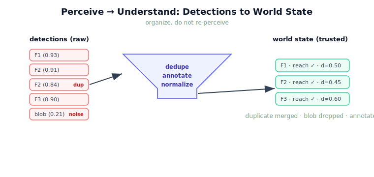

!!! abstract "You are here"
    **Module 9 — System Integration — The Complete Physical AI System**  ·  **Unit 2 — Perceive → Understand**  ·  **Lesson 2.1 — From Perception Output to World State**

# Lesson 2.1 — From Perception Output to World State

> Unit 1 gave us the lens; now we open the first seam. Perception produces **detections** — raw, noisy, camera-centric observations. The Understand stage's first duty is to turn those into a **world state**: a clean, de-duplicated, world-frame picture the rest of the pipeline can trust. This lesson is about that conversion and who owns it.

---

## 1. Why This Matters
Every later stage — selection, planning, execution — assumes it is working from a faithful picture of the world. But perception never delivers that picture directly. It delivers detections: a list like `{id, xy, ripe, confidence}`, each entry carrying measurement noise, each a snapshot that might double-report one fruit or miss another. If the system treats raw detections *as* the world, every downstream decision inherits perception's rough edges. The Perceive → Understand seam exists precisely to absorb those rough edges once, in one place, so nobody downstream has to. Get this seam right and the rest of the pipeline rests on solid ground; get it wrong and the errors propagate everywhere.

## 2. Physical Intuition
A produce inspector glances at a crate and *sees* tomatoes — but seeing is not yet a work order. Before acting, the inspector mentally tidies the view: "those two glimpses are the same tomato from different angles; that blurry one near the edge is probably ripe; that shadow is not a fruit at all." Only after this tidying does a clean inventory exist to act on. The robot's Understand stage does the same tidying in software: it takes perception's raw glimpses and produces the clean inventory — the world state — that planning will draw from. The camera *sees*; the world state is what the system *believes*, after tidying.

## 3. Mathematical Foundations
Let perception emit a detection set

$$D = \{\, d_k = (\text{id}_k,\ \mathbf{x}_k,\ r_k,\ c_k) \,\}_{k=1}^{m},$$

where $\mathbf{x}_k$ is a position (with noise $\mathbf{x}_k = \mathbf{x}_k^\star + \boldsymbol{\varepsilon}_k$), $r_k$ a ripeness flag, $c_k \in [0,1]$ a confidence. The world-state conversion is a map

$$W : D \mapsto \{\, w_j \,\},$$

that (i) **de-duplicates** — merges detections within a tolerance $\tau$ of each other, keeping the higher-confidence report; (ii) **annotates** — attaches derived facts the raw detection lacks, such as reachability and distance-from-tool; and (iii) **normalizes frame** — ensures positions are expressed in the world frame the rest of the system uses. The output $\{w_j\}$ is the blackboard's `targets`/world view. Crucially, $W$ adds no perception: it does not detect new fruit or re-estimate positions. It *organizes* what perception already reported. That boundary — organize, do not re-perceive — is the contract of this seam.

## 4. Visual Explanation

<figure markdown>
  { width="680" }
</figure>

## 5. Engineering Example
Perception reports five detections for a three-fruit cluster: F1 once, F2 *twice* (the camera caught it from two frames before the tracker merged them), and F3 once, plus a low-confidence blob at the canopy edge. Fed raw into selection, the duplicate F2 could be picked, approached, and then "picked again" — wasted motion, or worse, a collision with the already-harvested stem. The world-state conversion collapses the F2 pair (they are within $\tau$), keeps the higher-confidence copy, annotates each survivor with reachability and distance, and drops nothing real. Selection now sees three clean targets. The duplicate never reaches a decision because the seam absorbed it.

## 6. Worked Example
Given detections (positions in metres, confidence in parentheses):
`F2@(0.40,0.20) (0.91)`, `F2@(0.43,0.19) (0.84)`, `F1@(0.24,0.32) (0.93)`, with dedupe tolerance $\tau = 0.08$ m.

Step through $W$:
1. **Dedupe:** the two F2 reports are $\lVert(0.40,0.20)-(0.43,0.19)\rVert = \sqrt{0.03^2 + 0.01^2} \approx 0.032$ m apart, which is $< \tau$ → merge, keep the $0.91$-confidence copy. F1 is far from both → keep.
2. **Annotate:** for each survivor compute reachability (inside the reach annulus?) and distance from the current tool position.
3. **Normalize:** positions already in world frame → unchanged.

Result: two clean world-state entries, F2 (0.91) and F1 (0.93), each annotated. The duplicate is gone, no real fruit lost — exactly the seam's job.

## 7. Interactive Demonstration
*(Conceptual — runnable in the notebook; the installment's flagship Data-Flow Explorer also visualises this seam.)*
Imagine a slider for dedupe tolerance $\tau$ and a noise dial. Turn noise up and watch detection positions jitter; raise $\tau$ and watch near-duplicates merge into single world-state entries — but push $\tau$ too high and *distinct* fruit start collapsing into one. The demonstration's lesson: the conversion has a tuning knob, and the seam owner must choose it deliberately.

## 8. Coding Exercise

!!! tip "Run the hands-on notebook"
    `modules/module09/notebooks/lesson05_perception_to_world_state.ipynb` — open in JupyterLab and run **Kernel → Restart & Run All**.

*(The notebook makes this concrete with the real `model_perception` and `dedupe`/`understand`.)*
Generate detections with `model_perception(world, noise=…, duplicate=['F2'])`, then build the world state with `understand(...)`. Print the count before and after, and assert the duplicate was collapsed while every *real* fruit survived. The exercise teaches you to verify the seam's two guarantees at once: *no duplicate passes, no real target is lost*.

## 9. Knowledge Check

Formative — unlimited attempts, immediate feedback; does not affect your grade.

<iframe src="../../quizzes/module09/lesson05_quiz.html" title="From Perception Output to World State knowledge check" style="width:100%;height:720px;border:1px solid #e2e8f0;border-radius:12px"></iframe>

[Open this quiz in a new tab ↗](../quizzes/module09/lesson05_quiz.html)

*(Formative — unlimited attempts, immediate feedback.)*
Confirm the detection-vs-world-state distinction, the three jobs of the conversion (dedupe, annotate, normalize), the "organize, do not re-perceive" boundary, and who owns the seam.

## 10. Challenge Problem
The dedupe tolerance $\tau$ trades two errors against each other: too small and a single jittery fruit is double-counted; too large and two close fruit merge into one. Describe how you would *choose* $\tau$ for the greenhouse — what physical quantity it should relate to (hint: typical fruit spacing vs. perception noise) — and propose a check the world-state stage could run to warn when $\tau$ is mis-set. Keep the proposal within the seam's remit: it may organize and flag, but it may not invent new detections.

## 11. Common Mistakes
- **Treating raw detections as the world.** Detections are observations; the world state is the tidied belief the system acts on.
- **Re-perceiving in the seam.** The conversion organizes existing detections; estimating new positions or detecting new fruit belongs to perception (Module 3).
- **Ignoring duplicates.** An unmerged duplicate becomes a wasted pick or a collision downstream.
- **Setting dedupe tolerance blindly.** $\tau$ is a real engineering choice tied to fruit spacing and perception noise.

## 12. Key Takeaways
- Perception outputs **raw detections**; the Understand stage's first job is to convert them into a **trusted world state**.
- The conversion has three duties: **de-duplicate, annotate, normalize frame** — and one prohibition: **do not re-perceive**.
- Absorbing perception's rough edges once, at this seam, keeps every downstream stage on solid ground.
- The dedupe tolerance $\tau$ is a deliberate engineering choice, not a magic constant.
- Owning detection-to-world-state conversion is an **integration** responsibility, distinct from perception itself.

---

## AI Learning Companion
Copy any prompt into an AI assistant.

**Tutor prompt** — explain it another way
```
Re-explain Lesson 2.1 by contrasting a raw perception detection with a cleaned-up world-state entry, and the steps between them.
```
**Practice prompt** — generate more exercises
```
Give me 4 exercises on de-duplicating and annotating noisy object detections into a clean world state, with answers.
```
**Explore prompt** — connect it to the real world
```
Show me how real robot perception stacks turn raw detections into a maintained world model or scene graph, and what the cleanup step owns.
```

## Global Learning Support
Need this lesson in another language? Copy a prompt below into an AI assistant. English is the authoritative source.

**Supported languages (initial):** English · Español · 中文 (Simplified Chinese) · Türkçe

```
I just completed Lesson 2.1 — From Perception Output to World State.
Explain this lesson in Español. Keep robotics/math terminology in English where appropriate.
Then provide: a summary, three practice questions, and one challenge problem.
```
```
I just completed Lesson 2.1 — From Perception Output to World State.
Explain this lesson in 中文 (Simplified Chinese). Keep robotics/math terminology in English where appropriate.
Then provide: a summary, three practice questions, and one challenge problem.
```
```
I just completed Lesson 2.1 — From Perception Output to World State.
Explain this lesson in Türkçe. Keep robotics/math terminology in English where appropriate.
Then provide: a summary, three practice questions, and one challenge problem.
```

---

*Next lesson: 2.2 — Target Selection: Which Fruit, Which Pose? (from a clean world state to a single committed target).*
