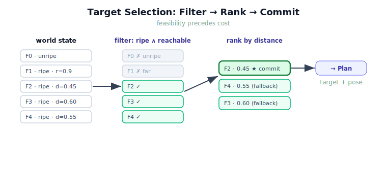

!!! abstract "You are here"
    **Module 9 — System Integration — The Complete Physical AI System**  ·  **Unit 2 — Perceive → Understand**  ·  **Lesson 2.2 — Target Selection: Which Fruit, Which Pose?**

# Lesson 2.2 — Target Selection: Which Fruit, Which Pose?

> The world state is clean, but it may list five ripe tomatoes. The robot has one gripper. *Which one, and how shall it grasp it?* This lesson is about the decision that converts a set of options into a single committed target — the beating heart of the Understand stage.

---

## 1. Why This Matters
Planning, IK, and control all act on **one** target at a time. None of them chooses it. If selection is vague or absent, the system either stalls (no target) or thrashes (changing its mind every cycle). Worse, if selection is buried inside perception ("just return the most confident detection") or inside IK ("solve for whatever's closest"), then the *policy* of the robot — what it prioritises, what it refuses — is scattered and unaccountable. Putting selection in one named place, with an explicit rule, is what makes the robot's behaviour legible and tunable. This lesson installs that rule.

## 2. Physical Intuition
A skilled picker does not grab the first fruit they see. They make a quick, consistent decision: *is it ripe? can I reach it without contorting? of the ones that qualify, which is easiest to get to right now?* — and they commit, reaching for that one rather than dithering between three. The decision is fast but it is a real decision, with priorities behind it (ripe first, reachable second, nearest among those). The robot needs the same: a rule it applies the same way every cycle, so its behaviour is predictable and improvable. Selection is that rule made explicit.

## 3. Mathematical Foundations
Given annotated world-state entries $\{w_j\}$ (each with ripeness $r_j$, reachability $\rho_j$, and a cost $g_j$), target selection is a **filter-then-rank** policy:

$$\text{feasible} = \{\, w_j : r_j = \text{ripe} \ \wedge\ \rho_j = \text{reachable} \,\}, \qquad
w^\star = \arg\min_{w_j \in \text{feasible}} g_j .$$

Here the cost is distance from the current tool position, $g_j = \lVert \mathbf{x}_j - \mathbf{x}_{\text{tool}} \rVert$, so the robot prefers the nearest qualifying fruit (less travel, faster cycle). If $\text{feasible} = \varnothing$, then $w^\star = \text{None}$ — a *legitimate* output meaning "nothing to pick now," not an error. The chosen $w^\star$ carries a **target pose**: at minimum the grasp position $\mathbf{x}_j$, plus (in fuller systems) an approach orientation. That pose is the baton handed to Plan. Note what selection does **not** compute: the joint angles to reach the pose (that is IK, Module 5) or the timed path to it (that is Plan, Module 7). Selection decides *which* and *what pose*; it stops there.

## 4. Visual Explanation

<figure markdown>
  { width="680" }
</figure>

## 5. Engineering Example
The world state lists F0 (unripe), F1 (ripe, but at radius 0.9 m — unreachable), F2 (ripe, reachable, 0.45 m away), F3 (ripe, reachable, 0.60 m away), F4 (ripe, reachable, 0.55 m away). Selection filters out F0 (unripe) and F1 (unreachable), leaving {F2, F3, F4}; ranks by distance; commits to **F2** (nearest). It hands F2's pose to Plan and records the full ranked list so Recover can fall back to F4 then F3 if F2 fails. One rule produced a committed target *and* a contingency order — both owned here, in selection.

## 6. Worked Example
Apply the policy by hand to: F1 (ripe, reachable, dist 1.4), F2 (unripe, reachable, dist 0.5), F3 (ripe, reachable, dist 0.9).

1. **Filter** (ripe ∧ reachable): F2 drops (unripe). Feasible = {F1, F3}.
2. **Rank** by distance: F3 (0.9) before F1 (1.4).
3. **Commit:** $w^\star = $ F3; ranked fallback list = [F3, F1].

Note F2 was *nearest* (0.5) but unripe, so it is not chosen — the filter dominates the rank. Getting that precedence right (feasibility before cost) is the crux of the policy.

## 7. Interactive Demonstration

<iframe src="../../demos/module09/lesson06_target_selection.html" title="Target Selection: Which Fruit, Which Pose? interactive demo" style="width:100%;height:520px;border:1px solid #e2e8f0;border-radius:12px"></iframe>

[Open this demo in a new tab ↗](../demos/module09/lesson06_target_selection.html)

*(Conceptual — runnable in the notebook.)*
Picture toggling each fruit's ripeness and dragging it in and out of the reach annulus, and watching the committed target update live: grey out the current pick and the next-ranked fruit lights up; make everything unripe and the target becomes `None`. The demonstration makes visceral that selection is a *function* of the world state — deterministic, inspectable, and the single place the robot's priorities live.

## 8. Coding Exercise

!!! tip "Run the hands-on notebook"
    `modules/module09/notebooks/lesson06_target_selection.ipynb` — open in JupyterLab and run **Kernel → Restart & Run All**.

*(The notebook runs the real `understand()` selection.)*
Build a world with a mix of ripe/unripe and reachable/unreachable fruit, run `understand(...)`, and assert: (a) the committed `current_target` is ripe and reachable, (b) it is the nearest such fruit, and (c) an all-unripe world yields `current_target is None`. This verifies the filter-then-rank policy and its graceful empty case in one go.

## 9. Knowledge Check

Formative — unlimited attempts, immediate feedback; does not affect your grade.

<iframe src="../../quizzes/module09/lesson06_quiz.html" title="Target Selection: Which Fruit, Which Pose? knowledge check" style="width:100%;height:720px;border:1px solid #e2e8f0;border-radius:12px"></iframe>

[Open this quiz in a new tab ↗](../quizzes/module09/lesson06_quiz.html)

*(Formative — unlimited attempts, immediate feedback.)*
Check the filter-then-rank order, why feasibility precedes cost, what a target pose hands forward, the meaning of a `None` target, and the ownership boundary (selection ≠ perception ≠ IK ≠ planning).

## 10. Challenge Problem
The lesson ranks by distance, but distance is only one possible cost. Propose a richer selection cost for the greenhouse that trades off at least two factors (e.g. distance vs. ripeness margin, or distance vs. manipulability of the grasp pose), write it as a single scalar $g_j$, and state one behaviour your cost produces that pure-distance ranking does not. Keep the proposal inside selection's remit — it may weigh annotated facts, but it may not solve IK or plan a path to evaluate the cost.

## 11. Common Mistakes
- **Ranking before filtering.** A nearer but unripe or unreachable fruit must be excluded first; feasibility dominates cost.
- **Treating `None` as a crash.** An empty feasible set is a correct selection output meaning "nothing to pick."
- **Letting IK or perception choose the fruit.** The policy belongs in one place — selection — or the robot's priorities become scattered and unaccountable.
- **Forgetting the fallback order.** Recording the ranked list (not just the winner) is what lets Recover try the next-best fruit later.

## 12. Key Takeaways
- Selection converts a set of options into **one committed target**, via **filter (ripe ∧ reachable) → rank (cost) → commit**.
- **Feasibility precedes cost:** an unripe or unreachable fruit is excluded regardless of how near it is.
- The committed target carries a **pose**, the baton handed to Plan; selection does *not* solve IK or plan the path.
- A `None` target is a legitimate output, not an error.
- Selection is the single, named home of the robot's pick **policy** — keep it there to keep behaviour legible.

---

## AI Learning Companion
Copy any prompt into an AI assistant.

**Tutor prompt** — explain it another way
```
Re-explain Lesson 2.2 as a filter-then-rank decision policy, emphasising why feasibility is checked before the distance cost.
```
**Practice prompt** — generate more exercises
```
Give me 4 target-selection exercises: given a list of fruit with ripeness, reachability, and distance, pick the committed target and the fallback order. With answers.
```
**Explore prompt** — connect it to the real world
```
Show me how real robots choose among multiple candidate targets (grasps, goals, waypoints) and where that selection policy lives in the stack.
```

## Global Learning Support
Need this lesson in another language? Copy a prompt below into an AI assistant. English is the authoritative source.

**Supported languages (initial):** English · Español · 中文 (Simplified Chinese) · Türkçe

```
I just completed Lesson 2.2 — Target Selection: Which Fruit, Which Pose?
Explain this lesson in Español. Keep robotics/math terminology in English where appropriate.
Then provide: a summary, three practice questions, and one challenge problem.
```
```
I just completed Lesson 2.2 — Target Selection: Which Fruit, Which Pose?
Explain this lesson in 中文 (Simplified Chinese). Keep robotics/math terminology in English where appropriate.
Then provide: a summary, three practice questions, and one challenge problem.
```
```
I just completed Lesson 2.2 — Target Selection: Which Fruit, Which Pose?
Explain this lesson in Türkçe. Keep robotics/math terminology in English where appropriate.
Then provide: a summary, three practice questions, and one challenge problem.
```

---

*Next lesson: 2.3 — Case Study: When Perception Lies (occlusion, clutter, and duplicate detections — and how the Understand stage defends against them).*
