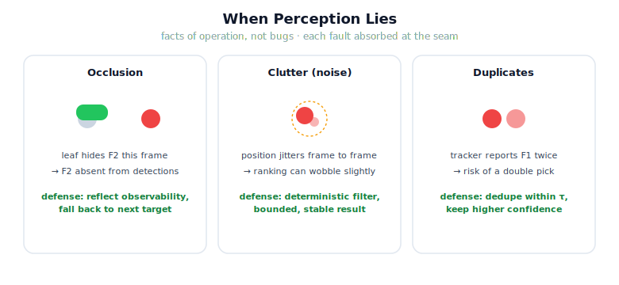

!!! abstract "You are here"
    **Module 9 — System Integration — The Complete Physical AI System**  ·  **Unit 2 — Perceive → Understand**  ·  **Lesson 2.3 — Case Study: When Perception Lies**

# Lesson 2.3 — Case Study: When Perception Lies

> Units so far assumed perception told the truth. It does not — not because it is broken, but because cameras get blocked, measurements are noisy, and trackers stutter. This case study deliberately makes perception lie in three realistic ways and watches the Understand stage hold the line.

---

## 1. Why This Matters
The Perceive → Understand seam earns its keep precisely when perception is imperfect. If detections were always clean, the seam would be a pass-through. The whole reason we *own* the conversion is to stay correct when the input is not. This lesson confronts the three faults that actually occur in a greenhouse — occlusion, clutter, duplicates — and shows that each one's damage is contained at the seam rather than propagating into a bad pick. Seeing the faults run, and the defenses work, is what converts "the seam absorbs perception's rough edges" from a slogan into something you trust.

## 2. Physical Intuition
Three everyday lies. **Occlusion:** a leaf swings in front of a ripe tomato, so for this frame the camera simply does not see it — the fruit is real but absent from the report. **Clutter / noise:** under flickering greenhouse light, a fruit's reported position jitters a few centimetres frame to frame. **Duplicates:** the tracker briefly loses and re-acquires a fruit, reporting it as two. A careful human shrugs these off — looks again next moment, doesn't lunge at a 2 cm wobble, recognises the "two" as one. The Understand stage must shrug them off too, deterministically.

## 3. Mathematical Foundations
Each fault is a perturbation of the detection set $D$ from Lesson 2.1:

- **Occlusion:** a fruit id is *removed* from $D$ this frame. Effect: it cannot be selected now; if it was the committed target, selection must fall back. The defense is *not pretending it's there* — the world state reflects what is currently observable, and Recover (Unit 7) handles persistence across frames.
- **Clutter (noise):** $\mathbf{x}_k = \mathbf{x}_k^\star + \boldsymbol{\varepsilon}_k$ with $\lVert\boldsymbol{\varepsilon}_k\rVert$ small. Effect: ranking by distance can wobble if two fruit are nearly equidistant. The defense is that selection is a *deterministic function of the current world state*, and small noise yields small, bounded changes — it does not produce a wrong *feasibility* verdict unless a fruit sits exactly on the reach boundary.
- **Duplicates:** $D$ contains two entries within tolerance $\tau$. Effect, if unhandled: a fruit picked twice. The defense is **dedupe** at the seam, exactly as in Lesson 2.1.

The throughline: the Understand stage treats $D$ as evidence to be cleaned and filtered, never as ground truth to be obeyed.

## 4. Visual Explanation

<figure markdown>
  { width="680" }
</figure>

## 5. Engineering Example
Run on the real model. With `occlude=['F2']`, the committed target was F2; now F2 is absent, so selection commits to the next-ranked reachable ripe fruit and the cycle proceeds — no stall, no phantom pick. With `noise=0.02`, positions jitter but the feasible set and its ranking are unchanged except when two fruit are within noise of equal distance, where the order may swap harmlessly. With `duplicate=['F1']`, the raw detection count rises by one but the world-state count does not — dedupe collapses the pair. Three lies, three contained outcomes, all owned at the seam.

## 6. Worked Example
Detections this frame: `F1@(0.30,0.40)(0.93)`, `F1@(0.33,0.39)(0.86)` (duplicate), `F4@(0.45,0.10)(0.90)`; F2 occluded (absent); dedupe $\tau=0.08$. Predict the committed target, given the tool at the origin.

1. **Dedupe:** the two F1 reports are $\approx 0.032$ m apart $< \tau$ → merge to F1 (0.93). World state = {F1, F4}.
2. **Filter:** both ripe and reachable → feasible = {F1, F4}.
3. **Rank by distance from origin:** F4 at $\sqrt{0.45^2+0.10^2}\approx0.46$ vs F1 at $\sqrt{0.30^2+0.40^2}=0.50$ → F4 nearer.
4. **Commit:** F4. (F2's occlusion simply removed it from contention; the duplicate F1 never double-counted.)

All three faults appeared in one frame; the seam handled all three and produced a single clean target.

## 7. Interactive Demonstration
*(Conceptual — runnable in the notebook.)*
Three toggles — *occlude*, *noise*, *duplicate* — each wired to the real `model_perception`. Flip them in combination and watch two numbers: the raw detection count and the world-state count, plus the committed target. The demonstration's punchline is that the world-state count and the committed target stay sensible across every combination, because the seam cleans before it decides.

## 8. Coding Exercise

!!! tip "Run the hands-on notebook"
    `modules/module09/notebooks/lesson07_when_perception_lies.ipynb` — open in JupyterLab and run **Kernel → Restart & Run All**.

*(The notebook runs all three faults on the real model.)*
Using `model_perception` with `occlude`, `noise`, and `duplicate`, assert three things: (a) an occluded committed target triggers a fall-back to another reachable ripe fruit (or `None` if none remain); (b) a duplicated id does **not** increase the world-state target count; (c) under modest noise the committed target stays ripe and reachable. This is the failure-analysis muscle the rest of the module leans on.

## 9. Knowledge Check

Formative — unlimited attempts, immediate feedback; does not affect your grade.

<iframe src="../../quizzes/module09/lesson07_quiz.html" title="Case Study: When Perception Lies knowledge check" style="width:100%;height:720px;border:1px solid #e2e8f0;border-radius:12px"></iframe>

[Open this quiz in a new tab ↗](../quizzes/module09/lesson07_quiz.html)

*(Formative — unlimited attempts, immediate feedback.)*
Check what each fault does to the detection set and the world state, why none is "fixed" inside this seam, and which defense (reflect-observability / deterministic-filter / dedupe) answers each.

## 10. Challenge Problem
Occlusion is handled here by simply reflecting what is currently observable and letting selection fall back. But a fruit that flickers in and out of view every other frame could cause the committed target to oscillate. Without building new perception, propose a *seam-level* defense (hint: think about brief memory or hysteresis on the committed target) that damps the oscillation — and state precisely which stage should own it and why it is integration, not perception. (This previews the Recover stage in Unit 7.)

## 11. Common Mistakes
- **Calling these perception bugs.** Occlusion, noise, and duplicates are facts of operation; the seam's job is robustness, not a perception fix.
- **Inventing occluded fruit.** The world state reflects what is observable now; persistence across frames is a Recover-stage concern, not a license to hallucinate.
- **Letting duplicates through.** An unmerged duplicate becomes a double pick — dedupe is mandatory.
- **Over-trusting a single noisy frame.** Selection is deterministic per frame; treat boundary cases (fruit exactly at reach limit) with care.

## 12. Key Takeaways
- Perception "lies" routinely via **occlusion, clutter (noise), and duplicates** — facts of operation, not bugs to fix here.
- The Understand stage treats detections as **evidence to clean and filter**, never as ground truth to obey.
- Defenses: **reflect current observability** (occlusion), **deterministic filter-then-rank** (noise), **dedupe** (duplicates).
- Each fault's damage is **contained at the seam** rather than propagating into a bad pick.
- This failure-analysis habit — run the fault, predict the effect, name the defense — recurs throughout Units 5–8.

---

## AI Learning Companion
Copy any prompt into an AI assistant.

**Tutor prompt** — explain it another way
```
Re-explain Lesson 2.3 by walking through occlusion, noise, and duplicate detections and how a robot's world-state stage stays correct under each.
```
**Practice prompt** — generate more exercises
```
Give me 4 "given these faulty detections, predict the world state and committed target" exercises covering occlusion, noise, and duplicates, with answers.
```
**Explore prompt** — connect it to the real world
```
Show me how real perception-driven robots cope with occlusion, sensor noise, and duplicate tracks, and which part of the stack owns that robustness.
```

## Global Learning Support
Need this lesson in another language? Copy a prompt below into an AI assistant. English is the authoritative source.

**Supported languages (initial):** English · Español · 中文 (Simplified Chinese) · Türkçe

```
I just completed Lesson 2.3 — When Perception Lies.
Explain this lesson in Español. Keep robotics/math terminology in English where appropriate.
Then provide: a summary, three practice questions, and one challenge problem.
```
```
I just completed Lesson 2.3 — When Perception Lies.
Explain this lesson in 中文 (Simplified Chinese). Keep robotics/math terminology in English where appropriate.
Then provide: a summary, three practice questions, and one challenge problem.
```
```
I just completed Lesson 2.3 — When Perception Lies.
Explain this lesson in Türkçe. Keep robotics/math terminology in English where appropriate.
Then provide: a summary, three practice questions, and one challenge problem.
```

---

*Next lesson: 2.4 — Unit 2 Recap (the Perceive → Understand seam, end to end: detections → world state → committed target, robust to imperfect perception).*
