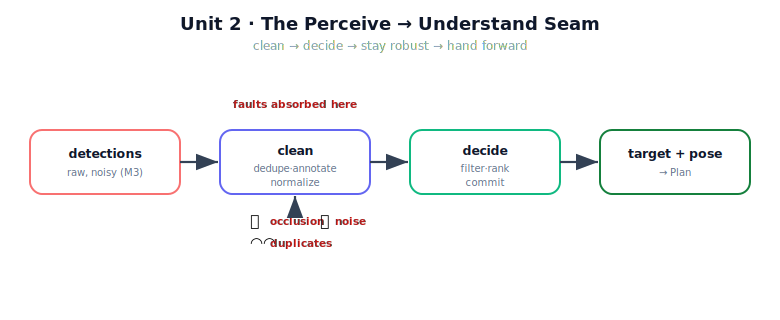

!!! abstract "You are here"
    **Module 9 — System Integration — The Complete Physical AI System**  ·  **Unit 2 — Perceive → Understand**  ·  **Lesson 2.4 — Unit 2 Recap: Perceive → Understand**

# Lesson 2.4 — Unit 2 Recap: Perceive → Understand

> Unit 2 took the first seam of the spine apart and put it back together. This recap consolidates the three moves — clean the detections, choose the target, survive imperfect perception — into one mental model and one runnable check, then points at the handoff to Plan.

---

## 1. Why This Matters
The Perceive → Understand seam is the template for every seam to come. Its discipline — *clean the input, apply an explicit policy, stay robust to faults, hand a clear baton forward* — repeats at Understand → Plan, Plan → Execute, and beyond. Lock in the template here and the rest of the pipeline is variations on a theme you already know. This recap makes sure the template is solid before Unit 3 opens the next seam.

## 2. Physical Intuition
The inspector again: glance (Perceive) → tidy the view into a clean inventory (world state) → decide which one to grab and how (selection) → and do all of that without being fooled by a hidden, wobbling, or double-counted fruit (robustness). Three moves, one habit. Hold them together and you have the Understand stage in a sentence.

## 3. Mathematical Foundations
Unit 2 in three lines:

- **Conversion** $W : D \mapsto \{w_j\}$ — dedupe (merge within $\tau$), annotate (reachability, distance), normalize (world frame). *Organize, don't re-perceive.*
- **Selection** — filter to ripe ∧ reachable, then $w^\star = \arg\min g_j$ (distance), with `None` a valid empty result and a ranked fallback list retained.
- **Robustness** — detections are evidence, not ground truth; occlusion → reflect observability, noise → bounded deterministic ranking, duplicates → dedupe.

The seam's output, $w^\star$ with its pose, is the precondition for Plan.

## 4. Visual Explanation

<figure markdown>
  { width="680" }
</figure>

## 5. Engineering Example
End to end on the real model: perception yields six noisy detections including one duplicate; the conversion collapses the duplicate and annotates the rest; selection filters out the unripe and unreachable, ranks the survivors by distance, and commits to the nearest — handing its pose to Plan and retaining the rest as fallbacks. Inject an occlusion of the committed fruit and the next-ranked one is chosen instead. That single run exercises every idea in Unit 2.

## 6. Worked Example
Self-test, answered. *Question:* perception returns five detections, two of which are the same fruit; one real fruit is occluded this frame; everything visible is ripe and reachable. After the seam, how many committed targets are there, and how many fruit are "in play" overall? *Answer:* exactly **one** committed target (selection commits to one), drawn from **four** world-state entries (five detections minus one merged duplicate); the occluded fruit is simply not among the four this frame. The recap outcome is being able to reason this through cleanly.

## 7. Interactive Demonstration
*(Conceptual — runnable in the notebook.)*
The recap demonstration is one consolidated run: build a world, perceive with a duplicate and a touch of noise, convert and select, print the committed target and the fallback order, then occlude the winner and re-select. It is Unit 2 compressed into a cell you can execute and trust.

## 8. Coding Exercise

!!! tip "Run the hands-on notebook"
    `modules/module09/notebooks/lesson08_unit2_recap.ipynb` — open in JupyterLab and run **Kernel → Restart & Run All**.

*(The recap notebook runs the consolidated seam check.)*
In one short notebook: (1) perceive with `duplicate` and `noise`; (2) run `understand` to get `targets` and `current_target`; (3) assert the duplicate was merged, the committed target is ripe and reachable, and occluding it yields a different (or `None`) committed target. Passing this cell is your evidence that the Perceive → Understand seam works end to end and survives imperfect perception.

## 9. Knowledge Check

Formative — unlimited attempts, immediate feedback; does not affect your grade.

<iframe src="../../quizzes/module09/lesson08_quiz.html" title="Unit 2 Recap: Perceive → Understand knowledge check" style="width:100%;height:720px;border:1px solid #e2e8f0;border-radius:12px"></iframe>

[Open this quiz in a new tab ↗](../quizzes/module09/lesson08_quiz.html)

*(Formative — unlimited attempts, immediate feedback.)*
Mixed review across Unit 2: the conversion's three duties, the filter-then-rank policy, the three perception faults and their defenses, and what the seam hands to Plan.

## 10. Challenge Problem
Unit 3 opens the Understand → Plan seam, where the committed target's *pose* must become a goal *configuration* (via IK, Module 5) before planning. Predict the one new failure mode that seam introduces that the Perceive → Understand seam did not have to worry about (hint: a reachable Cartesian point can still have an awkward or non-unique joint solution). State which earlier module owns the math, and which stage owns *deciding what to do* when that failure occurs.

## 11. Common Mistakes
- **Skipping the clean step.** Selecting straight from raw detections lets duplicates and noise into the decision.
- **Ranking before filtering.** Feasibility (ripe ∧ reachable) must gate the cost.
- **Treating `None` or an occlusion as a crash.** Both are normal, handled outcomes of the seam.
- **Forgetting the baton.** The seam's product is a committed target *with a pose* — that pose is what Plan needs.

## 12. Key Takeaways
- The Perceive → Understand seam is **clean → decide → stay robust → hand forward**, the template for every later seam.
- **Conversion** cleans detections into a trusted world state; **selection** applies an explicit filter-then-rank policy; **robustness** keeps both correct under occlusion, noise, and duplicates.
- A `None` target and an occlusion are normal outcomes, not errors.
- The seam hands Plan a **committed target with a pose** (plus a ranked fallback list).
- Next, Unit 3 turns that pose into a goal configuration and a planned reference.

---

## AI Learning Companion
Copy any prompt into an AI assistant.

**Tutor prompt** — explain it another way
```
Quiz me on Unit 2: the detections→world-state conversion, the target-selection policy, and robustness to occlusion/noise/duplicates. Re-explain whatever I miss.
```
**Practice prompt** — generate more exercises
```
Give me 5 mixed-review questions on cleaning detections, selecting a target, and handling perception faults, with answers.
```
**Explore prompt** — connect it to the real world
```
Show me how a real robot's "understand" stage turns perception into a committed goal and stays robust to imperfect sensing.
```

## Global Learning Support
Need this lesson in another language? Copy a prompt below into an AI assistant. English is the authoritative source.

**Supported languages (initial):** English · Español · 中文 (Simplified Chinese) · Türkçe

```
I just completed Lesson 2.4 — Unit 2 Recap: Perceive → Understand.
Explain this lesson in Español. Keep robotics/math terminology in English where appropriate.
Then provide: a summary, three practice questions, and one challenge problem.
```
```
I just completed Lesson 2.4 — Unit 2 Recap: Perceive → Understand.
Explain this lesson in 中文 (Simplified Chinese). Keep robotics/math terminology in English where appropriate.
Then provide: a summary, three practice questions, and one challenge problem.
```
```
I just completed Lesson 2.4 — Unit 2 Recap: Perceive → Understand.
Explain this lesson in Türkçe. Keep robotics/math terminology in English where appropriate.
Then provide: a summary, three practice questions, and one challenge problem.
```

---

*Next lesson: 3.1 — From Target Pose to Goal Configuration (Unit 3 opens the Understand → Plan seam; Installment B).*
