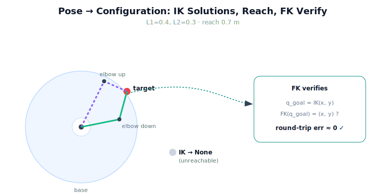

!!! abstract "You are here"
    **Module 9 — System Integration — The Complete Physical AI System**  ·  **Unit 3 — Understand → Plan**  ·  **Lesson 3.1 — From Target Pose to Goal Configuration**

# Lesson 3.1 — From Target Pose to Goal Configuration

> Unit 2 handed us a committed target as a **pose** — a point in the greenhouse. But the planner plans in **joint space**, and the controller commands **joint angles**. Before anything can move, the seam must translate "go to *that point*" into "go to *these angles*." That translation is inverse kinematics, and using it correctly — including when it fails — is the first job of Unit 3.

---

## 1. Why This Matters
The whole back half of the pipeline speaks joint angles. Module 7 plans a trajectory in configuration space; Module 8 tracks joint references; Module 6 maps joint rates. None of them can act on a Cartesian point like $(0.45, 0.15)$. So the committed target pose is, to them, in the wrong language. The Understand → Plan seam is where the language changes: pose in, configuration out. Get this conversion right and the planner has a well-posed goal; get it wrong — hand over an unreachable point, or the wrong one of two elbow solutions — and every downstream stage faithfully executes a mistake. This lesson is about owning that conversion, including its failure cases.

## 2. Physical Intuition
You decide to touch a spot on the table. Your eyes give you the *spot* (a pose); your arm must find a *set of joint bends* that puts your fingertip there. Usually there is more than one way — elbow up or elbow down both reach the same spot. And some spots are simply too far: no bend of your arm reaches them, and you feel that immediately rather than flailing. Inverse kinematics is the robot's version of that "find the joint bends" step, with the same two facts of life: a reachable point may have several joint solutions, and an unreachable point has none. The seam must handle both deliberately, not stumble into them.

## 3. Mathematical Foundations
For the planar 2R greenhouse arm ($L_1=0.4$, $L_2=0.3$), inverse kinematics maps a tool position $(x,y)$ to joint angles $(q_1, q_2)$. Module 5 gives the closed form; we **invoke** it, we do not re-derive it:

$$\cos q_2 = \frac{x^2 + y^2 - L_1^2 - L_2^2}{2 L_1 L_2}.$$

If $|\cos q_2| > 1$ the point is outside the reach annulus and IK returns **None** (unreachable). Otherwise $q_2 = \operatorname{atan2}(\pm\sqrt{1-\cos^2 q_2},\, \cos q_2)$ — the $\pm$ is the **elbow-up / elbow-down** ambiguity (two solutions) — and $q_1$ follows. To *verify* a returned configuration we run Module 4 forward kinematics and check the round trip:

$$\big\lVert \mathrm{FK}(\mathrm{IK}(x,y)) - (x,y) \big\rVert \approx 0.$$

A near-zero round-trip error confirms the configuration truly reaches the target. The seam's contract: **(i)** call IK; **(ii)** if `None`, the pose is unreachable — a Recover/Understand concern, not a value to fudge; **(iii)** if a solution exists, optionally pick the elbow branch by a policy (e.g. avoid joint limits) and verify with FK before handing it to Plan. No new kinematics is introduced here — only the disciplined use of two existing layers.

## 4. Visual Explanation

<figure markdown>
  { width="680" }
</figure>

## 5. Engineering Example
The committed target F3 sits at $(0.447, 0.152)$. The seam calls Module 5 IK and gets $q_{\text{goal}} = (-0.356, 1.684)$ rad. Before trusting it, the seam runs Module 4 FK on those angles and gets back $(0.447, 0.152)$ — a round-trip error of $6\times10^{-17}$, i.e. machine zero. The configuration is genuinely a solution, so it is handed to the planner. Had F3 been pushed to radius $0.9$ m (beyond the $0.7$ m reach), IK would have returned `None`, and the seam would *not* invent a "closest" angle — it would surface the unreachability to be handled, exactly the trap Lesson 1.1 warned about.

## 6. Worked Example
Target $(0.5, 0.0)$ on the arm with $L_1=0.4, L_2=0.3$. Compute the configuration.

1. $x^2+y^2 = 0.25$. $\cos q_2 = (0.25 - 0.16 - 0.09)/(2\cdot0.4\cdot0.3) = 0/0.24 = 0$.
2. $|\cos q_2| = 0 \le 1$ → reachable. $q_2 = \operatorname{atan2}(\pm 1, 0) = \pm\pi/2$ (elbow up or down).
3. Take elbow-up $q_2 = +\pi/2$. Then $q_1 = \operatorname{atan2}(0, 0.5) - \operatorname{atan2}(0.3\cdot1,\ 0.4 + 0.3\cdot0) = 0 - \operatorname{atan2}(0.3, 0.4) \approx -0.6435$ rad.
4. **Verify:** FK of $(-0.6435, 1.5708)$ returns $(0.5, 0.0)$ → round-trip ≈ 0. Configuration confirmed.

Note the two valid solutions $q_2 = \pm\pi/2$; the seam must *choose*, and record which, so the planner and controller agree.

## 7. Interactive Demonstration
*(Conceptual — runnable in the notebook.)*
Drag a target around the workspace and watch the two elbow solutions appear; drag it past the reach boundary and watch both vanish as IK returns `None`. A live FK readout shows the round-trip error hovering at machine zero for reachable points. The demonstration makes the three outcomes — two solutions, one chosen, or none — concrete.

## 8. Coding Exercise

!!! tip "Run the hands-on notebook"
    `modules/module09/notebooks/lesson09_pose_to_configuration.ipynb` — open in JupyterLab and run **Kernel → Restart & Run All**.

*(The notebook runs the real IK/FK round trip.)*
Take a committed target from `understand(...)`, call `to_configuration(target)` (which wraps Module 5 IK), and assert that Module 4 FK of the result returns the target to within $10^{-9}$. Then push a target out of reach and assert `to_configuration` returns `None`. This verifies the seam's two contracts — *reachable ⇒ verified configuration*, *unreachable ⇒ None* — at once.

## 9. Knowledge Check

Formative — unlimited attempts, immediate feedback; does not affect your grade.

<iframe src="../../quizzes/module09/lesson09_quiz.html" title="From Target Pose to Goal Configuration knowledge check" style="width:100%;height:720px;border:1px solid #e2e8f0;border-radius:12px"></iframe>

[Open this quiz in a new tab ↗](../quizzes/module09/lesson09_quiz.html)

*(Formative — unlimited attempts, immediate feedback.)*
Confirm what IK maps (pose → configuration), the meaning of a `None` result, the elbow-up/down ambiguity, the role of FK verification, and the ownership split (M5 owns the math, the seam owns the decision).

## 10. Challenge Problem
The elbow-up/down ambiguity means a reachable target has (usually) two configurations. Propose a *policy* for choosing between them that the seam could apply consistently — name one factor it should consider (e.g. proximity to joint limits, continuity with the current configuration, or manipulability of the resulting pose) — and explain why choosing arbitrarily could cause trouble downstream in Plan or Execute. Keep your policy within the seam's remit: it may select among IK's solutions, but it may not modify the IK math (that is Module 5).

## 11. Common Mistakes
- **Handing a Cartesian point to the planner.** The planner needs a configuration; the conversion is mandatory.
- **Fudging an unreachable target.** `None` means unreachable — surface it, don't invent a boundary angle (the Lesson 1.1 trap).
- **Ignoring the elbow ambiguity.** Two solutions exist; pick one by policy and record it so all stages agree.
- **Skipping FK verification.** Always confirm the chosen configuration actually reaches the target before committing it to Plan.

## 12. Key Takeaways
- The Understand → Plan seam converts a target **pose** into a goal **configuration** via Module 5 IK — a language change the back half of the pipeline requires.
- IK can return **None** (unreachable) or **two** solutions (elbow up/down); the seam must handle both deliberately.
- **Module 4 FK verifies** the configuration: a near-zero round-trip error confirms it reaches the target.
- The **math is M5's, the decision is integration's** — which branch to pick, and what to do when there is no solution.
- Never fudge an unreachable target into a boundary angle; surface it for Recover.

---

## AI Learning Companion
Copy any prompt into an AI assistant.

**Tutor prompt** — explain it another way
```
Re-explain Lesson 3.1 by walking a Cartesian target through inverse kinematics to joint angles, including the unreachable and two-solution cases.
```
**Practice prompt** — generate more exercises
```
Give me 4 planar 2R inverse-kinematics exercises (with L1, L2 given): solve for joint angles, flag unreachable targets, and note the elbow ambiguity. With answers.
```
**Explore prompt** — connect it to the real world
```
Show me how real robot software converts a Cartesian goal into a joint-space goal and how it handles unreachable targets and multiple IK solutions.
```

## Global Learning Support
Need this lesson in another language? Copy a prompt below into an AI assistant. English is the authoritative source.

**Supported languages (initial):** English · Español · 中文 (Simplified Chinese) · Türkçe

```
I just completed Lesson 3.1 — From Target Pose to Goal Configuration.
Explain this lesson in Español. Keep robotics/math terminology in English where appropriate.
Then provide: a summary, three practice questions, and one challenge problem.
```
```
I just completed Lesson 3.1 — From Target Pose to Goal Configuration.
Explain this lesson in 中文 (Simplified Chinese). Keep robotics/math terminology in English where appropriate.
Then provide: a summary, three practice questions, and one challenge problem.
```
```
I just completed Lesson 3.1 — From Target Pose to Goal Configuration.
Explain this lesson in Türkçe. Keep robotics/math terminology in English where appropriate.
Then provide: a summary, three practice questions, and one challenge problem.
```

---

*Next lesson: 3.2 — Invoking the Planner: Calling the Reference Layer (handing the goal configuration to Module 7).*
