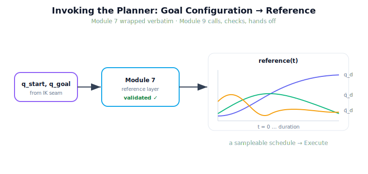

!!! abstract "You are here"
    **Module 9 — System Integration — The Complete Physical AI System**  ·  **Unit 3 — Understand → Plan**  ·  **Lesson 3.2 — Invoking the Planner: Calling the Reference Layer**

# Lesson 3.2 — Invoking the Planner: Calling the Reference Layer

> A goal configuration says *where to end up*. It says nothing about *how to get there over time* — smoothly, within velocity and acceleration limits, without yanking the arm. That is Module 7's job. This lesson is about calling Module 7 correctly and reading what it hands back, without re-opening the planner itself.

---

## 1. Why This Matters
Between "the goal is configuration $q_{\text{goal}}$" and "the motor should be at angle $\theta$ right now" lies a planned, timed trajectory. Module 7 produces it: a `reference(t)` that says, for every instant, the desired joint position and its derivatives, validated against the arm's limits. Module 9's Plan stage exists to *invoke* that layer and route its output forward — not to re-derive trajectory generation. Treating the planner as a black box with a clean interface is exactly the integration discipline: we trust the verified layer, call it through its published signature, and own only the call site and the handoff. If we instead reimplemented planning here, we would duplicate (and eventually contradict) Module 7 — the cardinal integration sin.

## 2. Physical Intuition
You know *where* you want your hand to end up. Your nervous system still has to schedule the motion: start gently, speed up, slow down, arrive without overshooting — all within what your muscles can do. You do not consciously design that schedule; a lower system produces it and you simply *run* it. The robot is the same: the goal configuration is the destination, and Module 7 is the lower system that produces the schedule — the reference. The Plan stage's job is to ask for the schedule and pass it on, not to redesign how schedules are made.

## 3. Mathematical Foundations
Module 7's reference layer has the interface

$$\texttt{reference\_trajectory\_layer}(q_{\text{start}}, q_{\text{goal}}, \text{obstacle}, v_{\lim}, a_{\lim}, \dots) \rightarrow \text{layer},$$

returning a dictionary whose central element is a function

$$\texttt{reference}(t) \rightarrow (q_d(t),\ \dot q_d(t),\ \ddot q_d(t),\ \text{info}),$$

the feed-forward reference signal Module 8 will track. The layer also reports a **`validated`** flag (did the trajectory pass the limit/feasibility checks?), a **`duration`**, and metrics. Module 9's `plan_reference` adapter wraps this verbatim, supplying greenhouse-sensible defaults and a uniform obstacle argument. The Plan stage's contract: **(i)** call the layer with $q_{\text{start}}$ (current configuration) and $q_{\text{goal}}$ (from the IK seam); **(ii)** check `validated` — an unvalidated plan is a failure to be handled, not silently executed; **(iii)** write the `reference` onto the blackboard for Execute. The trajectory mathematics — polynomials, time-scaling, validation — lives entirely in Module 7. We introduce none of it.

## 4. Visual Explanation

<figure markdown>
  { width="680" }
</figure>

## 5. Engineering Example
The seam holds $q_{\text{start}}$ (the arm's current configuration) and $q_{\text{goal}} = (-0.356, 1.684)$ for target F3. Plan calls `plan_reference(q_start, q_goal)`. Module 7 returns a layer with `validated = True` and `duration ≈ 1.13` s. Sampling `reference(0)` gives the start configuration with zero velocity; sampling `reference(duration)` gives $q_{\text{goal}}$, and forward kinematics of that endpoint lands exactly on F3's pose. The Plan stage writes this `reference` to the blackboard and hands off — never having computed a polynomial itself. Had the planner returned `validated = False` (say a goal jammed against a limit), the seam would surface that, not feed an invalid reference downstream.

## 6. Worked Example
You call the reference layer and receive `{validated: True, duration: 1.13, reference: <fn>}`. Answer three reading-comprehension questions about the handoff:

1. *What is `reference(0.565)`?* The desired joint state roughly halfway through the move (position, velocity, acceleration at $t = 0.565$ s) — sampling the schedule mid-flight.
2. *What does Execute do with `reference`?* It samples it each control tick and feeds the sample to Module 8's `tracking_controller` (Unit 4).
3. *What if `validated` were False?* Plan must not write the reference for execution; the failure is routed to Recover. The point: the Plan stage's whole job is *call, check, hand off* — three verbs, no planning math.

## 7. Interactive Demonstration
*(Conceptual — runnable in the notebook.)*
Pick a start and goal configuration, call the planner, and scrub a time slider from $0$ to `duration`, watching $q_d(t)$, $\dot q_d(t)$, $\ddot q_d(t)$ evolve and the arm trace the planned motion. A `validated` badge confirms the plan passed its checks. The demonstration shows the reference as a *sampleable schedule*, which is exactly how Execute will consume it.

## 8. Coding Exercise

!!! tip "Run the hands-on notebook"
    `modules/module09/notebooks/lesson10_invoking_the_planner.ipynb` — open in JupyterLab and run **Kernel → Restart & Run All**.

*(The notebook runs the real planner.)*
Convert a committed target to $q_{\text{goal}}$ with `to_configuration`, then call `plan_reference(q_start, q_goal)`. Assert: (a) `validated` is True; (b) `reference(0)` is the start configuration; (c) forward kinematics of `reference(duration)` reaches the target pose to within a small tolerance. This verifies the call and the handoff without touching trajectory internals.

## 9. Knowledge Check

Formative — unlimited attempts, immediate feedback; does not affect your grade.

<iframe src="../../quizzes/module09/lesson10_quiz.html" title="Invoking the Planner: Calling the Reference Layer knowledge check" style="width:100%;height:720px;border:1px solid #e2e8f0;border-radius:12px"></iframe>

[Open this quiz in a new tab ↗](../quizzes/module09/lesson10_quiz.html)

*(Formative — unlimited attempts, immediate feedback.)*
Check the reference layer's interface, the contents of `reference(t)`, the meaning of `validated`, and the three-verb contract of the Plan stage (call, check, hand off).

## 10. Challenge Problem
The reference layer accepts an optional obstacle (a disk) for collision avoidance. Without changing the planner, describe how the *system* would obtain that obstacle for a real greenhouse pick (where does the obstacle information come from, and which stage owns supplying it?), and what the Plan stage should do if the planner returns `validated = False` because no collision-free path exists. Frame your answer in terms of stage ownership and the handoff — not in terms of new planning algorithms.

## 11. Common Mistakes
- **Reimplementing planning in the seam.** The planner is wrapped verbatim; the Plan stage only calls it and hands off.
- **Ignoring the `validated` flag.** An unvalidated reference must not be executed; route the failure to Recover.
- **Passing a Cartesian goal.** The planner needs configurations ($q_{\text{start}}$, $q_{\text{goal}}$); the IK seam must run first.
- **Forgetting the derivatives.** `reference(t)` carries $\dot q_d, \ddot q_d$ too — Module 8 uses them as feed-forward; don't drop them.

## 12. Key Takeaways
- The Plan stage turns a goal **configuration** into a timed, validated **reference** by invoking Module 7's real reference layer.
- `reference(t)` yields $q_d, \dot q_d, \ddot q_d$ and info; the layer also reports **`validated`** and **`duration`**.
- Module 9 owns only the **call and the handoff**; the trajectory mathematics stays entirely in Module 7.
- An **unvalidated** plan is a failure for Recover, never something to execute silently.
- The reference is a **sampleable schedule** — exactly the form Execute (Unit 4) consumes.

---

## AI Learning Companion
Copy any prompt into an AI assistant.

**Tutor prompt** — explain it another way
```
Re-explain Lesson 3.2 by describing how a goal configuration becomes a timed reference trajectory, and what a system should do with a validated vs. unvalidated plan.
```
**Practice prompt** — generate more exercises
```
Give me 4 exercises on reading a reference trajectory signal (position, velocity, acceleration vs. time) and on handling a planner's validated/failed result, with answers.
```
**Explore prompt** — connect it to the real world
```
Show me how real robot stacks call a motion planner / trajectory generator through an interface and what they do when planning fails.
```

## Global Learning Support
Need this lesson in another language? Copy a prompt below into an AI assistant. English is the authoritative source.

**Supported languages (initial):** English · Español · 中文 (Simplified Chinese) · Türkçe

```
I just completed Lesson 3.2 — Invoking the Planner: Calling the Reference Layer.
Explain this lesson in Español. Keep robotics/math terminology in English where appropriate.
Then provide: a summary, three practice questions, and one challenge problem.
```
```
I just completed Lesson 3.2 — Invoking the Planner: Calling the Reference Layer.
Explain this lesson in 中文 (Simplified Chinese). Keep robotics/math terminology in English where appropriate.
Then provide: a summary, three practice questions, and one challenge problem.
```
```
I just completed Lesson 3.2 — Invoking the Planner: Calling the Reference Layer.
Explain this lesson in Türkçe. Keep robotics/math terminology in English where appropriate.
Then provide: a summary, three practice questions, and one challenge problem.
```

---

*Next lesson: 3.3 — Integration Exercise: Pose to Plan, Wired End to End (the whole Understand → Plan seam in one run).*
