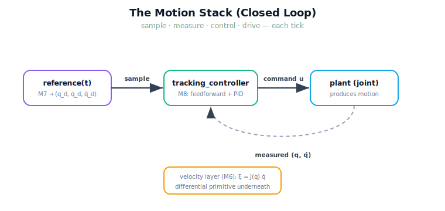

!!! abstract "You are here"
    **Module 9 — System Integration — The Complete Physical AI System**  ·  **Unit 4 — Plan → Execute**  ·  **Lesson 4.1 — The Motion Stack: Reference → Velocity → Tracking Controller**

# Lesson 4.1 — The Motion Stack: Reference → Velocity → Tracking Controller

> Unit 3 ended with a *plan*: a validated reference trajectory. But a plan does not move a robot. Execute is where the plan becomes motion — by sampling the reference each control tick and handing it to Module 8's tracking controller, which drives the joints and watches what actually happens. This lesson assembles that stack.

---

## 1. Why This Matters
The reference says where each joint *should* be at every instant. Real joints have friction, load, and inertia, so commanding the reference blindly drifts — the whole reason Module 8 exists. Execute closes the loop: it samples the reference, measures the actual joint state, and lets the controller correct the gap, tick after tick, until the arm tracks the plan. This is the stage where the greenhouse robot finally moves toward the fruit. Assembling the stack correctly — reference in, command out, actual state back in — is what makes the difference between a plan that works on paper and an arm that reaches the tomato.

## 2. Physical Intuition
Following a recipe while watching the pot. The reference is the recipe: at each minute, here is where things should be. But you do not cook with your eyes closed — you *watch* the pot and adjust the heat when it bubbles too hard. Execute is cooking with your eyes open: each tick, the controller compares the recipe's target for *now* against what the joint is *actually* doing and nudges the command to close the gap. The recipe (reference) comes from the planner; the watching-and-nudging (feedback) is Module 8; the result is an arm that follows the plan despite the world pushing back.

## 3. Mathematical Foundations
Execute runs a closed loop at a fixed timestep $\Delta t$. Each tick $t$:

1. **Sample** the reference: $(q_d, \dot q_d, \ddot q_d) = \texttt{reference}(t)$ — Module 7's output.
2. **Measure** the plant: $(q, \dot q)$ — the actual joint state.
3. **Control:** $u = \texttt{tracking\_controller}\big((q_d,\dot q_d,\ddot q_d),\ (q,\dot q),\ \Delta t\big)$ — Module 8 combines feed-forward (anticipating from $\dot q_d, \ddot q_d$) with PID feedback (correcting $q_d - q$).
4. **Drive** the plant: step it with command $u$, producing a new $(q, \dot q)$.

The loop repeats, and $q \to q_d$ over time. Beneath this sits Module 6's **velocity layer**: the geometric Jacobian $J(q)$ relates joint rates to tool twist, $\boldsymbol{\xi} = J(q)\,\dot q$, so the differential relationship between *joint* motion and *tool* motion is always available — the basis for Lesson 4.2's handoff contracts. The motion stack is therefore **reference (M7) → tracking controller (M8) → plant**, with the **velocity layer (M6)** as the differential primitive underneath. Module 9 introduces no control law; it only assembles and runs the loop.

## 4. Visual Explanation

<figure markdown>
  { width="680" }
</figure>

## 5. Engineering Example
The Plan stage handed Execute a validated reference for target F3, duration ≈ 1.13 s. Execute builds one tracking controller per joint (Module 8's `control_layer`) and one simulated plant per joint, then runs the loop at $\Delta t = 2$ ms. Each tick, it samples the reference, reads the plant, computes the command (feed-forward + feedback), and steps the plant. After the run, the tracking RMS error is ≈ 0.0001 rad and the final joint state matches the reference's end — forward kinematics of the final configuration lands exactly on F3. The plan became motion, and the motion reached the fruit. (If a mid-run disturbance kicks a joint, the feedback term drives it back — the loop *recovers*, where an open-loop command could not.)

## 6. Worked Example
You have a reference of duration $T = 1.0$ s and run Execute at $\Delta t = 2$ ms. Answer:

1. *How many control ticks?* $T/\Delta t + 1 = 501$ samples of the reference.
2. *What does the controller consume at tick $t = 0.5$?* The reference sample $(q_d, \dot q_d, \ddot q_d)$ at $0.5$ s *and* the measured $(q, \dot q)$ — both, every tick.
3. *Why feed-forward $\dot q_d, \ddot q_d$ and not just feedback on $q_d - q$?* Feed-forward *anticipates* the planned motion so the controller is not always playing catch-up; feedback then only has to correct the residual. Dropping the derivatives makes tracking lag. The stack uses both, which is why the reference carries all three.

## 7. Interactive Demonstration

<iframe src="../../demos/module09/lesson13_motion_stack_visualizer.html" title="The Motion Stack: Reference → Velocity → Tracking Controller interactive demo" style="width:100%;height:520px;border:1px solid #e2e8f0;border-radius:12px"></iframe>

[Open this demo in a new tab ↗](../demos/module09/lesson13_motion_stack_visualizer.html)

*(Conceptual — runnable in the notebook and the Installment-B flagship demo.)*
Watch the planned reference (a smooth curve) and the actual joint trajectory (tracking it) on the same axes, with the error shrinking toward zero. Inject a disturbance and see the actual curve jump then rejoin the reference. The flagship "Motion Stack Visualizer" for this installment animates exactly this: reference in, command out, actual state tracking back.

## 8. Coding Exercise

!!! tip "Run the hands-on notebook"
    `modules/module09/notebooks/lesson13_the_motion_stack.ipynb` — open in JupyterLab and run **Kernel → Restart & Run All**.

*(The notebook runs the real motion stack.)*
Take a validated `layer` from `plan_reference`, run `execute_reference(layer)`, and assert: (a) the run `reached` the target (final per-joint error < 0.05), (b) the tracking RMS is small, and (c) forward kinematics of the final configuration matches the planned endpoint. This verifies the stack tracks the plan to real motion.

## 9. Knowledge Check

Formative — unlimited attempts, immediate feedback; does not affect your grade.

<iframe src="../../quizzes/module09/lesson13_quiz.html" title="The Motion Stack: Reference → Velocity → Tracking Controller knowledge check" style="width:100%;height:720px;border:1px solid #e2e8f0;border-radius:12px"></iframe>

[Open this quiz in a new tab ↗](../quizzes/module09/lesson13_quiz.html)

*(Formative — unlimited attempts, immediate feedback.)*
Confirm the four steps of the loop (sample, measure, control, drive), why feedback is needed, what feed-forward adds, and where Module 6's velocity layer sits.

## 10. Challenge Problem
Execute currently tracks a *joint-space* reference (the planner already produced joint angles). Suppose instead you wanted the tool to follow a straight Cartesian line. Describe, using Module 6's velocity layer ($\boldsymbol{\xi} = J(q)\dot q$) and without inventing new control theory, how the desired tool twist $\boldsymbol{\xi}_d$ would become a desired joint rate $\dot q_d$ that the controller could track — and name the one configuration-dependent quantity that makes this conversion unreliable near a singularity (a Module 6 concept). State which stage owns choosing what to do there.

## 11. Common Mistakes
- **Executing the reference open-loop.** Without feedback, friction and load make the arm drift; the loop must read the actual state each tick.
- **Dropping the feed-forward derivatives.** $\dot q_d, \ddot q_d$ let the controller anticipate; without them tracking lags.
- **Reinventing the controller.** Module 8 is wrapped; Execute only assembles and runs the loop.
- **Forgetting the timestep.** Execution is periodic at a fixed $\Delta t$; the loop's behaviour depends on it (Lesson 4.2).

## 12. Key Takeaways
- **Execute turns a plan into motion** by running a closed loop: sample the reference, measure the plant, control, drive — repeat.
- The motion stack is **reference (M7) → tracking controller (M8) → plant**, with the **velocity layer (M6)** as the differential primitive underneath.
- **Feedback** corrects the reference-vs-reality gap; **feed-forward** (from $\dot q_d, \ddot q_d$) anticipates the planned motion.
- A healthy run tracks the reference to a tiny error, and FK of the final state reaches the target.
- Module 9 only **assembles and runs** the loop — it introduces no control law.

---

## AI Learning Companion
Copy any prompt into an AI assistant.

**Tutor prompt** — explain it another way
```
Re-explain Lesson 4.1 by walking through one tick of a closed-loop motion stack: sample reference, measure state, control, drive plant.
```
**Practice prompt** — generate more exercises
```
Give me 4 exercises on a closed-loop tracking stack: counting ticks, identifying what the controller consumes each tick, and the role of feedforward vs feedback. With answers.
```
**Explore prompt** — connect it to the real world
```
Show me how real robot controllers track a planned trajectory closed-loop and how feedforward and feedback combine in practice.
```

## Global Learning Support
Need this lesson in another language? Copy a prompt below into an AI assistant. English is the authoritative source.

**Supported languages (initial):** English · Español · 中文 (Simplified Chinese) · Türkçe

```
I just completed Lesson 4.1 — The Motion Stack: Reference → Velocity → Tracking Controller.
Explain this lesson in Español. Keep robotics/math terminology in English where appropriate.
Then provide: a summary, three practice questions, and one challenge problem.
```
```
I just completed Lesson 4.1 — The Motion Stack: Reference → Velocity → Tracking Controller.
Explain this lesson in 中文 (Simplified Chinese). Keep robotics/math terminology in English where appropriate.
Then provide: a summary, three practice questions, and one challenge problem.
```
```
I just completed Lesson 4.1 — The Motion Stack: Reference → Velocity → Tracking Controller.
Explain this lesson in Türkçe. Keep robotics/math terminology in English where appropriate.
Then provide: a summary, three practice questions, and one challenge problem.
```

---

*Next lesson: 4.2 — Handoff Contracts: ξ_d, q̇, and Real-Time Execution (the precise interfaces the motion stack passes, and what "real time" means here).*
