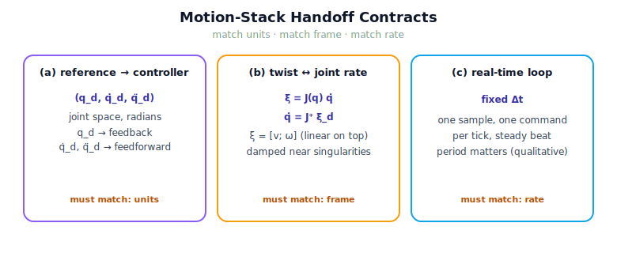

!!! abstract "You are here"
    **Module 9 — System Integration — The Complete Physical AI System**  ·  **Unit 4 — Plan → Execute**  ·  **Lesson 4.2 — Handoff Contracts: ξ_d, q̇, and Real-Time Execution**

# Lesson 4.2 — Handoff Contracts: ξ_d, q̇, and Real-Time Execution

> Lesson 1.1 warned that the bugs live in the seams. The motion stack has three tight seams — reference→controller, joint↔tool velocity, and the timing of the loop. This lesson writes down each contract precisely, because a mismatched unit, frame, or rate here produces motion that is subtly, dangerously wrong.

---

## 1. Why This Matters
The motion stack is the seam-densest part of the pipeline: per tick, a reference sample, a measured state, a command, and a timestep all change hands. Each handoff has a contract — what type, what units, what frame, what rate — and the composition is correct only if every contract is honoured. A reference in radians met by a controller expecting degrees; a tool twist in the wrong frame; a loop sampled too slowly to keep up — each looks like "the robot moves wrong" and each is a seam bug, not a layer bug. Writing the contracts down explicitly is how integration prevents them.

## 2. Physical Intuition
A relay baton must be the right baton, passed the right way, at the right moment. If the incoming runner expects the baton in their left hand and it comes to their right, the exchange fumbles even though both runners are fast. The motion stack's handoffs are the same: the controller expects the reference in specific units; the velocity relationship expects twist and joint-rate in matching frames; the loop expects to run on a steady beat. Honour the form of each handoff and the relay flows; violate one and the leg is lost in the exchange.

## 3. Mathematical Foundations
Three contracts.

**(a) Reference → controller.** Each tick the reference provides $(q_d, \dot q_d, \ddot q_d)$ — desired joint position, velocity, acceleration, in radians and radians/s(²), in joint space. The controller consumes $q_d$ for feedback ($q_d - q$) and $\dot q_d, \ddot q_d$ for feed-forward. *Contract:* a 3-tuple of joint-space arrays in consistent units; the controller also needs the measured $(q, \dot q)$ in the *same* units and frame.

**(b) Tool twist ↔ joint rate (Module 6).** The geometric Jacobian relates joint rates to tool twist:

$$\boldsymbol{\xi} = J(q)\,\dot q, \qquad \dot q = J(q)^{+}\boldsymbol{\xi}_d,$$

where $\boldsymbol{\xi} = [v; \omega]$ (linear on top, the locked convention) and $J^{+}$ is the (damped) pseudoinverse from the velocity layer. *Contract:* twist and joint rate must be in the **same frame** (base/world here) and consistent units; the conversion degrades near singularities (small $\sigma_{\min}$), which the velocity layer's damping handles.

**(c) Real-time execution.** "Real-time" in this module means the loop runs **periodically at a fixed timestep** $\Delta t$: every tick takes one sample and issues one command, on a steady beat. *Contract:* a fixed $\Delta t$; a loop that cannot keep up (or whose $\Delta t$ is too coarse for the motion) tracks poorly. We treat $\Delta t$ qualitatively — *the loop has a period and it matters* — without formal scheduling theory (rate-monotonic, WCET are out of scope, named only as the deeper topic).

## 4. Visual Explanation

<figure markdown>
  { width="680" }
</figure>

## 5. Engineering Example
A real handoff bug and its fix. Suppose perception and the world used metres while an early target pose slipped in as centimetres: the IK seam would still return *some* configuration, the planner would plan to it, and the controller would track it perfectly — to the wrong place, a hundredfold off. The contract that would have caught it: *every position is in metres, world frame, before the IK seam*. Likewise, if a desired tool twist $\boldsymbol{\xi}_d$ were expressed in the tool frame but converted with a base-frame Jacobian, the joint rates would be wrong despite a correct velocity layer. The contracts — units, frame, rate — are the checks that keep the motion stack honest.

## 6. Worked Example
The reference hands the controller $(q_d, \dot q_d, \ddot q_d)$ at tick $t$. Suppose a teammate "simplifies" the handoff to pass only $q_d$. Predict the effect and name the violated contract.

Reasoning: dropping $\dot q_d, \ddot q_d$ removes the feed-forward terms. The controller falls back to pure feedback on $q_d - q$, so it is always reacting to an error rather than anticipating the motion — tracking lags, especially during fast segments. No exception is thrown; the arm just trails the plan. The violated contract is **(a)**: the reference→controller handoff must carry the full 3-tuple, because the controller's feed-forward depends on the derivatives. The bug is invisible to a type check and visible only as degraded tracking — a classic seam failure.

## 7. Interactive Demonstration

<iframe src="../../demos/module09/lesson14_handoff_contracts.html" title="Handoff Contracts: ξ_d, q̇, and Real-Time Execution interactive demo" style="width:100%;height:520px;border:1px solid #e2e8f0;border-radius:12px"></iframe>

[Open this demo in a new tab ↗](../demos/module09/lesson14_handoff_contracts.html)

*(Conceptual — runnable in the notebook.)*
A toggle that drops the feed-forward derivatives from the handoff, side by side with the full handoff, plotting both tracking errors. The full contract tracks tightly; the stripped handoff lags. A second toggle coarsens $\Delta t$ and shows tracking degrade. The demonstration makes the cost of a violated contract visible without any exception being raised.

## 8. Coding Exercise

!!! tip "Run the hands-on notebook"
    `modules/module09/notebooks/lesson14_handoff_contracts.ipynb` — open in JupyterLab and run **Kernel → Restart & Run All**.

*(The notebook checks the contracts on the real stack.)*
Run `execute_reference` two ways: with full feed-forward (`ff="full"`) and feedback-only (`ff="none"`), and assert the full-contract run tracks with smaller RMS error. Separately, use the velocity layer to confirm $\boldsymbol{\xi} = J(q)\dot q$ round-trips: pick a joint rate, map to a twist, map back with the damped pseudoinverse, and check consistency. This verifies contracts (a) and (b) on real layers.

## 9. Knowledge Check

Formative — unlimited attempts, immediate feedback; does not affect your grade.

<iframe src="../../quizzes/module09/lesson14_quiz.html" title="Handoff Contracts: ξ_d, q̇, and Real-Time Execution knowledge check" style="width:100%;height:720px;border:1px solid #e2e8f0;border-radius:12px"></iframe>

[Open this quiz in a new tab ↗](../quizzes/module09/lesson14_quiz.html)

*(Formative — unlimited attempts, immediate feedback.)*
Confirm the contents and units of the reference→controller handoff, the twist↔joint-rate relationship and its frame requirement, the twist ordering convention $[v;\omega]$, and what "real-time" means here.

## 10. Challenge Problem
The twist↔joint-rate contract degrades near a singularity, where $J(q)$ loses rank and small tool motions demand huge joint rates. Without introducing new control theory, explain (using Module 6's damped pseudoinverse / manipulability) why the velocity layer *damps* the conversion there rather than following $\boldsymbol{\xi}_d$ exactly, and what trade-off that damping makes. Then state which stage owns *deciding* whether the resulting tracking degradation is acceptable or a failure — previewing the Track stage in Unit 5.

## 11. Common Mistakes
- **Mismatched units or frame.** Metres vs. centimetres, tool frame vs. base frame — silent, large errors. The contract is the check.
- **Stripping the feed-forward derivatives.** The handoff must carry $(q_d, \dot q_d, \ddot q_d)$; dropping the derivatives degrades tracking without an error.
- **Wrong twist ordering.** The convention is $\boldsymbol{\xi} = [v; \omega]$ (linear on top); swapping it corrupts the Jacobian relationship.
- **Ignoring the loop period.** A $\Delta t$ too coarse for the motion tracks poorly even with correct math.

## 12. Key Takeaways
- The motion stack has three tight contracts: **reference→controller** $(q_d, \dot q_d, \ddot q_d)$, **twist↔joint-rate** $\boldsymbol{\xi} = J\dot q$, and **fixed-Δt** periodic execution.
- Each contract specifies **type, units, frame, and rate**; a mismatch is a silent seam bug, not a layer bug.
- The Jacobian conversion requires **matching frames** (base/world) and the convention $\boldsymbol{\xi} = [v; \omega]$; it degrades near singularities (M6 damping).
- "**Real-time**" here means a periodic loop at a fixed timestep — treated qualitatively, formal scheduling out of scope.
- Writing the contracts down explicitly is how integration prevents the seam bugs Lesson 1.1 warned about.

---

## AI Learning Companion
Copy any prompt into an AI assistant.

**Tutor prompt** — explain it another way
```
Re-explain Lesson 4.2 by listing the exact handoff contracts of a robot motion stack (units, frame, rate) and what breaks when each is violated.
```
**Practice prompt** — generate more exercises
```
Give me 4 exercises on motion-stack interface contracts: spotting unit/frame mismatches, the twist=J·q̇ relationship, and fixed-timestep execution. With answers.
```
**Explore prompt** — connect it to the real world
```
Show me real examples where a units, frame, or rate mismatch between robot subsystems caused a failure, and how interface contracts prevent it.
```

## Global Learning Support
Need this lesson in another language? Copy a prompt below into an AI assistant. English is the authoritative source.

**Supported languages (initial):** English · Español · 中文 (Simplified Chinese) · Türkçe

```
I just completed Lesson 4.2 — Handoff Contracts: ξ_d, q̇, and Real-Time Execution.
Explain this lesson in Español. Keep robotics/math terminology in English where appropriate.
Then provide: a summary, three practice questions, and one challenge problem.
```
```
I just completed Lesson 4.2 — Handoff Contracts: ξ_d, q̇, and Real-Time Execution.
Explain this lesson in 中文 (Simplified Chinese). Keep robotics/math terminology in English where appropriate.
Then provide: a summary, three practice questions, and one challenge problem.
```
```
I just completed Lesson 4.2 — Handoff Contracts: ξ_d, q̇, and Real-Time Execution.
Explain this lesson in Türkçe. Keep robotics/math terminology in English where appropriate.
Then provide: a summary, three practice questions, and one challenge problem.
```

---

*Next lesson: 4.3 — System Walkthrough: A Goal Pose's Journey to Joint Motion (one pose, traced from decision to physical movement).*
