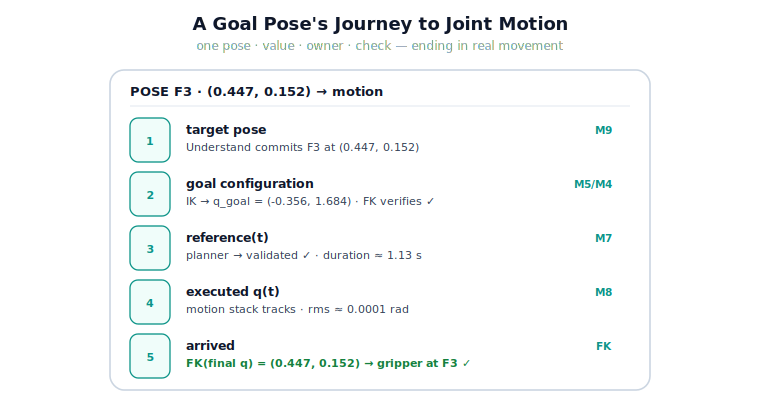

!!! abstract "You are here"
    **Module 9 — System Integration — The Complete Physical AI System**  ·  **Unit 4 — Plan → Execute**  ·  **Lesson 4.3 — System Walkthrough: A Goal Pose's Journey to Joint Motion**

# Lesson 4.3 — System Walkthrough: A Goal Pose's Journey to Joint Motion

> Unit 1 traced one tomato through six *labels*. Now we trace one pose through the *motion* machinery, end to end, watching the value change hands until the gripper physically arrives. This is the walkthrough that ties Units 3 and 4 together into a single, runnable journey.

---

## 1. Why This Matters
We have built each motion-stack piece and written its contract. The walkthrough proves they cooperate by following one pose all the way to movement and checking every handoff. It is the rehearsal for the midpoint checkpoint (next lesson) and for the capstone: if a single pose can travel from "the robot decided to pick F3" to "the gripper is at F3's position," the forward half of the system works. Reading this trace also cements the diagnostic habit — value, owner, check — on the motion stages, where the next units will inject failures.

## 2. Physical Intuition
Watch one reach in slow motion, narrated. *Decide* on the spot (pose). *Figure out the joint bends* (configuration). *Plan the reach over time* (reference). *Move, watching and adjusting* (track). *Arrive* (the gripper is there). Each step has a clear before and after, and you can point at the moment the baton passes. The walkthrough freezes each of those moments and reads what is on the blackboard, so the abstract stack becomes a concrete story you can follow with your finger.

## 3. Mathematical Foundations
The motion-half trace, with the check at each stage:

$$w^\star \xrightarrow[\text{FK verifies}]{\text{IK}} q_{\text{goal}} \xrightarrow[\text{validated}]{\text{plan}} \texttt{reference}(t) \xrightarrow[\text{rms}\to 0]{\text{execute}} q(t) \xrightarrow{\text{FK}} \mathbf{x}_{\text{tool}} \approx \mathbf{x}_{w^\star}.$$

Stage by stage: the target pose $w^\star$ becomes a goal configuration $q_{\text{goal}}$ (IK; FK confirms it reaches $w^\star$); the planner produces a validated $\texttt{reference}(t)$ from the current configuration to $q_{\text{goal}}$; Execute tracks it, producing an actual joint trajectory $q(t)$ with small RMS error; and forward kinematics of the final $q$ lands on $w^\star$. A correct walkthrough is one where every stage's check holds — the contract chain of Unit 1, now spanning perception, kinematics, planning, and control.

## 4. Visual Explanation

<figure markdown>
  { width="680" }
</figure>

## 5. Engineering Example
The journey of F3's pose, narrated by its trace. **Decide:** Understand commits F3 at $(0.447, 0.152)$. **Configure:** IK returns $q_{\text{goal}} = (-0.356, 1.684)$; FK confirms it reaches $(0.447, 0.152)$. **Plan:** the reference layer returns a validated trajectory of duration ≈ 1.13 s. **Execute:** the motion stack tracks it at $\Delta t = 2$ ms; tracking RMS ≈ 0.0001 rad. **Arrive:** forward kinematics of the final joint state lands on $(0.447, 0.152)$ — the gripper is at F3. Five stamps, every check green: a pose became motion and the motion reached the fruit.

## 6. Worked Example
Localise a fault from the motion-half trace. Suppose the trace reads: target pose ✓, $q_{\text{goal}}$ ✓ (FK confirms), reference validated ✓, but Execute's final tracking error is large (rms high, `reached = False`). Where is the fault? Reasoning: IK and planning checks passed, so the plan is sound and the goal reachable. A large execution error with a good plan points to **Execute** — for instance, a disturbance the feedback could not fully reject in time, gains too weak for the load, or (foreshadowing Unit 5) a genuine tracking failure. The fault is not in perception, IK, or the planner; it is in execution or its conditions. The trace localises it to the Execute stage — and *judging* whether that error is acceptable is the Track stage's job (Unit 5).

## 7. Interactive Demonstration

<iframe src="../../demos/module09/lesson15_goal_pose_journey.html" title="System Walkthrough: A Goal Pose's Journey to Joint Motion interactive demo" style="width:100%;height:520px;border:1px solid #e2e8f0;border-radius:12px"></iframe>

[Open this demo in a new tab ↗](../demos/module09/lesson15_goal_pose_journey.html)

*(Conceptual — runnable in the notebook and the flagship demo.)*
A "run the journey" button that prints the five-stamp trace and plots the planned vs. actual joint trajectory, ending with "arrived: FK = target ✓". Inject a disturbance and watch the actual trajectory dip and rejoin, the final stamp still arriving (feedback recovers) — or, with a strong enough disturbance, *not* arriving, foreshadowing failure detection.

## 8. Coding Exercise

!!! tip "Run the hands-on notebook"
    `modules/module09/notebooks/lesson15_goal_pose_journey.ipynb` — open in JupyterLab and run **Kernel → Restart & Run All**.

*(The notebook runs the full journey.)*
Wire `understand → to_configuration → plan_reference → execute_reference` for one target and print a five-stamp trace, asserting: IK reaches the target (FK), the plan is validated, execution `reached` the target with small RMS, and FK of the final joint state matches the target pose. Then inject a modest disturbance and confirm the run still arrives (feedback recovers). This is the motion-half walkthrough in code.

## 9. Knowledge Check

Formative — unlimited attempts, immediate feedback; does not affect your grade.

<iframe src="../../quizzes/module09/lesson15_quiz.html" title="System Walkthrough: A Goal Pose's Journey to Joint Motion knowledge check" style="width:100%;height:720px;border:1px solid #e2e8f0;border-radius:12px"></iframe>

[Open this quiz in a new tab ↗](../quizzes/module09/lesson15_quiz.html)

*(Formative — unlimited attempts, immediate feedback.)*
Confirm the order of the motion-half journey, the check at each stage, how to localise an execution fault from the trace, and the boundary between Execute (producing motion) and Track (judging it).

## 10. Challenge Problem
Extend the walkthrough to a *second* pose immediately after the first, and identify the one piece of state that must carry over for the second journey to start correctly (hint: the arm's actual final configuration becomes the next plan's $q_{\text{start}}$ — and note it is the *executed* configuration, which may differ slightly from the planned $q_{\text{goal}}$ if tracking was imperfect). State which value you would feed as the next $q_{\text{start}}$ — planned or actual — and justify the choice in terms of correctness.

## 11. Common Mistakes
- **Reading values without checking.** The journey is a contract chain; verify each stage's check, don't just watch numbers.
- **Confusing Execute with Track.** Execute *produces* motion; deciding whether the resulting error is acceptable is Track (Unit 5).
- **Feeding the planned $q_{\text{goal}}$ as the next start.** After imperfect tracking, the *actual* final configuration is where the arm really is.
- **Expecting new theory.** The walkthrough only runs and reads the wired stack; nothing is re-derived.

## 12. Key Takeaways
- The motion-half journey is **pose → configuration → reference → executed motion → arrival**, each stage with a value, an owner, and a check.
- A correct walkthrough ends with **FK of the executed final state landing on the target pose**.
- Reading the trace **localises faults**: a good plan with large execution error points to **Execute**, not perception/IK/planning.
- **Execute produces motion; Track (Unit 5) judges it** — keep the boundary clear.
- Sequential journeys thread the **actual** final configuration as the next start, not the planned goal.

---

## AI Learning Companion
Copy any prompt into an AI assistant.

**Tutor prompt** — explain it another way
```
Re-explain Lesson 4.3 by tracing one goal pose from decision through IK, planning, and closed-loop execution to physical joint motion, checking each handoff.
```
**Practice prompt** — generate more exercises
```
Give me 4 "read the motion-stack trace, localise the fault" exercises spanning IK, planning, and execution, with answers.
```
**Explore prompt** — connect it to the real world
```
Show me how engineers trace a single command through a real robot's IK → planning → control stack to verify it produced the intended motion.
```

## Global Learning Support
Need this lesson in another language? Copy a prompt below into an AI assistant. English is the authoritative source.

**Supported languages (initial):** English · Español · 中文 (Simplified Chinese) · Türkçe

```
I just completed Lesson 4.3 — System Walkthrough: A Goal Pose's Journey to Joint Motion.
Explain this lesson in Español. Keep robotics/math terminology in English where appropriate.
Then provide: a summary, three practice questions, and one challenge problem.
```
```
I just completed Lesson 4.3 — System Walkthrough: A Goal Pose's Journey to Joint Motion.
Explain this lesson in 中文 (Simplified Chinese). Keep robotics/math terminology in English where appropriate.
Then provide: a summary, three practice questions, and one challenge problem.
```
```
I just completed Lesson 4.3 — System Walkthrough: A Goal Pose's Journey to Joint Motion.
Explain this lesson in Türkçe. Keep robotics/math terminology in English where appropriate.
Then provide: a summary, three practice questions, and one challenge problem.
```

---

*Next lesson: 4.4 — Unit 4 Recap and Midpoint Checkpoint (the forward path Perceive → Execute, assembled and run once end to end).*
