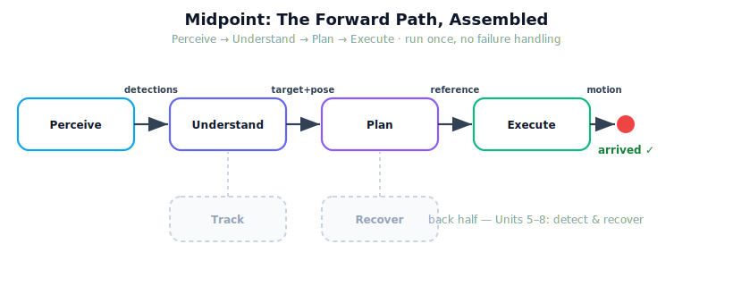

!!! abstract "You are here"
    **Module 9 — System Integration — The Complete Physical AI System**  ·  **Unit 4 — Plan → Execute**  ·  **Lesson 4.4 — Unit 4 Recap and Midpoint Checkpoint: The Forward Path, Assembled**

# Lesson 4.4 — Unit 4 Recap and Midpoint Checkpoint: The Forward Path, Assembled

> Halfway. Units 1–4 read the world and moved toward a goal — the forward path. This checkpoint assembles all four stages into one run, perception to motion, and confirms the gripper reaches the fruit. With the forward path proven, the back half can safely add what is still missing: noticing when things go wrong, and recovering.

---

## 1. Why This Matters
A midpoint is a deliberate pause to prove the foundation before building higher. Everything in Units 5–8 — tracking judgement, failure detection, recovery, orchestration — assumes the forward path actually works: that a perceived fruit becomes a committed target, a configuration, a plan, and real motion that arrives. This checkpoint runs exactly that, once, on the real layers, with no safety net. If it reaches the fruit, the layers compose and the back half is built on solid ground. If it did not, we would fix it here rather than discover it under recovery logic later. Proving the forward path is the whole point of the midpoint.

## 2. Physical Intuition
A dress rehearsal of the first act. We have staged each scene — perceive, decide, plan, move — and now we run them in sequence, start to finish, to see that the play flows. No understudy for mistakes yet (that is the second act: detection and recovery). The rehearsal's success criterion is simple: did the actor cross the stage and arrive on the mark? For the robot: did the gripper reach the tomato? If yes, the first act holds.

## 3. Mathematical Foundations
The forward path, composed and run once:

$$\text{world} \xrightarrow{\text{Perceive}} D \xrightarrow{\text{Understand}} w^\star \xrightarrow{\text{IK}} q_{\text{goal}} \xrightarrow{\text{Plan}} \texttt{reference}(t) \xrightarrow{\text{Execute}} q(t),\quad \mathrm{FK}(q(\text{end})) \approx \mathbf{x}_{w^\star}.$$

The checkpoint's success predicate is the conjunction of every stage's check: a committed ripe-and-reachable target; an FK-verified goal configuration; a validated reference; and an executed motion whose final forward kinematics lands on the target within tolerance. Crucially, **no Recover stage runs** — the forward path is exercised in isolation. This both proves composition and sets up the contrast: the back half will inject a failure into this very run and require the system to detect and recover from it.

## 4. Visual Explanation

<figure markdown>
  { width="680" }
</figure>

## 5. Engineering Example
The full forward run on the real layers. Perceive yields detections from a seeded greenhouse row; Understand commits the nearest ripe, reachable fruit and hands its pose forward; IK returns an FK-verified goal configuration; the planner returns a validated reference; the motion stack tracks it to RMS ≈ 0.0001 rad; forward kinematics of the final joint state lands on the target. One command, four stages, perception to motion, gripper on the fruit — with no failure handling anywhere in the loop. That is the midpoint passing.

## 6. Worked Example
Self-test, answered. *Question:* the midpoint run reaches the target. A teammate says "great, the robot is done — ship it." What is the one-sentence rebuttal? *Answer:* the forward path works *when nothing goes wrong*, but the run has **no failure detection and no recovery** — it cannot yet notice an occluded fruit mid-reach, a diverging tracking error, or an unreachable target chosen under noise, let alone respond to them; that is exactly what Units 5–8 add. Being able to state crisply what the midpoint does *not* yet cover is the checkpoint's real outcome.

## 7. Interactive Demonstration

<iframe src="../../demos/module09/lesson16_midpoint_motion_stack.html" title="Unit 4 Recap and Midpoint Checkpoint: The Forward Path, Assembled interactive demo" style="width:100%;height:520px;border:1px solid #e2e8f0;border-radius:12px"></iframe>

[Open this demo in a new tab ↗](../demos/module09/lesson16_midpoint_motion_stack.html)

*(Conceptual — runnable in the notebook and the flagship demo.)*
A single "run the forward path" button that prints a four-stamp trace (perceive → understand → plan → execute) ending in "arrived ✓", with the planned vs. actual joint trajectory plotted. The flagship Motion Stack Visualizer shows the same run as animated motion. The demonstration is the midpoint in miniature: the whole forward half, in one click.

## 8. Coding Exercise

!!! tip "Run the hands-on notebook"
    `modules/module09/notebooks/lesson16_unit4_recap_midpoint.ipynb` — open in JupyterLab and run **Kernel → Restart & Run All**.

*(The midpoint notebook runs the assembled forward path.)*
Wire `model_perception → understand → to_configuration → plan_reference → execute_reference` into one function and assert the full success predicate: committed target ripe and reachable; FK-verified configuration; validated reference; execution `reached` the target; and FK of the final joint state matches the target pose. Passing this single run is the midpoint checkpoint — evidence the forward path composes end to end on the real layers.

## 9. Knowledge Check

Formative — unlimited attempts, immediate feedback; does not affect your grade.

<iframe src="../../quizzes/module09/lesson16_quiz.html" title="Unit 4 Recap and Midpoint Checkpoint: The Forward Path, Assembled knowledge check" style="width:100%;height:720px;border:1px solid #e2e8f0;border-radius:12px"></iframe>

[Open this quiz in a new tab ↗](../quizzes/module09/lesson16_quiz.html)

*(Formative — unlimited attempts, immediate feedback.)*
Mixed review across Units 1–4: the forward path's four stages and their owners, the checks that compose into the success predicate, why the midpoint runs without failure handling, and what the back half adds.

## 10. Challenge Problem
The midpoint run reaches one fruit. Sketch how you would extend it to harvest a *whole row* of fruit in sequence, and identify the single new failure mode the row introduces that a single pick never faced (hint: what happens when, partway down the row, the next-ranked fruit becomes unreachable or a tracking error diverges?). State which back-half unit (5, 6, 7, or 8) is responsible for *detecting* it and which for *recovering* — connecting the midpoint to the rest of the module.

## 11. Common Mistakes
- **Mistaking the midpoint for completion.** The forward path works only when nothing goes wrong; detection and recovery are still missing.
- **Skipping a stage check.** The success predicate is the conjunction of all four stages' checks; a silent miss in one invalidates the run.
- **Feeding planned instead of actual state forward.** For sequential picks, the arm's actual final configuration is the next start.
- **Adding theory at the checkpoint.** The midpoint only assembles and runs verified layers; nothing new is introduced.

## 12. Key Takeaways
- The **forward path** — Perceive → Understand → Plan → Execute — is assembled and run once, perception to physical motion.
- The midpoint **success predicate** is the conjunction of every stage's check, ending in FK of the executed state reaching the target.
- The run has **no failure handling**: it proves composition and sets up the back half.
- **Units 5–8** add what is missing: judging tracking (Track), detecting failures, recovering, and orchestrating the whole cycle.
- Passing the midpoint **de-risks the second half** by proving the layers connect before recovery is layered on.

---

## AI Learning Companion
Copy any prompt into an AI assistant.

**Tutor prompt** — explain it another way
```
Quiz me on the forward path of a robot pipeline (perceive → understand → plan → execute): the four stages, their checks, and what's still missing at the midpoint.
```
**Practice prompt** — generate more exercises
```
Give me 5 mixed-review questions covering perception→target→configuration→plan→execution and what failure handling the forward path still lacks, with answers.
```
**Explore prompt** — connect it to the real world
```
Show me how real robot projects validate a full perceive-to-motion pipeline before adding failure detection and recovery.
```

## Global Learning Support
Need this lesson in another language? Copy a prompt below into an AI assistant. English is the authoritative source.

**Supported languages (initial):** English · Español · 中文 (Simplified Chinese) · Türkçe

```
I just completed Lesson 4.4 — Unit 4 Recap and Midpoint Checkpoint.
Explain this lesson in Español. Keep robotics/math terminology in English where appropriate.
Then provide: a summary, three practice questions, and one challenge problem.
```
```
I just completed Lesson 4.4 — Unit 4 Recap and Midpoint Checkpoint.
Explain this lesson in 中文 (Simplified Chinese). Keep robotics/math terminology in English where appropriate.
Then provide: a summary, three practice questions, and one challenge problem.
```
```
I just completed Lesson 4.4 — Unit 4 Recap and Midpoint Checkpoint.
Explain this lesson in Türkçe. Keep robotics/math terminology in English where appropriate.
Then provide: a summary, three practice questions, and one challenge problem.
```

---

*Next lesson: 5.1 — Closing the Loop: Tracking Error and Success Criteria (Installment C opens the back half — Execute → Track).*
