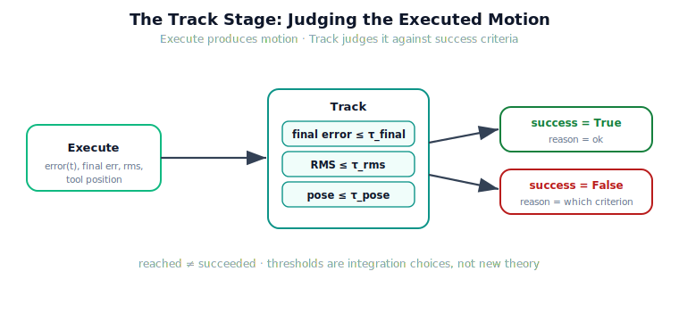

!!! abstract "You are here"
    **Module 9 — System Integration — The Complete Physical AI System**  ·  **Unit 5 — Execute → Track**  ·  **Lesson 5.1 — Closing the Loop: Tracking Error and Success Criteria**

# Lesson 5.1 — Closing the Loop: Tracking Error and Success Criteria

> The midpoint run reached the fruit — but *who decided* it reached the fruit? Execute drove the joints; something else has to look at the result and say "success" or "not yet." That something is the Track stage, and this lesson gives it explicit criteria and clear ownership. Installment C opens the back half of the pipeline here.

---

## 1. Why This Matters
Until now, "did it work?" was answered informally — we eyeballed the final error. A real system cannot eyeball; it needs an explicit, owned judgement: given this executed run, did the pick succeed, by stated criteria? That judgement is the Track stage. Separating it from Execute matters because the two answer different questions — Execute asks "what motion happened?", Track asks "is that motion good enough?" — and confusing them is how systems either declare false success (the arm moved, so ship it) or never notice failure at all. Track is the gate that turns motion into a verdict, and the verdict is what the back half (failure detection, recovery) acts on.

## 2. Physical Intuition
Driving the car versus checking you parked. Pressing the pedals and turning the wheel is execution; *then* you look — am I inside the lines, close enough to the curb, not touching the next car? Those are success criteria, and the check is a separate act from the driving. You can drive smoothly and still park badly; you can drive roughly and still park fine. The motion and the judgement are distinct, and a careful driver always does both. Track is the robot looking up after the move and deciding whether it parked.

## 3. Mathematical Foundations
The Track stage reads Execute's output — it adds no control. Given the execution record (the per-tick error $e(t) = q_d(t) - q(t)$, the final per-joint error, and the tracking RMS $\sqrt{\langle e^2\rangle}$) and the target pose, it evaluates explicit **success criteria**:

$$\text{success} = \underbrace{(\max_j |e_j(\text{end})| \le \tau_{\text{final}})}_{\text{arrived in joint space}} \;\wedge\; \underbrace{(\text{RMS} \le \tau_{\text{rms}})}_{\text{tracked well throughout}} \;\wedge\; \underbrace{(\lVert \mathbf{x}_{\text{tool}} - \mathbf{x}_{\text{target}}\rVert \le \tau_{\text{pose}})}_{\text{reached the fruit}}.$$

The verdict is the conjunction, plus a **reason** localising the first criterion that failed. Two distinctions matter. First, *reached* (the joints settled near the reference's end) is necessary but not sufficient for *succeeded* (the tool is actually at the target with good tracking) — a plan to the wrong place could "reach" perfectly. Second, the thresholds $\tau$ are **integration choices**, not new theory: they encode how good is good enough for this task. Track owns choosing and applying them; Module 8 owns only producing the error they judge.

## 4. Visual Explanation

<figure markdown>
  { width="680" }
</figure>

## 5. Engineering Example
The F3 pick, judged. Execute returned a run with final per-joint error ≈ 0.0001 rad and tracking RMS ≈ 0.0001 rad; forward kinematics of the final state sits 0.0000 m from F3. Track applies its criteria ($\tau_{\text{final}} = 0.05$, $\tau_{\text{rms}} = 0.02$, $\tau_{\text{pose}} = 0.01$): all three pass, so the verdict is `success = True, reason = "ok"`. Now a degraded run: a strong sustained disturbance on joint 0 leaves a final error of ≈ 2.0 rad. Track's first criterion fails, so the verdict is `success = False, reason = "final_error"` — the judgement not only says *no*, it says *which criterion* said no. That `reason` is the first step of fault localisation, which Unit 6 builds on.

## 6. Worked Example
A run returns: final error 0.01 rad (≤ 0.05 ✓), RMS 0.03 rad (> 0.02 ✗), pose error 0.004 m (≤ 0.01 ✓). What is the verdict, and what does it mean?

Reasoning: the arm *ended* close to the reference and the tool *is* near the target, but the *RMS* criterion failed — the tracking was poor *along the way* even though it settled correctly at the end. Verdict: `success = False, reason = "rms"`. This is a real and useful distinction: a run can arrive correctly yet have tracked badly mid-flight (oscillation, a transient disturbance), which may matter for a delicate pick or signal an underlying problem. Track surfaces it because RMS is one of its criteria; an end-point-only check would have wrongly passed this run.

## 7. Interactive Demonstration

<iframe src="../../demos/module09/lesson17_success_criteria.html" title="Closing the Loop: Tracking Error and Success Criteria interactive demo" style="width:100%;height:520px;border:1px solid #e2e8f0;border-radius:12px"></iframe>

[Open this demo in a new tab ↗](../demos/module09/lesson17_success_criteria.html)

*(Conceptual — runnable in the notebook and the Installment-C flagship demo.)*
A run with a slider for disturbance strength: at low strength the three criteria all stay green (success); as you increase it, watch the RMS criterion trip first, then the final-error criterion, the verdict flipping to failure with the `reason` naming which one. The demonstration makes "reached vs. succeeded" and the per-criterion reason concrete.

## 8. Coding Exercise

!!! tip "Run the hands-on notebook"
    `modules/module09/notebooks/lesson17_tracking_and_success.ipynb` — open in JupyterLab and run **Kernel → Restart & Run All**.

*(The notebook runs the real Track stage.)*
Execute a healthy pick and call `track(record, target)`; assert the verdict is `success = True` with `reason = "ok"`. Then execute the same plan under a strong disturbance and assert `track` returns `success = False` with a `reason` naming the failed criterion. This verifies that Track judges Execute's output and localises the failing criterion.

## 9. Knowledge Check

Formative — unlimited attempts, immediate feedback; does not affect your grade.

<iframe src="../../quizzes/module09/lesson17_quiz.html" title="Closing the Loop: Tracking Error and Success Criteria knowledge check" style="width:100%;height:720px;border:1px solid #e2e8f0;border-radius:12px"></iframe>

[Open this quiz in a new tab ↗](../quizzes/module09/lesson17_quiz.html)

*(Formative — unlimited attempts, immediate feedback.)*
Confirm the Execute/Track split, the three success criteria, the difference between *reached* and *succeeded*, that the thresholds are integration choices, and that the verdict carries a localising reason.

## 10. Challenge Problem
The pose criterion ($\lVert \mathbf{x}_{\text{tool}} - \mathbf{x}_{\text{target}}\rVert \le \tau_{\text{pose}}$) can pass while the joint-space final-error criterion fails, or vice versa, depending on the configuration. Construct a scenario where the *tool* is at the target but a *joint* still has large error (hint: think about redundancy or a configuration where one joint's error barely moves the tool), and argue which criterion should govern "success" for a harvesting pick. Keep your answer about *choosing criteria* (an integration decision) — do not invent new control or estimation.

## 11. Common Mistakes
- **Conflating Execute and Track.** Execute moves the arm; Track decides if the move succeeded. They are different stages with different owners.
- **End-point-only judgement.** Checking just the final error misses runs that tracked badly mid-flight; RMS is a criterion too.
- **Treating "reached" as "succeeded".** Settling near the reference's end does not guarantee the tool is at the right place with good tracking.
- **Hiding the reason.** A bare pass/fail is less useful than a verdict that names which criterion failed — that reason starts fault localisation.

## 12. Key Takeaways
- **Execute produces motion; Track judges it** against explicit, owned success criteria.
- The criteria are **final error, tracking RMS, and tool-pose reached** — their thresholds are integration choices, not new theory.
- **Reached ≠ succeeded**: settling near the reference's end is necessary but not sufficient for a successful pick.
- The Track verdict carries a **reason** localising the first failed criterion — the first step of fault localisation.
- Track is the gate that turns Execute's motion into a verdict the back half can act on.

---

## AI Learning Companion
Copy any prompt into an AI assistant.

**Tutor prompt** — explain it another way
```
Re-explain Lesson 5.1 by separating "the robot moved" from "the task succeeded", and listing the success criteria a Track stage checks.
```
**Practice prompt** — generate more exercises
```
Give me 4 exercises where I'm given a run's final error, RMS, and pose error, and must return a pass/fail verdict with the failing criterion. With answers.
```
**Explore prompt** — connect it to the real world
```
Show me how real robot systems define and check task-success criteria separately from executing the motion.
```

## Global Learning Support
Need this lesson in another language? Copy a prompt below into an AI assistant. English is the authoritative source.

**Supported languages (initial):** English · Español · 中文 (Simplified Chinese) · Türkçe

```
I just completed Lesson 5.1 — Closing the Loop: Tracking Error and Success Criteria.
Explain this lesson in Español. Keep robotics/math terminology in English where appropriate.
Then provide: a summary, three practice questions, and one challenge problem.
```
```
I just completed Lesson 5.1 — Closing the Loop: Tracking Error and Success Criteria.
Explain this lesson in 中文 (Simplified Chinese). Keep robotics/math terminology in English where appropriate.
Then provide: a summary, three practice questions, and one challenge problem.
```
```
I just completed Lesson 5.1 — Closing the Loop: Tracking Error and Success Criteria.
Explain this lesson in Türkçe. Keep robotics/math terminology in English where appropriate.
Then provide: a summary, three practice questions, and one challenge problem.
```

---

*Next lesson: 5.2 — System Monitoring: Telemetry and the Info Dictionaries (the health signals every layer already emits).*
