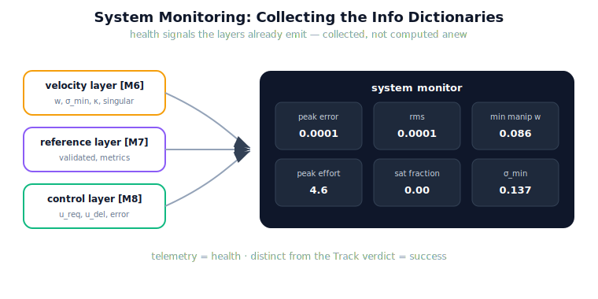

!!! abstract "You are here"
    **Module 9 — System Integration — The Complete Physical AI System**  ·  **Unit 5 — Execute → Track**  ·  **Lesson 5.2 — System Monitoring: Telemetry and the Info Dictionaries**

# Lesson 5.2 — System Monitoring: Telemetry and the Info Dictionaries

> A good operator does not wait for the machine to fail — they watch the gauges. The greenhouse robot already has gauges: each layer returns an info dictionary of health signals every time it runs. This lesson collects those scattered readings into one dashboard, so the system's health is visible at a glance — the prerequisite for detecting failure in Unit 6.

---

## 1. Why This Matters
Failure detection (Unit 6) needs something to watch. That something already exists: the layers were built to report on themselves. The velocity layer reports how far the arm is from a singularity; the planner reports whether the trajectory validated; the controller reports how hard it is working. These are health signals, emitted continuously, and ignoring them is like driving with the dashboard covered. Monitoring is the discipline of *collecting* them — not adding new sensors or new theory, but reading what the system already says about itself. A run's telemetry is the evidence base for every judgement the back half will make.

## 2. Physical Intuition
The cockpit instrument panel. A pilot does not infer engine trouble from the plane falling out of the sky; they read the oil-pressure gauge, the temperature, the fuel flow — signals the engine emits continuously, gathered onto one panel. Each gauge alone is a number; together they are situational awareness. Telemetry is the robot's instrument panel: manipulability, validation, control effort, tracking error, all in one view, so a developer (and later, the detector) can see the run's health while it happens, not only after it crashes.

## 3. Mathematical Foundations
The health signals, by layer — all already emitted, none new:

- **Velocity layer (M6):** for the configuration $q$, the manipulability $w = \prod_i \sigma_i$ (product of the Jacobian's singular values, the locked convention), the smallest singular value $\sigma_{\min}$, the condition number $\kappa$, and a `singular` flag. *Reads as:* how much freedom the arm has to move the tool here — small $w$ or $\sigma_{\min}$ means near a singularity.
- **Reference layer (M7):** the `validated` flag and trajectory metrics. *Reads as:* was the plan feasible.
- **Control layer (M8):** per tick, the requested vs. delivered effort $(u_{\text{req}}, u_{\text{del}})$ and its feed-forward/feedback split. *Reads as:* how hard the controller is working, and whether the actuator is saturating ($u_{\text{req}} \ne u_{\text{del}}$).
- **Execution record:** the tracking error $e(t)$, its peak, and RMS. *Reads as:* how well the motion followed the plan.

System monitoring collects these into one summary — peak error, RMS, minimum manipulability, minimum $\sigma_{\min}$, peak effort, saturation fraction. This is pure **observation**: a function of existing outputs, introducing no estimation theory. The dashboard is distinct from the Track verdict — telemetry describes *health*; the verdict pronounces *success*. A run can succeed while showing worrying health (a near-singular pass), and that is exactly what monitoring exists to reveal.

## 4. Visual Explanation

<figure markdown>
  { width="680" }
</figure>

## 5. Engineering Example
Two runs, one dashboard each. The healthy F3 pick: peak error 0.0001 rad, RMS 0.0001, minimum manipulability 0.086 (comfortably away from zero), peak effort 4.6, saturation fraction 0.0. Every gauge nominal. The disturbed pick: peak error 2.2 rad, peak effort 70 (the controller straining against the disturbance), manipulability still fine. Same instruments, two very different stories — and crucially, the dashboard shows *where the strain is* (effort and error spiked; manipulability did not), which the next units will use to localise the fault. Note the gauges came for free: every number was already in a layer's info dictionary.

## 6. Worked Example
You are handed a run's telemetry: peak error 0.002 rad (small), RMS 0.001 (small), minimum manipulability 0.004 (very small), peak effort 9 (moderate). The Track verdict is `success = True`. Is everything fine?

Reasoning: the *task* succeeded — error and tracking are excellent. But the *health* gauge for manipulability is alarming: 0.004 means the arm passed very close to a singularity, where small tool motions demand large joint rates and the velocity mapping is ill-conditioned. This run succeeded, but barely, through a fragile region; a slightly different target might not. Monitoring surfaces this latent risk that the success verdict alone hides. The right reading: "succeeded, but with a near-singular health warning" — a flag worth investigating even though nothing failed *this* time. That gap between *success* and *health* is the whole reason to monitor.

## 7. Interactive Demonstration
*(Conceptual — runnable in the notebook and the flagship demo.)*
A live dashboard alongside a running pick: error, effort, and manipulability gauges updating over the trajectory. Drive the target toward a singular configuration and watch the manipulability gauge sink toward zero and the effort gauge climb, even while the run still "succeeds." The demonstration makes the health-vs-success distinction visible on the instruments.

## 8. Coding Exercise

!!! tip "Run the hands-on notebook"
    `modules/module09/notebooks/lesson18_system_monitoring.ipynb` — open in JupyterLab and run **Kernel → Restart & Run All**.

*(The notebook collects real telemetry.)*
Run `execute_reference(layer, telemetry=True)` and `system_monitor(record)`; assert the summary contains the expected health signals (peak error, RMS, min manipulability, peak effort, saturation fraction) and that a healthy run shows small error and effort with manipulability bounded away from zero. Then run a disturbed pick and assert the dashboard reflects the elevated error and effort. This verifies monitoring as collection of existing signals.

## 9. Knowledge Check

Formative — unlimited attempts, immediate feedback; does not affect your grade.

<iframe src="../../quizzes/module09/lesson18_quiz.html" title="System Monitoring: Telemetry and the Info Dictionaries knowledge check" style="width:100%;height:720px;border:1px solid #e2e8f0;border-radius:12px"></iframe>

[Open this quiz in a new tab ↗](../quizzes/module09/lesson18_quiz.html)

*(Formative — unlimited attempts, immediate feedback.)*
Confirm which health signal each layer emits, that monitoring collects rather than computes anew, the difference between telemetry (health) and the Track verdict (success), and what a low manipulability reading means.

## 10. Challenge Problem
The saturation signal ($u_{\text{req}} \ne u_{\text{del}}$) is in the controller's info dictionary but reads zero whenever the actuator has effectively unlimited range. Explain why saturation is nonetheless a health signal worth monitoring (what does a nonzero saturation fraction tell you about the relationship between the *plan* and the *actuator's limits*?), and which stage would own responding to persistent saturation. Frame it as reading an existing signal — do not propose new actuator modelling.

## 11. Common Mistakes
- **Building new instrumentation.** The signals already exist in the layers' info dictionaries; monitoring collects them.
- **Confusing health with success.** A run can succeed while showing worrying telemetry (a near-singular pass); the dashboard exists to reveal that.
- **Watching one gauge.** Situational awareness comes from the panel as a whole — error *and* effort *and* manipulability together.
- **Reading telemetry only after failure.** The point of monitoring is to see health *during* the run, not to autopsy it afterward.

## 12. Key Takeaways
- Every layer already emits **health signals**: M6 manipulability/$\sigma_{\min}$/$\kappa$, M7 `validated`, M8 effort $u_{\text{req}}/u_{\text{del}}$, plus the tracking error.
- **System monitoring collects** these existing info dictionaries into one dashboard — observation, not new theory.
- Telemetry describes **health**; the Track verdict pronounces **success** — a run can succeed with poor health.
- A low **manipulability** reading warns of a near-singular pass; high **effort** warns of strain; **saturation** warns the plan exceeds the actuator.
- The dashboard is the evidence base the back half (failure detection) reads.

---

## AI Learning Companion
Copy any prompt into an AI assistant.

**Tutor prompt** — explain it another way
```
Re-explain Lesson 5.2 by treating each robot layer's "info dictionary" as a cockpit gauge, and describing the dashboard they form together.
```
**Practice prompt** — generate more exercises
```
Give me 4 exercises where I read a telemetry dashboard (error, effort, manipulability, saturation) and describe the run's health, separate from whether it succeeded. With answers.
```
**Explore prompt** — connect it to the real world
```
Show me what telemetry real robots emit (joint effort, condition number, tracking error) and how operators monitor it live.
```

## Global Learning Support
Need this lesson in another language? Copy a prompt below into an AI assistant. English is the authoritative source.

**Supported languages (initial):** English · Español · 中文 (Simplified Chinese) · Türkçe

```
I just completed Lesson 5.2 — System Monitoring: Telemetry and the Info Dictionaries.
Explain this lesson in Español. Keep robotics/math terminology in English where appropriate.
Then provide: a summary, three practice questions, and one challenge problem.
```
```
I just completed Lesson 5.2 — System Monitoring: Telemetry and the Info Dictionaries.
Explain this lesson in 中文 (Simplified Chinese). Keep robotics/math terminology in English where appropriate.
Then provide: a summary, three practice questions, and one challenge problem.
```
```
I just completed Lesson 5.2 — System Monitoring: Telemetry and the Info Dictionaries.
Explain this lesson in Türkçe. Keep robotics/math terminology in English where appropriate.
Then provide: a summary, three practice questions, and one challenge problem.
```

---

*Next lesson: 5.3 — Case Study: Reading Telemetry (a healthy run and a degraded run, read side by side).*
