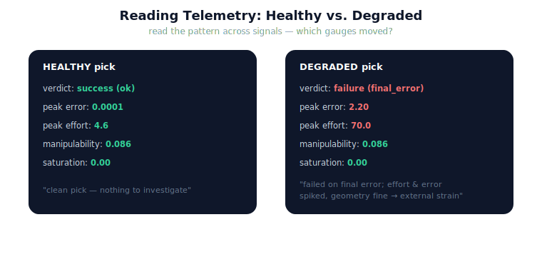

!!! abstract "You are here"
    **Module 9 — System Integration — The Complete Physical AI System**  ·  **Unit 5 — Execute → Track**  ·  **Lesson 5.3 — Case Study: Reading Telemetry**

# Lesson 5.3 — Case Study: Reading Telemetry

> Gauges are only useful if you can read them. This case study runs two picks — one healthy, one degraded — and practises turning their telemetry into an assessment: what happened, how healthy was it, and where would you look next. It is the reading skill that the whole back half depends on.

---

## 1. Why This Matters
Unit 6 will ask the system to *detect* failure automatically; before automating a judgement, you must be able to make it yourself. This case study builds that human skill: given a run's telemetry and verdict, say in a sentence what occurred and how sound it was. The skill transfers directly — the guards Unit 6 writes are just this reading, encoded. And it begins the Architect's three-question discipline (*what failed? where? who owns the fix?*) at the level of observation: the telemetry is the evidence you reason from. A developer who can read these signals can debug the integrated system; one who cannot is flying blind.

## 2. Physical Intuition
A doctor reading two charts. One patient's vitals are all nominal — a clean bill. The other's chart shows a normal temperature but a racing pulse and high blood pressure: something is straining the system even though no single number is catastrophic. The doctor does not panic at one reading or relax at another; they read the pattern across the chart and form an assessment. Reading telemetry is the same diagnostic act: not "is this one number bad?" but "what story do these signals, together, tell about this run?"

## 3. Mathematical Foundations
The reading combines the **Track verdict** (success and its reason, Lesson 5.1) with the **telemetry dashboard** (health signals, Lesson 5.2) into an assessment. A useful reading addresses three things, all from existing signals:

1. **Outcome** — did it succeed (verdict), and if not, which criterion failed (reason)?
2. **Health** — what do the gauges say: peak error, peak effort, minimum manipulability, saturation? Nominal, strained, or alarming?
3. **Where to look** — which signal moved most relative to the healthy baseline, pointing at the stage or condition involved?

Formally there is nothing new: success $= \bigwedge_k \text{criterion}_k$, and each gauge is a reduction (max, mean, min) of an existing per-tick signal. The content is *interpretation*: mapping numbers to a sentence. A degraded run whose effort and error spiked while manipulability stayed nominal reads as "an external strain on execution, not a geometry problem" — a localisation hint that Unit 6 will sharpen into a taxonomy. The case study is reading practice, not new machinery.

## 4. Visual Explanation

<figure markdown>
  { width="680" }
</figure>

## 5. Engineering Example
The two F3 picks, read aloud. **Healthy:** verdict `success`, peak error 0.0001 rad, peak effort 4.6, manipulability 0.086, no saturation. *Reading:* "A clean pick — tracked tightly, light effort, comfortable distance from any singularity; nothing to investigate." **Degraded** (sustained disturbance on joint 0): verdict `failure, reason = final_error`, peak error 2.2 rad, peak effort 70, manipulability still 0.086. *Reading:* "The pick failed on final error; effort and tracking error spiked hard while manipulability stayed nominal — so the trouble is an external strain on execution, not the arm's geometry. Look at what perturbed joint 0 during the run." That last sentence is fault localisation in embryo — exactly what Unit 6 systematises.

## 6. Worked Example
A third run to read on your own, answered. Telemetry: verdict `failure, reason = rms`; peak error 0.4 rad; peak effort 12; minimum manipulability 0.003; saturation fraction 0.0. What happened, and where would you look?

Reasoning: the run failed on RMS (poor tracking *throughout*, though it may have settled), with moderate peak error and effort — but the standout signal is manipulability at 0.003, an order of magnitude below the healthy 0.086. That says the trajectory passed very near a singularity, where the velocity mapping is ill-conditioned and tracking naturally degrades. *Reading:* "Failed on tracking quality, most likely because the planned path grazed a near-singular configuration — a geometry/planning condition, not an external disturbance. Look at the configurations the plan traversed." Different signal moved, different place to look — the reading discipline localises it.

## 7. Interactive Demonstration

<iframe src="../../demos/module09/lesson19_reading_telemetry.html" title="Case Study: Reading Telemetry interactive demo" style="width:100%;height:520px;border:1px solid #e2e8f0;border-radius:12px"></iframe>

[Open this demo in a new tab ↗](../demos/module09/lesson19_reading_telemetry.html)

*(Conceptual — runnable in the notebook and the flagship demo.)*
Two runs on screen with their dashboards; a control to switch the degradation between "external disturbance" and "near-singular path." Watch which gauge moves in each case — effort/error for the disturbance, manipulability for the singularity — and practise reading the difference. The demonstration trains the eye to map a signal pattern to a cause.

## 8. Coding Exercise

!!! tip "Run the hands-on notebook"
    `modules/module09/notebooks/lesson19_telemetry_case_study.ipynb` — open in JupyterLab and run **Kernel → Restart & Run All**.

*(The notebook reads real telemetry.)*
Run a healthy pick and a disturbed pick with `telemetry=True`, call `track` and `system_monitor` on each, and print a side-by-side comparison. Assert: the healthy run's verdict is success with small effort/error; the disturbed run's verdict is failure with elevated peak error and effort but comparable manipulability. Write (in a comment) the one-sentence reading of each run. This practises reading telemetry into an assessment.

## 9. Knowledge Check

Formative — unlimited attempts, immediate feedback; does not affect your grade.

<iframe src="../../quizzes/module09/lesson19_quiz.html" title="Case Study: Reading Telemetry knowledge check" style="width:100%;height:720px;border:1px solid #e2e8f0;border-radius:12px"></iframe>

[Open this quiz in a new tab ↗](../quizzes/module09/lesson19_quiz.html)

*(Formative — unlimited attempts, immediate feedback.)*
Confirm how to combine verdict and telemetry into a reading, what a spike in effort vs. a drop in manipulability respectively suggest, and how the reading begins localising what happened.

## 10. Challenge Problem
You are given only the telemetry summary (no description of what was done to the run) for three picks: (A) success, all gauges nominal; (B) failure reason `final_error`, effort and error high, manipulability nominal; (C) success, but minimum manipulability 0.002 and peak effort high. Write the one-sentence reading for each, and for (C) explain why a *successful* run still warrants a flag. Then state which of the three questions — *what failed? where? who owns the fix?* — your readings have started to answer, and which still need Unit 6.

## 11. Common Mistakes
- **Reading one gauge in isolation.** The assessment comes from the pattern across signals, not a single number.
- **Equating success with health.** Run (C) succeeds yet is fragile; telemetry catches what the verdict misses.
- **Stopping at pass/fail.** The reason and the gauges tell you *where to look*, which is the point.
- **Inventing causes not in the signals.** Read what the telemetry supports; the formal taxonomy of causes is Unit 6.

## 12. Key Takeaways
- Reading telemetry combines the **Track verdict (outcome)** with the **dashboard (health)** into a plain-language assessment.
- A **spike in effort/error with nominal manipulability** reads as external strain on execution; a **drop in manipulability** reads as a near-singular geometry/planning condition.
- A **successful** run can still warrant a flag (fragile health) — telemetry reveals what the verdict hides.
- The reading **begins localising** what happened ("where to look"), the on-ramp to Unit 6's taxonomy.
- This human reading skill is exactly what the automated failure-detection guards will encode.

---

## AI Learning Companion
Copy any prompt into an AI assistant.

**Tutor prompt** — explain it another way
```
Re-explain Lesson 5.3 by reading two robot runs' telemetry like medical charts and saying what each shows about the run's health and outcome.
```
**Practice prompt** — generate more exercises
```
Give me 4 telemetry-reading exercises: a verdict plus gauges (error, effort, manipulability), and I write the one-sentence assessment and where to look. With answers.
```
**Explore prompt** — connect it to the real world
```
Show me how engineers diagnose a robot run from its telemetry logs and which signals point to disturbances vs. near-singular configurations.
```

## Global Learning Support
Need this lesson in another language? Copy a prompt below into an AI assistant. English is the authoritative source.

**Supported languages (initial):** English · Español · 中文 (Simplified Chinese) · Türkçe

```
I just completed Lesson 5.3 — Case Study: Reading Telemetry.
Explain this lesson in Español. Keep robotics/math terminology in English where appropriate.
Then provide: a summary, three practice questions, and one challenge problem.
```
```
I just completed Lesson 5.3 — Case Study: Reading Telemetry.
Explain this lesson in 中文 (Simplified Chinese). Keep robotics/math terminology in English where appropriate.
Then provide: a summary, three practice questions, and one challenge problem.
```
```
I just completed Lesson 5.3 — Case Study: Reading Telemetry.
Explain this lesson in Türkçe. Keep robotics/math terminology in English where appropriate.
Then provide: a summary, three practice questions, and one challenge problem.
```

---

*Next lesson: 5.4 — Unit 5 Recap (Execute → Track consolidated, before Unit 6 turns reading into automatic detection).*
