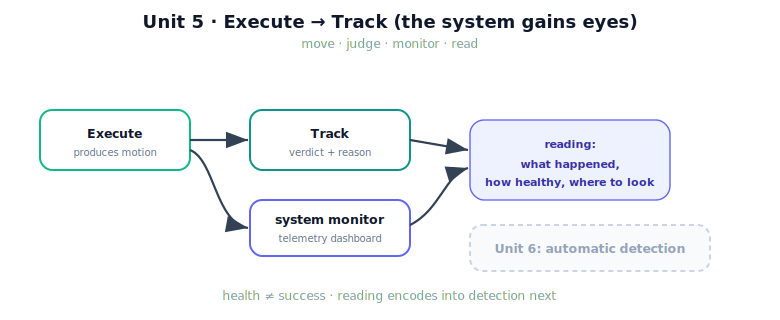

!!! abstract "You are here"
    **Module 9 — System Integration — The Complete Physical AI System**  ·  **Unit 5 — Execute → Track**  ·  **Lesson 5.4 — Unit 5 Recap: Execute → Track**

# Lesson 5.4 — Unit 5 Recap: Execute → Track

> Unit 5 gave the system eyes. It can now move *and* judge the move, watch its own health while doing so, and read the result. This recap consolidates that into one model — and points at Unit 6, where reading becomes detecting.

---

## 1. Why This Matters
Detection, recovery, and orchestration all stand on the Track stage. If the system cannot judge a run and read its health, it cannot notice failure, let alone respond. Unit 5 built exactly that judgement and that visibility. Consolidating it — what Track owns, how telemetry is collected, why health differs from success — is what lets Unit 6 add automatic detection cleanly, as encoded readings rather than new machinery.

## 2. Physical Intuition
Move, then look at the gauges and decide. Unit 4 was the moving; Unit 5 is the looking and deciding. You drove (Execute), you checked you parked within the lines by clear criteria (Track), you glanced at the dashboard for any warning lights (telemetry), and you read the overall picture (the case study). That full loop — act, judge, monitor, read — is what a competent operator does every time, and it is what the system now does for each pick.

## 3. Mathematical Foundations
Unit 5 in four lines:

- **Track verdict** (Lesson 5.1): $\text{success} = (\,|e_{\text{final}}| \le \tau_{\text{final}}) \wedge (\text{RMS} \le \tau_{\text{rms}}) \wedge (\text{pose} \le \tau_{\text{pose}})$, with a **reason** naming the first failed criterion. Track owns it; M8 only produced the error.
- **Telemetry** (Lesson 5.2): collect existing per-layer health signals — $w, \sigma_{\min}, \kappa$ (M6), `validated` (M7), $u_{\text{req}}/u_{\text{del}}$ (M8), tracking error — into one dashboard. Observation, not new theory.
- **Health ≠ success:** a run can succeed with worrying telemetry (a near-singular pass); monitoring reveals what the verdict hides.
- **Reading** (Lesson 5.3): combine verdict and gauges into an assessment that begins localising — *what happened, how healthy, where to look*.

The output of Unit 5 is a *judged, monitored, readable* run — the input Unit 6's detector needs.

## 4. Visual Explanation

<figure markdown>
  { width="680" }
</figure>

## 5. Engineering Example
The two F3 picks, one recap line each. Healthy: verdict `success`, dashboard all-nominal — "clean pick, nothing to investigate." Disturbed: verdict `failure (final_error)`, effort and error spiked, manipulability nominal — "failed on final error from an external strain on execution; look at what hit joint 0." Two runs, the same act-judge-monitor-read loop, two readings. If you can produce those readings from the telemetry, Unit 5 has done its job.

## 6. Worked Example
Self-test, answered. *Question:* a run returns verdict `success`, but the dashboard shows minimum manipulability 0.003 and high peak effort. Should the system be satisfied? *Answer:* the *task* succeeded, but the *health* is poor — the arm passed close to a singularity and worked hard to do so. A robust system flags this: success this time does not mean success next time from a slightly different target. The right disposition is "succeeded, with a near-singular health warning worth investigating." Distinguishing a healthy success from a fragile one is the core Unit 5 competence.

## 7. Interactive Demonstration

<iframe src="../../demos/module09/lesson20_unit5_recap.html" title="Unit 5 Recap: Execute → Track interactive demo" style="width:100%;height:520px;border:1px solid #e2e8f0;border-radius:12px"></iframe>

[Open this demo in a new tab ↗](../demos/module09/lesson20_unit5_recap.html)

*(Conceptual — runnable in the notebook and the flagship demo.)*
The recap demonstration runs a pick end to end and shows all of Unit 5 at once: the motion, the three success criteria evaluating to a verdict, the live telemetry dashboard, and a printed one-sentence reading. Toggle a disturbance or a near-singular target and watch the verdict and the relevant gauge respond together.

## 8. Coding Exercise

!!! tip "Run the hands-on notebook"
    `modules/module09/notebooks/lesson20_unit5_recap.ipynb` — open in JupyterLab and run **Kernel → Restart & Run All**.

*(The recap notebook runs the full Execute → Track loop.)*
For a healthy and a degraded run: `execute_reference(..., telemetry=True)`, then `track` and `system_monitor`, and assert the healthy run is a clean success with nominal gauges while the degraded run fails with the elevated signals. Print the one-sentence reading of each. Passing this is your evidence that Execute → Track works end to end on the real layers.

## 9. Knowledge Check

Formative — unlimited attempts, immediate feedback; does not affect your grade.

<iframe src="../../quizzes/module09/lesson20_quiz.html" title="Unit 5 Recap: Execute → Track knowledge check" style="width:100%;height:720px;border:1px solid #e2e8f0;border-radius:12px"></iframe>

[Open this quiz in a new tab ↗](../quizzes/module09/lesson20_quiz.html)

*(Formative — unlimited attempts, immediate feedback.)*
Mixed review across Unit 5: the Execute/Track split and ownership, the success criteria and reason, the per-layer health signals, health-vs-success, and reading telemetry into an assessment.

## 10. Challenge Problem
Unit 6 will write *guards* that fire automatically when a health signal crosses a threshold — turning your readings into detection. Pick one signal from Unit 5 (tracking error, effort, manipulability, or the verdict's reason) and sketch the guard you would write on it: what threshold, what it would catch, and — applying the Architect's three questions — *what failed, where, and who owns the fix* when it fires. This previews Unit 6 directly.

## 11. Common Mistakes
- **Letting Execute pronounce success.** The verdict is Track's; Execute only produces the motion Track judges.
- **Skipping the dashboard.** Without telemetry, health is invisible and only catastrophic failures get noticed.
- **Equating success and health.** A fragile success (near-singular, high effort) still warrants a flag.
- **Treating the reading as the end.** The reading localises *where to look*; automatic detection and the taxonomy are Unit 6.

## 12. Key Takeaways
- Unit 5 added the stage that **judges**: Execute moves, **Track** decides success against explicit criteria with a localising reason.
- **System monitoring** collects existing per-layer health signals into one dashboard — observation, not new theory.
- **Health ≠ success**: telemetry reveals fragile successes the verdict alone hides.
- **Reading telemetry** turns verdict + gauges into an assessment that begins localising what happened.
- Next, **Unit 6** encodes these readings as automatic **failure detection** and a integration-focused **taxonomy**.

---

## AI Learning Companion
Copy any prompt into an AI assistant.

**Tutor prompt** — explain it another way
```
Quiz me on Unit 5: Execute vs. Track, success criteria, telemetry health signals, and health-vs-success. Re-explain whatever I miss.
```
**Practice prompt** — generate more exercises
```
Give me 5 mixed-review questions on judging a run's success, collecting telemetry, and reading health signals, with answers.
```
**Explore prompt** — connect it to the real world
```
Show me how real robot systems separate task-success judgement from health monitoring, and how operators read both.
```

## Global Learning Support
Need this lesson in another language? Copy a prompt below into an AI assistant. English is the authoritative source.

**Supported languages (initial):** English · Español · 中文 (Simplified Chinese) · Türkçe

```
I just completed Lesson 5.4 — Unit 5 Recap: Execute → Track.
Explain this lesson in Español. Keep robotics/math terminology in English where appropriate.
Then provide: a summary, three practice questions, and one challenge problem.
```
```
I just completed Lesson 5.4 — Unit 5 Recap: Execute → Track.
Explain this lesson in 中文 (Simplified Chinese). Keep robotics/math terminology in English where appropriate.
Then provide: a summary, three practice questions, and one challenge problem.
```
```
I just completed Lesson 5.4 — Unit 5 Recap: Execute → Track.
Explain this lesson in Türkçe. Keep robotics/math terminology in English where appropriate.
Then provide: a summary, three practice questions, and one challenge problem.
```

---

*Next lesson: 6.1 — The Failure Taxonomy: Integration Events (Unit 6 opens — naming the failures the system must detect).*
