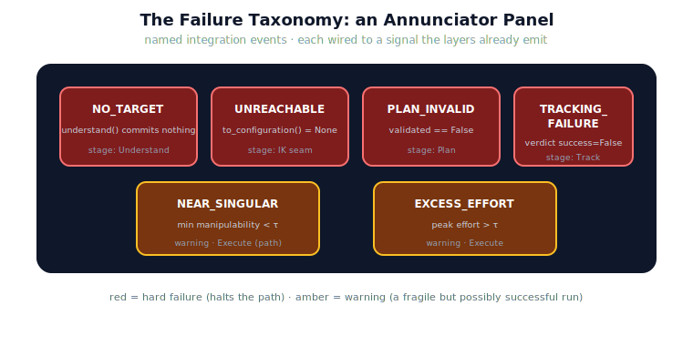

!!! abstract "You are here"
    **Module 9 — System Integration — The Complete Physical AI System**  ·  **Unit 6 — Failure Detection**  ·  **Lesson 6.1 — The Failure Taxonomy: Integration Events**

# Lesson 6.1 — The Failure Taxonomy: Integration Events

> "It failed" is not actionable. *Which* failure, at *which* seam, on *which* signal — that is. Unit 6 opens by naming the failures the greenhouse robot can have, not as exotic faults but as a short list of integration events the system already has the signals to see. A named taxonomy is what makes detection possible.

---

## 1. Why This Matters
You cannot detect what you have not named. Before writing a single guard, the system needs a vocabulary of failures: a finite set of conditions, each tied to a signal it already produces. Crucially, in an *integrated* system the failures that matter are not "the motor burned out" — they are *integration events*: the planner reported it could not validate, the tracker missed its criteria, perception committed nothing. These live at the seams, on the info dictionaries and verdicts the back half reads. Cataloguing them as a taxonomy converts an open-ended fear ("what if something breaks?") into a closed checklist the detector can sweep — and keeps us firmly in the integration lane, not building fault-diagnosis theory.

## 2. Physical Intuition
A pilot's checklist of annunciator lights. A cockpit does not have one vague "trouble" lamp; it has a named panel — low oil pressure, gear unsafe, stall warning — each wired to a specific sensor crossing a specific threshold. The pilot trains on that finite list, so when a light comes on they know *what* it means and *where* to look, instantly. The failure taxonomy is the robot's annunciator panel: a fixed set of named events, each tied to a signal, so a failure announces itself as a *specific* thing rather than a generic alarm.

## 3. Mathematical Foundations
A failure event is a triple of a **condition on an existing signal**, the **stage** it belongs to, and a **severity**. The greenhouse taxonomy, all integration events:

| Event | Signal (already emitted) | Stage | Severity |
|---|---|---|---|
| `NO_TARGET` | `understand()` commits nothing | Understand | failure |
| `UNREACHABLE` | `to_configuration()` returns `None` | IK seam | failure |
| `PLAN_INVALID` | reference `validated == False` | Plan | failure |
| `TRACKING_FAILURE` | Track verdict `success == False` | Execute → Track | failure |
| `NEAR_SINGULAR` | `min manipulability < τ` | Execute (path) | warning |
| `EXCESS_EFFORT` | `peak effort > τ` | Execute | warning |

Two properties define the taxonomy. First, every event's condition is a function of a signal the layers **already produce** — no new estimator is introduced; detection is reading, thresholded. Second, severity splits **hard failures** (the run cannot or did not succeed — these halt the forward path) from **warnings** (the run may have succeeded but the telemetry is concerning — a fragile success). This is deliberately *integration-focused*: the taxonomy names events at the seams, not internal component physics. Diagnosing *why* a motor produces a disturbance is out of scope; detecting *that* execution missed its criteria is in scope.

## 4. Visual Explanation

<figure markdown>
  { width="680" }
</figure>

## 5. Engineering Example
The taxonomy on real runs. Occlude every fruit and the panel lights `NO_TARGET` at Understand — perception committed nothing, a hard failure, and the forward path halts there. Block the goal with an obstacle and `PLAN_INVALID` lights at Plan — the planner could not validate a path. Kick a joint mid-reach and `TRACKING_FAILURE` lights at Track (the verdict turned false), often alongside an amber `EXCESS_EFFORT` (the controller strained against the kick). Aim at the workspace edge and the run may still succeed, but `NEAR_SINGULAR` glows amber — a fragile success. Same six lights, different runs; each light a named integration event, each wired to a signal that already existed.

## 6. Worked Example
Classify three observations into the taxonomy.

1. *"The planner returned `validated = False`."* → `PLAN_INVALID`, stage Plan, severity failure. The signal is the validated flag.
2. *"The pick succeeded, but minimum manipulability was 0.01."* → `NEAR_SINGULAR`, stage Execute (path), severity **warning** — success did not preclude a health flag.
3. *"Understand returned no committed target after heavy occlusion."* → `NO_TARGET`, stage Understand, severity failure.

Note observation 2 is a *warning on a successful run* — the taxonomy's severity split lets the system flag fragility without calling a successful pick a failure. That separation is exactly why severity is part of the event, not an afterthought.

## 7. Interactive Demonstration

<iframe src="../../demos/module09/lesson21_failure_taxonomy.html" title="The Failure Taxonomy: Integration Events interactive demo" style="width:100%;height:520px;border:1px solid #e2e8f0;border-radius:12px"></iframe>

[Open this demo in a new tab ↗](../demos/module09/lesson21_failure_taxonomy.html)

*(Conceptual — runnable in the notebook and the Installment-C flagship demo.)*
An annunciator panel that lights the matching event as you inject each fault — occlude → `NO_TARGET`, block → `PLAN_INVALID`, kick → `TRACKING_FAILURE` (+`EXCESS_EFFORT`), edge → `NEAR_SINGULAR`. Failures glow red and halt; warnings glow amber and pass. The demonstration makes the taxonomy a tangible panel rather than a table.

## 8. Coding Exercise

!!! tip "Run the hands-on notebook"
    `modules/module09/notebooks/lesson21_failure_taxonomy.ipynb` — open in JupyterLab and run **Kernel → Restart & Run All**.

*(The notebook reads the real taxonomy.)*
Inspect `FAILURE_TAXONOMY`: assert it contains the six events, that each carries a `what`/`where`/`who`/`signal`, and that `failure_event(code)` builds an event with a severity. Then trigger `NO_TARGET` (occlude all) and `TRACKING_FAILURE` (disturbance) via `run_pipeline` and assert the right event codes appear. This grounds the taxonomy in the running system.

## 9. Knowledge Check

Formative — unlimited attempts, immediate feedback; does not affect your grade.

<iframe src="../../quizzes/module09/lesson21_quiz.html" title="The Failure Taxonomy: Integration Events knowledge check" style="width:100%;height:720px;border:1px solid #e2e8f0;border-radius:12px"></iframe>

[Open this quiz in a new tab ↗](../quizzes/module09/lesson21_quiz.html)

*(Formative — unlimited attempts, immediate feedback.)*
Confirm that failures are integration events on existing signals, the six events and their stages, the failure-vs-warning severity split, and that the taxonomy is integration-focused (not component physics).

## 10. Challenge Problem
The taxonomy lists `UNREACHABLE` (IK returns `None`) as a distinct event at the IK seam, yet in the integrated pipeline a target that is out of reach is usually caught earlier by Understand's reachable filter, surfacing as `NO_TARGET` instead. Explain why both events still belong in the taxonomy (what does it mean if `UNREACHABLE` ever *does* fire downstream of Understand?), and what that would tell you about a seam between Understand and the IK conversion. Keep the analysis about integration events and signal consistency — do not propose new estimation.

## 11. Common Mistakes
- **Treating failures as mysterious.** In an integrated system they are named events on known signals — a finite list.
- **Building component fault-diagnosis.** The taxonomy is integration-focused; diagnosing internal physics is out of scope.
- **Conflating failure and warning.** A warning can ride on a successful run (a fragile pick); severity is part of the event.
- **Inventing new signals.** Every event reads an output the layers already emit; detection is thresholded reading.

## 12. Key Takeaways
- Failures in an integrated system are **integration events**: a known condition on an existing signal at a known seam.
- The greenhouse **taxonomy** has six events — `NO_TARGET`, `UNREACHABLE`, `PLAN_INVALID`, `TRACKING_FAILURE` (failures) and `NEAR_SINGULAR`, `EXCESS_EFFORT` (warnings).
- Every event's condition reads a signal the layers **already produce** — no new estimation theory.
- **Severity** splits hard failures (halt the path) from warnings (a fragile success worth flagging).
- A named taxonomy turns "something went wrong" into a **finite, checkable list** — the basis for detection.

---

## AI Learning Companion
Copy any prompt into an AI assistant.

**Tutor prompt** — explain it another way
```
Re-explain Lesson 6.1 by treating robot failures as a cockpit annunciator panel: a finite set of named events, each wired to a signal.
```
**Practice prompt** — generate more exercises
```
Give me 4 exercises where I classify an observation into a failure taxonomy (event, stage, failure-vs-warning) for a robot pipeline. With answers.
```
**Explore prompt** — connect it to the real world
```
Show me how real robot systems define a finite catalogue of fault/event types tied to specific signals, rather than a generic error state.
```

## Global Learning Support
Need this lesson in another language? Copy a prompt below into an AI assistant. English is the authoritative source.

**Supported languages (initial):** English · Español · 中文 (Simplified Chinese) · Türkçe

```
I just completed Lesson 6.1 — The Failure Taxonomy: Integration Events.
Explain this lesson in Español. Keep robotics/math terminology in English where appropriate.
Then provide: a summary, three practice questions, and one challenge problem.
```
```
I just completed Lesson 6.1 — The Failure Taxonomy: Integration Events.
Explain this lesson in 中文 (Simplified Chinese). Keep robotics/math terminology in English where appropriate.
Then provide: a summary, three practice questions, and one challenge problem.
```
```
I just completed Lesson 6.1 — The Failure Taxonomy: Integration Events.
Explain this lesson in Türkçe. Keep robotics/math terminology in English where appropriate.
Then provide: a summary, three practice questions, and one challenge problem.
```

---

*Next lesson: 6.2 — Detecting Failure: Health Signals and Guards (turning the taxonomy into automatic checks).*
