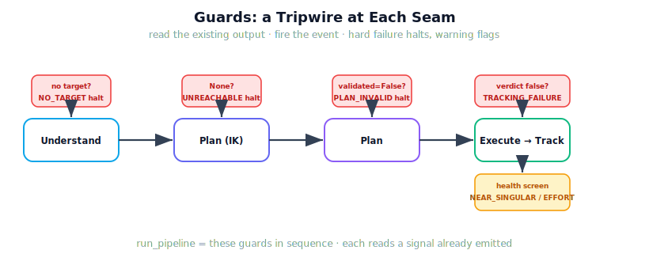

!!! abstract "You are here"
    **Module 9 — System Integration — The Complete Physical AI System**  ·  **Unit 6 — Failure Detection**  ·  **Lesson 6.2 — Detecting Failure: Health Signals and Guards**

# Lesson 6.2 — Detecting Failure: Health Signals and Guards

> The taxonomy named the lights; now we wire them. A guard is the simple, honest mechanism that turns a signal crossing a line into a fired event. Put one at each seam of the forward path and the system stops flying blind — it detects its own failures as they happen, using nothing but what it already reports.

---

## 1. Why This Matters
Detection is the difference between a system that fails silently and one that says, the instant it happens, *this failed, here*. The mechanism is deliberately humble: a guard reads an existing output and checks it against the taxonomy's condition. No estimator, no model of faults — just a threshold on a signal that already exists. Placing guards along the whole forward path means failure is caught at its source stage, not inferred three steps later from a crash. And because hard failures halt the path while warnings pass, the system spends no effort executing a doomed run, yet still flags the fragile successes worth a second look. Guards are where Unit 5's reading skill becomes automatic.

## 2. Physical Intuition
Tripwires along a corridor. Instead of waiting to discover an intruder in the vault, you string a tripwire at every doorway; the first one crossed tells you exactly where the breach is. A guard is a tripwire on a data path: the moment the signal crossing that seam meets the failure condition, the alarm names the event and the place. You do not need to understand *why* the intruder came — the tripwire's job is only to detect and locate, immediately and cheaply. That is precisely a guard's remit: detect and localise, not diagnose.

## 3. Mathematical Foundations
A **guard** is a predicate on an existing output that, when true, emits a taxonomy event:

$$\text{guard}_s(\text{output}_s) = \begin{cases} \text{event}(s) & \text{if condition}_s(\text{output}_s) \\ \varnothing & \text{otherwise.}\end{cases}$$

The guarded forward path places one at each seam, evaluated in order:

1. **Understand:** if `understand()` commits nothing → `NO_TARGET` (halt).
2. **IK seam:** if `to_configuration()` is `None` → `UNREACHABLE` (halt).
3. **Plan:** if reference `validated == False` → `PLAN_INVALID` (halt).
4. **Track:** if verdict `success == False` → `TRACKING_FAILURE`.
5. **Health screen:** if `min manipulability < τ` → `NEAR_SINGULAR` (warning); if `peak effort > τ` → `EXCESS_EFFORT` (warning).

Hard-failure guards (1–4) **halt** the path — there is no point planning to an uncommitted target or executing an invalid plan — and the runner returns with the event and the stage it `reached`. Warning guards do not halt; they annotate a completed run. The thresholds $\tau$ are integration choices (Unit 5), not derived constants. The entire mechanism is reading existing outputs against the taxonomy — `run_pipeline` is just these guards in sequence. No new theory enters; detection is the disciplined application of thresholds to signals already in hand.

## 4. Visual Explanation

<figure markdown>
  { width="680" }
</figure>

## 5. Engineering Example
The guarded pipeline on four runs. A **healthy** run passes all guards, reaches `Track`, returns `success` with no events. An **occluded** run trips the Understand guard, returns at stage `Understand` with `NO_TARGET` — the system never wastes a planning call. A **blocked** run passes Understand and the IK seam, trips the Plan guard (`validated == False`), returns at `Plan` with `PLAN_INVALID`. A **disturbed** run reaches `Track`, trips the Track guard (`TRACKING_FAILURE`) and the effort warning (`EXCESS_EFFORT`). One runner, the same guards, each failure caught at its own seam with the stage recorded — automatic detection from existing signals.

## 6. Worked Example
Where does each injected fault halt, and why?

1. *Occlude all fruit.* The Understand guard fires first (`NO_TARGET`); the path halts at Understand. *Why halt:* there is no target to convert, plan, or execute — proceeding is meaningless.
2. *Target out of reach, bypassing Understand's filter.* The IK-seam guard fires (`UNREACHABLE`); halts at the IK seam. *Why:* no configuration exists to plan toward.
3. *Obstacle over the goal.* Understand and IK pass; the Plan guard fires (`PLAN_INVALID`); halts at Plan. *Why:* executing an unvalidated plan is exactly the trap Unit 3 warned against.
4. *Strong disturbance.* All hard guards pass; the run executes and the Track guard fires (`TRACKING_FAILURE`) with an `EXCESS_EFFORT` warning. *Why no halt earlier:* nothing was wrong until execution, where the disturbance broke the success criteria. Each fault halts at the *first* seam whose guard it trips — which is also where it should be fixed.

## 7. Interactive Demonstration

<iframe src="../../demos/module09/lesson22_failure_injection_sandbox.html" title="Detecting Failure: Health Signals and Guards interactive demo" style="width:100%;height:520px;border:1px solid #e2e8f0;border-radius:12px"></iframe>

[Open this demo in a new tab ↗](../demos/module09/lesson22_failure_injection_sandbox.html)

*(Conceptual — the Installment-C flagship: the Failure-Injection Sandbox.)*
Toggle faults — occlusion, an unreachable target, a blocking obstacle, a disturbance, a near-singular target — and watch the guarded pipeline run: the flow advances stage by stage until a guard trips, lighting the event and freezing at that seam, or completes and flags any warnings. The sandbox is this lesson made interactive: inject, watch the guard fire, read the stage.

## 8. Coding Exercise

!!! tip "Run the hands-on notebook"
    `modules/module09/notebooks/lesson22_detecting_failure.ipynb` — open in JupyterLab and run **Kernel → Restart & Run All**.

*(The notebook runs the guarded pipeline.)*
Using `run_pipeline`, trigger each hard failure and assert it halts at the expected stage with the expected event: occlude-all → `NO_TARGET` at `Understand`; blocking obstacle → `PLAN_INVALID` at `Plan`; strong disturbance → `TRACKING_FAILURE` at `Track`. Assert a healthy run reaches `Track` with no events. This verifies the guards detect and halt correctly.

## 9. Knowledge Check

Formative — unlimited attempts, immediate feedback; does not affect your grade.

<iframe src="../../quizzes/module09/lesson22_quiz.html" title="Detecting Failure: Health Signals and Guards knowledge check" style="width:100%;height:720px;border:1px solid #e2e8f0;border-radius:12px"></iframe>

[Open this quiz in a new tab ↗](../quizzes/module09/lesson22_quiz.html)

*(Formative — unlimited attempts, immediate feedback.)*
Confirm what a guard is, where guards sit on the forward path, the halt-on-hard-failure vs flag-on-warning behaviour, and that guards read existing outputs (no new theory).

## 10. Challenge Problem
Hard-failure guards halt the path, which is efficient but means later guards never run on a failed prefix (a run that fails at Plan is never executed, so its execution guards stay silent). Argue why this ordering is correct for *detection* (what would a later guard even read on a run that never executed?), and describe one case where you might *also* want to record that a downstream stage was *not reached* — connecting to how Unit 7's recovery will need to know not just what failed but how far the run got. Keep it about detection and the `reached` field, not recovery mechanics.

## 11. Common Mistakes
- **Building a diagnoser.** A guard detects and localises with a threshold; it does not explain root physics.
- **Guarding only at the end.** A guard at each seam catches failure at its source, not three steps downstream.
- **Halting on warnings.** Warnings annotate a completed run; only hard failures halt the path.
- **Re-deriving thresholds.** The τ values are integration choices from Unit 5, applied here — not new constants to prove.

## 12. Key Takeaways
- A **guard** is a predicate on an existing output that fires the matching taxonomy event.
- The guarded forward path places a guard at **each seam**; `run_pipeline` is those guards in sequence.
- **Hard-failure guards halt** the path (and record the stage `reached`); **warning guards flag** a completed run.
- Every guard reads a signal the layers **already emit** — detection is thresholded reading, not diagnosis.
- Guards turn Unit 5's manual reading into **automatic detection**, each failure caught at its own seam.

---

## AI Learning Companion
Copy any prompt into an AI assistant.

**Tutor prompt** — explain it another way
```
Re-explain Lesson 6.2 by describing "guards" as tripwires on a robot's data path that fire a named event when a signal crosses a line.
```
**Practice prompt** — generate more exercises
```
Give me 4 exercises: given an injected fault, say which guard fires, at which stage the pipeline halts, and whether it's a failure or warning. With answers.
```
**Explore prompt** — connect it to the real world
```
Show me how real robot systems place runtime checks/guards across a pipeline to detect and localise failures from existing signals.
```

## Global Learning Support
Need this lesson in another language? Copy a prompt below into an AI assistant. English is the authoritative source.

**Supported languages (initial):** English · Español · 中文 (Simplified Chinese) · Türkçe

```
I just completed Lesson 6.2 — Detecting Failure: Health Signals and Guards.
Explain this lesson in Español. Keep robotics/math terminology in English where appropriate.
Then provide: a summary, three practice questions, and one challenge problem.
```
```
I just completed Lesson 6.2 — Detecting Failure: Health Signals and Guards.
Explain this lesson in 中文 (Simplified Chinese). Keep robotics/math terminology in English where appropriate.
Then provide: a summary, three practice questions, and one challenge problem.
```
```
I just completed Lesson 6.2 — Detecting Failure: Health Signals and Guards.
Explain this lesson in Türkçe. Keep robotics/math terminology in English where appropriate.
Then provide: a summary, three practice questions, and one challenge problem.
```

---

*Next lesson: 6.3 — Failure Analysis: What Failed, Where, and Who Owns the Fix (localising each fault with the three questions).*
