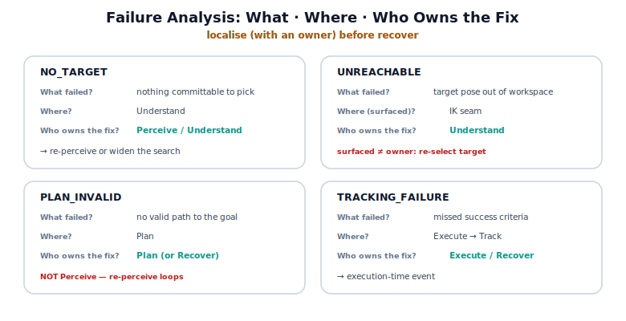

!!! abstract "You are here"
    **Module 9 — System Integration — The Complete Physical AI System**  ·  **Unit 6 — Failure Detection**  ·  **Lesson 6.3 — Failure Analysis: What Failed, Where, and Who Owns the Fix**

# Lesson 6.3 — Failure Analysis: What Failed, Where, and Who Owns the Fix

> A fired event says *something* is wrong. Analysis makes it *actionable*: what exactly failed, at which seam, and whose responsibility it is to fix. This lesson runs every hard fault through that three-question triad — the discipline that must come before recovery, because you cannot hand a fix to a stage you have not identified.

---

## 1. Why This Matters
The Architect's sequence is strict: *What failed? → Where did it fail? → Who owns the fix?* — **before** *How do we recover?* The reason is engineering hygiene. A recovery strategy aimed at the wrong stage is worse than none: re-perceiving when the plan was infeasible, or replanning when perception found nothing, wastes time and can loop forever. Localisation with a named owner is what lets Unit 7's recovery be *targeted* — the right stage acting on the right failure. This lesson builds that localisation as a repeatable analysis: every event resolves to a what, a where, and a who, so the eventual fix has a clear address.

## 2. Physical Intuition
Triage before treatment. A good emergency clinician does not start treatment on a patient they have not assessed — they first establish *what* is wrong, *where* it is, and *which specialist* owns it, then route accordingly. Treating before triage risks the cardiologist working on a broken leg. Failure analysis is triage for the robot: assess and route first, treat (recover) second. The three questions are the triage protocol, and the owner is the specialist the case is routed to.

## 3. Mathematical Foundations
Each event in the taxonomy already carries the triad — analysis is reading it out and committing to the owner. The four hard faults:

| Event | **What failed** | **Where** | **Who owns the fix** |
|---|---|---|---|
| `NO_TARGET` | nothing committable to pick | Understand | Perceive / Understand — re-perceive or widen the search |
| `UNREACHABLE` | the target pose is outside the workspace | IK seam | Understand — re-select a reachable target |
| `PLAN_INVALID` | no valid path to the goal | Plan | Plan — replan / relax, or escalate to Recover |
| `TRACKING_FAILURE` | execution missed the success criteria | Execute → Track | Execute / Recover |

The **owner** is the stage responsible for *addressing* the failure — which previews recovery but does not perform it. Note the localisation is not always "blame the stage where it fired": `UNREACHABLE` fires at the IK seam, but the *owner* is Understand, because the fix is to choose a different target, not to change the kinematics. This distinction — *where it surfaced* vs *who must act* — is the heart of analysis. A subtle integration point recurs here: because Understand's reachable filter usually pre-empts `UNREACHABLE`, that fault most often appears as `NO_TARGET` at Understand instead, and the owner is the same (Understand) — the analysis is stable under where the fault surfaces. No diagnostic theory is invoked; the triad is bookkeeping the taxonomy already encodes.

## 4. Visual Explanation

<figure markdown>
  { width="680" }
</figure>

## 5. Engineering Example
Two faults, analysed aloud. **Occlusion run:** event `NO_TARGET`. *What failed?* Perception committed nothing pickable. *Where?* Understand. *Who owns the fix?* Perceive/Understand — re-perceive (the occlusion may clear) or widen the search criteria. **Disturbance run:** event `TRACKING_FAILURE` (+`EXCESS_EFFORT` warning). *What failed?* Execution missed the success criteria. *Where?* Execute → Track. *Who owns the fix?* Execute/Recover — the disturbance is an execution-time event, so the response lives there, not in perception or planning. The `localize()` helper prints exactly this triad for any event. Each analysis ends with a named owner — a clean handoff to the recovery Unit 7 will build.

## 6. Worked Example
A run fires `PLAN_INVALID`. Walk the triad, and name one wrong owner to avoid.

*What failed?* No valid path to the goal — the planner could not validate a trajectory (e.g. an obstacle blocks every route). *Where?* Plan. *Who owns the fix?* Plan — replan with relaxed timing or a different path, or escalate to Recover if no path exists. *Wrong owner to avoid:* **Perceive**. Re-perceiving will faithfully re-detect the same reachable fruit and hand the same goal to a planner that still cannot route to it — an infinite loop. The analysis prevents this by assigning the owner to Plan, where the obstacle actually blocks progress. This is precisely why localisation-with-owner must precede recovery: the wrong owner turns a fixable failure into a loop.

## 7. Interactive Demonstration

<iframe src="../../demos/module09/lesson23_failure_analysis_triad.html" title="Failure Analysis: What Failed, Where, and Who Owns the Fix interactive demo" style="width:100%;height:520px;border:1px solid #e2e8f0;border-radius:12px"></iframe>

[Open this demo in a new tab ↗](../demos/module09/lesson23_failure_analysis_triad.html)

*(Conceptual — runnable in the notebook and the flagship sandbox.)*
Inject a fault and the sandbox prints its triad: the fired event, the stage where it surfaced, and the owner — with the surfaced-vs-owner distinction shown when they differ (`UNREACHABLE`). Step through all four hard faults and watch each resolve to a clear owner, building the analysis habit before recovery enters in Unit 7.

## 8. Coding Exercise

!!! tip "Run the hands-on notebook"
    `modules/module09/notebooks/lesson23_failure_analysis.ipynb` — open in JupyterLab and run **Kernel → Restart & Run All**.

*(The notebook analyses real faults.)*
Trigger each hard fault via `run_pipeline`, take the fired event, and call `localize(event)`; assert the triad's `where` and `who` match the taxonomy, and that for the disturbance fault the owner is Execute/Recover (not Perceive or Plan). Confirm the analysis is stable: an out-of-reach scenario surfaces as `NO_TARGET` at Understand with Understand as owner. This grounds the What/Where/Who discipline in the running system.

## 9. Knowledge Check

Formative — unlimited attempts, immediate feedback; does not affect your grade.

<iframe src="../../quizzes/module09/lesson23_quiz.html" title="Failure Analysis: What Failed, Where, and Who Owns the Fix knowledge check" style="width:100%;height:720px;border:1px solid #e2e8f0;border-radius:12px"></iframe>

[Open this quiz in a new tab ↗](../quizzes/module09/lesson23_quiz.html)

*(Formative — unlimited attempts, immediate feedback.)*
Confirm the three-question order, the owner of each hard fault, the difference between where a fault surfaced and who owns the fix, and why localisation must precede recovery.

## 10. Challenge Problem
Pick the `TRACKING_FAILURE` fault and argue both sides of its ownership: a case where the right owner is **Execute** (the fix lives in execution — e.g. the disturbance was transient and a retry would succeed) and a case where the right owner is **Recover/Plan** (the fix lives upstream — e.g. the target was on the edge of the workspace and any plan there tracks poorly). State what *additional signal* from the telemetry (effort? manipulability? the verdict's reason?) would let the analysis choose between these owners — connecting failure analysis to the telemetry reading of Unit 5. Do not design the recovery itself; that is Unit 7.

## 11. Common Mistakes
- **Skipping straight to recovery.** Localise with an owner first; an untargeted fix can loop or worsen things.
- **Blaming the stage where it surfaced.** The owner is who must *act* — `UNREACHABLE` surfaces at the IK seam but is owned by Understand.
- **Assigning the wrong owner.** Re-perceiving a `PLAN_INVALID` re-creates the same blocked goal; the owner is Plan.
- **Treating analysis as diagnosis.** The triad is integration bookkeeping the taxonomy encodes — not root-cause physics.

## 12. Key Takeaways
- Failure analysis answers, in order, **What failed? → Where? → Who owns the fix?** — before recovery.
- Each hard fault resolves to a named **owner**: `NO_TARGET`→Perceive/Understand, `UNREACHABLE`→Understand, `PLAN_INVALID`→Plan, `TRACKING_FAILURE`→Execute/Recover.
- **Where a fault surfaced can differ from who owns the fix** (`UNREACHABLE` surfaces at the IK seam, owned by Understand).
- **Localisation must precede recovery**, or an untargeted fix loops or compounds the failure.
- The triad is integration bookkeeping the taxonomy already encodes — no diagnostic theory required.

---

## AI Learning Companion
Copy any prompt into an AI assistant.

**Tutor prompt** — explain it another way
```
Re-explain Lesson 6.3 using medical triage: assess what's wrong, where, and which specialist owns it, before any treatment (recovery).
```
**Practice prompt** — generate more exercises
```
Give me 4 exercises: given a fired failure event, answer What failed / Where / Who owns the fix, and name a wrong owner to avoid. With answers.
```
**Explore prompt** — connect it to the real world
```
Show me how real robotics teams localise a failure to a responsible subsystem before deciding on a recovery action.
```

## Global Learning Support
Need this lesson in another language? Copy a prompt below into an AI assistant. English is the authoritative source.

**Supported languages (initial):** English · Español · 中文 (Simplified Chinese) · Türkçe

```
I just completed Lesson 6.3 — Failure Analysis: What Failed, Where, and Who Owns the Fix.
Explain this lesson in Español. Keep robotics/math terminology in English where appropriate.
Then provide: a summary, three practice questions, and one challenge problem.
```
```
I just completed Lesson 6.3 — Failure Analysis: What Failed, Where, and Who Owns the Fix.
Explain this lesson in 中文 (Simplified Chinese). Keep robotics/math terminology in English where appropriate.
Then provide: a summary, three practice questions, and one challenge problem.
```
```
I just completed Lesson 6.3 — Failure Analysis: What Failed, Where, and Who Owns the Fix.
Explain this lesson in Türkçe. Keep robotics/math terminology in English where appropriate.
Then provide: a summary, three practice questions, and one challenge problem.
```

---

*Next lesson: 6.4 — Unit 6 Recap and Installment C Milestone (detection consolidated; recovery awaits Unit 7).*
