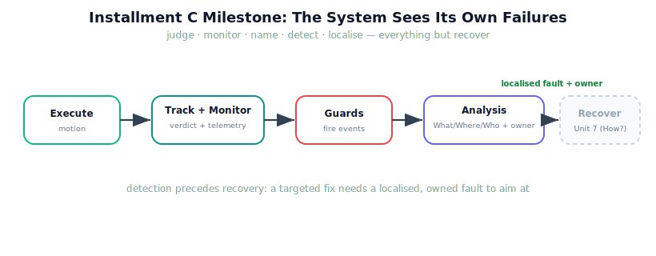

!!! abstract "You are here"
    **Module 9 — System Integration — The Complete Physical AI System**  ·  **Unit 6 — Failure Detection**  ·  **Lesson 6.4 — Unit 6 Recap and Installment C Milestone: The System Can See Its Own Failures**

# Lesson 6.4 — Unit 6 Recap and Installment C Milestone: The System Can See Its Own Failures

> Installment C set out to make the robot self-aware about failure, and it has. The system now judges, monitors, names, detects, and localises — everything except recover. This recap consolidates that, and marks the milestone where detection is complete and recovery is the only thing left to build.

---

## 1. Why This Matters
Recovery (Unit 7) is only as good as the detection beneath it. A system that recovers from failures it cannot reliably detect, or aims fixes at failures it cannot localise, is dangerous — it acts on guesses. Installment C built the foundation that makes recovery safe: a finite taxonomy, automatic guards, and a clean what/where/who for every fault. Consolidating that foundation — and being precise about what it does *not* yet do — is what lets Unit 7 add recovery as a targeted response rather than a hopeful flail. This is the milestone where "the system knows when and how it failed" becomes true.

## 2. Physical Intuition
The instrument panel is now fully wired and labelled. Unit 5 installed the gauges and the success check; Unit 6 added the annunciator panel of named warning lights and the tripwires that fire them, each routed to the specialist who owns it. The pilot can now see, instantly, *that* something failed, *which* thing, *where*, and *who* should handle it. What the panel still cannot do is *fly the recovery* — that is the pilot's next skill, and the robot's next unit.

## 3. Mathematical Foundations
Installment C in one pipeline. Execute produces motion; then:

- **Track** (Unit 5): verdict $= \bigwedge_k(\text{criterion}_k)$ with a localising reason.
- **Monitor** (Unit 5): collect existing health signals into a dashboard.
- **Taxonomy** (6.1): six integration events on existing signals, split failure vs warning.
- **Guards** (6.2): a predicate at each seam fires the matching event; hard failures halt, warnings flag; `run_pipeline` is the sequence.
- **Analysis** (6.3): each event → *What failed? / Where? / Who owns the fix?*, with a named owner (where-it-surfaced may differ from who-owns-it).

The output is a run that, on failure, returns the **stage reached**, the **fired event(s)**, and a **localisation with an owner** — all from signals the layers already emit, with no estimation, fault-diagnosis, or control theory added. That triad-with-owner is precisely the input Unit 7's recovery will consume.

## 4. Visual Explanation

<figure markdown>
  { width="680" }
</figure>

## 5. Engineering Example
The four hard faults, each detected and localised, in one breath. Occlude → `NO_TARGET`, halts at Understand, owner Perceive/Understand. Out-of-reach → surfaces as `NO_TARGET` (Understand's filter) or `UNREACHABLE` at the IK seam, owner Understand. Block the goal → `PLAN_INVALID`, halts at Plan, owner Plan. Kick a joint → `TRACKING_FAILURE` (+`EXCESS_EFFORT` warning) at Track, owner Execute/Recover. Four injections, four clean localisations with owners — and not one line of recovery code. That is exactly the Installment C milestone: complete, precise detection, with recovery deliberately still ahead.

## 6. Worked Example
Self-test, answered. *Question:* why could recovery not have been built in Unit 6, alongside detection? *Answer:* recovery must be *targeted*, and targeting requires a reliable, localised, owner-tagged failure to aim at — which detection provides. Building recovery first would mean responding to failures the system cannot yet name or place, producing untargeted fixes that loop (re-perceiving a blocked plan) or compound the failure. The Architect's sequence — what/where/who before how — is not pedantry; it is the dependency order. Unit 6 produces the localised, owned fault; Unit 7 consumes it. Detection is the prerequisite, not a parallel track.

## 7. Interactive Demonstration

<iframe src="../../demos/module09/lesson24_unit6_milestone.html" title="Unit 6 Recap and Installment C Milestone: The System Can See Its Own Failures interactive demo" style="width:100%;height:520px;border:1px solid #e2e8f0;border-radius:12px"></iframe>

[Open this demo in a new tab ↗](../demos/module09/lesson24_unit6_milestone.html)

*(Conceptual — the Installment-C flagship: the Failure-Injection Sandbox.)*
The recap demonstration is the full sandbox: inject any fault, watch the guarded pipeline halt or flag at the right seam, light the event, and print the What/Where/Who with its owner — then note the greyed "Recover" stage that Unit 7 will fill. It is all of Installment C's back-half competence in one interactive panel.

## 8. Coding Exercise

!!! tip "Run the hands-on notebook"
    `modules/module09/notebooks/lesson24_unit6_recap_milestone.ipynb` — open in JupyterLab and run **Kernel → Restart & Run All**.

*(The recap notebook runs detect-and-localise end to end.)*
For each of the four hard faults, run `run_pipeline` with the matching injection, assert it halts/flags at the expected stage with the expected event, and call `localize` to print the triad. Assert a healthy run reaches `Track` with no events. Passing this is the Installment C milestone evidence: the system detects and localises every catalogued failure on the real layers, recovery excluded.

## 9. Knowledge Check

Formative — unlimited attempts, immediate feedback; does not affect your grade.

<iframe src="../../quizzes/module09/lesson24_quiz.html" title="Unit 6 Recap and Installment C Milestone: The System Can See Its Own Failures knowledge check" style="width:100%;height:720px;border:1px solid #e2e8f0;border-radius:12px"></iframe>

[Open this quiz in a new tab ↗](../quizzes/module09/lesson24_quiz.html)

*(Formative — unlimited attempts, immediate feedback.)*
Mixed review across Units 5–6: Track and telemetry, the taxonomy and severity, guards and halting, the What/Where/Who localisation with owners, and why detection precedes recovery.

## 10. Challenge Problem
Installment D (Unit 7) will add the orchestrator that *responds* to a localised fault. For each of the four hard faults, propose — in one phrase, as a preview, not an implementation — the *kind* of response its owner might take (e.g. `NO_TARGET` → re-perceive / next row; `PLAN_INVALID` → replan or skip). Then identify the one fault whose response most clearly needs the orchestrator to remember *state across attempts* (hint: which response could loop forever without a retry limit?), connecting detection to the coordination Unit 7 introduces.

## 11. Common Mistakes
- **Thinking detection is recovery.** Unit 6 detects and localises; it does not fix anything yet.
- **Forgetting the owner.** A localisation without a named owner cannot be acted on cleanly.
- **Halting on warnings.** Warnings flag a completed (possibly successful) run; only hard failures halt.
- **Adding theory.** Detection is thresholded reading of existing signals — no estimation or diagnosis.

## 12. Key Takeaways
- Installment C gave the system **self-awareness about failure**: judge, monitor, name, detect, localise.
- The detect-and-localise pipeline returns the **stage reached, the fired event(s), and a what/where/who with an owner** — from existing signals only.
- **Where a fault surfaces can differ from who owns the fix**; the owner is who must act.
- **Detection must precede recovery** — targeting a fix requires a localised, owned fault to aim at.
- **Unit 7 (Recover)** consumes this localised fault to add the targeted response — the milestone's deliberate next step.

---

## AI Learning Companion
Copy any prompt into an AI assistant.

**Tutor prompt** — explain it another way
```
Quiz me on Units 5–6: Track, telemetry, the failure taxonomy, guards, and the What/Where/Who localisation. Re-explain whatever I miss.
```
**Practice prompt** — generate more exercises
```
Give me 5 mixed-review questions on detecting and localising robot pipeline failures (event, stage, owner), with answers.
```
**Explore prompt** — connect it to the real world
```
Show me how real autonomous systems detect and localise failures before deciding how to recover, and why that order matters.
```

## Global Learning Support
Need this lesson in another language? Copy a prompt below into an AI assistant. English is the authoritative source.

**Supported languages (initial):** English · Español · 中文 (Simplified Chinese) · Türkçe

```
I just completed Lesson 6.4 — Unit 6 Recap and Installment C Milestone.
Explain this lesson in Español. Keep robotics/math terminology in English where appropriate.
Then provide: a summary, three practice questions, and one challenge problem.
```
```
I just completed Lesson 6.4 — Unit 6 Recap and Installment C Milestone.
Explain this lesson in 中文 (Simplified Chinese). Keep robotics/math terminology in English where appropriate.
Then provide: a summary, three practice questions, and one challenge problem.
```
```
I just completed Lesson 6.4 — Unit 6 Recap and Installment C Milestone.
Explain this lesson in Türkçe. Keep robotics/math terminology in English where appropriate.
Then provide: a summary, three practice questions, and one challenge problem.
```

---

*Next lesson: 7.1 — The Orchestrator: Coordination as a Stage (Installment D opens — Recover, then full system integration).*
