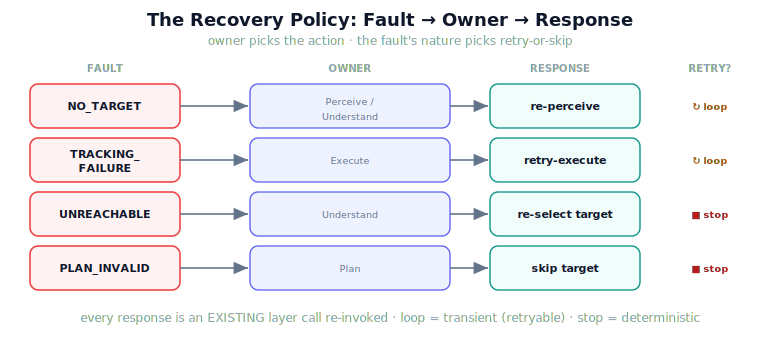

!!! abstract "You are here"
    **Module 9 — System Integration — The Complete Physical AI System**  ·  **Unit 7 — Recover**  ·  **Lesson 7.2 — Targeted Responses: Matching Action to Owner**

# Lesson 7.2 — Targeted Responses: Matching Action to Owner

> The orchestrator knows *who* owns each fault; now it needs to know *what each owner should do*. This lesson builds the recovery policy — the map from fault to action — and draws the line that keeps it from looping: retry what is transient, skip what is deterministic. The owner picks the response; the fault's nature decides whether to try again.

---

## 1. Why This Matters
A targeted response is the payoff of all that localisation. Because Unit 6 named the owner of each fault, the orchestrator can route a *specific* action rather than a blunt "try the whole thing again." Re-perceiving a tracking failure would be absurd; retrying a blocked plan would loop forever. The policy encodes the right action per owner — but it must encode one more thing: whether retrying *can* help. A disturbance might be a passing gust (retry succeeds) or a standing load (retry never succeeds); an obstacle over the goal will not move because you ask twice. Getting this distinction into the policy is what separates recovery that converges from recovery that spins.

## 2. Physical Intuition
A mechanic's decision tree. A good mechanic does not apply the same fix to every symptom — a loose bolt gets tightened, a cracked part gets replaced, and a design flaw gets escalated rather than re-tightened forever. They also know which problems are worth a quick retry (reseat the connector and test again) and which are not (a snapped cable will not un-snap on a second try). The recovery policy is that decision tree: each fault routed to the action its owner can take, and each action tagged with whether a retry is even sensible.

## 3. Mathematical Foundations
The **recovery policy** maps each fault event to a targeted response and a retryability flag, routed by the owner from Unit 6:

| Event | Owner | Targeted response | Retryable? |
|---|---|---|---|
| `NO_TARGET` | Perceive / Understand | **re-perceive** (a fresh frame) | yes — occlusion may clear |
| `TRACKING_FAILURE` | Execute | **retry-execute** (re-run the plan) | yes — a disturbance may be transient |
| `UNREACHABLE` | Understand | **re-select target** (next ripe, reachable) | no — the same target stays unreachable |
| `PLAN_INVALID` | Plan | **skip target** (or replan, then skip) | no — the same obstacle stays put |

Two properties matter. First, every response is an **existing layer call** — `re-perceive` is `model_perception` again, `retry-execute` is `execute_reference` again — so no new theory enters; the policy only chooses *which* call. Second, **retryability encodes the fault's nature**: a *transient* fault (a passing disturbance, a momentary occlusion) can clear, so retrying is rational; a *deterministic* fault (an out-of-reach pose, a blocking obstacle) will recur identically, so retrying is wasted and the right response is to move on. A retryable response loops under a budget (Lesson 7.3); a non-retryable one escalates at once. The owner picks the action; the nature picks retry-or-skip.

## 4. Visual Explanation

<figure markdown>
  { width="680" }
</figure>

## 5. Engineering Example
Two faults, two routings. **Occlusion run:** `NO_TARGET`, owner Perceive/Understand, response *re-perceive*, retryable — a leaf may have shifted, so a fresh perception frame might reveal the fruit. The orchestrator re-perceives; if the occlusion was transient the target appears and the cycle proceeds. **Blocked-goal run:** `PLAN_INVALID`, owner Plan, response *skip target*, **not** retryable — the obstacle is fixed, so re-planning the same goal yields the same failure; the right action is to skip this fruit and move to the next. Same orchestrator, opposite handling — because the policy reads not just the fault's name but whether retrying could possibly help. That is targeted recovery.

## 6. Worked Example
Should `TRACKING_FAILURE` be retryable, and what is the risk? *Reasoning:* a tracking failure can come from a transient disturbance (a passing gust — retry succeeds) or a persistent one (a standing overload — retry fails identically). Marking it retryable is correct *because the transient case exists and is common*, and retrying is cheap. The risk is the persistent case: without a bound, the orchestrator would retry-execute forever against a standing disturbance. The resolution is not to make it non-retryable (that would abandon recoverable transient faults) but to **bound the retries** (Lesson 7.3): retry a few times — enough to clear a transient — then escalate. So `TRACKING_FAILURE` is retryable *with a budget*: the policy says "this is worth trying again," and the budget says "but not forever." Both pieces are needed.

## 7. Interactive Demonstration
*(Conceptual — runnable in the notebook and the flagship player.)*
Inject each fault and watch the policy route it: `NO_TARGET` → re-perceive (loops), `TRACKING_FAILURE` → retry-execute (loops), `PLAN_INVALID` → skip (stops immediately). The demonstration makes the owner→action mapping and the retry-vs-skip tag tangible.

## 8. Coding Exercise

!!! tip "Run the hands-on notebook"
    `modules/module09/notebooks/lesson26_targeted_responses.ipynb` — open in JupyterLab and run **Kernel → Restart & Run All**.

*(The notebook reads the real policy.)*
Inspect `RECOVERY_POLICY`: assert it maps each of the four hard faults to a `response`, an `owner`, and a `retryable` flag, and that `NO_TARGET`/`TRACKING_FAILURE` are retryable while `UNREACHABLE`/`PLAN_INVALID` are not. Then run `recover` on a transient occlusion (re-perceive recovers) and a deterministic blocked goal (skips immediately), asserting the orchestrator routes each correctly. This grounds the policy in the running system.

## 9. Knowledge Check

Formative — unlimited attempts, immediate feedback; does not affect your grade.

<iframe src="../../quizzes/module09/lesson26_quiz.html" title="Targeted Responses: Matching Action to Owner knowledge check" style="width:100%;height:720px;border:1px solid #e2e8f0;border-radius:12px"></iframe>

[Open this quiz in a new tab ↗](../quizzes/module09/lesson26_quiz.html)

*(Formative — unlimited attempts, immediate feedback.)*
Confirm the owner→response map, the retryable-vs-deterministic distinction, that responses are existing layer calls, and why the policy must encode the fault's nature.

## 10. Challenge Problem
`UNREACHABLE` is marked non-retryable with response *re-select target*, but consider a moving target (a fruit swaying on a branch) that is unreachable now but might swing into reach. Argue whether retryability should ever depend on *time* rather than being fixed per fault, and what minimal information the orchestrator would need to make that call — connecting the policy to the world model without inventing new estimation. State why, for the greenhouse's static targets, the fixed non-retryable choice is the right default.

## 11. Common Mistakes
- **One response for all faults.** Re-perceiving a tracking failure or retrying a blocked plan is wrong; the owner picks the action.
- **Ignoring the fault's nature.** Retrying a deterministic fault loops; the policy must tag retryability.
- **Making everything non-retryable to avoid loops.** That abandons recoverable transient faults; bound the retries instead (Lesson 7.3).
- **Smuggling in new theory.** Every response is an existing layer call re-invoked, not a new algorithm.

## 12. Key Takeaways
- The **recovery policy** maps each fault to a **targeted response**, routed by its **owner**.
- `NO_TARGET`→re-perceive, `TRACKING_FAILURE`→retry-execute, `UNREACHABLE`→re-select, `PLAN_INVALID`→skip.
- Every response is an **existing layer call re-invoked** — no new theory.
- **Retryability encodes the fault's nature**: transient faults are retryable (with a budget); deterministic faults are not (escalate at once).
- The **owner picks the action; the nature picks retry-or-skip** — both are needed for recovery that converges.

---

## AI Learning Companion
Copy any prompt into an AI assistant.

**Tutor prompt** — explain it another way
```
Re-explain Lesson 7.2 as a mechanic's decision tree: route each symptom to a fix, and tag which are worth a retry vs which to escalate.
```
**Practice prompt** — generate more exercises
```
Give me 4 exercises mapping a localised robot fault to its targeted response and a retryable/deterministic tag, with answers.
```
**Explore prompt** — connect it to the real world
```
Show me how real autonomous systems encode recovery policies that route faults to specific actions and decide whether to retry.
```

## Global Learning Support
Need this lesson in another language? Copy a prompt below into an AI assistant. English is the authoritative source.

**Supported languages (initial):** English · Español · 中文 (Simplified Chinese) · Türkçe

```
I just completed Lesson 7.2 — Targeted Responses: Matching Action to Owner.
Explain this lesson in Español. Keep robotics/math terminology in English where appropriate.
Then provide: a summary, three practice questions, and one challenge problem.
```
```
I just completed Lesson 7.2 — Targeted Responses: Matching Action to Owner.
Explain this lesson in 中文 (Simplified Chinese). Keep robotics/math terminology in English where appropriate.
Then provide: a summary, three practice questions, and one challenge problem.
```
```
I just completed Lesson 7.2 — Targeted Responses: Matching Action to Owner.
Explain this lesson in Türkçe. Keep robotics/math terminology in English where appropriate.
Then provide: a summary, three practice questions, and one challenge problem.
```

---

*Next lesson: 7.3 — Retry Limits and State Across Attempts (bounding recovery so it converges).*
