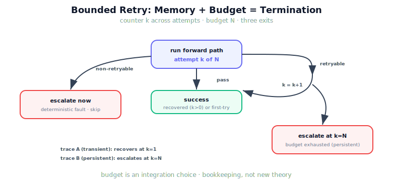

!!! abstract "You are here"
    **Module 9 — System Integration — The Complete Physical AI System**  ·  **Unit 7 — Recover**  ·  **Lesson 7.3 — Retry Limits and State Across Attempts**

# Lesson 7.3 — Retry Limits and State Across Attempts

> "Try again" is only safe if you remember how many times you have already tried. This lesson gives the orchestrator memory and a budget — the difference between a system that recovers from a passing fault and one that retries a hopeless one until the end of time. Termination is a feature, and it is built here.

---

## 1. Why This Matters
The most dangerous bug in a recovery system is the infinite loop: a fault the orchestrator keeps "recovering" from forever, harvesting nothing while burning cycles. The previous lesson's retryability flag is necessary but not sufficient — even a genuinely retryable fault (a disturbance) can be *persistent*, and retrying it without limit spins just as badly. The fix is twofold: **state across attempts** (the orchestrator remembers it has already tried, and how many times) and a **budget** (a hard cap on retries). Together they guarantee the recovery loop terminates — recovering transient faults quickly and escalating persistent ones cleanly. A recovery stage without these is not robust; it is a liability.

## 2. Physical Intuition
A person jiggling a stuck key. You try the key, it does not turn; you jiggle and try again — but a sensible person does not jiggle forever. After a few tries you stop and do something else: call a locksmith, use another door. The "few tries" is a budget; the "I have already tried three times" is state across attempts. Without the count, you would jiggle until you collapsed. The orchestrator needs the same self-awareness: try a bounded number of times, remember the count, and when it is spent, escalate to another plan rather than repeating the same motion endlessly.

## 3. Mathematical Foundations
The orchestrator carries **state across attempts** — an attempt counter and a log of what failed each time — and enforces a **budget** $N = \text{max\_attempts}$. The loop:

$$\text{for } k = 0, 1, \dots, N-1: \quad \text{run; if success} \to \text{return; else apply policy}.$$

Termination has three exits:

1. **Success** — the forward path passes (possibly after $k>0$ retries): *recovered*.
2. **Deterministic escalation** — a non-retryable fault (Lesson 7.2) fires; escalate **immediately** ($k=1$), because retrying the identical goal is pointless.
3. **Budget-exhaustion escalation** — a retryable fault persists through all $N$ attempts; escalate when the budget is spent.

The counter $k$ is the cross-attempt state that makes (3) possible — without remembering the count, the loop could not know it had reached $N$. The budget $N$ is an integration choice: large enough to clear a typical transient (a couple of frames/runs), small enough to fail fast on a persistent fault. Crucially, this introduces **no new theory** — it is bookkeeping (a counter, a cap) around the same existing layer calls. Termination is guaranteed because every path either succeeds, escalates deterministically at $k=1$, or escalates at $k=N$; the loop cannot run past $N$.

## 4. Visual Explanation

<figure markdown>
  { width="680" }
</figure>

## 5. Engineering Example
Two disturbance runs under a budget of three. **Transient kick** (joint 0, attempt 0 only): attempt 0 fails `TRACKING_FAILURE`; the orchestrator retries; attempt 1 runs clean and succeeds — *recovered in 2 attempts*. **Persistent kick** (every attempt): attempt 0 fails, attempt 1 fails, attempt 2 fails; the budget is now spent, so the orchestrator *escalates* (`retry-budget-exhausted`) rather than trying a fourth time. Same fault type, same retryable policy — the *budget and counter* are what separate the happy ending from the safe surrender. And a **blocked goal** never even reaches a second attempt: `PLAN_INVALID` is deterministic, so it escalates at attempt 0 (`skip-target`), because retrying an unmovable obstacle is futile. Three outcomes, one terminating loop.

## 6. Worked Example
Choose a budget for `NO_TARGET` recovery (re-perceive) in a greenhouse where occlusions typically clear within one or two frames, and justify it. *Reasoning:* if a leaf briefly hides a fruit, one or two fresh perception frames usually reveal it, so a budget that allows ~2–3 re-perceives covers the common transient case. Setting it to 1 would give up too early (a single unlucky frame ends the pick); setting it to 50 would stall the robot on a *permanently* occluded fruit (e.g. hidden behind the stem) that will never appear, when the better action after a few tries is to skip it and harvest the next. So a small budget (≈3) balances *clearing transients* against *failing fast on permanents*. The exact number is an integration choice tuned to the environment — and the counter is what lets the orchestrator honour it. Note we did **not** make `NO_TARGET` non-retryable: re-perceiving is genuinely useful for transient occlusion; we simply bound it.

## 7. Interactive Demonstration

<iframe src="../../demos/module09/lesson27_retry_limits.html" title="Retry Limits and State Across Attempts interactive demo" style="width:100%;height:520px;border:1px solid #e2e8f0;border-radius:12px"></iframe>

[Open this demo in a new tab ↗](../demos/module09/lesson27_retry_limits.html)

*(Conceptual — runnable in the notebook and the flagship player.)*
A retry slider sets the budget; inject a persistent fault and watch the orchestrator retry exactly that many times before escalating, the attempt counter ticking up. Switch to a transient fault and watch it recover early, well under budget. The demonstration makes termination and the budget visible.

## 8. Coding Exercise

!!! tip "Run the hands-on notebook"
    `modules/module09/notebooks/lesson27_retry_limits.ipynb` — open in JupyterLab and run **Kernel → Restart & Run All**.

*(The notebook runs the bounded orchestrator.)*
Run `recover` with `disturbance = lambda a: kick if a == 0 else None` (transient) and assert it recovers (`recovered = True`, `n_attempts = 2`). Then run with `disturbance = lambda a: kick` (persistent) and `max_attempts = 3` and assert it escalates with `escalation = "retry-budget-exhausted"` and exactly 3 attempts. Finally run a deterministic blocked goal and assert it escalates at `n_attempts = 1` (`skip-target`). This verifies all three termination exits.

## 9. Knowledge Check

Formative — unlimited attempts, immediate feedback; does not affect your grade.

<iframe src="../../quizzes/module09/lesson27_quiz.html" title="Retry Limits and State Across Attempts knowledge check" style="width:100%;height:720px;border:1px solid #e2e8f0;border-radius:12px"></iframe>

[Open this quiz in a new tab ↗](../quizzes/module09/lesson27_quiz.html)

*(Formative — unlimited attempts, immediate feedback.)*
Confirm why a budget and cross-attempt state are needed, the three termination exits, the difference between immediate and budget-exhaustion escalation, and that the budget is an integration choice (no new theory).

## 10. Challenge Problem
The current orchestrator uses a single global budget. Consider a full row harvest where several fruits each may need a retry: argue whether the budget should be *per-target* (reset for each fruit) or *global* (shared across the row), and what failure each choice guards against (a single hard fruit exhausting the whole row vs. a systemic fault retrying on every fruit). Connect this to the full-system integration of Unit 8, where the orchestrator coordinates a sequence of picks. Keep it about budgeting and state, not new theory.

## 11. Common Mistakes
- **Unbounded retries.** Without a budget, a persistent fault loops forever; the budget guarantees termination.
- **Forgetting cross-attempt state.** The counter is what lets the loop know it has reached the budget.
- **Retrying deterministic faults.** They escalate immediately; only retryable faults consume the budget.
- **Confusing the two escalations.** Deterministic escalates at attempt 1; retryable escalates at attempt N.

## 12. Key Takeaways
- A retry without a limit is a loop — **state across attempts and a budget** make recovery terminate.
- Three termination exits: **success** (recovered), **deterministic escalation** (immediate), **budget-exhaustion escalation** (at $N$).
- The **counter** is the cross-attempt state that lets the loop honour the budget.
- The **budget is an integration choice** — big enough to clear transients, small enough to fail fast on persistents.
- This is **bookkeeping, not new theory** — a counter and a cap around existing layer calls.

---

## AI Learning Companion
Copy any prompt into an AI assistant.

**Tutor prompt** — explain it another way
```
Re-explain Lesson 7.3 using "jiggling a stuck key a few times then trying another door" — budget and remembering how many tries.
```
**Practice prompt** — generate more exercises
```
Give me 4 exercises tracing a bounded retry loop: given a fault (transient/persistent/deterministic) and a budget, say the outcome and attempt count. With answers.
```
**Explore prompt** — connect it to the real world
```
Show me how real systems bound retries and track attempt state to guarantee a recovery loop terminates.
```

## Global Learning Support
Need this lesson in another language? Copy a prompt below into an AI assistant. English is the authoritative source.

**Supported languages (initial):** English · Español · 中文 (Simplified Chinese) · Türkçe

```
I just completed Lesson 7.3 — Retry Limits and State Across Attempts.
Explain this lesson in Español. Keep robotics/math terminology in English where appropriate.
Then provide: a summary, three practice questions, and one challenge problem.
```
```
I just completed Lesson 7.3 — Retry Limits and State Across Attempts.
Explain this lesson in 中文 (Simplified Chinese). Keep robotics/math terminology in English where appropriate.
Then provide: a summary, three practice questions, and one challenge problem.
```
```
I just completed Lesson 7.3 — Retry Limits and State Across Attempts.
Explain this lesson in Türkçe. Keep robotics/math terminology in English where appropriate.
Then provide: a summary, three practice questions, and one challenge problem.
```

---

*Next lesson: 7.4 — Unit 7 Recap (Recover consolidated, before Unit 8 assembles the full self-healing system).*
