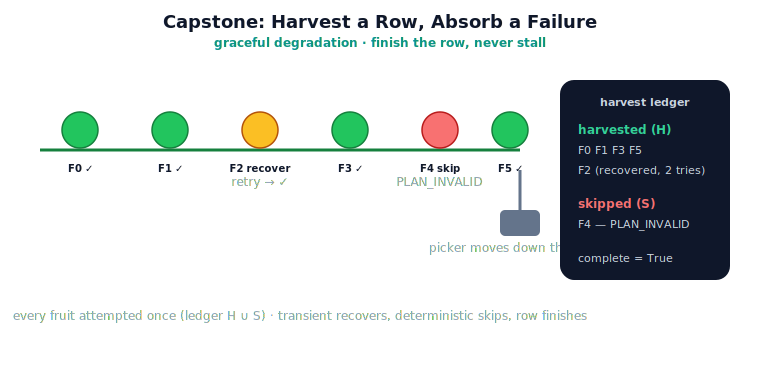

!!! abstract "You are here"
    **Module 9 — System Integration — The Complete Physical AI System**  ·  **Unit 8 — Full System Integration**  ·  **Lesson 8.2 — Capstone: Harvesting a Row with Injected Failure**

# Lesson 8.2 — Capstone: Harvesting a Row with Injected Failure

> A single pick proved the loop. A whole row proves the *system*. The capstone sends the robot down a row of fruit, harvesting pick by pick, and then throws a failure in its path. What happens next — recover and continue, or skip and continue, but never stall — is the whole point of everything we built.

---

## 1. Why This Matters
Real harvests are not clean. Fruit hides, plans get blocked, disturbances strike. A system that halts on the first problem is useless in a greenhouse; a system that *degrades gracefully* — recovering what it can, skipping what it can't, and finishing the row — is a working robot. This capstone demonstrates exactly that: the full pick cycle, looped across a row, with a ledger that ensures every fruit is attempted once and one stubborn fruit never stops the rest. It is the integration story's payoff: detection and recovery turning a brittle pipeline into a resilient harvester.

## 2. Physical Intuition
A picker working down a row. A skilled human harvester does not freeze when one fruit is stuck behind a branch — they give it a try or two, and if it won't come, they move on and keep the row going, noting the one they left. Their value is not picking every single fruit; it is *finishing the row efficiently*, handling snags without stopping. The harvester orchestrator is that picker: try, recover if it's transient, skip if it's stuck, keep moving, and report what was taken and what was left.

## 3. Mathematical Foundations
The row harvest is the pick cycle iterated under a ledger. With a set of harvested ids $H$ and skipped ids $S$, each step:

1. **Select:** perceive, then `understand` over the fruit not in $H \cup S$; if none remain, the row is **complete**.
2. **Attempt:** run the recovering pick cycle (`recover`) on the chosen target.
3. **Record:** on success add the id to $H$; on escalation add it to $S$ (with its fault).

The ledger $H \cup S$ guarantees **termination and progress**: every fruit moves into $H$ or $S$ exactly once, so the loop cannot revisit a decided fruit and must finish. The injected fault determines a target's branch: a *transient* fault recovers (lands in $H$ with `recovered = True`), a *deterministic* fault escalates (lands in $S$ with its fault code), and the rest harvest cleanly. The system's guarantee is precisely **graceful degradation**: it completes the row with a definite outcome for every fruit — harvested or skipped-with-reason — rather than stalling on any one. No new theory appears; the harvester is pure coordination over the pick cycle plus the ledger.

## 4. Visual Explanation

<figure markdown>
  { width="680" }
</figure>

## 5. Engineering Example
The capstone on a six-fruit row. With no injection, `harvest_row` takes every ripe, reachable fruit — five harvested, the unripe one never selected, `complete = True`. Now inject a *transient* disturbance on one fruit's pick: that pick fails on the first attempt (`TRACKING_FAILURE`), Recover retries, the disturbance has cleared, and the fruit is harvested `recovered = True, n_attempts = 2` — the row still finishes with all five taken, zero skipped. Swap the injection for a *blocking obstacle* on the same fruit: its plan can never validate, so after immediate escalation it is **skipped** (`PLAN_INVALID`), and the other four harvest cleanly — four taken, one skipped-with-reason, row complete. One injected failure, two graceful outcomes, the row finished either way.

## 6. Worked Example
You inject a *persistent* disturbance (never clears) on one fruit and run the row with retry budget 3. Predict the harvest outcome and the ledger. Reasoning: the targeted fruit fails `TRACKING_FAILURE` on every attempt; since the fault is retryable but persistent, Recover exhausts the budget and escalates (`retry-budget-exhausted`) after 3 attempts — the fruit lands in the **skipped** set with that escalation. Every other fruit harvests normally. So the ledger reads: all-but-one harvested, one skipped (`TRACKING_FAILURE`, budget-exhausted), `complete = True`. The row still finishes; the persistent fault costs three attempts and a skip, not a stall. This is the difference the retry budget makes — bounded effort on a hopeless fruit, then move on.

## 7. Interactive Demonstration

<iframe src="../../demos/module09/lesson30_pick_cycle_player.html" title="Capstone: Harvesting a Row with Injected Failure interactive demo" style="width:100%;height:520px;border:1px solid #e2e8f0;border-radius:12px"></iframe>

[Open this demo in a new tab ↗](../demos/module09/lesson30_pick_cycle_player.html)

*(Conceptual — the Installment-D flagship: the End-to-End Pick-Cycle Player.)*
The player runs the whole row: watch each fruit cycle through the six stages and turn green as it's harvested; inject a fault on a chosen fruit and watch it either recover (a retry, then green) or skip (marked with its fault), while the robot continues down the row. The ledger fills in live. The capstone, animated end to end.

## 8. Coding Exercise

!!! tip "Run the hands-on notebook"
    `modules/module09/notebooks/lesson30_capstone_harvest_row.ipynb` — open in JupyterLab and run **Kernel → Restart & Run All**.

*(The notebook runs the capstone.)*
Run `harvest_row(world)` with no injection and assert every ripe, reachable fruit is harvested with none skipped and `complete = True`. Then inject a transient disturbance on one fruit and assert it is still harvested (with `recovered = True`) and the row completes. Finally inject a blocking obstacle on one fruit and assert that fruit is skipped (`PLAN_INVALID`) while the rest are harvested. This verifies graceful degradation across the row.

## 9. Knowledge Check

Formative — unlimited attempts, immediate feedback; does not affect your grade.

<iframe src="../../quizzes/module09/lesson30_quiz.html" title="Capstone: Harvesting a Row with Injected Failure knowledge check" style="width:100%;height:720px;border:1px solid #e2e8f0;border-radius:12px"></iframe>

[Open this quiz in a new tab ↗](../quizzes/module09/lesson30_quiz.html)

*(Formative — unlimited attempts, immediate feedback.)*
Confirm how the ledger guarantees termination and progress, the difference between a recovered and a skipped fruit, what graceful degradation means here, and that one stubborn fruit never stalls the row.

## 10. Challenge Problem
The harvester guarantees every fruit ends up harvested or skipped-with-reason, and the row always completes. Identify one realistic situation this guarantee does *not* cover (hint: think about a fault that changes the *scene* for other fruit, or a target whose skip should trigger revisiting an earlier one), and explain what additional coordination — not new theory — the orchestrator would need to handle it. Keep your answer about ledger/coordination design, not new estimation or planning.

## 11. Common Mistakes
- **Halting on the first failure.** The system degrades gracefully — it recovers or skips and continues; it does not stall.
- **Conflating harvested and skipped.** Both end the fruit's attempt, but one is a success and one is a recorded miss-with-reason.
- **Forgetting the ledger.** Without $H \cup S$ tracking, a decided fruit could be revisited forever; the ledger guarantees progress.
- **Expecting every fruit picked.** The goal is to *finish the row efficiently*, taking what's takeable and recording the rest.

## 12. Key Takeaways
- The capstone runs the **full system across a row**: the pick cycle looped under a harvest **ledger**.
- The ledger ($H \cup S$) guarantees **termination and progress** — every fruit is attempted once, the row completes.
- A **transient** injected fault **recovers** (harvested, `recovered = True`); a **deterministic** one is **skipped-with-reason**.
- **Graceful degradation:** the system finishes the row with a definite outcome per fruit, **never stalling** on one.
- This is the integration payoff — detection and recovery turn a brittle pipeline into a **resilient harvester**.

---

## AI Learning Companion
Copy any prompt into an AI assistant.

**Tutor prompt** — explain it another way
```
Re-explain Lesson 8.2 by describing a human picker working down a row: try, recover, or skip a stuck fruit, but always finish the row.
```
**Practice prompt** — generate more exercises
```
Give me 4 exercises where I predict a row-harvest outcome (harvested vs skipped, ledger) given an injected transient, persistent, or deterministic fault. With answers.
```
**Explore prompt** — connect it to the real world
```
Show me how real harvesting or warehouse robots degrade gracefully — recovering or skipping a failed item and continuing the task.
```

## Global Learning Support
Need this lesson in another language? Copy a prompt below into an AI assistant. English is the authoritative source.

**Supported languages (initial):** English · Español · 中文 (Simplified Chinese) · Türkçe

```
I just completed Lesson 8.2 — Capstone: Harvesting a Row with Injected Failure.
Explain this lesson in Español. Keep robotics/math terminology in English where appropriate.
Then provide: a summary, three practice questions, and one challenge problem.
```
```
I just completed Lesson 8.2 — Capstone: Harvesting a Row with Injected Failure.
Explain this lesson in 中文 (Simplified Chinese). Keep robotics/math terminology in English where appropriate.
Then provide: a summary, three practice questions, and one challenge problem.
```
```
I just completed Lesson 8.2 — Capstone: Harvesting a Row with Injected Failure.
Explain this lesson in Türkçe. Keep robotics/math terminology in English where appropriate.
Then provide: a summary, three practice questions, and one challenge problem.
```

---

*Next lesson: 8.3 — Reading the Integrated System: Guarantees, Degradation, and Boundaries.*
