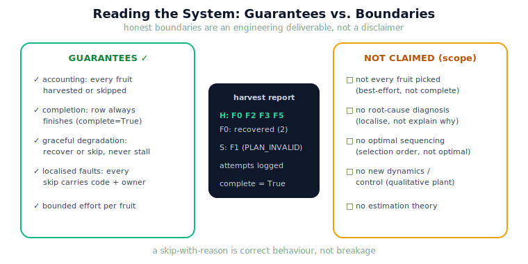

!!! abstract "You are here"
    **Module 9 — System Integration — The Complete Physical AI System**  ·  **Unit 8 — Full System Integration**  ·  **Lesson 8.3 — Reading the Integrated System: Guarantees, Degradation, and Boundaries**

# Lesson 8.3 — Reading the Integrated System: Guarantees, Degradation, and Boundaries

> A working system is only trustworthy if you know its limits. This lesson reads the finished harvester honestly: what it reliably delivers, how it degrades, what its report tells you, and — just as important — what it does *not* claim to do. Overclaiming is how integrated systems fail in the field.

---

## 1. Why This Matters
The most dangerous system is one whose operators believe it does more than it does. The integrated harvester is genuinely capable — it detects, localises, recovers, and finishes the row — but it is not magic, and an engineer must be able to state its guarantees precisely and its boundaries plainly. This lesson builds that judgement: reading the harvest report to assess a run, distinguishing what the system *promises* (a definite outcome per fruit) from what it merely *attempts* (picking every fruit), and naming the lines the module deliberately did not cross. Honest boundaries are an engineering deliverable, not a disclaimer.

## 2. Physical Intuition
Reading a delivery driver's end-of-shift report. The report does not promise every parcel was delivered — it promises every parcel was *accounted for*: delivered, or returned-with-reason. A good dispatcher reads it to see what got through, what bounced and why, and whether the route ran clean. They do not expect the driver to have rebuilt a blocked bridge or re-routed the whole city — that is outside the job. Reading the harvest report is the same: account for every fruit, judge the run, and respect what the system was built to do.

## 3. Mathematical Foundations
The integrated system's **guarantees**, stated precisely:

- **Accounting:** every fruit ends in exactly one of harvested $H$ or skipped $S$ — no fruit is silently lost.
- **Termination & completion:** the row always finishes ($\text{complete} = \text{True}$); the ledger forbids revisiting a decided fruit.
- **Graceful degradation:** a transient fault is recovered; a deterministic or persistent fault is skipped-with-reason, bounded by the retry budget — one fruit never stalls the row.
- **Localised faults:** every skip carries a fault code and owner (Unit 6), so the report is *diagnosable by a human*.

What it explicitly does **not** guarantee, by scope:

- **Not every fruit picked** — it maximises a *best-effort* harvest, not completeness.
- **No root-cause diagnosis** — it detects and localises *that* a fault occurred, not the underlying physics (no estimation/fault-diagnosis theory).
- **No optimisation** — it harvests in selection order, not an optimal sequence (no planning theory beyond the existing layers).
- **No new dynamics or control** — the plant is the qualitative M8 model; real-time, contact, and actuator physics remain out of scope.

Reading the **harvest report** — $|H|$, $|S|$ with reasons, per-fruit attempts and `recovered` flags — is how an operator judges a run against these guarantees. The report is the system's honest self-account.

## 4. Visual Explanation

<figure markdown>
  { width="680" }
</figure>

## 5. Engineering Example
Reading one harvest report. A run returns `harvested = [F3, F5, F0, F2]`, `skipped = [F1 (PLAN_INVALID)]`, `complete = True`, with F0 showing `recovered = True, n_attempts = 2`. The honest reading: "The row finished. Four fruit taken; F0 needed a recovery (a transient disturbance, retried successfully); F1 was skipped because no valid plan existed — likely a blocked approach, owned by Plan, worth a human look. Every fruit is accounted for." Note what the report does *not* say: it does not explain *why* F1's approach was blocked (that is diagnosis, out of scope) nor whether a different pick order would have done better (that is optimisation, out of scope). The report judges the run; the boundaries keep the judgement honest.

## 6. Worked Example
An operator complains: "The harvester left two fruit — it's broken." Evaluate the claim against the system's guarantees. Reasoning: leaving fruit is not, by itself, a failure of the system — the guarantee is a *definite, accounted-for outcome per fruit*, not completeness. If the report shows the two fruit `skipped` with fault codes (say one `UNREACHABLE`, one `PLAN_INVALID`), the system worked *exactly as designed*: it identified two fruit it could not take, localised why, skipped them, and finished the row. The right response is not "it's broken" but "it correctly degraded — here is why those two were skipped, and whether a human or an upstream change (a different approach, a moved obstacle) could recover them." Confusing best-effort with completeness is the operator's error, not the system's. Stating the guarantee precisely resolves the complaint.

## 7. Interactive Demonstration

<iframe src="../../demos/module09/lesson31_harvest_report.html" title="Reading the Integrated System: Guarantees, Degradation, and Boundaries interactive demo" style="width:100%;height:520px;border:1px solid #e2e8f0;border-radius:12px"></iframe>

[Open this demo in a new tab ↗](../demos/module09/lesson31_harvest_report.html)

*(Conceptual — runnable in the notebook and the flagship player.)*
The player's harvest report panel, read alongside the run: harvested vs skipped, each skip's fault, per-fruit attempts. Toggle injections and watch the report change — a transient fault adds a `recovered` flag, a deterministic one adds a skip-with-reason — while the guarantees (accounting, completion) always hold. The demonstration trains reading the system's self-account.

## 8. Coding Exercise

!!! tip "Run the hands-on notebook"
    `modules/module09/notebooks/lesson31_reading_integrated_system.ipynb` — open in JupyterLab and run **Kernel → Restart & Run All**.

*(The notebook reads the harvest report.)*
Run `harvest_row` with a deterministic injection and assert the guarantees hold: every fruit appears in exactly one of `harvested`/`skipped` (accounting), `complete = True` (completion), and the skipped fruit carries a fault code (localised). Then assert a boundary: the system does *not* re-pick a skipped fruit (it is recorded, not retried endlessly). This verifies reading the report against the stated guarantees.

## 9. Knowledge Check

Formative — unlimited attempts, immediate feedback; does not affect your grade.

<iframe src="../../quizzes/module09/lesson31_quiz.html" title="Reading the Integrated System: Guarantees, Degradation, and Boundaries knowledge check" style="width:100%;height:720px;border:1px solid #e2e8f0;border-radius:12px"></iframe>

[Open this quiz in a new tab ↗](../quizzes/module09/lesson31_quiz.html)

*(Formative — unlimited attempts, immediate feedback.)*
Confirm the system's guarantees (accounting, completion, graceful degradation, localised faults), its explicit non-guarantees (completeness, diagnosis, optimisation, new dynamics), and how to read a harvest report.

## 10. Challenge Problem
Pick one of the system's boundaries — say, "no optimal sequencing" — and argue both why it was *right* to exclude it from Module 9 (what would including it have required?) and how a *future* module could add it *without violating the integration discipline* (i.e. as coordination over existing layers, or as a clearly-scoped new layer). Connect this to where Module 10 (the Digital Twin Capstone) does and does not extend the system. Keep it about scope and integration, not a new algorithm.

## 11. Common Mistakes
- **Overclaiming.** The system is best-effort with graceful degradation, not a guarantee that every fruit is picked.
- **Reading skips as breakage.** A skip-with-reason is the system working as designed, not failing.
- **Expecting diagnosis.** The report localises faults; it does not explain root-cause physics.
- **Ignoring the report.** The harvest report is the system's honest self-account — judge runs by it.

## 12. Key Takeaways
- The integrated system **guarantees**: accounting (every fruit harvested or skipped), completion, graceful degradation, and localised faults.
- It **does not guarantee**: completeness (every fruit picked), root-cause diagnosis, optimal sequencing, or new dynamics/control.
- The **harvest report** ($H$, $S$-with-reasons, attempts, `recovered`) is how an operator judges a run.
- A **skip-with-reason is correct behaviour**, not breakage — best-effort with graceful degradation.
- **Honest boundaries are an engineering deliverable** — knowing the limits is what makes the system trustworthy.

---

## AI Learning Companion
Copy any prompt into an AI assistant.

**Tutor prompt** — explain it another way
```
Re-explain Lesson 8.3 by reading a delivery driver's end-of-shift report: every parcel accounted for (delivered or returned-with-reason), not every parcel delivered.
```
**Practice prompt** — generate more exercises
```
Give me 4 exercises where I read a harvest report and judge whether the system behaved correctly, distinguishing best-effort from completeness. With answers.
```
**Explore prompt** — connect it to the real world
```
Show me how real autonomous systems state their guarantees and boundaries honestly, and why overclaiming causes field failures.
```

## Global Learning Support
Need this lesson in another language? Copy a prompt below into an AI assistant. English is the authoritative source.

**Supported languages (initial):** English · Español · 中文 (Simplified Chinese) · Türkçe

```
I just completed Lesson 8.3 — Reading the Integrated System: Guarantees, Degradation, and Boundaries.
Explain this lesson in Español. Keep robotics/math terminology in English where appropriate.
Then provide: a summary, three practice questions, and one challenge problem.
```
```
I just completed Lesson 8.3 — Reading the Integrated System: Guarantees, Degradation, and Boundaries.
Explain this lesson in 中文 (Simplified Chinese). Keep robotics/math terminology in English where appropriate.
Then provide: a summary, three practice questions, and one challenge problem.
```
```
I just completed Lesson 8.3 — Reading the Integrated System: Guarantees, Degradation, and Boundaries.
Explain this lesson in Türkçe. Keep robotics/math terminology in English where appropriate.
Then provide: a summary, three practice questions, and one challenge problem.
```

---

*Next lesson: 8.4 — Unit 8 Recap, Module 9 Close, and the Handoff to Module 10 (Digital Twin Capstone).*
