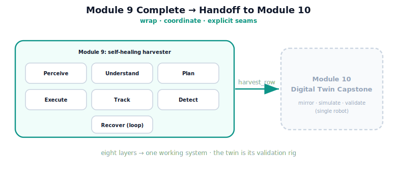

!!! abstract "You are here"
    **Module 9 — System Integration — The Complete Physical AI System**  ·  **Unit 8 — Full System Integration**  ·  **Lesson 8.4 — Unit 8 Recap, Module 9 Close, and the Handoff to Module 10**

# Lesson 8.4 — Unit 8 Recap, Module 9 Close, and the Handoff to Module 10

> We began with eight layers that did not talk to each other and a question: how do you make them cooperate? Eight units later, the answer is running — a robot that harvests a row, recovers from what it can, skips what it can't, and finishes the job. This lesson consolidates the whole module and points it at what comes next.

---

## 1. Why This Matters
Closing a module well means being able to state what was built, how, and why it holds together — and handing it cleanly to what follows. Module 9's deliverable is not a clever component; it is a *working system* assembled from existing parts by disciplined coordination. Consolidating that — the six stages, the seams, the detection and recovery, the graceful degradation — is what lets Module 10 build on it with confidence. A capstone that cannot articulate its own integration is not finished; this lesson finishes it.

## 2. Physical Intuition
The finished machine on the shop floor, ready for its test rig. Every part was fabricated and fitted across the build; now it runs as one machine, and the next step is not to rebuild it but to put it on a test rig — a faithful twin — where it can be exercised, validated, and tuned before it goes to work for real. Module 9 built and ran the machine; Module 10 is the test rig. The handoff is the machine rolling from the assembly bay to the validation bay.

## 3. Mathematical Foundations
Module 9 in one arc. The forward path (Units 1–4): $\text{Perceive} \to \text{Understand} \to \text{Plan} \to \text{Execute}$, wrapping M3, the Understand adapter, M5 IK, M7 planner, and M6/M8 control across explicit seams. The judging back half (Units 5–6): $\text{Track}$ (verdict against criteria) and **Detect** (a failure taxonomy and guards reading existing signals, localising each fault to *what/where/who*). The closing stage (Unit 7): **Recover**, an orchestrator that routes a targeted, bounded response by owner. The whole (Unit 8): the six-stage **pick cycle** looped across a row under a ledger, degrading gracefully.

The discipline that held throughout, stated once:

- **Wrap, do not redefine** — every stage calls a real existing layer; Module 9 adds no estimation, planning, or control theory.
- **Coordinate, do not re-theorise** — detection and recovery are reading and control flow over existing outputs.
- **Make seams explicit** — each handoff has a contract; failures are caught at the seam they occur.

The result is a system whose intelligence lives in its *composition* — which is exactly what an integration module exists to teach.

## 4. Visual Explanation

<figure markdown>
  { width="680" }
</figure>

## 5. Engineering Example
The module, demonstrated in one call. `harvest_row(world)` runs the entire system: it perceives the row, and for each fruit in turn runs the full pick cycle with recovery, harvesting what it can and skipping (with a localised reason) what it can't, until the row is complete. Inject a transient fault and one fruit recovers; inject a deterministic fault and one fruit is skipped; either way the row finishes with every fruit accounted for. That single call exercises all eight units — perception, target selection, IK, planning, execution, tracking, detection, recovery, and row-level orchestration — which is the most concrete possible statement that Module 9 is an integrated system, not a pile of parts.

## 6. Worked Example
Self-test, answered. *Question:* in one sentence each, what did each pair of units contribute to the finished harvester? *Answer:* Units 1–2 (Perceive → Understand) turn raw detections into a committed, deduplicated target; Units 3–4 (Plan, Execute) turn that target into a validated reference and drive it into tracked motion; Units 5–6 (Track, Detect) judge the motion and detect-and-localise any failure from existing signals; Units 7–8 (Recover, Integrate) respond to faults by targeted bounded recovery and loop the whole cycle across a row with graceful degradation. Eight units, four contributions, one system. If you can give those four sentences, you hold the module.

## 7. Interactive Demonstration

<iframe src="../../demos/module09/lesson32_module_close_capstone.html" title="Unit 8 Recap, Module 9 Close, and the Handoff to Module 10 interactive demo" style="width:100%;height:520px;border:1px solid #e2e8f0;border-radius:12px"></iframe>

[Open this demo in a new tab ↗](../demos/module09/lesson32_module_close_capstone.html)

*(Conceptual — the Installment-D flagship: the End-to-End Pick-Cycle Player.)*
The player as a module-wide demonstration: run the full row, inject any fault, and watch the complete system — all six stages, detection, recovery, and the ledger — handle it and finish. It is Module 9 in one interactive panel, and the artifact that best shows the integration is real.

## 8. Coding Exercise

!!! tip "Run the hands-on notebook"
    `modules/module09/notebooks/lesson32_unit8_recap_module_close.ipynb` — open in JupyterLab and run **Kernel → Restart & Run All**.

*(The recap notebook runs the whole module.)*
Run `harvest_row(world)` clean and assert the full system completes the row (every ripe reachable fruit harvested, `complete = True`). Then run it with a transient injection (one fruit recovered) and a deterministic injection (one fruit skipped-with-reason), asserting graceful degradation in both. Passing this is your evidence that the eight units compose into one working, self-healing harvester.

## 9. Knowledge Check

Formative — unlimited attempts, immediate feedback; does not affect your grade.

<iframe src="../../quizzes/module09/lesson32_quiz.html" title="Unit 8 Recap, Module 9 Close, and the Handoff to Module 10 knowledge check" style="width:100%;height:720px;border:1px solid #e2e8f0;border-radius:12px"></iframe>

[Open this quiz in a new tab ↗](../quizzes/module09/lesson32_quiz.html)

*(Formative — unlimited attempts, immediate feedback.)*
Mixed review across Module 9: the six stages and their seams, Track and Detect, Recover's policy and bounds, the row harvest and graceful degradation, and the integration discipline (wrap, coordinate, explicit seams).

## 10. Challenge Problem
Module 10 is the **Digital Twin Capstone**: a faithful mirror of this single robot, used to simulate, visualise, and validate the integrated system before (and alongside) the physical world. Propose — as scope, not implementation — three things a digital twin of *this* harvester would let you do that the integrated system alone does not (hint: think prediction-free validation, what-if injection at scale, and visual inspection of the pick cycle), and for each, state whether it extends the system by *coordination over existing layers* or by a *clearly-scoped new capability*. Keep it about the twin's role and boundaries; do not design new control or estimation.

## 11. Common Mistakes
- **Treating the module as parts.** The deliverable is the *system* — the composed, self-healing pick cycle.
- **Forgetting the discipline.** Wrap, coordinate, explicit seams — no new theory — is what held it together.
- **Skipping the handoff.** Module 10 builds on this finished system; a clean close enables a clean start.
- **Overclaiming at the close.** The system is best-effort with graceful degradation and honest boundaries (Lesson 8.3).

## 12. Key Takeaways
- Module 9 turned **eight layers into one self-healing harvester** — a six-stage pick cycle looped across a row.
- The arc: **Perceive → Understand → Plan → Execute** (forward), **Track → Detect** (judge), **Recover → Integrate** (heal and loop).
- The discipline: **wrap don't redefine, coordinate don't re-theorise, make seams explicit** — no new estimation, planning, or control theory.
- The whole module runs in one call (`harvest_row`) with **graceful degradation** — the proof that integration is real.
- **Module 10, the Digital Twin Capstone**, takes this finished single-robot system into a mirror for simulation, visualisation, and validation.

---

## AI Learning Companion
Copy any prompt into an AI assistant.

**Tutor prompt** — explain it another way
```
Quiz me on the whole of Module 9: the six stages, the seams, detection, recovery, and graceful degradation. Re-explain whatever I miss.
```
**Practice prompt** — generate more exercises
```
Give me 5 mixed-review questions covering the entire integrated harvester — perception to recovery to row harvest — with answers.
```
**Explore prompt** — connect it to the real world
```
Show me how real robotics teams move from an integrated system to a digital twin for validation, and what the twin adds.
```

## Global Learning Support
Need this lesson in another language? Copy a prompt below into an AI assistant. English is the authoritative source.

**Supported languages (initial):** English · Español · 中文 (Simplified Chinese) · Türkçe

```
I just completed Lesson 8.4 — Unit 8 Recap, Module 9 Close, and the Handoff to Module 10.
Explain this lesson in Español. Keep robotics/math terminology in English where appropriate.
Then provide: a summary, three practice questions, and one challenge problem.
```
```
I just completed Lesson 8.4 — Unit 8 Recap, Module 9 Close, and the Handoff to Module 10.
Explain this lesson in 中文 (Simplified Chinese). Keep robotics/math terminology in English where appropriate.
Then provide: a summary, three practice questions, and one challenge problem.
```
```
I just completed Lesson 8.4 — Unit 8 Recap, Module 9 Close, and the Handoff to Module 10.
Explain this lesson in Türkçe. Keep robotics/math terminology in English where appropriate.
Then provide: a summary, three practice questions, and one challenge problem.
```

---

*Module 9 complete. Next: Module 10 — the Digital Twin Capstone.*
