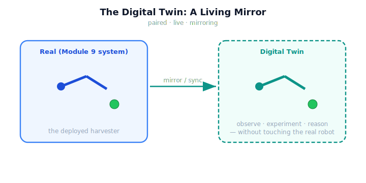

!!! abstract "You are here"
    **Module 10 — Digital Twin Capstone**  ·  **Unit 1 — What Is a Digital Twin?**  ·  **Lesson 1.1 — The Twin Concept: A Living Mirror of the Robot**

# Lesson 1.1 — The Twin Concept: A Living Mirror of the Robot

> Nine modules built a robot that harvests a greenhouse. This final module builds a *second* robot — a virtual one — that shadows the first: mirrors its state, runs alongside it, and lets us watch, test, and improve the real one through its reflection. Welcome to the digital twin, and to the capstone of the course.

---

## 1. Why This Matters
You cannot safely experiment on a working robot in a live greenhouse — every test risks a crop, a collision, or a wasted harvest. But you *can* experiment freely on a faithful virtual copy. That is the entire promise of a digital twin: a running, synchronized replica you can observe, probe, and reason about while the real system keeps working untouched. A twin turns "I hope this change helps" into "I tested it on the twin first." For our greenhouse robot — already integrated and self-healing in Module 9 — the twin is the tool that will let us monitor it, predict its failures before they happen, and improve its decisions. This lesson establishes what a twin *is* before we build one.

## 2. Physical Intuition
A flight simulator paired with a specific aircraft. Not a generic "flying game" — a simulator built to mirror *this* aircraft's exact systems, kept updated as the real plane is maintained and modified. Pilots train on it, engineers test procedures on it, and faults are reproduced on it — all without risking the real aircraft. The simulator is valuable precisely because it is *paired* with and *kept in step with* a real asset. A digital twin is that, for our robot: a virtual greenhouse robot that mirrors the real one closely enough to stand in for it when experimenting would be costly or dangerous.

## 3. Mathematical Foundations
A digital twin is a pairing of two systems that share a *state representation* and a *synchronization relationship*. Let the real system have an observable state $s_{\text{real}}$ (for our robot: joint configuration $q$, tool position, fruit states, health signals, pipeline stage). The twin holds its own state $s_{\text{twin}}$ in the *same representation*. The defining relationship is that the twin is kept close to the real system:

$$s_{\text{twin}} \;\xleftarrow{\text{sync}}\; \text{report}(s_{\text{real}}), \qquad \text{gap} = d(s_{\text{twin}}, s_{\text{real}}) \;\to\; \text{small}.$$

Three properties distinguish a twin from its neighbours. It is **paired** (bound to one specific asset, not a generic model), **live** (synchronized over time, not a snapshot), and **mirroring** (it represents the asset's actual state, not a hypothetical one). The twin is therefore *built on* the real system's interface — for us, the Module 9 system's reported world-state. It introduces **no new robotics theory**: the twin reuses Module 9's layers and world entirely (wrap, do not redefine). What is new is the *pairing and synchronization* — a second copy kept in step, which the rest of the module exploits.

## 4. Visual Explanation

<figure markdown>
  { width="680" }
</figure>

## 5. Engineering Example
The greenhouse twin, conceptually. The real system is the Module 9 harvester: it perceives a row, runs the pick cycle, detects and recovers from faults, and reports its world-state (where the arm is, which fruit are picked, the health signals). The twin is a second virtual greenhouse robot that holds the *same* world-state representation and is kept synchronized to what the real system reports. With the twin in hand, an engineer can ask "what would happen if I changed the pick order?" or "is the real arm drifting toward a singularity?" — and answer it on the twin, not the crop. Everything the twin does reuses Module 9's real layers; the twin adds only the second copy and the sync.

## 6. Worked Example
Why is a twin more than "just a simulation"? Consider two artifacts. Artifact 1: a standalone physics simulation you run to study harvesting in general — useful, but disconnected from any particular robot; it models a *hypothetical*. Artifact 2: a virtual robot bound to *your* deployed robot, updated continuously from its reported state, so at any moment it reflects *that robot's actual situation*. Only Artifact 2 is a twin: it is paired (this robot), live (kept in step), and mirroring (the real state, not a hypothetical). The distinction matters because a twin's answers are about *the real robot right now* — "is this arm near a singularity *on this pick*?" — which a generic simulation cannot give. The next lesson sharpens twin vs. model vs. simulation precisely.

## 7. Interactive Demonstration
*(Conceptual — the Installment-A flagship: the Twin Mirror.)*
Two greenhouse robots side by side: move the real one (change its configuration, pick a fruit) and watch the twin mirror it after a sync. Pause the sync and watch the twin fall out of step; resume and watch it catch up. The demonstration makes "paired, live, mirroring" tangible — the twin is only useful while it tracks the real system.

## 8. Coding Exercise

!!! tip "Run the hands-on notebook"
    `modules/module10/notebooks/lesson01_twin_concept.ipynb` — open in JupyterLab and run **Kernel → Restart & Run All**.

*(The notebook builds a first twin.)*
Construct a real Module 9 world and a `DigitalTwin` of it; assert the twin holds its *own* world instance (separate object) in the same layout. Move the real robot, then `sync` the twin to the real system's reported state and assert the twin now mirrors it. This establishes the twin as a live, paired, separate replica.

## 9. Knowledge Check

Formative — unlimited attempts, immediate feedback; does not affect your grade.

<iframe src="../../quizzes/module10/lesson01_quiz.html" title="The Twin Concept: A Living Mirror of the Robot knowledge check" style="width:100%;height:720px;border:1px solid #e2e8f0;border-radius:12px"></iframe>

[Open this quiz in a new tab ↗](../quizzes/module10/lesson01_quiz.html)

*(Formative — unlimited attempts, immediate feedback.)*
Confirm the definition of a digital twin (paired, live, mirroring), why it is valuable (observe/experiment/reason without touching reality), that it is built on the Module 9 system, and that it adds no new robotics theory.

## 10. Challenge Problem
A digital twin is "only as useful as it is faithful." Argue, from the definition (paired, live, mirroring), what happens to each of the twin's three uses — observation, experimentation, reasoning — as the twin's synchronization with reality degrades. Identify which use breaks *first* as the mirror drifts, and why. Keep your answer about the twin concept and the sync relationship; the mechanism of drift is built in Unit 2.

## 11. Common Mistakes
- **Twin = simulation.** A twin is paired with and synchronized to a *specific* real asset; a generic simulation is not.
- **Twin = a one-time model.** A twin is *live* — kept in step over time, not a single snapshot.
- **Thinking the twin needs new robot theory.** It reuses Module 9's system entirely; what is new is the second copy and the sync.
- **Forgetting the purpose.** The twin exists to let you observe, experiment, and reason *without touching the real robot*.

## 12. Key Takeaways
- A **digital twin** is a **paired, live, mirroring** virtual replica of a specific real system.
- Its value: **observe, experiment, and reason** about the real robot *without touching it*.
- Our twin is built **on the Module 9 system** — the integrated greenhouse harvester is the asset being twinned.
- The twin adds **no new robotics theory**; what is new is the **second copy kept in step** (sync).
- A twin is only useful while it stays **faithful** to the real system — synchronization is everything.

---

## AI Learning Companion
Copy any prompt into an AI assistant.

**Tutor prompt** — explain it another way
```
Re-explain Lesson 1.1 using a flight simulator paired with one specific aircraft: paired, live, and mirroring — and why that beats a generic flying game.
```
**Practice prompt** — generate more exercises
```
Give me 4 exercises where I decide whether a described artifact is a true digital twin (paired/live/mirroring) or just a model/simulation. With answers.
```
**Explore prompt** — connect it to the real world
```
Show me how real industries (aerospace, manufacturing, wind energy) use digital twins paired with a specific deployed asset.
```

## Global Learning Support
Need this lesson in another language? Copy a prompt below into an AI assistant. English is the authoritative source.

**Supported languages (initial):** English · Español · 中文 (Simplified Chinese) · Türkçe

```
I just completed Lesson 1.1 — The Twin Concept: A Living Mirror of the Robot.
Explain this lesson in Español. Keep robotics/math terminology in English where appropriate.
Then provide: a summary, three practice questions, and one challenge problem.
```
```
I just completed Lesson 1.1 — The Twin Concept: A Living Mirror of the Robot.
Explain this lesson in 中文 (Simplified Chinese). Keep robotics/math terminology in English where appropriate.
Then provide: a summary, three practice questions, and one challenge problem.
```
```
I just completed Lesson 1.1 — The Twin Concept: A Living Mirror of the Robot.
Explain this lesson in Türkçe. Keep robotics/math terminology in English where appropriate.
Then provide: a summary, three practice questions, and one challenge problem.
```

---

*Next lesson: 1.2 — Twin vs. Model vs. Simulation (drawing the lines precisely, with the Twin Mirror demo).*
