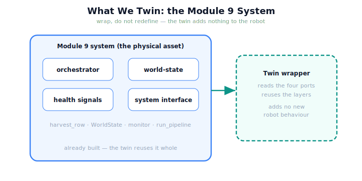

!!! abstract "You are here"
    **Module 10 — Digital Twin Capstone**  ·  **Unit 1 — What Is a Digital Twin?**  ·  **Lesson 1.3 — What We Twin: the Module 9 System as the Physical Asset**

# Lesson 1.3 — What We Twin: the Module 9 System as the Physical Asset

> A twin is meaningless without the thing it twins. Ours is the robot we already built — the Module 9 integrated harvester. This lesson takes inventory of exactly what Module 9 handed us, because the twin is built *entirely* on those parts.

---

## 1. Why This Matters
The governing rule of this module is **wrap, do not redefine** — the same discipline that built Module 9. The twin must add no new perception, planning, control, or robot behaviour; it reuses the Module 9 system whole and only mirrors it. To do that honestly, we need a precise inventory of what the real system provides: what state it reports, what health it emits, and through what interface we run it. This lesson is that inventory. Get it right and the twin is a thin, faithful wrapper; get it wrong and the twin starts re-implementing the robot — exactly what the rulings forbid.

## 2. Physical Intuition
Taking delivery of a machine before instrumenting it. Before you can build a control room for a factory line, you walk the line and note its actual interfaces: what sensors it already exposes, what state it reports, how you start and stop it. You don't rebuild the line — you learn its existing connection points. The twin's first job is the same: learn the Module 9 system's existing interface — what it reports and how it runs — so the twin can plug into it rather than duplicate it.

## 3. Mathematical Foundations
Module 9 hands the twin four things, and the twin builds on exactly these:

1. **The integrated orchestrator** — `harvest_row` (and the underlying pick cycle / `run_pipeline`): the system's *behaviour*, the model the twin will run in simulation (later). The twin calls it; it does not re-author it.
2. **The world-state model** — the greenhouse `world` (the arm configuration $q$, the tool position, the fruit and their states) plus the `WorldState` representation. This is the *state* the twin mirrors.
3. **The health signals** — the monitor's outputs (peak error, RMS, manipulability, effort, saturation): the system's self-reported *condition*, which the twin will mirror and later watch for drift.
4. **The system interface** — the functions through which the real system is observed and run (its reported snapshot; the pipeline entry points). This is the *connection* the twin plugs into.

The twin's **reported state** is a copyable frame drawn from these — joint configuration, tool position, fruit states, health, stage. Formally the twin is a wrapper $W$ over the Module 9 system $M_9$: $W$ reads $\text{report}(M_9)$ and reuses $M_9$'s layers, contributing no new robot operator. This is the precise sense of *wrap, do not redefine* extended into Module 10: the asset is $M_9$, fully built; the twin is the mirror around it.

## 4. Visual Explanation

<figure markdown>
  { width="680" }
</figure>

## 5. Engineering Example
Reading the real system's reported state. Take the deployed Module 9 robot mid-harvest: its reported snapshot is the arm configuration $q$, the tool position (from forward kinematics), each fruit's status (ripe / picked), and the health signals from the last pick (manipulability, effort, tracking error). The twin reads *exactly this* — a plain, copyable frame — and reuses Module 9's layers to interpret it. The twin contributes no new sensor, no new planner, no new controller; it is a mirror plus, later, a runner of the very same `harvest_row`. Everything the twin "knows" about robotics, it borrows from Module 9.

## 6. Worked Example
Decide, for three candidate twin features, whether each respects *wrap, do not redefine*. (a) "The twin reads the real robot's reported $q$ and fruit states." → **respects** it (mirroring an existing report). (b) "The twin runs `harvest_row` on its own world copy to simulate a harvest." → **respects** it (reusing the M9 orchestrator). (c) "The twin adds a smarter planner that picks fruit in a better order than M9." → **violates** it (that is a new robot behaviour, redefining the system — and out of scope; the twin only *tests and informs*, it does not replace M9's planning). The line is clean: the twin may *mirror* and *run* the M9 system, but never *replace* its layers.

## 7. Interactive Demonstration

<iframe src="../../demos/module10/lesson03_what_we_twin.html" title="What We Twin: the Module 9 System as the Physical Asset interactive demo" style="width:100%;height:520px;border:1px solid #e2e8f0;border-radius:12px"></iframe>

[Open this demo in a new tab ↗](../demos/module10/lesson03_what_we_twin.html)

*(Conceptual — the Installment-A flagship: the Twin Mirror.)*
The Twin Mirror, annotated with the four inputs: as the real robot harvests, watch the four ports update — orchestrator advancing the pick, world-state changing, health signals refreshing, all flowing through the interface into the twin. The demonstration shows the twin reading exactly Module 9's outputs and nothing more.

## 8. Coding Exercise

!!! tip "Run the hands-on notebook"
    `modules/module10/notebooks/lesson03_what_we_twin.ipynb` — open in JupyterLab and run **Kernel → Restart & Run All**.

*(The notebook reads the M9 interface.)*
Run one real pick on a Module 9 world via the system interface and capture its reported `snapshot` (q, tool, fruit, health). Assert the snapshot contains the four expected kinds of state, and that building a `DigitalTwin` reuses the Module 9 world layout without redefining any layer. This grounds the twin as a wrapper over the M9 inputs.

## 9. Knowledge Check

Formative — unlimited attempts, immediate feedback; does not affect your grade.

<iframe src="../../quizzes/module10/lesson03_quiz.html" title="What We Twin: the Module 9 System as the Physical Asset knowledge check" style="width:100%;height:720px;border:1px solid #e2e8f0;border-radius:12px"></iframe>

[Open this quiz in a new tab ↗](../quizzes/module10/lesson03_quiz.html)

*(Formative — unlimited attempts, immediate feedback.)*
Confirm the four Module 9 inputs (orchestrator, world-state, health signals, interface), that the twin wraps rather than redefines them, and what the reported state contains.

## 10. Challenge Problem
The twin reuses Module 9's orchestrator as its "model" for simulation. Argue why this is both a strength (fidelity: the twin runs the *exact* logic the real robot runs) and a limitation (the twin can only ever be as faithful as Module 9's own model of reality — it inherits M9's simplifications). Connect this to why a sim-to-real gap is inevitable even with a perfect wrapper. Keep it about wrapping and fidelity; the gap mechanism is Unit 4.

## 11. Common Mistakes
- **Re-implementing the robot in the twin.** The twin wraps Module 9's layers; it adds no new robot behaviour.
- **Inventing new state.** The twin mirrors the *reported* world-state; it does not manufacture state Module 9 doesn't expose.
- **Treating the twin as an upgrade to M9.** The twin tests and informs the real system; it does not replace its planning/control.
- **Ignoring health signals.** They are one of the four inputs — the system's self-reported condition the twin mirrors.

## 12. Key Takeaways
- The twin's **physical asset is the Module 9 system** — already integrated and self-healing.
- Module 9 hands the twin four things: the **orchestrator** (`harvest_row`), the **world-state model**, the **health signals**, and the **system interface**.
- The twin **wraps** these (reads the report, reuses the layers) and **adds no new robot behaviour** — wrap, do not redefine.
- The twin's **reported state** is a copyable frame: joint configuration, tool position, fruit states, health, stage.
- Knowing exactly what we twin — and what it already provides — is the foundation for building the mirror (Unit 2).

---

## AI Learning Companion
Copy any prompt into an AI assistant.

**Tutor prompt** — explain it another way
```
Re-explain Lesson 1.3 by "taking delivery" of the Module 9 robot and listing the four interfaces a twin plugs into without rebuilding the machine.
```
**Practice prompt** — generate more exercises
```
Give me 4 candidate twin features and have me decide which respect "wrap, do not redefine" and which redefine the robot. With answers.
```
**Explore prompt** — connect it to the real world
```
Show me what interfaces a real deployed robot exposes (state, telemetry, control entry points) that a digital twin would wrap.
```

## Global Learning Support
Need this lesson in another language? Copy a prompt below into an AI assistant. English is the authoritative source.

**Supported languages (initial):** English · Español · 中文 (Simplified Chinese) · Türkçe

```
I just completed Lesson 1.3 — What We Twin: the Module 9 System as the Physical Asset.
Explain this lesson in Español. Keep robotics/math terminology in English where appropriate.
Then provide: a summary, three practice questions, and one challenge problem.
```
```
I just completed Lesson 1.3 — What We Twin: the Module 9 System as the Physical Asset.
Explain this lesson in 中文 (Simplified Chinese). Keep robotics/math terminology in English where appropriate.
Then provide: a summary, three practice questions, and one challenge problem.
```
```
I just completed Lesson 1.3 — What We Twin: the Module 9 System as the Physical Asset.
Explain this lesson in Türkçe. Keep robotics/math terminology in English where appropriate.
Then provide: a summary, three practice questions, and one challenge problem.
```

---

*Next lesson: 1.4 — Unit 1 Recap (the twin concept consolidated, before we build the mirror).*
