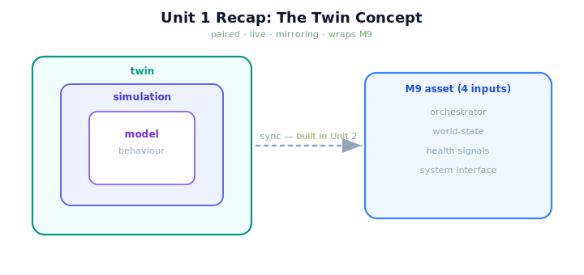

!!! abstract "You are here"
    **Module 10 — Digital Twin Capstone**  ·  **Unit 1 — What Is a Digital Twin?**  ·  **Lesson 1.4 — Unit 1 Recap: The Twin Concept**

# Lesson 1.4 — Unit 1 Recap: The Twin Concept

> Unit 1 was about *what* we are building and *what* it builds on. Before we make the mirror work in Unit 2, let's consolidate the concept so the construction rests on solid definitions.

---

## 1. Why This Matters
Building a twin without a precise concept invites overclaiming and scope creep — calling a simulation a twin, or letting the twin re-implement the robot. Unit 1 fixed the definitions and the asset. Consolidating them is what lets Unit 2 build the mirror cleanly: we know exactly what state to synchronize (the Module 9 reported world-state) and exactly what *not* to add (any new robot behaviour).

## 2. Physical Intuition
You have studied the blueprint and taken delivery of the machine; now you are about to wire the control room. Unit 1 was the study and the delivery — understanding what a twin is and inventorying the Module 9 robot's interfaces. Unit 2 is the wiring: making the virtual copy actually track the real one. This recap is the last check before the wiring starts.

## 3. Mathematical Foundations
Unit 1 in four lines:

- **Definition** (1.1): a digital twin is **paired** (bound to one real asset), **live** (synced over time), and **mirroring** (reflects the real state). Value: observe, experiment, reason — without touching reality.
- **Distinctions** (1.2): *model* (behaviour description) ⊂ *simulation* (model run forward) ⊂ *twin* (simulation + live pairing). *twin = model + simulation + binding.*
- **The asset** (1.3): the Module 9 system, handing the twin four inputs — orchestrator (`harvest_row`), world-state model, health signals, system interface.
- **The discipline:** wrap, do not redefine — the twin reuses M9's layers and reads its reported state, adding no new robot behaviour.

The output of Unit 1 is a *concept and an asset*; Unit 2 turns it into a *working mirror* via synchronization, $s_{\text{twin}} \xleftarrow{\text{sync}} \text{report}(s_{\text{real}})$.

## 4. Visual Explanation

<figure markdown>
  { width="680" }
</figure>

## 5. Engineering Example
The greenhouse twin, in one breath: it is a virtual robot **paired** with the deployed Module 9 harvester, intended to be **live** (synced each cycle) and **mirroring** (holding the real arm configuration, fruit states, and health). It **contains** the Module 9 model (the layers) and will **run simulations** on it (Unit 3), but in Installment A it earns the name *twin* by being bound to the real system. It **wraps** Module 9's four inputs and **adds no new robot behaviour**. That sentence is the whole of Unit 1.

## 6. Worked Example
Self-test, answered. *Question:* a colleague shows you a program that runs `harvest_row` on a randomly generated greenhouse to estimate average yield, and calls it "our digital twin." Is it? *Answer:* No — it is a **simulation**. It runs the Module 9 model forward, but it is **not paired** with any specific deployed robot and **not synchronized** to a real reported state; it describes a hypothetical greenhouse, not *this* robot now. To make it a twin, bind it to a specific real system and keep it in step (the Unit 2 mirror). Spotting this misclassification is the core Unit 1 competence.

## 7. Interactive Demonstration
*(Conceptual — the Installment-A flagship: the Twin Mirror.)*
The recap view of the Twin Mirror: real robot and twin side by side, the four M9 inputs flowing through the sync arrow, with the model/simulation/twin distinction annotated. Toggle the sync to recall the lesson that the *binding* is what makes it a twin.

## 8. Coding Exercise

!!! tip "Run the hands-on notebook"
    `modules/module10/notebooks/lesson04_unit1_recap.ipynb` — open in JupyterLab and run **Kernel → Restart & Run All**.

*(The recap notebook checks the concept end to end.)*
Build a `DigitalTwin` of a Module 9 world; assert it (a) holds its own separate world, (b) reuses the M9 layout without redefining layers, and (c) can read the real system's reported snapshot (the four kinds of state). This confirms the concept is realized before Unit 2 makes the mirror live.

## 9. Knowledge Check

Formative — unlimited attempts, immediate feedback; does not affect your grade.

<iframe src="../../quizzes/module10/lesson04_quiz.html" title="Unit 1 Recap: The Twin Concept knowledge check" style="width:100%;height:720px;border:1px solid #e2e8f0;border-radius:12px"></iframe>

[Open this quiz in a new tab ↗](../quizzes/module10/lesson04_quiz.html)

*(Formative — unlimited attempts, immediate feedback.)*
Mixed review of Unit 1: the twin definition, model/simulation/twin distinctions, the four M9 inputs, and wrap-do-not-redefine.

## 10. Challenge Problem
Unit 2 will make the twin *live* by synchronizing it to the real system's reported state. Predict, before building it: what is the simplest possible synchronization, what would a perfect sync achieve (and not achieve), and why might even a perfect sync leave a residual gap to reality? Sketch your expectation; Unit 2 (and Unit 4) will test it.

## 11. Common Mistakes
- **Blurring twin and simulation.** The live pairing to a specific asset is the deciding line.
- **Letting the twin redefine the robot.** It wraps Module 9's four inputs; it adds no new robot behaviour.
- **Forgetting the asset.** The thing being twinned is the concrete Module 9 system, not a generic greenhouse.
- **Skipping the sync ahead.** A twin is only useful *live* — Unit 2 makes the mirror track reality.

## 12. Key Takeaways
- A **digital twin** is **paired, live, mirroring** — distinct from a **model** and a **simulation**, which it contains.
- *twin = model + simulation + live binding*; the **binding to one real asset** is the defining feature.
- Our asset is the **Module 9 system**, handing the twin four inputs: **orchestrator, world-state, health signals, interface**.
- The twin **wraps** these and **adds no new robot behaviour** (wrap, do not redefine).
- Next, **Unit 2** builds the **mirror** — synchronizing the twin's state to the real system's reported state.

---

## AI Learning Companion
Copy any prompt into an AI assistant.

**Tutor prompt** — explain it another way
```
Quiz me on Unit 1: the twin definition, model vs simulation vs twin, and the four Module 9 inputs. Re-explain whatever I miss.
```
**Practice prompt** — generate more exercises
```
Give me 5 mixed-review questions on the digital-twin concept and what it wraps, with answers.
```
**Explore prompt** — connect it to the real world
```
Show me how an engineering team scopes a digital-twin project: defining the asset, the interfaces, and what the twin will and won't do.
```

## Global Learning Support
Need this lesson in another language? Copy a prompt below into an AI assistant. English is the authoritative source.

**Supported languages (initial):** English · Español · 中文 (Simplified Chinese) · Türkçe

```
I just completed Lesson 1.4 — Unit 1 Recap: The Twin Concept.
Explain this lesson in Español. Keep robotics/math terminology in English where appropriate.
Then provide: a summary, three practice questions, and one challenge problem.
```
```
I just completed Lesson 1.4 — Unit 1 Recap: The Twin Concept.
Explain this lesson in 中文 (Simplified Chinese). Keep robotics/math terminology in English where appropriate.
Then provide: a summary, three practice questions, and one challenge problem.
```
```
I just completed Lesson 1.4 — Unit 1 Recap: The Twin Concept.
Explain this lesson in Türkçe. Keep robotics/math terminology in English where appropriate.
Then provide: a summary, three practice questions, and one challenge problem.
```

---

*Next lesson: 2.1 — The Twin's State: Mirroring the World-State Model (Unit 2 begins — building the mirror).*
