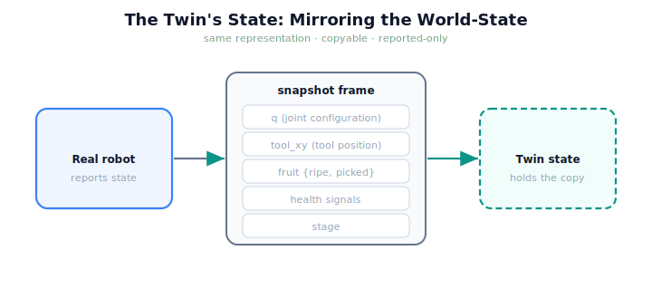

!!! abstract "You are here"
    **Module 10 — Digital Twin Capstone**  ·  **Unit 2 — Building the Mirror: State Synchronization**  ·  **Lesson 2.1 — The Twin's State: Mirroring the World-State Model**

# Lesson 2.1 — The Twin's State: Mirroring the World-State Model

> A mirror reflects whatever is in front of it. For the twin to reflect the real robot, it must hold the robot's state — the same quantities, in the same form. This lesson defines that shared state and captures it as a copyable frame, the raw material of the mirror.

---

## 1. Why This Matters
The twin can only mirror what it represents. If the twin's state leaves out the fruit statuses, it cannot reflect which fruit are picked; if it omits the health signals, it cannot mirror the robot's condition. So the first construction step is choosing the right *state representation* — and matching it to what the Module 9 system actually reports, no more and no less. Mirror too little and the twin is blind to part of reality; invent state the robot doesn't expose and the twin is fiction. A faithful twin starts with a faithful state.

## 2. Physical Intuition
A control-room screen laid out to match the plant. The screen shows exactly the gauges the plant reports — tank levels, valve positions, temperatures — each in the same units, updated from the plant's telemetry. It does not show gauges the plant has no sensor for (that would be made-up), and it does not omit ones the operator needs. The twin's state is that screen's data model: a structured copy of precisely what the real system reports, ready to be refreshed.

## 3. Mathematical Foundations
The Module 9 system reports a **world-state** — the observable quantities that describe the robot's situation:

$$s = \big(\,q,\; \mathbf{x}_{\text{tool}},\; \{\text{fruit}_i: (\text{xy}, \text{ripe}, \text{picked})\},\; \text{health},\; \text{stage}\,\big),$$

where $q$ is the joint configuration, $\mathbf{x}_{\text{tool}}$ the tool position (forward kinematics of $q$), the fruit set carries each fruit's position and status, *health* is the monitor's signals (manipulability, effort, error), and *stage* is where the pick cycle stands. The twin's state is a **copyable frame** of exactly this — a `snapshot`. Two design rules: (1) it mirrors **only reported state** (nothing the robot doesn't expose — no hidden truth), and (2) it is **copyable and self-contained** (a value, not a live reference into the robot), so the twin can hold, compare, and diverge from it independently. The snapshot introduces no new theory; it is a faithful transcription of Module 9's world-state into a frame the twin owns.

## 4. Visual Explanation

<figure markdown>
  { width="680" }
</figure>

## 5. Engineering Example
Capturing the greenhouse state. Mid-harvest, the real robot's reported snapshot is: $q$ (the two joint angles), the tool position from forward kinematics, the six fruit with their ripe/picked flags, the latest health signals (e.g. minimum manipulability, peak effort), and the current stage. The twin takes this whole frame as a copy and holds it as its own state. Note what is *not* in it: there is no "true" arm position the robot doesn't report, no fruit the camera didn't see — only what the system actually exposes. The twin mirrors the report, which is the honest thing to mirror.

## 6. Worked Example
Decide what belongs in the twin's state frame. Candidate items: (a) the joint configuration $q$ — **yes** (reported, essential). (b) The tool position — **yes** (reported, derived from $q$). (c) Each fruit's picked status — **yes** (reported; needed to mirror harvest progress). (d) The *exact* unmodeled friction in joint 1 that the robot cannot measure — **no** (not reported; including it would be fiction, not mirroring). (e) The health signals — **yes** (reported condition). The rule decides every case: *is it reported?* The twin's state is the union of reported quantities, transcribed faithfully — which also foreshadows the sim-to-real gap (Unit 4): the unreported truth in (d) is exactly what the twin cannot mirror.

## 7. Interactive Demonstration
*(Conceptual — the Installment-A flagship: the Twin Mirror.)*
Inspect the live state frame beside the robot: each field (q, tool, fruit, health, stage) shown updating as the real robot acts. Toggle a field's source to see the twin's state populate from the report. The demonstration makes the twin's state concrete — a structured, copyable reflection of the reported world-state.

## 8. Coding Exercise

!!! tip "Run the hands-on notebook"
    `modules/module10/notebooks/lesson05_twin_state.ipynb` — open in JupyterLab and run **Kernel → Restart & Run All**.

*(The notebook captures real state.)*
Take a Module 9 world, advance it (move the arm, mark a fruit picked), and capture its `snapshot`; assert the frame contains $q$, tool position, fruit states, health, and stage, and that it is a *copy* (mutating the world afterward does not change the captured frame). This builds the twin's raw material — a faithful, copyable state.

## 9. Knowledge Check

Formative — unlimited attempts, immediate feedback; does not affect your grade.

<iframe src="../../quizzes/module10/lesson05_quiz.html" title="The Twin's State: Mirroring the World-State Model knowledge check" style="width:100%;height:720px;border:1px solid #e2e8f0;border-radius:12px"></iframe>

[Open this quiz in a new tab ↗](../quizzes/module10/lesson05_quiz.html)

*(Formative — unlimited attempts, immediate feedback.)*
Confirm what the reported world-state contains, that the twin mirrors only reported state, that the frame is copyable/self-contained, and why mirroring unreported "truth" would be fiction.

## 10. Challenge Problem
The twin's state must be **copyable and self-contained**, not a live reference into the robot's own objects. Explain why this matters specifically for a twin (hint: think about what `divergence` and later *simulation* require), and what would go wrong if the twin's state were just an alias of the real robot's state. Keep the analysis about state representation; synchronization is the next lesson.

## 11. Common Mistakes
- **Mirroring too little.** Omitting fruit status or health leaves the twin blind to part of reality.
- **Inventing unreported state.** The twin mirrors what the robot *reports*; adding hidden "truth" is fiction.
- **Aliasing instead of copying.** A live reference into the robot can't diverge or be simulated independently; the frame must be a copy.
- **Wrong representation.** The twin must hold the *same* quantities in the *same* form as the report, or comparison is meaningless.

## 12. Key Takeaways
- The twin holds the **same world-state representation** the real system reports: $q$, tool position, fruit states, health, stage.
- The state is captured as a **copyable, self-contained frame** (a `snapshot`) the twin owns.
- The twin mirrors **only reported state** — nothing the robot doesn't expose (no hidden truth).
- A faithful twin **starts with a faithful state**; the mirror is only as good as the state it copies.
- The unreported truth the twin *cannot* mirror foreshadows the **sim-to-real gap** (Unit 4).

---

## AI Learning Companion
Copy any prompt into an AI assistant.

**Tutor prompt** — explain it another way
```
Re-explain Lesson 2.1 as designing a control-room data model that mirrors exactly the gauges a plant reports — no more, no less.
```
**Practice prompt** — generate more exercises
```
Give me 4 exercises where I decide which quantities belong in a twin's state frame (reported vs unreported). With answers.
```
**Explore prompt** — connect it to the real world
```
Show me what state a real robot's telemetry exposes and how a twin's state model is designed to match it.
```

## Global Learning Support
Need this lesson in another language? Copy a prompt below into an AI assistant. English is the authoritative source.

**Supported languages (initial):** English · Español · 中文 (Simplified Chinese) · Türkçe

```
I just completed Lesson 2.1 — The Twin's State: Mirroring the World-State Model.
Explain this lesson in Español. Keep robotics/math terminology in English where appropriate.
Then provide: a summary, three practice questions, and one challenge problem.
```
```
I just completed Lesson 2.1 — The Twin's State: Mirroring the World-State Model.
Explain this lesson in 中文 (Simplified Chinese). Keep robotics/math terminology in English where appropriate.
Then provide: a summary, three practice questions, and one challenge problem.
```
```
I just completed Lesson 2.1 — The Twin's State: Mirroring the World-State Model.
Explain this lesson in Türkçe. Keep robotics/math terminology in English where appropriate.
Then provide: a summary, three practice questions, and one challenge problem.
```

---

*Next lesson: 2.2 — Synchronizing Twin ↔ Real (making the mirror live).*
