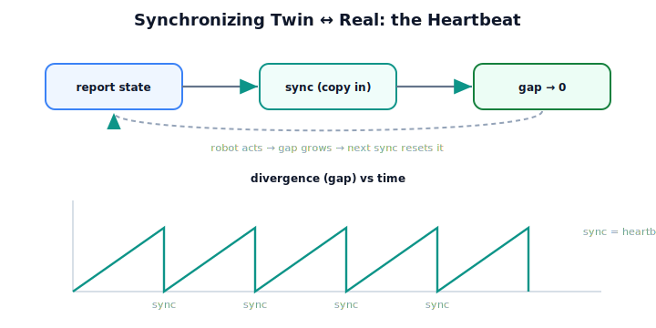

!!! abstract "You are here"
    **Module 10 — Digital Twin Capstone**  ·  **Unit 2 — Building the Mirror: State Synchronization**  ·  **Lesson 2.2 — Synchronizing Twin ↔ Real**

# Lesson 2.2 — Synchronizing Twin ↔ Real

> A copy made once is a snapshot; a copy refreshed continuously is a mirror. Synchronization is the act of refreshing — pulling the real system's reported state into the twin each cycle so the two stay in step. This is the heartbeat that makes our replica a *twin*.

---

## 1. Why This Matters
Unit 1 said a twin is *live*; this lesson is where "live" gets built. Synchronization is the mechanism that keeps the twin faithful as the real robot acts — every pick, every joint motion, the twin pulls the new reported state and matches it. Without sync the twin is a stale photograph; with it, the twin reflects the robot *now*, which is the precondition for everything the back half of the module does (monitoring drift, predicting ahead, adapting). Sync is simple — copy the report into the twin — but it is the difference between a model and a twin.

## 2. Physical Intuition
A clock set to a time signal. A clock left alone drifts; a clock that re-reads an authoritative time signal each minute stays correct. The re-reading is synchronization: a periodic correction that pulls the local copy back onto the source of truth. The twin's sync is that re-read — each cycle it pulls the robot's reported state and sets itself to match, so the mirror never drifts far from the real system.

## 3. Mathematical Foundations
**Synchronization** copies the real system's reported state into the twin, driving the gap to zero:

$$s_{\text{twin}} \;\leftarrow\; \text{report}(s_{\text{real}}), \qquad d(s_{\text{twin}}, s_{\text{real}}) \to 0 \;\text{after sync.}$$

Concretely, `sync(report)` writes the reported $q$, tool position, fruit states, and health into the twin's state and world. The **divergence** $d$ — the joint gap, the tool-position gap, and the count of fruit-status mismatches — is **zero immediately after a sync against that report** (the mirror is faithful to what it was told). Over time, a **live sync loop** runs this each cycle:

$$\text{for each cycle: } \; s_{\text{twin}} \leftarrow \text{report}(s_{\text{real}}^{(t)}),$$

so the twin tracks the real robot through a whole harvest. The operation reuses the Module 9 interface entirely — read the report, write the twin — and introduces **no new theory**; it is structured copying. Two facts to hold: after a sync the gap is zero *against the report*, and *between* syncs the twin does not move on its own, so it can drift from a robot that keeps acting (Lesson 2.3). Sync frequency is therefore a design choice trading freshness against cost.

## 4. Visual Explanation

<figure markdown>
  { width="680" }
</figure>

## 5. Engineering Example
Syncing through a harvest. As the real robot works down a row, after each pick it reports a fresh state — a new $q$, an updated fruit picked, new health signals. The twin syncs to each report and its divergence drops to zero every time: joint gap 0, tool gap 0, no fruit mismatches. Run the loop across the whole row and the twin tracks the real robot pick by pick. Pause the sync for a few picks and the twin freezes while the robot moves on — the divergence climbs — until the next sync snaps it back. The twin is faithful exactly as often as it syncs.

## 6. Worked Example
A twin is synced to the robot's reported state, then the robot completes one more pick *without* a sync. What does `divergence` report, and what does a subsequent sync do? Reasoning: immediately after the first sync, the gap is zero. The robot then moves (new $q$, a newly picked fruit) while the twin holds the old frame — so `divergence` now shows a nonzero joint gap, a nonzero tool gap, and one fruit mismatch: the twin has *drifted* because it didn't refresh. Running `sync` against the new report rewrites the twin's state to match, and the gap returns to zero. The lesson: divergence grows whenever the real system advances past the last sync, and sync is what resets it — which is exactly why the mirror must be kept live.

## 7. Interactive Demonstration

<iframe src="../../demos/module10/lesson06_sync_sawtooth.html" title="Synchronizing Twin ↔ Real interactive demo" style="width:100%;height:520px;border:1px solid #e2e8f0;border-radius:12px"></iframe>

[Open this demo in a new tab ↗](../demos/module10/lesson06_sync_sawtooth.html)

*(Conceptual — the Installment-A flagship: the Twin Mirror.)*
The sawtooth made interactive: a divergence meter that climbs as the real robot acts and snaps to zero at each sync. Slow the sync rate and watch the gap grow larger between refreshes; speed it up and watch it stay tight. The demonstration shows sync as the twin's heartbeat and frequency as the freshness dial.

## 8. Coding Exercise

!!! tip "Run the hands-on notebook"
    `modules/module10/notebooks/lesson06_synchronizing.ipynb` — open in JupyterLab and run **Kernel → Restart & Run All**.

*(The notebook runs a live sync loop.)*
Build a `DigitalTwin`; over a sequence of real states (advance the world, sync, repeat), assert that `divergence` is ~0 (`synced` True) immediately after each sync. Then advance the real world *without* syncing and assert divergence becomes nonzero, and that a following sync drives it back to zero. This verifies synchronization as the live mirror.

## 9. Knowledge Check

Formative — unlimited attempts, immediate feedback; does not affect your grade.

<iframe src="../../quizzes/module10/lesson06_quiz.html" title="Synchronizing Twin ↔ Real knowledge check" style="width:100%;height:720px;border:1px solid #e2e8f0;border-radius:12px"></iframe>

[Open this quiz in a new tab ↗](../quizzes/module10/lesson06_quiz.html)

*(Formative — unlimited attempts, immediate feedback.)*
Confirm what sync does (copy report into twin, gap → 0), that the twin drifts between syncs, that sync reuses the M9 interface with no new theory, and the freshness-vs-cost trade in sync frequency.

## 10. Challenge Problem
Sync frequency trades **freshness** (small gap) against **cost** (each sync reads and writes state). For our greenhouse robot, argue what sets a *good enough* sync rate — what determines how stale the twin may safely become before the back-half uses (monitoring, prediction) start to suffer? Frame your answer around the divergence sawtooth and the twin's purpose; do not introduce real-time scheduling theory (that was named out-of-scope back in Module 8).

## 11. Common Mistakes
- **Syncing once and calling it live.** A twin is kept in step *continuously*; one sync is a snapshot.
- **Expecting the twin to move on its own.** Between syncs the twin is frozen; only sync (or, later, simulation) advances it.
- **Assuming sync removes the gap to reality.** Sync zeroes the gap *to the report* — a hidden unreported effect can remain (Lesson 2.3 / Unit 4).
- **Over-syncing blindly.** Freshness has a cost; the rate is a design choice, not "as fast as possible always."

## 12. Key Takeaways
- **Synchronization** copies the real system's reported state into the twin, driving the gap to **zero after each sync**.
- A **live sync loop** runs this each cycle, so the twin tracks the real robot through a whole harvest.
- Between syncs the twin **drifts** as the robot acts — divergence climbs, then a sync resets it (the sawtooth).
- Sync **reuses the Module 9 interface** (read report, write twin) and adds **no new theory**.
- Sync **frequency** trades freshness against cost — the twin is faithful exactly as often as it syncs.

---

## AI Learning Companion
Copy any prompt into an AI assistant.

**Tutor prompt** — explain it another way
```
Re-explain Lesson 2.2 with a clock re-reading a time signal: synchronization as periodic correction that keeps the twin from drifting.
```
**Practice prompt** — generate more exercises
```
Give me 4 exercises tracing a twin's divergence as the real robot acts and syncs occur (the sawtooth). With answers.
```
**Explore prompt** — connect it to the real world
```
Show me how real digital twins synchronize with their physical asset (telemetry cadence, state updates) and the freshness-vs-cost trade.
```

## Global Learning Support
Need this lesson in another language? Copy a prompt below into an AI assistant. English is the authoritative source.

**Supported languages (initial):** English · Español · 中文 (Simplified Chinese) · Türkçe

```
I just completed Lesson 2.2 — Synchronizing Twin ↔ Real.
Explain this lesson in Español. Keep robotics/math terminology in English where appropriate.
Then provide: a summary, three practice questions, and one challenge problem.
```
```
I just completed Lesson 2.2 — Synchronizing Twin ↔ Real.
Explain this lesson in 中文 (Simplified Chinese). Keep robotics/math terminology in English where appropriate.
Then provide: a summary, three practice questions, and one challenge problem.
```
```
I just completed Lesson 2.2 — Synchronizing Twin ↔ Real.
Explain this lesson in Türkçe. Keep robotics/math terminology in English where appropriate.
Then provide: a summary, three practice questions, and one challenge problem.
```

---

*Next lesson: 2.3 — When the Mirror Drifts: Sync Error (reported vs. true, the first glimpse of the sim-to-real gap).*
