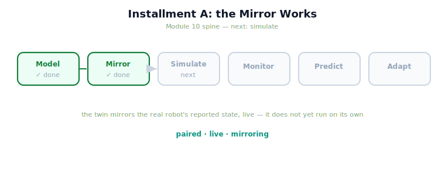

!!! abstract "You are here"
    **Module 10 — Digital Twin Capstone**  ·  **Unit 2 — Building the Mirror: State Synchronization**  ·  **Lesson 2.4 — Unit 2 Recap and Installment A Milestone**

# Lesson 2.4 — Unit 2 Recap and Installment A Milestone

> Two units in, the twin is real and the mirror is live. Before the Architect opens the next installment, let's consolidate what we have built — a faithful, synchronized reflection of the Module 9 robot — and be precise about what it still cannot do.

---

## 1. Why This Matters
A milestone is where you state plainly what works and what doesn't, so the next stage builds on solid ground. Installment A built the *mirror*: the twin holds the real system's state and stays synced to it. That is the foundation for everything ahead — you cannot monitor, predict, or adapt with a twin that doesn't first faithfully reflect reality. Naming the milestone's boundary — the twin mirrors but does not yet *run* — sets up Installment B cleanly.

## 2. Physical Intuition
The control room is wired and the screens track the plant — but no one has yet run a "what-if" on a copy. The instrumentation works: every gauge mirrors the real line, live. The next capability is to take the mirrored state and *run it forward* in a sandbox to ask what would happen. Installment A wired the room; Installment B runs the first experiment.

## 3. Mathematical Foundations
Installment A in four results:

- **The asset & concept** (Unit 1): a digital twin is paired, live, mirroring; it wraps the Module 9 system's four inputs (orchestrator, world-state, health signals, interface) and adds no new robot behaviour.
- **The state** (2.1): the twin holds a copyable frame of the **reported** world-state — $q$, tool position, fruit states, health, stage — and only what is reported.
- **Synchronization** (2.2): `sync` copies the report into the twin, driving the gap to zero; a live loop keeps the twin tracking the real robot; the twin drifts between syncs (the sawtooth).
- **Sync error vs. residual gap** (2.3): sync error (twin vs. report) → 0, but a residual gap (twin vs. truth) can remain when reality carries unmodeled effects — the origin of the sim-to-real gap.

**Milestone state:** the twin **mirrors** the real system's reported state faithfully and live. **Boundary:** the twin does **not yet run on its own** — it holds and reflects state, but does not simulate the system forward. That is Installment B.

## 4. Visual Explanation

<figure markdown>
  { width="680" }
</figure>

## 5. Engineering Example
What the twin can do today. Point it at the deployed Module 9 harvester and it will hold a faithful, copyable frame of the robot's reported state and keep it synced each cycle — joint configuration, tool position, fruit picked, health signals — with divergence dropping to zero at every sync. It honestly reports its sync error, and (given ground truth) it can reveal a residual gap from unmodeled effects. What it cannot do today: take that mirrored state and *run the harvest forward* to ask "what happens next?" The twin reflects; it does not yet simulate. That single next capability unlocks monitoring, prediction, and adaptation.

## 6. Worked Example
Self-test, answered. *Question:* given Installment A, which of these can the twin do — (a) show the real robot's current arm configuration; (b) flag that it has drifted since the last sync; (c) reveal it differs from reality due to a hidden offset; (d) predict whether the next pick will succeed? *Answer:* (a) **yes** (mirroring reported state), (b) **yes** (divergence vs the report grows between syncs), (c) **yes** (given ground truth, the residual gap shows), but (d) **no** — predicting the next pick requires *running the system forward in the twin*, which is simulation (Installment B). Knowing that (d) is out of reach today, and *why*, is the milestone's key insight.

## 7. Interactive Demonstration
*(Conceptual — the Installment-A flagship: the Twin Mirror.)*
The Twin Mirror as the capstone of Installment A: real robot and twin side by side, state mirrored, sync as heartbeat, the sawtooth of drift-and-reset, and the hidden-offset toggle exposing the residual gap. Everything Units 1–2 built, in one panel. What it does *not* yet show — the twin running ahead of reality — is Installment B.

## 8. Coding Exercise

!!! tip "Run the hands-on notebook"
    `modules/module10/notebooks/lesson08_unit2_recap.ipynb` — open in JupyterLab and run **Kernel → Restart & Run All**.

*(The recap notebook checks the whole mirror.)*
End to end: build a `GroundTruth` and a `DigitalTwin`; sync and assert zero sync error (`synced` True); advance reality without syncing and assert drift; re-sync and assert recovery; add a hidden offset and assert a nonzero residual gap against the true state. Passing this confirms the Installment A mirror is complete and faithful.

## 9. Knowledge Check

Formative — unlimited attempts, immediate feedback; does not affect your grade.

<iframe src="../../quizzes/module10/lesson08_quiz.html" title="Unit 2 Recap and Installment A Milestone knowledge check" style="width:100%;height:720px;border:1px solid #e2e8f0;border-radius:12px"></iframe>

[Open this quiz in a new tab ↗](../quizzes/module10/lesson08_quiz.html)

*(Formative — unlimited attempts, immediate feedback.)*
Mixed review across Installment A: the twin definition, the four M9 inputs, the reported state frame, synchronization and drift, and sync error vs. residual gap.

## 10. Challenge Problem
The next installment lets the twin *simulate* — run the Module 9 system forward on its own world. Predict three things simulation will enable that mirroring alone cannot, and for each, note which later theme (monitoring, prediction, adaptation) it serves. Then state one risk simulation introduces that mirroring did not (hint: a simulated future is only as faithful as the twin's model — recall the residual gap). Sketch your expectations; Installment B will test them.

## 11. Common Mistakes
- **Thinking the twin can already predict.** Mirroring reflects the present; prediction needs simulation (next installment).
- **Forgetting drift.** A twin is faithful only as often as it syncs; between syncs it drifts.
- **Equating synced with correct-about-reality.** Sync zeroes the gap to the report; a residual gap can remain.
- **Skipping the boundary.** A clean milestone states what the twin cannot yet do, not just what it can.

## 12. Key Takeaways
- **Installment A is complete:** the twin **exists** (Unit 1) and the **mirror works** (Unit 2).
- The twin holds a **copyable frame of the reported world-state** and stays **synced** to the real robot (gap → 0), drifting between syncs.
- **Sync error → 0**, but a **residual gap** to reality can remain from unmodeled effects — the sim-to-real gap's origin.
- **Milestone boundary:** the twin **mirrors but does not yet simulate** — it reflects the present, it does not run forward.
- **Next (Installment B):** **simulating the system in the twin**, and confronting the **sim-to-real gap** head-on (Unit 4, the midpoint).

---

## AI Learning Companion
Copy any prompt into an AI assistant.

**Tutor prompt** — explain it another way
```
Quiz me on Installment A: the twin concept, the state frame, synchronization and drift, and sync error vs residual gap. Re-explain whatever I miss.
```
**Practice prompt** — generate more exercises
```
Give me 5 mixed-review questions on building the twin mirror (state, sync, sync error), with answers.
```
**Explore prompt** — connect it to the real world
```
Show me how a real digital-twin project sequences its work: first faithful state mirroring, then simulation, then monitoring and prediction.
```

## Global Learning Support
Need this lesson in another language? Copy a prompt below into an AI assistant. English is the authoritative source.

**Supported languages (initial):** English · Español · 中文 (Simplified Chinese) · Türkçe

```
I just completed Lesson 2.4 — Unit 2 Recap and Installment A Milestone.
Explain this lesson in Español. Keep robotics/math terminology in English where appropriate.
Then provide: a summary, three practice questions, and one challenge problem.
```
```
I just completed Lesson 2.4 — Unit 2 Recap and Installment A Milestone.
Explain this lesson in 中文 (Simplified Chinese). Keep robotics/math terminology in English where appropriate.
Then provide: a summary, three practice questions, and one challenge problem.
```
```
I just completed Lesson 2.4 — Unit 2 Recap and Installment A Milestone.
Explain this lesson in Türkçe. Keep robotics/math terminology in English where appropriate.
Then provide: a summary, three practice questions, and one challenge problem.
```

---

*Installment A complete. Next: Installment B — Simulating the System in the Twin, and the Sim-to-Real Gap (Unit 4 midpoint).*
