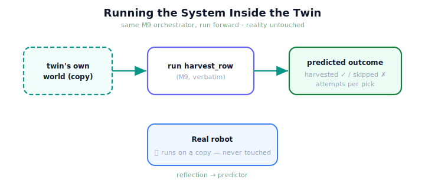

!!! abstract "You are here"
    **Module 10 — Digital Twin Capstone**  ·  **Unit 3 — Simulating the System in the Twin**  ·  **Lesson 3.1 — Running the System Inside the Twin**

# Lesson 3.1 — Running the System Inside the Twin

> Installment A built a faithful mirror — but a mirror only shows you *now*. The moment we let the twin *run the harvester forward on its own copy of the world*, it stops merely reflecting and starts answering questions. That is simulation, and it is what makes a twin powerful.

---

## 1. Why This Matters
Mirroring tells you the robot's current state; simulation tells you what *would happen* if the robot acted. That single leap — from reflecting to running — is what lets a twin be used for anything beyond a live dashboard. Run the Module 9 harvester inside the twin and you get a *predicted harvest*: which fruit it would pick, which it would skip, how many attempts each would take — all computed on the twin's own world, with the real robot untouched. Every later capability (monitoring against predictions, looking ahead, pre-validating actions) is built on this one. And, crucially, it costs nothing real: the twin runs on a copy.

## 2. Physical Intuition
A flight simulator you can actually *fly*. The mirror was the cockpit displays showing the real plane's state; simulation is taking the controls and flying the simulated plane through a maneuver to see how it goes — without risking the real aircraft. You run the *same* flight model the real plane obeys, on a copy, and watch the outcome. The twin's simulation is exactly this: run the real robot's own logic, on the twin's world, and observe the result.

## 3. Mathematical Foundations
Simulation is running the model forward. The twin holds a world $w_{\text{twin}}$ (its mirrored layout and state); simulation applies the Module 9 orchestrator to it:

$$\text{outcome}_{\text{sim}} = \texttt{harvest\_row}(w_{\text{twin}}),$$

producing the same structured result the real system produces — harvested set, skipped set, per-pick attempts. Two design rules make this a *twin* simulation rather than a generic one. (1) It runs on the **twin's own world** (a copy of reality's layout), so it predicts *this* robot's harvest, not a hypothetical. (2) It runs on a **fresh copy** each time, so the twin can simulate repeatedly without consuming its state and **without touching reality** — the real robot is never executed. The orchestrator is reused **verbatim**: simulation introduces no new perception, planning, control, or recovery — it is the M9 model, run forward in the twin. Formally, simulation is the map $w \mapsto \texttt{harvest\_row}(w)$ applied inside the twin; the only new thing is *where* it runs (the twin's copy) and *why* (to predict, safely).

## 4. Visual Explanation

<figure markdown>
  { width="680" }
</figure>

## 5. Engineering Example
Predicting a harvest. Build a twin of the deployed robot's greenhouse and call `simulate()`: the twin runs the full Module 9 pick cycle across its row — perceiving, selecting targets, planning, executing, tracking, recovering — and returns a predicted outcome: say, all ripe reachable fruit harvested, none skipped, each in one attempt. The real robot has done nothing; this is a *forecast* of what it would do. Run it again and you can study the predicted harvest in detail — exactly the kind of question a mirror alone could never answer. Everything the simulation "knows" about harvesting it borrows from Module 9; the twin only chose to run it on a copy.

## 6. Worked Example
Why run simulation on a *copy* of the twin's world rather than the twin's world directly? Reasoning: `harvest_row` mutates the world as it picks (fruit get marked, the arm moves). If the twin simulated on its live state, a single simulation would *consume* that state — the twin could not then simulate a second scenario from the same starting point, nor continue mirroring. Running on a fresh copy each time keeps the twin's own state intact, so it can simulate the same situation many times (different what-ifs) and keep syncing to reality in between. The copy is what makes simulation *repeatable* and *non-destructive* — the properties the sandbox (next lesson) depends on.

## 7. Interactive Demonstration

<iframe src="../../demos/module10/lesson09_running_in_twin.html" title="Running the System Inside the Twin interactive demo" style="width:100%;height:520px;border:1px solid #e2e8f0;border-radius:12px"></iframe>

[Open this demo in a new tab ↗](../demos/module10/lesson09_running_in_twin.html)

*(Conceptual — previews the Installment-B flagship, the Sim-to-Real Gap Explorer.)*
Run a harvest inside the twin and watch the predicted outcome appear — harvested and skipped fruit, attempts per pick — while the real robot sits idle. Re-run it and see the same prediction reproduced. The demonstration shows the twin *running*, not just reflecting, with reality untouched.

## 8. Coding Exercise

!!! tip "Run the hands-on notebook"
    `modules/module10/notebooks/lesson09_simulating_in_twin.ipynb` — open in JupyterLab and run **Kernel → Restart & Run All**.

*(The notebook runs a simulation in the twin.)*
Build a `DigitalTwin` and call `simulate()` to run `harvest_row` on its own world; assert it returns a structured outcome (harvested, skipped, picks, complete) and that the real world is unchanged afterward (simulation ran on a copy). This establishes simulation as running the M9 system forward in the twin, safely.

## 9. Knowledge Check

Formative — unlimited attempts, immediate feedback; does not affect your grade.

<iframe src="../../quizzes/module10/lesson09_quiz.html" title="Running the System Inside the Twin knowledge check" style="width:100%;height:720px;border:1px solid #e2e8f0;border-radius:12px"></iframe>

[Open this quiz in a new tab ↗](../quizzes/module10/lesson09_quiz.html)

*(Formative — unlimited attempts, immediate feedback.)*
Confirm that simulation runs the M9 orchestrator forward on the twin's own world, that it runs on a copy (reality untouched, repeatable), and that it adds no new theory.

## 10. Challenge Problem
Simulation turns the twin from a reflection into a predictor. List three questions about the real robot that simulation can now answer that mirroring alone could not, and for each, name which later theme (monitoring, prediction, adaptation) it serves. Then state the one assumption every simulated answer rests on (hint: recall that the twin can only be as faithful as its model of reality). Keep it conceptual — no new algorithm.

## 11. Common Mistakes
- **Confusing mirroring with simulation.** Mirroring reflects the present; simulation runs the system forward.
- **Simulating on the live twin state.** Run on a copy, or a single simulation consumes the twin's state.
- **Thinking simulation needs new robot logic.** It reuses Module 9's orchestrator verbatim.
- **Forgetting it's safe.** Simulation runs on a copy — the real robot is never executed.

## 12. Key Takeaways
- **Simulation** is running the Module 9 harvester **forward inside the twin's own world** to produce a predicted outcome.
- It **reuses `harvest_row` verbatim** — no new perception, planning, control, or recovery.
- It runs on a **fresh copy** each time: **reality is never touched**, and simulation is **repeatable**.
- Simulation turns the twin from a **reflection into a predictor** — the foundation for monitoring, prediction, and adaptation.
- Every simulated answer is only as faithful as the twin's model — which sets up the **sim-to-real gap** (Unit 4).

---

## AI Learning Companion
Copy any prompt into an AI assistant.

**Tutor prompt** — explain it another way
```
Re-explain Lesson 3.1 with a flight simulator you can actually fly: running the real plane's model on a copy to see what would happen, without risking the aircraft.
```
**Practice prompt** — generate more exercises
```
Give me 4 exercises distinguishing mirroring (reflect the present) from simulation (run forward), with answers.
```
**Explore prompt** — connect it to the real world
```
Show me how real digital twins run their physical asset's own control logic forward in simulation to forecast outcomes.
```

## Global Learning Support
Need this lesson in another language? Copy a prompt below into an AI assistant. English is the authoritative source.

**Supported languages (initial):** English · Español · 中文 (Simplified Chinese) · Türkçe

```
I just completed Lesson 3.1 — Running the System Inside the Twin.
Explain this lesson in Español. Keep robotics/math terminology in English where appropriate.
Then provide: a summary, three practice questions, and one challenge problem.
```
```
I just completed Lesson 3.1 — Running the System Inside the Twin.
Explain this lesson in 中文 (Simplified Chinese). Keep robotics/math terminology in English where appropriate.
Then provide: a summary, three practice questions, and one challenge problem.
```
```
I just completed Lesson 3.1 — Running the System Inside the Twin.
Explain this lesson in Türkçe. Keep robotics/math terminology in English where appropriate.
Then provide: a summary, three practice questions, and one challenge problem.
```

---

*Next lesson: 3.2 — The Twin as a Sandbox: Risk-Free Experimentation.*
