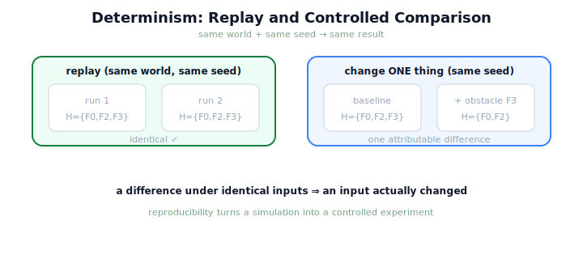

!!! abstract "You are here"
    **Module 10 — Digital Twin Capstone**  ·  **Unit 3 — Simulating the System in the Twin**  ·  **Lesson 3.3 — Replay and Reproduce: Determinism in the Twin**

# Lesson 3.3 — Replay and Reproduce: Determinism in the Twin

> If you run the same simulation twice and get two different results, you cannot study either. Reproducibility — replaying a harvest exactly — is what makes the sandbox scientific: it lets you change one thing, re-run, and know that any difference came from your change.

---

## 1. Why This Matters
Experiments require controls. To learn from the twin you must be able to say "I changed X, and *only* X, and here is the effect." That demands that everything *else* stay identical between runs — which means the simulation must be **deterministic**: same starting world, same random seed, same result, every time. Without determinism, a difference between two runs could come from your change or from noise, and you'd never know which. With it, the twin becomes a controlled laboratory: replay a harvest to inspect it, or hold everything fixed but one variable to isolate that variable's effect. Reproducibility is the quiet property that makes every other use of the twin trustworthy.

## 2. Physical Intuition
A recorded experiment you can re-run frame by frame. A good lab procedure, given the same inputs and conditions, yields the same result — that repeatability is what lets others verify it and what lets you change one factor at a time. A simulation with a fixed seed is a recording you can replay exactly and then perturb deliberately. The twin replays the harvest like rewinding and replaying a tape: identical unless *you* change something.

## 3. Mathematical Foundations
Determinism means the simulation is a **function** of its inputs: given a world $w$ and a random seed $\sigma$, the outcome is fixed,

$$\texttt{harvest\_row}(w,\ \texttt{rng\_seed}=\sigma) \;\Rightarrow\; \text{the same outcome every time.}$$

Module 9's execution is seeded (perception sampling, any stochastic step draws from a seeded generator), so re-running with the same world and seed **reproduces the result exactly** — identical harvested and skipped sets, identical per-pick attempts. This gives two powerful tools. **Replay:** run the same $(w, \sigma)$ to inspect a specific harvest as many times as needed. **Controlled comparison:** hold $(w, \sigma)$ fixed and change exactly one thing (an injected fault, a calibration), so any difference in outcome is **attributable to that change** and not to randomness. Determinism is not a new algorithm — it is a property the twin inherits from M9's seeded execution, and it is what elevates a simulation from an anecdote to an experiment.

## 4. Visual Explanation

<figure markdown>
  { width="680" }
</figure>

## 5. Engineering Example
Replaying and comparing a harvest. Simulate a harvest in the twin with a fixed seed; simulate it again with the same seed and the outcome is *identical* — the harvest is reproducible, so you can study that exact run. Now run a controlled comparison: same seed, but inject a blocking obstacle on one fruit. The only difference in the outcome is that one fruit's fate (skipped instead of harvested) — and because everything else was held fixed, you can attribute that difference *entirely* to the obstacle. Replay let you inspect; the controlled change let you measure an effect. Both rest on determinism.

## 6. Worked Example
You run two simulations of the same harvest with the same seed and get different harvested sets. What does this tell you, before you investigate the cause? Reasoning: with a fixed world and a fixed seed, Module 9's seeded execution is deterministic, so identical inputs *must* yield identical outcomes. A difference therefore means an input was *not* actually identical — something varied between the runs (a different seed, a mutated world, a stray injection, a leaked piece of state). The discrepancy is a signal to find the hidden variation, not evidence of inherent randomness. This diagnostic power — "if it differs, something changed" — is exactly what determinism buys, and it is why controlled comparisons are trustworthy.

## 7. Interactive Demonstration

<iframe src="../../demos/module10/lesson11_replay_determinism.html" title="Replay and Reproduce: Determinism in the Twin interactive demo" style="width:100%;height:520px;border:1px solid #e2e8f0;border-radius:12px"></iframe>

[Open this demo in a new tab ↗](../demos/module10/lesson11_replay_determinism.html)

*(Conceptual — previews the Installment-B flagship, the Sim-to-Real Gap Explorer.)*
Run a simulated harvest twice with the same seed and see identical outcomes; change the seed and watch the run vary; then hold the seed and inject one change and see a single, attributable difference. The demonstration makes determinism and controlled comparison concrete.

## 8. Coding Exercise

!!! tip "Run the hands-on notebook"
    `modules/module10/notebooks/lesson11_determinism.ipynb` — open in JupyterLab and run **Kernel → Restart & Run All**.

*(The notebook checks reproducibility.)*
Simulate a harvest in the twin twice with the same seed and assert the outcomes are identical (reproducible). Then simulate with the same seed plus one injected obstacle and assert the *only* difference is that fruit's fate. This verifies determinism and controlled comparison.

## 9. Knowledge Check

Formative — unlimited attempts, immediate feedback; does not affect your grade.

<iframe src="../../quizzes/module10/lesson11_quiz.html" title="Replay and Reproduce: Determinism in the Twin knowledge check" style="width:100%;height:720px;border:1px solid #e2e8f0;border-radius:12px"></iframe>

[Open this quiz in a new tab ↗](../quizzes/module10/lesson11_quiz.html)

*(Formative — unlimited attempts, immediate feedback.)*
Confirm that same world + same seed → identical outcome, that reproducibility enables replay and controlled comparison, that determinism is inherited from M9's seeded execution, and what a difference under identical inputs implies.

## 10. Challenge Problem
Determinism lets you attribute an outcome difference to a single change. Explain why this property is *essential* for the back half of the module — specifically, for trusting that a twin's prediction of "this pick will fail" reflects a real cause rather than simulation noise. Then describe one way determinism could be accidentally broken in practice, and how you'd detect it. Keep it about reproducibility, not a new technique.

## 11. Common Mistakes
- **Assuming simulations vary inherently.** With a fixed world and seed, the outcome is fixed; variation means an input changed.
- **Comparing runs with different seeds.** A controlled comparison holds the seed fixed and changes one thing.
- **Treating determinism as new theory.** It is inherited from Module 9's seeded execution.
- **Ignoring hidden state leaks.** A difference under "identical" inputs is a clue that something silently varied.

## 12. Key Takeaways
- **Determinism:** same world + same seed → **identical outcome**, every time.
- **Replay** lets you inspect a specific harvest; **controlled comparison** holds everything fixed but one change.
- A difference under identical inputs means **an input actually changed** — a diagnostic, not randomness.
- Determinism is **inherited from Module 9's seeded execution** — no new theory.
- Reproducibility turns a simulation from an **anecdote into a controlled experiment** — the basis for trustworthy prediction.

---

## AI Learning Companion
Copy any prompt into an AI assistant.

**Tutor prompt** — explain it another way
```
Re-explain Lesson 3.3 with a recorded lab experiment you can replay frame by frame and perturb one factor at a time.
```
**Practice prompt** — generate more exercises
```
Give me 4 exercises on determinism: predict whether two runs match, and attribute a difference to a change or a hidden variation. With answers.
```
**Explore prompt** — connect it to the real world
```
Show me why reproducibility (seeds, fixed inputs) matters in real simulation and digital-twin engineering.
```

## Global Learning Support
Need this lesson in another language? Copy a prompt below into an AI assistant. English is the authoritative source.

**Supported languages (initial):** English · Español · 中文 (Simplified Chinese) · Türkçe

```
I just completed Lesson 3.3 — Replay and Reproduce: Determinism in the Twin.
Explain this lesson in Español. Keep robotics/math terminology in English where appropriate.
Then provide: a summary, three practice questions, and one challenge problem.
```
```
I just completed Lesson 3.3 — Replay and Reproduce: Determinism in the Twin.
Explain this lesson in 中文 (Simplified Chinese). Keep robotics/math terminology in English where appropriate.
Then provide: a summary, three practice questions, and one challenge problem.
```
```
I just completed Lesson 3.3 — Replay and Reproduce: Determinism in the Twin.
Explain this lesson in Türkçe. Keep robotics/math terminology in English where appropriate.
Then provide: a summary, three practice questions, and one challenge problem.
```

---

*Next lesson: 3.4 — Unit 3 Recap (the twin now simulates; next, why it diverges from reality).*
