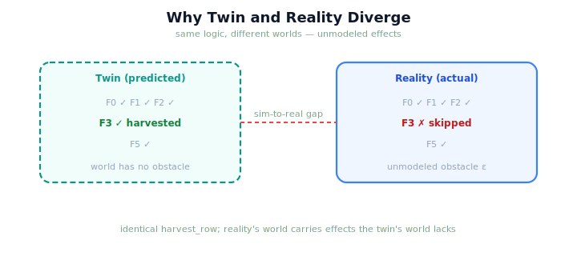

!!! abstract "You are here"
    **Module 10 — Digital Twin Capstone**  ·  **Unit 4 — The Sim-to-Real Gap**  ·  **Lesson 4.1 — Why Twin and Reality Diverge**

# Lesson 4.1 — Why Twin and Reality Diverge

> The twin runs the *exact same* harvester as the real robot. So how can its predicted harvest differ from what really happens? Because reality is more than any model of it. This lesson reaches the heart of the module: the sim-to-real gap, and why it is not a flaw but a fact.

---

## 1. Why This Matters
A twin that you trust blindly is dangerous; a twin whose limits you understand is invaluable. Even with identical logic, the twin's *world* is a simplification — it cannot include every disturbance, every slipped grip, every obstruction reality throws at the real robot. So the twin's simulated harvest and the real harvest will sometimes disagree, and an engineer must understand *why* before using the twin to monitor, predict, or adapt. This lesson names the cause — unmodeled effects — and frames the gap as the inevitable signature of modeling, not a bug to chase to zero. Everything in the module's back half is, in some sense, about living wisely with this gap.

## 2. Physical Intuition
A weather forecast that runs the real atmosphere's physics — and is still sometimes wrong. The forecast model uses genuine physical laws, yet it cannot resolve every gust and microclimate, so its prediction diverges from the actual sky. The divergence is not a coding error; it is the unavoidable consequence of modeling a vast reality with a finite model. The twin's simulated harvest diverges from the real one for the same reason: the world has more in it than the twin's copy does.

## 3. Mathematical Foundations
The twin and reality run the **same orchestrator** but on **different worlds**. Reality's world carries **unmodeled effects** $\varepsilon$ — disturbances, obstructions, calibration errors — that the twin's world lacks:

$$\text{outcome}_{\text{sim}} = \texttt{harvest\_row}(w_{\text{twin}}), \qquad \text{outcome}_{\text{real}} = \texttt{harvest\_row}(w_{\text{real}} \oplus \varepsilon),$$

so even though the *function* is identical, the *inputs* differ by $\varepsilon$, and the outcomes can diverge. Concretely, model reality with an unmodeled blocking obstacle on one fruit: the twin (not knowing about it) predicts that fruit **harvested**, while reality (experiencing it) **skips** it. The gap is the difference between these outcomes — and its source is precisely $\varepsilon$, the part of reality the twin does not model. Two facts anchor the lesson. First, the gap is **inevitable**: any model simpler than the world will miss something, so $\varepsilon \neq 0$ in general. Second, the gap is **informative**: where sim and real disagree points exactly at what the twin failed to model. No new theory is introduced — the gap is just the consequence of $w_{\text{twin}} \neq w_{\text{real}}$, made visible by running both.

## 4. Visual Explanation

<figure markdown>
  { width="680" }
</figure>

## 5. Engineering Example
The diverging harvest. Build a twin of the greenhouse and let reality carry an unmodeled blocking obstacle on one fruit — a branch the camera never reported, say. The twin simulates and predicts all ripe reachable fruit harvested, including that one. Reality runs the *same* harvester, hits the obstacle, and skips that fruit (a localised plan failure) while harvesting the rest. Compare the two outcomes: they agree everywhere except that one fruit — predicted harvested, actually skipped. That single disagreement *is* the sim-to-real gap, and it points straight at the unmodeled obstacle. The twin's logic was perfect; its world was incomplete.

## 6. Worked Example
The twin predicts a fruit harvested; reality skips it. Is the twin "broken"? Reasoning: no. The twin ran the identical Module 9 harvester; the divergence came from an **unmodeled effect** in reality (the obstacle) that the twin's world did not include. A model simpler than reality *will* miss such effects — that is the definition of a model, not a defect. The right reading is: "the twin and reality disagree on this fruit, which tells me reality has an effect here that my twin doesn't model." That is diagnostic information, not breakage. Expecting the gap to be zero is the real error; understanding and using the gap is the skill.

## 7. Interactive Demonstration

<iframe src="../../demos/module10/lesson13_why_diverge.html" title="Why Twin and Reality Diverge interactive demo" style="width:100%;height:520px;border:1px solid #e2e8f0;border-radius:12px"></iframe>

[Open this demo in a new tab ↗](../demos/module10/lesson13_why_diverge.html)

*(Conceptual — the Installment-B flagship: the Sim-to-Real Gap Explorer.)*
Run the twin's predicted harvest beside reality's actual harvest. Add an unmodeled effect to reality — a blocking obstacle, a disturbance — and watch the outcomes diverge: a fruit the twin harvests, reality skips. Toggle effects on and off and watch the gap open and close. The demonstration makes the sim-to-real gap, and its cause, unmistakable.

## 8. Coding Exercise

!!! tip "Run the hands-on notebook"
    `modules/module10/notebooks/lesson13_why_diverge.ipynb` — open in JupyterLab and run **Kernel → Restart & Run All**.

*(The notebook opens the gap.)*
Give a `GroundTruth` an unmodeled blocking obstacle on one fruit; `simulate` the twin's predicted harvest and `run` reality's actual harvest. Assert the twin predicts that fruit harvested while reality skips it — a divergent outcome — and that the difference traces to the unmodeled effect. This makes the sim-to-real gap concrete.

## 9. Knowledge Check

Formative — unlimited attempts, immediate feedback; does not affect your grade.

<iframe src="../../quizzes/module10/lesson13_quiz.html" title="Why Twin and Reality Diverge knowledge check" style="width:100%;height:720px;border:1px solid #e2e8f0;border-radius:12px"></iframe>

[Open this quiz in a new tab ↗](../quizzes/module10/lesson13_quiz.html)

*(Formative — unlimited attempts, immediate feedback.)*
Confirm that identical logic on different worlds can diverge, that unmodeled effects are the source, that the gap is inevitable (not a bug), and that it is informative (it points at what's unmodeled).

## 10. Challenge Problem
The sim-to-real gap is both inevitable and informative. Argue why trying to eliminate it entirely is the wrong goal, and what the *right* goal is instead (hint: think about what the gap *tells* you and how the back half of the module uses it). Then give two greenhouse effects that would open a gap and say, for each, whether the twin could plausibly come to model it. Keep it conceptual — no new method.

## 11. Common Mistakes
- **Treating divergence as a bug.** Identical logic on different worlds diverges because of unmodeled effects — that's expected.
- **Expecting a zero gap.** Any model simpler than reality will miss something; the gap is inevitable.
- **Ignoring what the gap reveals.** Where sim and real disagree points exactly at what the twin failed to model.
- **Blaming the logic.** The orchestrator is identical; the difference is in the worlds.

## 12. Key Takeaways
- The twin runs the **same harvester** as reality but on a **different world** — reality carries **unmodeled effects** the twin lacks.
- The **sim-to-real gap** is the resulting difference between the **predicted** and **actual** harvest.
- The gap is **inevitable** (a model is simpler than the world) and **informative** (it points at what's unmodeled).
- A divergence is **not a bug** — it is the diagnostic signature of an effect the twin doesn't model.
- Living wisely with this gap is the central skill of the module's back half.

---

## AI Learning Companion
Copy any prompt into an AI assistant.

**Tutor prompt** — explain it another way
```
Re-explain Lesson 4.1 with a weather forecast that uses real physics yet still diverges from the sky — unmodeled effects, not bugs.
```
**Practice prompt** — generate more exercises
```
Give me 4 scenarios where a twin's predicted harvest diverges from reality, and I name the unmodeled effect causing it. With answers.
```
**Explore prompt** — connect it to the real world
```
Show me real examples of the sim-to-real gap in robotics and why it's considered fundamental, not a defect.
```

## Global Learning Support
Need this lesson in another language? Copy a prompt below into an AI assistant. English is the authoritative source.

**Supported languages (initial):** English · Español · 中文 (Simplified Chinese) · Türkçe

```
I just completed Lesson 4.1 — Why Twin and Reality Diverge.
Explain this lesson in Español. Keep robotics/math terminology in English where appropriate.
Then provide: a summary, three practice questions, and one challenge problem.
```
```
I just completed Lesson 4.1 — Why Twin and Reality Diverge.
Explain this lesson in 中文 (Simplified Chinese). Keep robotics/math terminology in English where appropriate.
Then provide: a summary, three practice questions, and one challenge problem.
```
```
I just completed Lesson 4.1 — Why Twin and Reality Diverge.
Explain this lesson in Türkçe. Keep robotics/math terminology in English where appropriate.
Then provide: a summary, three practice questions, and one challenge problem.
```

---

*Next lesson: 4.2 — Measuring the Gap: Divergence Metrics.*
