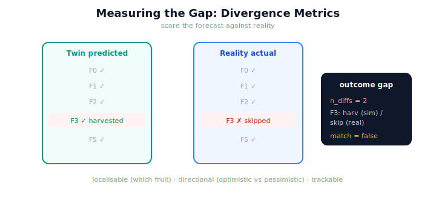

!!! abstract "You are here"
    **Module 10 — Digital Twin Capstone**  ·  **Unit 4 — The Sim-to-Real Gap**  ·  **Lesson 4.2 — Measuring the Gap: Divergence Metrics**

# Lesson 4.2 — Measuring the Gap: Divergence Metrics

> "The twin and reality disagree" is a start, but not a tool. To *act* on the gap — to track it, threshold it, shrink it — you must put a number on it. This lesson defines how to measure the sim-to-real gap precisely.

---

## 1. Why This Matters
Everything the back half of the module does with the gap — flagging when the twin has drifted from reality, deciding whether the twin is trustworthy enough to predict with, checking whether a calibration helped — requires *measuring* the gap. A qualitative "they differ" cannot be tracked over time or compared before and after a fix. A divergence metric turns the gap into data: how many fruit did the twin get wrong? Which ones? By how much? With that number in hand, the gap becomes something you can monitor and manage rather than merely acknowledge.

## 2. Physical Intuition
Scoring a forecast against what actually happened. Meteorologists don't just say "the forecast was off" — they score it: how many degrees of temperature error, how many hours off on the rain, which regions it missed. The score lets them track skill over time and tell whether a model change helped. Measuring the sim-to-real gap is scoring the twin's harvest forecast against reality's actual harvest: a concrete tally of where, and by how much, they disagreed.

## 3. Mathematical Foundations
The **outcome gap** compares the twin's predicted harvest to reality's actual harvest, component by component. With predicted sets (harvested $H_s$, skipped $S_s$) and real sets ($H_r$, $S_r$):

- **Set differences:** $H_s \setminus H_r$ (predicted-harvested but actually-skipped), $H_r \setminus H_s$, and likewise for skipped — each fruit the two outcomes disagree on.
- **Attempt differences:** fruit whose per-pick attempt counts differ between sim and real (a softer disagreement — same fate, different effort).
- **A scalar:** $n_{\text{diffs}}$, the total count of outcome disagreements, with $\texttt{match} = (n_{\text{diffs}} = 0 \text{ and no attempt diffs})$.

This is a faithful, honest divergence measure built **entirely from existing `harvest_row` outputs** — it reads the harvested/skipped sets and the picks, and compares. No new theory: just structured comparison. The metric's value is that it is **trackable** (a number over time), **localisable** (it names *which* fruit diverged), and **directional** (it distinguishes "twin too optimistic" — predicted harvested, really skipped — from "twin too pessimistic"). Those properties are exactly what calibration (next lesson) needs to target the gap, and what monitoring (Unit 5) needs to watch it.

## 4. Visual Explanation

<figure markdown>
  { width="680" }
</figure>

## 5. Engineering Example
Scoring one gap. With an unmodeled obstacle on fruit F3, the twin predicts F3 harvested and reality skips it. Compute the outcome gap: F3 appears in "harvested-only-in-sim" *and* in "skipped-only-in-real"; every other fruit matches; the tally is $n_{\text{diffs}} = 2$, $\texttt{match} = \text{false}$. The metric has turned "they disagree about F3" into a precise, localised score: two outcome disagreements, both naming F3, in the direction "twin too optimistic." That number can be logged each harvest, compared after a calibration, or thresholded by a monitor — none of which a vague impression could support.

## 6. Worked Example
The outcome gap reports `harvested_only_in_sim = [F3]`, `skipped_only_in_real = [F3]`, `attempt_diffs = {}`, `match = false`. Interpret it. Reasoning: the two outcomes agree on every fruit except F3. The twin **predicted F3 harvested**, but reality **skipped** F3 — the twin was *too optimistic* about F3 (it didn't model whatever stopped the real pick). There are no attempt-count disagreements, so the only divergence is F3's fate. The gap is small ($n_{\text{diffs}} = 2$, both pointing at one fruit) and *directional* (optimistic). This tells calibration exactly where to look: add the missing effect on F3. A precise metric thus converts the gap into an actionable target — which fruit, which direction, how much.

## 7. Interactive Demonstration

<iframe src="../../demos/module10/lesson14_divergence_metrics.html" title="Measuring the Gap: Divergence Metrics interactive demo" style="width:100%;height:520px;border:1px solid #e2e8f0;border-radius:12px"></iframe>

[Open this demo in a new tab ↗](../demos/module10/lesson14_divergence_metrics.html)

*(Conceptual — the Installment-B flagship: the Sim-to-Real Gap Explorer.)*
The Gap Explorer's scoreboard: as you toggle unmodeled effects, watch the divergence metric update — which fruit diverged, in which direction, the running $n_{\text{diffs}}$, and the match flag. The demonstration shows the gap as a live, localisable number rather than a vague impression.

## 8. Coding Exercise

!!! tip "Run the hands-on notebook"
    `modules/module10/notebooks/lesson14_measuring_gap.ipynb` — open in JupyterLab and run **Kernel → Restart & Run All**.

*(The notebook measures the gap.)*
With an unmodeled obstacle on one fruit, `simulate` the prediction and `run` reality, then compute `outcome_gap`. Assert it reports that fruit in `harvested_only_in_sim` and `skipped_only_in_real`, that `n_outcome_diffs` is nonzero, and `match` is false. Then assert a no-effect case yields `match = true`. This verifies the divergence metric.

## 9. Knowledge Check

Formative — unlimited attempts, immediate feedback; does not affect your grade.

<iframe src="../../quizzes/module10/lesson14_quiz.html" title="Measuring the Gap: Divergence Metrics knowledge check" style="width:100%;height:720px;border:1px solid #e2e8f0;border-radius:12px"></iframe>

[Open this quiz in a new tab ↗](../quizzes/module10/lesson14_quiz.html)

*(Formative — unlimited attempts, immediate feedback.)*
Confirm what the outcome gap compares (harvested/skipped sets, attempts), that it yields a localisable, directional, trackable number, that it's built from existing harvest_row outputs, and what `match` means.

## 10. Challenge Problem
The outcome gap distinguishes "twin too optimistic" (predicted harvested, really skipped) from "twin too pessimistic" (predicted skipped, really harvested). Argue why this *direction* matters more than the raw count for deciding how much to trust a twin's prediction — especially for the safety-relevant case of predicting failures (Unit 6). Keep the analysis about the metric's interpretation, not a new algorithm.

## 11. Common Mistakes
- **Settling for "they disagree."** Without a number, the gap can't be tracked, thresholded, or shrunk.
- **Ignoring direction.** "Too optimistic" and "too pessimistic" have very different consequences.
- **Inventing a new metric from scratch.** The gap is computed from existing harvest_row outputs.
- **Counting without localising.** A good metric names *which* fruit diverged, not just how many.

## 12. Key Takeaways
- The **outcome gap** scores the twin's **predicted harvest** against reality's **actual harvest**.
- It reports **set differences** (which fruit diverged), **attempt differences**, a scalar **n_diffs**, and a **match** flag.
- It is **localisable** (which fruit), **directional** (optimistic vs pessimistic), and **trackable** (a number over time).
- It is built **entirely from existing harvest_row outputs** — no new theory.
- Measuring the gap is what makes it **actionable** — the prerequisite for calibration and monitoring.

---

## AI Learning Companion
Copy any prompt into an AI assistant.

**Tutor prompt** — explain it another way
```
Re-explain Lesson 4.2 as scoring a weather forecast against what actually happened — a concrete, trackable error, not a vague "it was off."
```
**Practice prompt** — generate more exercises
```
Give me 4 outcome-gap readouts to interpret (which fruit diverged, direction, match). With answers.
```
**Explore prompt** — connect it to the real world
```
Show me how digital-twin engineers quantify the sim-to-real gap and track it over time.
```

## Global Learning Support
Need this lesson in another language? Copy a prompt below into an AI assistant. English is the authoritative source.

**Supported languages (initial):** English · Español · 中文 (Simplified Chinese) · Türkçe

```
I just completed Lesson 4.2 — Measuring the Gap: Divergence Metrics.
Explain this lesson in Español. Keep robotics/math terminology in English where appropriate.
Then provide: a summary, three practice questions, and one challenge problem.
```
```
I just completed Lesson 4.2 — Measuring the Gap: Divergence Metrics.
Explain this lesson in 中文 (Simplified Chinese). Keep robotics/math terminology in English where appropriate.
Then provide: a summary, three practice questions, and one challenge problem.
```
```
I just completed Lesson 4.2 — Measuring the Gap: Divergence Metrics.
Explain this lesson in Türkçe. Keep robotics/math terminology in English where appropriate.
Then provide: a summary, three practice questions, and one challenge problem.
```

---

*Next lesson: 4.3 — Calibrating the Twin: Shrinking the Gap.*
